= Additional Module Components

This section discusses additional module controls. These controls are not available for individual Map Windows. Buttons associated with these controls will always appear in the Main Controls Toolbar.

== Action Button

The Action Button combines a number of different actions into a single button. When the button is clicked, or its Hotkey is pressed, it can display a message to the Chat window, play a sound, or send a list of Hotkeys to other components.

An Action Button includes these attributes:

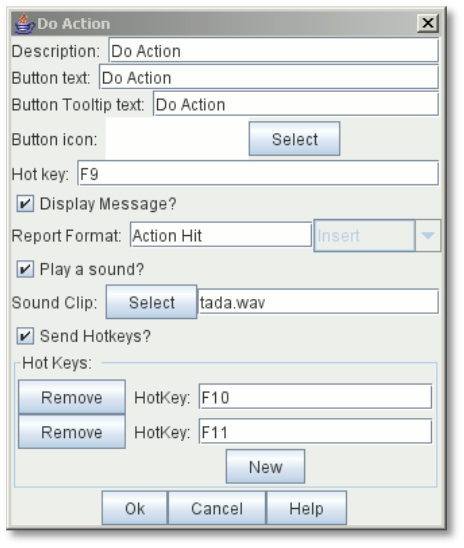

* *Description:* An identifying name for this button.
* *Button Text:* The text of the button to be added to the Toolbar.
* *Tooltip Text:* The tooltip text of the button to be added to the Toolbar.
* *Button Icon:* Icon for the Toolbar button.
* *Hotkey:* Keyboard shortcut for the Toolbar button.
* *Display Message?* Select to display a message to the Chat Window when the button is activated.
* *Report Format:* Message Format to report to the chat line.
* *Play a Sound?* Select to play a sound clip when the button is activated.
[loweralpha, start=15]
. *Sound Clip:* The Sound clip file to be played. Select a file in .au, .aiff, or .wav format. The sound file specified in this field will be played when the action is invoked. (MP3s are currently not supported.)

* *Send Hotkeys?* Select to send hotkeys to other components when the button is activated.

[loweralpha, start=15]
. *Hotkeys:* The list of Hotkeys to be sent. Use the *New* button to add another key, or the *Remove* buttons to remove existing keys.

*To add an Action Button to the Toolbar,*

. Right-click the *[Module]* node, and pick *Add Action Button.*
. On the *Do Action* dialog, enter the settings for the Action Button.
. Click *Ok.*

_The Action Button component is distinct from the Action Button Piece Trait (see page 43)._

== Charts Window

A Charts Window is used for displaying gameplay aids, such as charts, tables, and important game information. Charts are accessible using a Toolbar button.

A Charts Window has these attributes:

* *Name*: Name of the *Charts* window.
* *Button Text:* Text for the Notes window button in the Main Controls Toolbar.
* *Tooltip Text:* Mouseover tooltip for the Toolbar button.
* *Button Icon:* Icon for the Toolbar button.
* *Hotkey:* Keyboard shortcut for the Toolbar button.

_*Sub-Components*_

A Charts Window is highly configurable, and can contain any combination of tabs, lists, and pull-down menus containing individual Charts, HTML Charts, or Maps. For example, a Scrollable List could include a Tabbed Panel, which includes individual Charts.

_*Additional Module Components: Game Piece Inventory Window*_

=== Chart Displays

* *Tabbed Panel:* A panel with tabs, each of which corresponds to a Panel or other Tabbed Pane subcomponent. The label of the tab will be the name of the subcomponent.
* *Panel:* A panel that can contain Charts, HTML Charts, or Maps. Select *Fixed cell size* to specify a fixed number of columns for the panel. Otherwise, the sub-components will appear in a single row, or a single column if the *Vertical* *layout box* is checked.
* *Pull-down Menu:* A pull-down menu in which each menu item corresponds to a subcomponent. The name of the menu item will be the name of the subcomponent.
* *Scrollable List:* A scroll list in which each entry corresponds to a subcomponent. The name of the entry will be the name of the subcomponent.

=== Chart Types

* *Chart:* A chart is an image file depicting a game table or other useful information.
* *HTML Chart:* An HTML Chart is a simple HTML page. The HTML should be simple; avoid using the <Head> tag. HTML Charts can contain hyperlinks to one another, and to files in the module, but not to external resources.
* *Map:* A fully functioning Map Window can be embedded within a Chart. Use a Map when you want to place counters onto a chart for bookkeeping purposes.

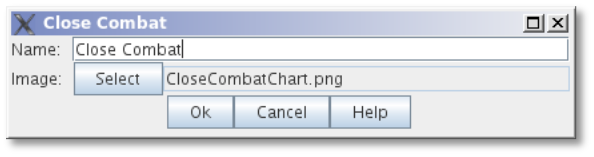

_You cannot paste a Map Window created as a Chart to the *[Module]* node, or vice versa._

*To create a Charts window,*

. Right-click the *[Module]* node and select *Add Charts*
. In the *Charts* dialog, specify the settings for the Charts window.
. Click *Ok*.
. Right-click the new *[Charts]* node and pick a sub-component to add.
. Continue adding subcomponents as needed.

== Game Piece Inventory Window

A Game Piece Inventory Window organizes and summarizes the pieces in the game in a tree view (similar to browsing a file system). You can define exactly which pieces are displayed in the window and how they are organized.

Possible uses for a Game Piece Inventory (GPI) Window include:

* _Displaying the name and location and location of pieces on a map_: Each unit in an army could be displayed by grid location with other units in its stack. Units in each stack could even be organized in subgroups based on some Property—for example, all Depleted units in the stack could be in a subfolder inside each stack listing.
* _Tracking discarded or ʻdeadʼ units_: A hidden map could be created (see page 90), and discarded or destroyed units could be sent there (using the Send to Location Trait) instead of being deleted from the game. Then, a GPI window could list all units sent to the hidden map, which would give an easy to use summary of discarded units without giving access to the pieces themselves.
* _Grouping and listing pieces by some Property:_ For example, in a personal combat game, where combatants move in order of their Dexterity, pieces could be assigned a Dexterity property. In the Game Piece Inventory Window, pieces could be grouped by the value of their Dexterity and each group displayed in (ascending) order.
* _A stack management tool:_ You can make the Command menus of pieces accessible through the GPI window. Each piece is directly accessible--no unstacking and re-stacking of pieces is required. As a result, for games with large, unwieldy stacks, itʼs sometimes easier to use a GPI window to access the individual pieces.

A Game Piece Inventory Window has these attributes.

* *Name:* The name that appears in the window title bar.
* *Button Text:* Text for the Inventory Window button in the Main Controls Toolbar.
* *Hotkey:* Keyboard shortcut for the Toolbar button.
* *Tooltip Text:* Mouseover tooltip for the Toolbar button.
* *Show Only Pieces Matching These Properties:* The window will only summaries pieces with the matching set of

Properties. For example: limit the pieces to a single map with the CurrentMap Property, or only select pieces with a given value of a Marker Trait.

* *Sort and Group By Properties:* A list of Property names. Pieces with the same value of a given Property will be grouped together at the same level. (Example: listing the

CurrentBoard and LocationName Properties will cause the Inventory Window to show a top-level folder for each board and a sub-folder for each location that contains a Game Piece.)

* *Label for Folders:* A Message Format specifying the text used to label each folder in the tree. The PropertyValue Property gives the value of the Property that defines its group (for example, the board name or location name). Any Property

image:_images/image213.png[image,width=276,height=403]

of the form sum_XXX will be replaced with the sum of Property

XXX for all pieces within that folder. For example, a Game Piece uses a Layer Trait named Manpower, giving it an automatic Property named Manpower_Level. Using the sum_Manpower_Level Property in the folder label will report the total manpower for all pieces inside that folder.

* *Show Only Folders:* If selected, then individual pieces within a folder will not be shown in the view.
* *Label for Pieces:* A Message Format specifying the text used to label each piece in the tree.
* *Sort:* If selected, then sort pieces.

[loweralpha, start=15]
. *Label for Sort:* A Message Format specifying the text that sorts pieces. (Example: A piece is named _3rd_ _Battalion, 4th Regiment, 3rd Division_; for sorting the markers $division $regiment $battalion are used rather than the pieceʼs name.)
[loweralpha, start=15]
.. __________________________________________
*Sorting Method:* Choose a sorting method:
* _Alpha_ sorts the inventory tree alphabetically.
* _Numeric_ sorts by the value of the first integer found, in ascending order. (Descending order is not currently available.)
* _Length_ sorts by the string length first.
* When two entries are equal for numeric and length, alpha is used for sorting. (Example: $id$ is the Label for sort. Three Game Pieces have the ids 'a', 'aa', and 'b'. Sorting by alpha and numeric is ['a', 'aa', 'b']. Sorting by length is ['a', 'b', 'aa']. Three Game Pieces have the ids 'a3', 'b2', 'c-4'. Sorting by alpha and length is ['a3', 'b2', 'c-4']. Sorting by numeric is ['c-4', 'b2', 'a3'].)

* *Center On Selected Piece:* If selected, then clicking on a Game Piece in the tree will center the map on that piece.
* *Forward Key Strokes To Selected Piece:* If selected, then any keystrokes types into the window will be sent as key commands to the selected piece. Selecting a folder will send the command to all pieces within that folder.
* *Show Right-Click Menu Of Piece:* If selected, then right-clicking on a Game Piece in the tree will display its Command Menu, which can be used to send commands to the piece. (This can be a handy way to manage Game Pieces in large stacks.)
* *Draw Piece Images:* If selected, the tree will draw reduced-size images of the piece at the specified Zoom factor.
* *Zoom Factor:* The magnification factor for drawing pieces in the tree.
* *Available To These Sides:* The Toolbar button will only be visible to the player Sides listed here. An empty list makes the button visible to all players.

*To create a Game Piece Inventory Window,*

. Right-click the *[Module]* node, and pick *Add Game Piece Inventory Window*.
. In the *Inventory* dialog, enter the settings for your *Game Piece Inventory window.*
. Click *Ok.*

== Global Key Command (Module Level)

The Global Key Command (GKC) adds a button to the Main Controls Toolbar. Clicking the button will select certain pieces in the module and apply the same keyboard command to all of them simultaneously.

Global Key Commands are hierarchical. A Global Key command assigned to the module can affect any pieces in the module.

However, a Global Key command assigned to a map (see page 25) may only affect pieces on that map.

_Commands applied by Global Key Commands will be affected by piece ownership. If the GKC triggers a command that is restricted by side, the action may not take place as intended when the restricted side triggers the GKC (by button, hotkey, Turn-based Global Hotkey, or other command)._

The Global Key Command has these attributes:

* *Description:* A description of the action, used for the button's mouseover tooltip.
* *Key Command:* The keyboard command that will be applied to the selected pieces.
* *Matching Properties:* The command will apply to all pieces on the map that match the given Property expression.
* *Within a Deck, apply to:* Select how this command applies to pieces that are contained within a Deck.

[loweralpha, start=15]
. _No pieces_ means that all pieces in a Deck ignore the command.

[loweralpha, start=15]
. _All pieces_ means that the command applies to the entire Deck.
[loweralpha, start=15]
.. _________________________________________________________________________________________________________________________
_Fixed number of pieces_ enables you to specify the number of pieces (drawn from the top) that the command will apply to.

* *Tooltip text:* Mouseover hint text for the Toolbar button.
* *Button text:* Text for the Toolbar button.
* *Button Icon:* Icon for the Toolbar button.
* *Hotkey:* Keyboard shortcut for the Toolbar button.
* *Suppress Individual Reports:* If selected, then any auto-reporting of the action by individual pieces by the Report Action Trait will be suppressed.
* *Report Format:* A Message Format that will be echoed to the Chat window when the button is pressed.

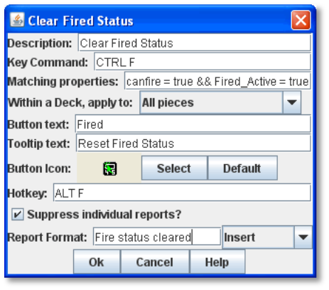

_Example: Suppose you have configured some pieces to contain a Layer indicating that a Game Piece has fired, activated by Ctrl-F and with the name Fired._

_Give each piece the Marker Trait with Property name canFire and value true. Configure the Global Key Command to apply to pieces whose Properties match canFire = true && Fired_Active = true. Specify Ctrl-F as the key command. Now clicking the Global Key Command button will set all marked pieces on the map to not having fired._

*To create a module-level Global Key Command,*

. Right-click the *[Module]* node and pick *Add Global Key Command.*
. In the *Global Key Command* dialog, enter the settings for the command.
. Click *Ok*.

== Global Options

Global Options are settings that apply to the module as a whole. If an option has a *Use Preferences Setting* choice, selecting it will add an entry *Preferences* window to allow players to choose their own value for the setting at game time.

* *Allow Non-Owners To Unmask Pieces:* By default, only the player who originally masked a Game Piece (see the Mask Trait for Game Pieces) is allowed to unmask it. This option allows other player to unmask a masked piece
* *Center On Opponent's Moves:* This option will center a Map Window in an opponent's move when reading a logfile or receiving a move on the server.
* *Auto-Report Moves:* This option will automatically report a text description (for example, "3rd Cavalry moves from A10 -|B11") to the chat area of the control window whenever a player moves a Game Piece in a Map Window.
* *Player ID Format:* A Message Format that is used to identify players when typing chat text.
* *Icons and Hotkeys:* You can specify your own button icons and keyboard shortcuts for the logfile step/undo buttons and the button that shows/hides the server controls.

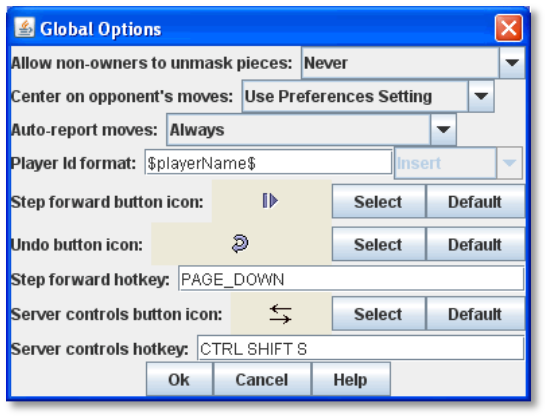

=== Sub-Components

You may add your own arbitrary preference settings to the global options. The different sub-components support different constraints on the values of the preference setting. The values of these preference settings are exposed as Properties.

You must save and re-load the module before these sub-components will show up in the Preferences window

* *String Preference:* A simple string value.
* *Text Box Preference:* A multi-line string value.
* *Drop-down List Preference:* A drop-down from which the user selects from a list of specified values.
* *Whole Number:* An integer value.
* *Decimal Number Preference:* A floating-point value.
* *Checkbox Preference:* A true/false value.

== Global Property

Global Properties can be attached to a Zone, Map Window, or Module. The *[Global Properties]* node is a container for all Properties attached to the Map or Module.

When looking for the value of a Property of a Game Piece, global Properties provide default values. If the Property is not defined on the Game Piece itself, the value will come from the Zone occupied the by piece, the Map to which it belongs, or the Module overall, in that order.

_A Game Piece can define the value of a Global Property with the Set Global Property Trait. See page 62 for more information._

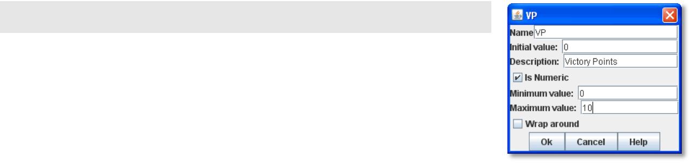

A Global Property has these attributes:

* *Name:* The name of the Property.
* *Initial Value:* The value of the Property at the start of a new game.
* *Description:* Description of the Property.
* *Is Numeric?* If selected, then changes to the value of the Property will be restricted to integer values.
* *Minimum Value:* Numeric values will be restricted to no less than this number.
* *Maximum Value:* Numeric values will be restricted to no more than this number.
* *Wrap Around:* If selected, then when incrementing this numeric Property, values will wrap around from the maximum to the minimum.

*To add a Global Property,*

. Right-click the *[Global Properties]* node, and pick *Add Global Property.*
. On the Global Property dialog, enter the settings for the Property.
. Click *Ok.*

=== Change-Property Toolbar Button

A Change-Property Toolbar button changes the value of a Global Property. Like other Toolbar buttons, you can combine multiple buttons into a single drop-down menu using a Toolbar Menu.

* *Button Text:* The text of the Toolbar button.
* *Button Icon:* The icon of the Toolbar button.
* *Hotkey:* Keyboard shortcut for the Toolbar button.
* *Report Format:* Message Format of a text message to echo to the controls window when the button is pressed: oldValue is the value of the Global Property prior to the button press, newValue is the value after the button press, and description is text from the *Description* field of the Global Property dialog.
* *Type:* Defines how the Property value should change:

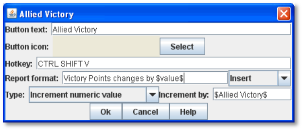

[loweralpha, start=15]
. _Set value directly_ sets the Property to a fixed value, after substituting values of Properties.

[loweralpha, start=15]
. _Increment numeric value_ adds a fixed value to the Property. You can specify a number, or the value of another Property. (If you specify a Property, enter the name of the Property in $-signs; for example, $ExampleProperty$.)

[loweralpha, start=15]
. _Prompt user_ displays a dialog for the user to type in a new value.

[loweralpha, start=15]
. _Prompt user to select from list_ displays a dialog with a drop-down menu for the user to select from.

*To add a Change-Property button to a Global Property,*

. In the *[Global Properties]* node, select the Global Property to add the button to.
. Right-click and select *Add Change-Property Toolbar Button.*
. In the dialog, enter the settings for the button.
. Click *Ok*. The button is added to the Main Controls Toolbar.

== Map Window Toolbars

Each Map Window comes with a Toolbar, which includes button controls for the options you have selected for it. Typically, each of these buttons includes a text label and icon that describes its function. For example, if you have selected additional controls like the Zoom Tool or Line of Sight Thread, the Toolbar for the Map Window will include buttons for these controls.

=== Main Controls Toolbar

The Main Controls Toolbar is displayed above the main Map Window, at the top of the screen. Every module must have a main Toolbar; it cannot be disabled even if the game does not have a main map window.

The Toolbar comprises these button types:

* *Standard Buttons:* Standard Main Controls Toolbar buttons are common to all modules and are shown on the left – hand portion of the Toolbar. These include *Undo*, *Step Through Log*, *Connect to Server*, and *Retire*. These buttons are configured using Global Options (see page 87).
* *Module-Specific Buttons:* These buttons represent components specific to the module. If a Toolbar button is associated with a component (such as with a Game Piece Palette, Toolbar Menu, or Map Window), the module-specific buttons will appear in the order they appear in the Configuration Window, from top to bottom.
* *Map-Specific Buttons:* If the main Map Window includes any additional map options, their buttons, if any, will be shown on the right-hand portion of the Toolbar.

=== Keyboard Shortcuts (Hotkeys)

If your cursor is in the Chat Window, pressing a buttonʼs keyboard shortcut when the piece is selected will invoke the corresponding button, just as if the Toolbar button was actually clicked.

Hotkeys can also be invoked by automated commands. For example, a Global Key Command refers to the Hotkey of the command that it applies. In every respect, a Hotkey invoked by automated commands will work the same as if an actual player had pressed the key combination on a keyboard.
You can define any unique keyboard shortcut you want as a Hotkey for a particular command. To make it harder to press them accidentally, keyboard shortcuts are usually comprised of more than one key, such as Ctrl-X or Alt-Shift-K.

A keyboard shortcut could be composed of any number of keys pressed at once, but generally use 2 or 3, usually in combination with one of the following keys: Ctrl, Alt/Option, Shift, Meta/Command.

To make them more memorable, when assigning keyboard shortcuts, use key combinations that are reminiscent of the command itself. (For example, Ctrl-R would be an easily remembered shortcut for a Die Roll Button.)

Use these guidelines when assigning keyboard shortcuts.

* Avoid using keyboard shortcuts that players could type inadvertently. For example, a single capital letter M would not be a suitable shortcut, nor would Shift-M, because players could easily type either in the Chat window during ordinary conversation. However, Ctrl-M or Ctrl-Shift-M would both be suitable.
* Be careful about assigning hotkeys to keys that invoke special functions on your computer. Caps Lock, Backspace, Delete, Home, End, Enter/Return, and so on, are not generally suitable for use as hotkeys. Similarly, the Function (F1-F9) keys at the top of a standard keyboard may serve as hotkeys for various Windows or MacOS functions, and pressing them could cause unexpected operating system functions to be invoked instead of the desired piece command.

=== Modifying Toolbar Buttons

You can modify Toolbar buttons in a variety of ways.

==== Setting Toolbar Buttons Icons to Null

Many module components, such as Dice buttons, include a default button icon. By setting a Toolbar button icon to null, you can prevent its default icon from being displayed on the Toolbar button. Only the button text will be shown.

To set a Toolbar button to null, when selecting the button icon, click *Select*, and then click *Cancel*.

If the icon is set to null, make sure you specify some button text, or the button will not show up at all in the game.

==== Replacing Toolbar Button Text with Icons

By default, Toolbar buttons include a text label, but the text label is actually optional. If desired, you can replace the text label completely with an icon.

Create the button icons first in an image editor. Then, for each control where a button is specified (such as for a Game Piece Palette), in *Button Text*, leave blank, and in button icon, click *Select* and select your button image.

You cannot use this method if the Toolbar button is intended to be included in a Toolbar Menu. You must use a text label for the buttons so the Toolbar Menu can sort them.

_The four standard buttons (*Undo*, *Step Through Log*, *Connect*, and *Retire*) will always appear on the Toolbar even if no text label or icon is assigned to them. If both label and icon are omitted, they will appear as very small, blank, but clickable buttons. To reduce player confusion, always assign a text label, an icon, or both to each of these four buttons._

==== Hiding Toolbar Buttons

You can hide Toolbar buttons completely from player view. This is helpful if the hidden buttons are for components that players do not need to access directly, such as for automated Global Key Commands, or to create hidden maps.

To hide a componentʼs Toolbar button, create a new Toolbar Menu (see page 90) . Leave the button text for the Toolbar Menu button blank. Then, under *Menu Entries*, enter the name of each button you want to hide. (You can add any number of buttons to the hidden Toolbar Menu, so you can repeat this as many times as needed to hide multiple buttons.) Click *Ok.* The buttons are now hidden in the invisible Toolbar Menu, but will still be accessible to automated game functions.

==== Modifying Toolbar Button Labels

By enclosing button label text within simple HTML tags, you can use simple HTML format to specify various colors, font weights, and sizes. Example: <html><b>Bold text</b>
with a line break
and different colors</html| would display as:

*Bold text*

with a line break

and different colors

_*Additional Module Components: Multi-Action Button*_

== Multi-Action Button

The Multi-Action Button combines multiple buttons in a Toolbar into a single button, which replaces the component buttons.

Clicking this button automatically invokes the actions of all the other buttons in the order given (from top to bottom).

[upperalpha]
. Multi-Action Button includes these attributes:
* *Button Text:* The text of the button to be added to the Toolbar.
* *Button Icon:* Icon for the Toolbar button.
* *Hotkey:* Keyboard shortcut for the Toolbar button.
* *Buttons:* Enter the text of the buttons that you wish to invoke as a result of clicking this button. The text is case-sensitive. They will be invoked in the order listed (top to bottom).

*To add a Multi-Action button to the Toolbar,*

. Right-click the *[Module]* node, and pick *Add Multi-Action*

*Button.*

[arabic, start=2]
. On the *Multi-Action Button* dialog, enter the settings for the Multi-Action Button.
. Under *Buttons*, enter the name of the first button to be included in the Toolbar Menu, and click *Add*.
. Repeat Step 3 for each additional Toolbar button.
. Click *Ok.*

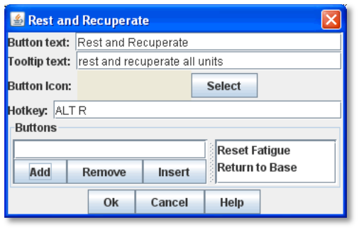

=== Multi-Action Button Examples

* A Global Key Command is defined that resets the fatigue level of all armies on the map. A second Global Key Command returns them to their home base. A Multi-Action Button can be used to combine both actions into a single button.
* A Dice Button is defined that exposes its result as a Property named Damage. Some Game Pieces are defined with

a Trigger Action Trait that compares the level of a Layer (representing armor) with the Damage Property and deletes the piece if the level is below the Damage value. A Global Key Command invokes the Trigger Action. A Multi-Action Button is defined that invokes the Dice Button, followed by the Global Key Command, resulting in the automatic deletion of any units with armor less than the random amount of damage.

* A Symbolic Dice button makes a dice-rolling sound when clicked. The Multi-Action button combines the Symbolic Dice button with a separate Action button, which triggers the dice rolling sound file. For best results, the Action button that plays the sound should be listed first.

== Notes Window

The Notes window, accessible by a Toolbar button, enables you to save text notes for a game. The window contains these tabs:

* *Scenario:* Descriptive notes on the scenario. Useful when creating pre-defined setups to describe scenario forces, placement, and victory conditions. Scenario notes are saved when the game is saved.
* *Public:* Notes that are visible to all players, and to which all players may add.
* *Private:* Notes that are visible only to the player who entered them.
* *Delayed:* This tab is for writing messages to be revealed at a later time as a safeguard against cheating. To create a delayed message, click *New* and enter a name and message text. Once created, the text of a message cannot be changed. At the appropriate time, the owning player may reveal the text of the message to other players by selecting the message and clicking *Reveal*.

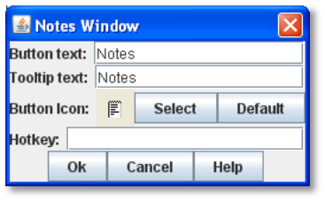

The number of tabs and their labels are not customizable.

Each *Notes* window has these attributes:

* *Button Text:* Text for the *Notes* window button in the Main Controls Toolbar.
* *Tooltip Text:* Mouseover tooltip for the Toolbar button.

_*Additional Module Components: Toolbar Menu*_

* *Button Icon:* Icon for the Toolbar button.
* *Hotkey:* Keyboard shortcut for the Toolbar button.

*To create a Notes window,*

. Right-click the *[Module]* node and pick *Add Notes Window.*
. In the *Notes Window* dialog, enter the settings for the Notes Window.
. Click *Ok*.

== Toolbar Menu

The Toolbar Menu component enables you to organize buttons from the Toolbar of the main controls window or a Map Window into a single drop -down menu. Each button named in this component will be removed from the Toolbar and instead appear as a menu item in the drop-down menu. Items added to a Toolbar Menu are case-sensitive.

* *Button Text:* The text of the Toolbar Menu. Clicking the button will reveal the drop-down menu. If left blank, the Toolbar Menu, and any buttons on the menu, will be hidden.
* *Button Icon:* Icon for the Toolbar Menu button.
* *Hotkey:* Keyboard shortcut for revealing the drop-down menu.
* *Menu Entries:* Enter the text of the buttons that you wish to move to the drop-down menu. The menu item will have the same text. If the button uses an icon, the menu item will also use it.

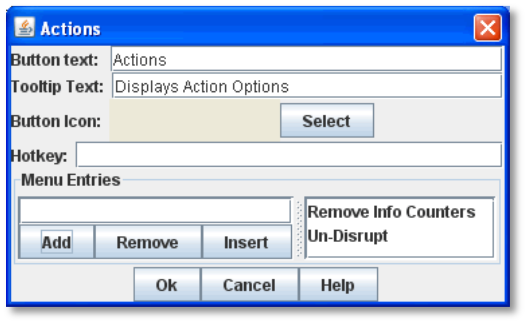

*To add a Toolbar Menu,*

. Click the *[Module]* node and pick *Add Toolbar Menu.*
. On the *Toolbar Menu* dialog, enter the settings for the Toolbar Menu.
. Under *Menu Entries*, enter the name of the first button to be included in the Toolbar Menu, and click *Add*.
. Repeat Step 3 for each additional Toolbar button.
. Click *Ok*. The Toolbar Menu is displayed on the Toolbar.

== Turn Counter

A Turn Counter can be used to track any intervals you define, such as turns, phases, rounds, segments or days. To mark the progress of the game, players can advance the turn forward or backward, or, optionally, jump directly to a selected turn.

A Turn Counter is defined as a series of nested levels to any level you desire. Advancing the turn moves the deepest level forward. When a child level wraps around, the next child level under the same parent advances forward. When the last child level has wrapped around, the parent level advances forward.

For example, a level representing the Month may contain a level representing the Day, which contains a level representing time of day (Morning or Evening). Advancing the turn counter moves the game from Morning to Evening (deepest level), then to Morning of the next day, evening of the next day, and so on.

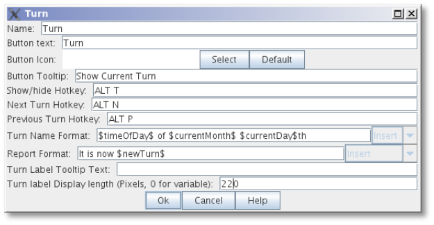

_Although there is no programmatic limit to the number of nested levels you can use in a Turn Counter, there may be a practical one. Tracking each individual phase, sub- phase and segment of some complex games could mean that the Turn Counter is constantly being clicked to advance the game, which may be a burden during game play._

The Turn Counter controls can be docked into the Main Controls Toolbar, or can be opened in a separate window that is shown or hidden by a button on the Toolbar. Whether the controls are docked is controlled by the player's preferences.

A Turn Counter includes these attributes:

* *Name:* A name for display in the Configuration Window.
* *Button text:* The text of the Toolbar button to show or hide the controls when un-docked
* *Button Icon:* Icon for the Toolbar button.
* *Tooltip Text:* The tooltip text of the button.
* *Show/Hide Hotkey:* Keyboard shortcut to hide or show the Turn Counter window when un-docked.
* *Next Turn Hotkey:* Keyboard shortcut to advance the Turn Counter one step.
* *Previous Turn Hotkey:* Keyboard shortcut to return the Turn Counter to the previous step.
* *Turn Name Format:* Message Format to format the display of the current turn. All module-level Properties will be substituted. In particular, the Properties exposed by any child Counters or Lists can be used. In addition, the special Properties level1, level2, etc. can be used to represent the values of the active Counter or List within the Turn Counter. For example: If the Turn Counter contains a Month level, which further, contains a Day level, then level1 gives the value of the Month and level2 gives the Day.
* *Report Format:* Message Format to display a message in the Chat Window whenever the turn changes.
* *Turn Label Tooltip Text:* Tooltip text for the Turn Display.
* *Turn Label Display Length:* Set the number of pixels wide the turn display label should be, or use 0 to let it float to suit the current turn display.

=== Types of Turns

Turns can be of two types: Counters and Lists. Both types can freely be nested in one another, in any combinations.

==== Counter

A Counter is a numerical level that advances by incrementing the number by a fixed value. It can optionally loop when it reaches a maximum value. An example of a Counter would be Turn 1, Turn 2, Turn 3, and so on. A Counter has these attributes:

* *Description:* A name for display in the Configuration Window.
* *Property Name:* The name of the global Property that will hold the value of this level.
* *Turn Level Format:* A Message Format that gives the value of the level1, level2, etc. Property for use in the Turn Counter's Turn Name Format Property.
* *Start Value:* The initial (and minimum) numeric value.
* *Increment By:* The amount by which the numeric value increases when the level advances.
* *Loop:* If selected, the level will return to its starting value after reaching the maximum value.
* *Maximum value:* The maximum value at which the level will loop.

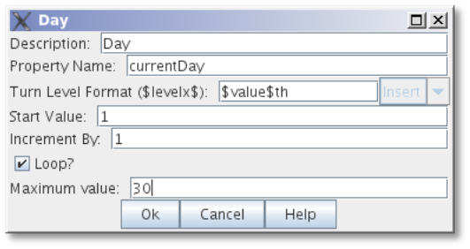

==== List

A List is a level that cycles through a specified list of text strings. An example of a List would be Spring, Summer, Fall, and Winter.

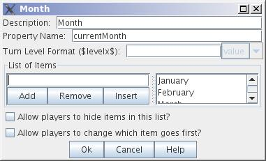

* *Description:* A name for display in the Configuration Window.
* *Property Name:* The name of the global Property that will hold the value of this level.
* *Turn Level Format:* A Message Format that gives the value of the level Property for use in the Turn Counter's Turn Name Format.
* *List of Items:* A list of text strings that the level will cycle through.
* *Allow Players To Hide Items In This List:* If selected, then player will be allowed to disable items in this list at game time.
* *Allow Players To Change Which Item Goes First:* If selected, then players will be allowed to change which should

be the beginning item in the list, i.e. the item at which the parent level will be advanced. Example: If a List represents Sides in a game, but the order in which Sides move is not always fixed.

_*Additional Module Components: Turn Counter*_

=== Turn Counter Properties

Lists and Counters both allow you to define the name of the global Property used to hold the value of the given level, in the *Property Name* entry box.

For example, if you define a Counter that tracks turns numerically, you could enter currentTurn in *Property Name*.

=== Turn-Based Global Hotkey

A Turn-Based Global Hotkey automatically fires a key sequence whenever a certain state of the Turn Counter is reached. The Hotkey can trigger the firing of another command or button, such as a Global Key Command, exactly as if a player had typed it in.

For example, when the Repair Units phase is reached, a Turn-Based Global Hotkey fires that corresponds to the keyboard shortcut of a Global Key Command that removes all Damage counters from pieces on the map.

[upperalpha]
. Turn-Based Global Hotkey has these attributes:
* *Description:* A name for display in the Configuration Window.
* *Global Hotkey:* The keyboard shortcut to fire. The program will respond exactly as if one of the players had typed this key sequence.
* *Match Properties:* A Property Expression that specifies when to fire the Hotkey. If the expression is true after any level of the Turn Counter advances, the Hotkey will fire.
* *Report Format:* A Message Format that will be echoed to the Chat Window when the Hotkey fires.

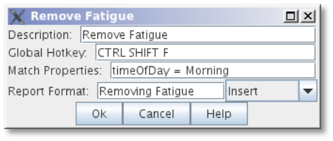

_Actions initiated by Turn- Based Global Hotkeys will be affected by piece ownership. If the Turn-Based Global Hotkey triggers a command that is restricted by side, the action may not take place as intended when the restricted side clicks to advance the turn._

_For example, Side A in a game represents a group of camouflaged units, which can be hidden (Masked) from Side B at the start of each turn. Each of Side Aʼs pieces includes a Mask trait which only Side A can use. To make things easier, you create a Turn- Based Global Hotkey that triggers a GKC, which causes Side Aʼs pieces to automatically reset their Masks at the beginning of each turn. When Side A clicks to advance the turn, the pieces are masked as intended. However, when Side B clicks to advance the turn, the pieces will not be masked automatically, since Side B Is restricted from using the piecesʼ Mask trait._

=== Creating a Turn Counter

*To create a Turn Counter,*

. Right-click the *[Module]* node, and pick *Add Turn Counter*.
. In the *Turn* dialog, enter the values for the Turn Counter.
. In the Configuration Window, right-click the new *[Turn Counter]* node and do one of the following:
* Select *Add Counter:* Then, in the *Counter* dialog, enter the settings for the first level Counter.
* Select *Add List:* Then, in the *List* dialog, enter the settings for the first level List.
. Optionally, to nest a level under the first one, select either the new *[Counter]* (or new *[List]*) node, and then repeat Step 3 for the next level.
. Repeat Step 4 for all further nested levels.
. Optionally, right-click the *[Turn Counter]* node and pick *Add Global Hotkey*. In the *Global Hotkey dialog*, enter the settings for the Global Hotkey, then click *Ok*.

=== Tracking Numerical Quantities with a Turn Counter

You can adapt Turn Counters to track a variety of numerical quantities for the game or for individual players. For example, if players in the game must keep track of their Resource Points used to purchase units, you could use a Turn Counter for each player to track Resource Point levels.

In general, to track numerical quantities, you will use a Counter component, and tracker components will not be nested (as they might be with regular Turn Counters).

*To create a quantity tracker,*

. Create a Turn Counter.
. Create a Counter component named for the quantity you wish to track.
. Set the Start Value of the Counter to the starting level for the game. (If each player began with 40 Resource Points, then you would enter 40.)
. Choose any other settings required for the Counter.
. If each player will need such a tracker, copy/paste the newly created tracker as many times as needed to the *[Module]* node, and edit each one appropriately.

=== Automating an Action to Happen Regularly

Using the Turn-Based Global Hotkey, you can automate a global action to happen on a regular basis, each time the Turn Counter is advanced to a particular level. For example, you have a module where all disabled Infantry units are reset at the end of the Turn, during the End Phase. Since this must occur every turn, automating this will make gameplay faster.

. Add a command to each unit that will reset its status. Assign this command a keyboard shortcut.
. Add a Global Key Command to the module.
[loweralpha]
.. ____________________________________________________________________________
In *Global Key Command*, enter the keyboard shortcut you assigned in Step 1.
.. __________________________________________________________________________________________
In Hotkey, assign a Hotkey to the GKC. (This is the keyboard shortcut for the GKC itself).
. On the Turn Counter, add a Turn-Based Global Hotkey.
[loweralpha, start=3]
.. _______________________________________________________________________________________
In *Global Hotkey*, enter the Hotkey of the Global Key Command you assigned in Step 2b.
.. ________________________________________________________________________________________________________________________________
For *Match Properties*, enter the turn or phase where the command will be applied. (In the example, this would be Phase = End. )

Now, each time you advance the Turn Counter to the appropriate level, the Global Hotkey will trigger the GKC, which will apply its command to all pieces.
