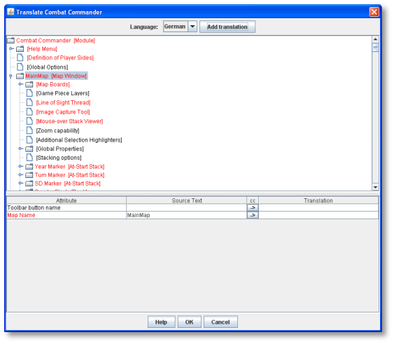
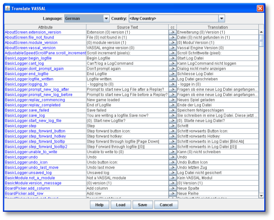

== Additional Topics

This section describes some advanced module design topics. It presumes knowledge of the design procedures discussed earlier.

=== Importing Custom Classes

If youʼre familiar with Java programming, VASSAL enables you to write and plug your own Java classes into a module. As an open- source project, the VASSAL engine package contains the source code for the core engine. The VASSAL libraries package contains additional .jar files you will need to compile and run the program. The main class for the application is named org.Vassalengine.Main and resides in Vassal.jar.

*To import a Java class for a particular component,*

. Right-click the component you wish to import a Java class for.
. Pick *Add Imported Class.*
. Enter the name of the class, and click *Ok*.

A complete programming tutorial, which presumes a level of Java programming skills, is available at [.underline]#http://www.vassalengine.org/wiki/Programming_Tutorial#.

=== Module File Structure

A module (.vmod) file is simply an archive file using ZIP compression. It can be easily decompressed using any application that handles ZIP files, including WinZip or the MacOS Archive Utility, to view or extract the files inside. If you need to have a look at a file inside a module, simply unzip the module.

_For some utilities, you may need to change the file extension from .vmod to .zip in order to be able to unzip it. You can change it back to .vmod when the process completes. Make sure that your operating system is set up to display file extensions._

Because a module file is itself a ZIP file, when you packaging or publishing a module, do not zip the module file. For one thing, the savings due to compression is minimal. In addition, compressing a ZIP file can cause confusion when unzipping, as some ZIP utilities may unzip the base ZIP file and any included ZIP files, leaving only the component files behind.

Extension (.vmdx) files are also ZIP files, like module files.

=== File Components

A module file contains the following components:

* *BuildFile:* The BuildFile is a descriptor file containing all of the moduleʼs component settings, in plain text format. You create and modify the BuildFile automatically when you edit a module in the Module Editor.

[loweralpha, start=15]
. The BuildFile can be opened in any text editor. Each component is specified as a text string, along with values for the componentʼs settings. However, although you can use a text editor to open it, the BuildFile is not particularly legible for humans.

[loweralpha, start=15]
. Some advanced VASSAL module designers prefer to edit the BuildFile manually, in a text editor. However, the structure of the BuildFile is complex and intricate. _Editing it directly is_ _*not*_ _recommended_. A single typo or misplaced comma can ruin your whole day.
[loweralpha, start=15]
.. _________________________________________________________________________________________________________________________________
In general, use the Module Editor to make changes to your module; these changes will be automatically reflected in the BuildFile.

* *ModuleData File:* The ModuleData file contains the moduleʼs basic settings. Like the BuildFile, it should not be edited directly.
* *Images Folder:* Contains all of the moduleʼs images: maps, pieces and other images.
* *Sounds Folder:* Includes any sound files associated with the module (from Play Sound Traits or Action Buttons).
* *Help Folder:* Contains HTML help files, if any.
* *Additional Files:* Some modules may contain additional files, such as a Readme.txt file.

=== Reducing Module File Size

The module design process can lead to module files including unnecessary or obsolete files. Large files are slow to download and unwieldy to distribute. As a result, once the design process is complete, you may wish to reduce the file size of your module.

The vast majority of a moduleʼs file size is usually caused by the image files included in the module. You may wish to try the following in order to reduce overall file size:

* Re-scale your game graphics to a smaller size. A large 5000x5000 pixel map may be more manageable when rescaled to 2500x2500 pixels. Use your favorite image editor application to accomplish this.
* Delete unnecessary files from the module, such as unused images or obsolete text files.

*Deleting Unnecessary Files from a Module*

To reduce file size, you can delete unnecessary files from a module. To accomplish this, you will require a utility capable of unzipping and re-zipping files.

*To delete files from a module,*

. Create a backup of your existing module in the same directory as your existing module.
. Unzip the original module using the unzip utility of your choice.
. Open the resulting directory. There will be a file called BuildFile, a folder named Images, and some other bits and pieces. (This is the ʻroot levelʼ of your module.)
. Switch to the Images directory and delete all the obsolete image files.
. Repeat Step 4 for any other unneeded files, such as text, sound, or help files.
. Move up one level, to the directory that contains the BuildFile (the ʻrootʼ level).
. Select all these directories and files, and zip them using your zip utility. You should now have a ZIP file in the same directory as the BuildFile.
. Rename the new ZIP file to the original name of your module: <module name>.vmod.
. Drag the new ZIP file up one directory level; that is, to the same directory where your backup is. The entry for this module in your Module Manager will now correspond to your new, cleaned-up module.
. Using the Module Manager, launch the re-zipped module in VASSAL and test it, to make sure you didn't delete any images or other files by mistake. Errors will be displayed in the chat window. Test and check the game thoroughly. If you get an error, use your backup to recover whatever files you deleted and repeat the process from Step 2.

_Ensure that you re -zip the module at the root level (this is the level where you see BuildFile, the Images folder, and other files) ._ Do not zip the folder that contains these items__. If you re-zipped the wrong level, when you open the file in VASSAL, it will return 'Invalid VASSAL module.'__

=== Importing an Aide de Camp II Module into VASSAL

VASSAL includes a tool that enables you to convert modules made for the application [.underline]#Aide de Camp II# (ADC2) into VASSAL module format.

The import process creates maps and pieces and a basic module structure. The tool does not parse any rules or automation in ADC2 modules, so unless the module is extremely simple, the import process will likely require some manual editing in VASSAL after completion to complete the conversion.

*To import an ADC2 module,*

. In the Module Manager, *pick File | Import Module.*
. Browse to the ADC2 module you wish to import.
. Select the .OPS file for the module.
[arabic, start=4]
. Click *Open*. The module is converted into VASSAL format and displayed in the Module Editor.
. Edit the module as needed and save as a .vmod file.

=== Translations

VASSAL supports two sets of translations: module translations and translations of the VASSAL engine.

==== Translating a Module

VASSAL modules are not localized. VASSAL relies on the generosity of module designers (or players) to translate modules into other languages. If you are a fluent speaker of a language other

than English, you can translate the text strings in your module into the language of choice, and save the translated strings. When a player launches the module, VASSAL will use the translation appropriate for the locale of the user's computer.

A module can include translations into multiple languages.

To complete the translation process, first, you specify the language (or languages) into which the module has been translated. Then, you create the actual text strings to be included in the translation to that language.

*To specify languages for a module,*

. In the Configuration Window, right-click the *[Translations]* node and pick *Add Translation.*
. In the dialog, in *Language*, select a language from the drop-down list. Optionally, in *Country*, select a country.

*To include strings for one of the specified languages,*

. Right-click the *[Module]* node, and pick *Translate*.
. In the *Translate Module* dialog, in *Language*, select one of the languages from the drop-down list. Any translations you make will be considered to be in this language.
. In the top pane, module components are shown in a tree view similar to that of the Configuration Window. Module components with text that needs translating are shown in red. Select a component to translate.
. In the bottom pane, text strings requiring translation are shown in red. Select one.
. Under *Translation*, double-click the empty box. Then, enter the translation for the selected string into your chosen language.
. Repeat Step 5 for any other strings.
. Select a new component to translate from the top pane. Repeat Steps 3-6 for this and any other components.
. Click *Ok*.

Module translations are not shown in edit mode. The translated strings will only be displayed when the game is played.

=== Translating the VASSAL Engine

You can also supply translations for the VASSAL engine.

*To create a VASSAL translation file,*

. Launch VASSAL from the command line, with the - translate switch.
. In the *Translate VASSAL* dialog, select the language you are translating into, and optionally, select a country.
[arabic, start=3]
. For each string you wish to translate, under *Translation*, double-click the empty box. Then, enter the translation for the selected string into your chosen language.
. Click *Save*.

A translation file is saved in the VASSAL home directory. The next time you start VASSAL, it will look in the home directory for a translation file matching your computerʼs locale and display the strings.

When your translation file is complete, email it to support@vassalengine.org. It will be bundled with the next VASSAL release for use by other players worldwide!
