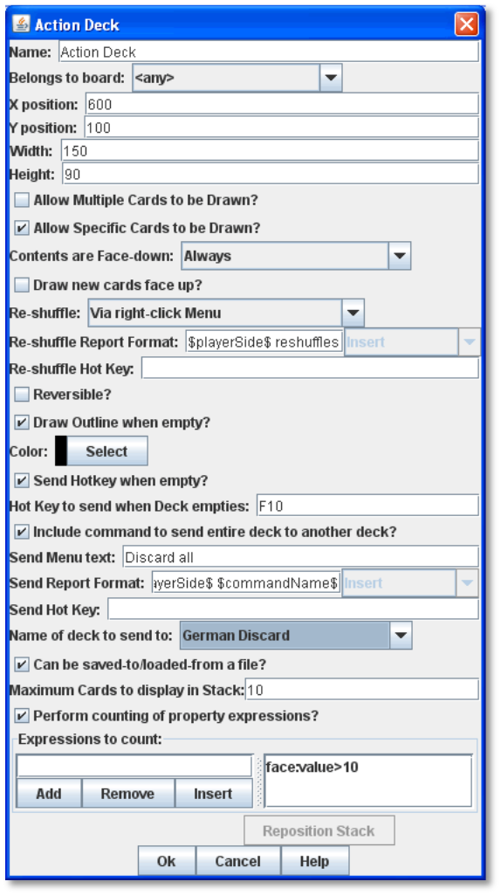
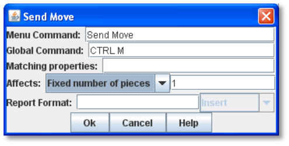

= Decks and Cards

Many games include decks of cards as part of play; in fact, some games consist _entirely_ of decks of cards. In VASSAL, Cards are created as a special form of Game Piece. However, the Deck functionality can be applied to a range of Game Piece types besides traditional Cards, such as for any pieces whose number is fixed or which need to be drawn randomly.

== Creating a Deck

A Deck functions like a deck of playing cards. Each game begins with the contents of the Deck as specified in the *[Deck]* node. During a game, players may remove Cards from the Deck by clicking on the Deck and dragging cards from it with the mouse. This removes the Card from the Deck and assigns ownership to the dragging player. Dragging a Card onto the Deck area adds it back to the Deck.

Each Deck must be placed on a Map Window. A Deck may have a Command Menu that can include specialized commands that will affect only the Cards in the Deck.

=== Deck Attributes

Each Deck has the following attributes:

* *Name:* The name of a Deck is not used during game play. It is just used for identification in the module editor.
* *Belongs to Board:* If a name is selected, the Deck will appear on that particular Board. If a game does not use that Board, then the Deck will not appear. If _Any_ is selected, then the Deck will always appear at the given position, regardless of the boards in use.
* *X, Y position:* The position in the Map Window of the center of the Deck. If this Deck belongs to a Board, the position is relative to the Board's position in the Map Window.
* *Width, Height:* The size of the "tray" holding the Cards. If the Deck is empty, this determines the area into which players may drag Cards to add them back to the Deck. It should be set to the same size as the Cards the Deck will hold.
* *Allow Multiple Cards to be Drawn:* Adds a Command Menu entry that prompts the user to specify the number of Cards to be drawn from the Deck with the next drag.
* *Allow Specific Cards to be Drawn:* Adds a Command Menu entry that prompts the user to examine the Deck and select exactly which Cards will be drawn from the Deck with the next drag.
* *When Selecting, List Cards Using:* When the user is prompted to select specific Cards from the Deck, individual Cards will be listed using the specified Message Format.
* *When Selecting, Sort Cards By:* When the user is prompted to select specific Cards from the Deck, the Cards can optionally be sorted (alphabetically) using the listed Property. Leave blank to list Cards by their occurring position in the Deck. Example: Cards in a Deck can use a Marker Trait to specify a Card number (001,002) and always list Cards in order of their assigned number.
* *Contents are Face-down:* Determines whether Cards in the Deck are always face-down, always face-up, or can be switched from face-up to face-down with a Command Menu entry.

[loweralpha, start=15]
. *Face Down Report Format:* A Message Format that is echoed to the chat text window whenever a player selects the *Face Down* menu item (if enabled above): DeckName is the name of this Deck, commandName is the name of the menu item.
[loweralpha, start=15]
. *Draw New Cards Face Up:* If selected, then Cards drawn from this Deck will be placed face-up on the playing area. If un-checked, then Cards in a facedown Deck are drawn face down and owned by the drawing player.

* *Re-Shuffle:* If set to _Never_, then Cards remain in their original order; Cards are drawn from and added to the top. If set to _Always_, then Cards are always drawn randomly from the Deck. If set to _Via right-click menu,_ then a *Shuffle* command is added to the Deck's Command Menu.
[loweralpha, start=16]
. *Re-Shuffle Report Format:* A Message Format that is echoed to the chat text window whenever a player

selects the "Shuffle" menu item (if enabled above): DeckName is the name of this Deck, commandName is the name of the menu item.

* *Reversible:* Adds an entry to the Command Menu that reverses the order of Cards in the Deck.
[loweralpha, start=17]
. *Reverse Report Format:* A Message Format that is echoed to the chat text window whenever a player

selects the Reversible menu item (if enabled above): DeckName is the name of this Deck, commandName is the name of the menu item.

* *Draw Outline When Empty?* Whether to draw the "tray" for the Cards. The "tray" is a rectangle of the specified width and height, centered at the x, y coordinates. Only drawn when there are no Cards in the Deck, to indicate where to drag Cards to place them back in the Deck. May not be necessary if the Map Window contains a board onto which the tray is already drawn.
* *Color:* The color of the rectangle representing the "tray" above.
* *Send Hotkey when Empty?* Select this option to send a Global Hotkey whenever the Deck is emptied.
[loweralpha, start=18]
. *Hotkey To Send When Deck Empties*: Select the Hotkey combination to send whenever enough Cards are removed from the Deck to empty it.
* *Include Command To Send Entire Deck To Another Deck:* If selected, the Command Menu for this Deck will include a command that sends every piece in this Deck to a designated Deck. For example, this can be used to reshuffle a discard pile into its original Deck. The following three attributes all refer to this option.
[loweralpha, start=19]
. *Menu Text:* The text that appears in the Command Menu.

[loweralpha, start=15]
. *Report Format:* A Message Format that is echoed to the chat text window whenever a player selects *Send*

*to Another Deck* (if enabled above): DeckName is the name of this Deck, commandName is the name of the menu item.

[loweralpha, start=15]
. *Name Of Deck To Send To:* The name of the Deck that the contents will be sent to.

* *Can Be Saved-To/Loaded-From A File:* If selected, the Deckʼs Command Menu will include *Save* and *Load* items.
[loweralpha, start=16]
. *Save* saves the contents of a Deck to a file.
[loweralpha, start=15]
. *Load* replaces the contents of the Deck with the Cards specified in the file. Saved Decks can be loaded into an entirely different game than the one used to save the Deck. This option is useful for collectible Card games, in which a player may prepare a Deck offline in preparation for a game.

* *Maximum Cards To Be Displayed In Stack:* This defines the maximum number of Cards to graphically display in the Deck. The default is 10. For example, if set to 10, a Deck of 52 will appear to have 10 Cards, until the actual number of contents drops below 10. Then the Deck will visually start to shrink as Cards are removed. If set to 1, the Deck will appear flat like a single Card.
* *Perform Counting Of Property Expressions:* Enable processing of Property expression counting. Expressions must be defined.
[loweralpha, start=16]
. *Expressions To Count:* Specify expressions to be counted within the Deck. These can be whatever you like and must be in the format of: <expression name> : <expression> For each expression, a map-level Property called <DeckName>_<expression name> is exposed. The exposed value is number of pieces for which that expression evaluates to true. An example of how to do this is provided on page 77. NOTE: Currently the only dynamic Property that can be used in counting expressions is playerSide. Other dynamic Properties will most likely not update if they change after pieces move into a Deck.

* *Reposition Stack:* Click to drag a representation of the Deck to its final position on the board. This overrides any values you specified for X and Y positions, above.

_*Repositioning an Empty Deck:* You must have at least 1 Card defined for a Deck in order to use the *Reposition* function. If the Deck does not have any Cards, like a discard pile, define a single dummy Card for the Deck, reposition the stack by dragging, and then delete the dummy Card when youʼre done._

_*Decks and Cards: Creating Cards*_

First create the Deck, and then create the individual Cards in it.

*To create a Deck,*

. Select (or create) a Map Window where your Deck will reside.
. Right-click the selected *[Map Window]* node and pick *Add Deck.*
. In the *Deck* dialog, enter the attributes for your Deck.
. Click *Ok*.

You may now create the Cards for the new Deck.

== Deck Properties

Decks include these Properties. <Deckname> is the name of the Deck.

[cols=",,",]
|================================
a|
*Name*

a|
*Description*

a|
*Property Level*

a|
<Deckname>_numPieces

a|
Number of Cards in the Deck.

a|
Map

a|
<Deckname>_<type>

a|
Number of Card types in the Deck.

a|
Map
|================================

== Creating Cards

You create Cards like other Game Pieces, and may use any of the standard Game Piece Traits. However, by default, Cards include a Mask Trait to reflect their back face, which is hidden from view until revealed.

The term “Card” is used to describe any piece in a Deck, even if it does not necessarily resemble a traditional playing Card.

Cards may represent actual cards, blocks, map tiles, or any number of other counter types.

Once created, a *[Card]* node may not be converted into a *[Game Piece]* node, and vice versa.

_In VASSAL 3.1.16 and earlier, Cards were created as part of a Deck and could never be pasted into Game Piece Palettes. Similarly, ordinary Game Pieces could not be pasted into Decks. This is no longer true in versions 3.1.17 and later—the two types of piece are interchangeable between Palettes and Decks._

*To create Cards for your Deck,*

. Expand the *[Map Window]* node where the Deck resides.
. Right-click the new *[Deck]* node and pick *Add Card.*
. In the *Card* dialog, select the Traits for the Card as you would a Game Piece.

_Remember to define a base image for each Card, or the Card may appear to vanish when drawn from a Deck._

[arabic, start=4]
. Click *Ok*.
. Repeat steps 2-4 until all Cards have been added to the Deck.

In the Module Editor, Cards are treated as a distinct piece type. Cards may not be pasted into Game Piece Palettes, and ordinary Game Pieces may not be pasted into Decks.

For more information on creating Game Pieces, see page 40.

== Cards and Prototypes

Cards from the same Deck often behave identically and are different only in their front faces. For instance, they most likely have the same Card back images, and will likely be sent to the same Deck (such as a discard pile) after use.

As a result, itʼs highly recommended to define a Prototype for each Card type in your game, and then assign the relevant Prototype Trait to each Card in a Deck. (See _Prototypes_ on page 67.)

For example, the game includes an Event Deck where the Cards describe random game events. You can create a Prototype called Event Card that includes a Mask Trait to reflect the common back of the Event Cards, and a Return to Deck Trait that sends discarded Event Cards back to the Event Deck.

By default, new Cards include a Mask Trait. You can delete the default Mask Trait and define it in the Prototype instead.

== Copying and Pasting Cards

Copying and pasting Cards can vastly speed up the process of Card creation. Define the first Card, then right -click, *Copy* the Card, and paste it into your *[Deck]* node. You will now have an identical copy of the first Card. You can then edit the copy and select a new image for the face of the Card. You can create many new Cards quickly by repeating this method.

== Editing the Contents of a Deck

You can make wholesale changes quickly to the entire contents of a Deck. Right-click the Deck and pick *Edit All Contained* *Pieces*. The *Properties* dialog for the first Card is displayed, but any changes you make in the Properties dialog will affect all Cards in the Deck. Add, remove or edit Traits as usual, then click *Ok*. Your changes are applied to all Cards.

== Card Properties

Cards have all the same Properties as regular Game Pieces. However, they also include these system Properties:

[cols=",",]
|=========================================================
a|
*Name*

a|
*Description*

a|
ObscuredToOthers

a|
Has a value of true if the Card is masked.

a|
DeckName

a|
Name of the Deck the Card is currently stacked in, if any.

|=========================================================

== Deck Global Key Command (GKC)

This component adds an action that applies a key command to pieces contained within the Deck, similar to the Global Key Command component of a Map Window. Each Deck GKC has these attributes.

* *Menu Command:* Name of the Command Menu item.
* *Keyboard Command:* Keyboard shortcut of the menu item that initiates the command.
* *Global Command:* The key command that will be applied to the Cards in the Deck.
* *Matching Properties:* The key command will only be applied to pieces with the specified Properties. If you do not enter a Property expression, then all Cards in the Deck will be selected.
* *Affects:* The Global command can apply to all Cards in the Deck, or to a set number only. Use a setting of 1 to select the top Card.
* *Report Format:* A Message Format that is echoed to the chat text window whenever the Global Key Command is activated.

*To add a Deck Global Key Command to a Deck,*

. Expand the *[Map Window]* node where the Deck resides.
. Right-click the new *[Deck]* node and pick *Add Deck Global Key Command.*
. In the *Deck Global Key Command* dialog, specify the behavior of the GKC.
. Click *Ok.*

== Card Decks in Practice

The following examples of possible Card Decks illustrate a variety of uses for them.

* *Playing Cards:* An ordinary Deck of playing Cards for Poker or Hearts would be set to: Allow Multiple = false, Allow Specific = false, Face Down = Always, Re-shuffle = Always, Reversible = false.
* *Discard Pile:* A Discard Pile is a type of Deck that is typically empty at game start. Cards from another Deck are drawn, played and then sent to the Discard Pile. When the other Deck is empty, the Discard pile is usually re-shuffled into the other Deck, and play continues. To create a typical Discard pile, define a Deck as usual, but use these settings:

[loweralpha, start=15]
. Allow Multiple = false, Allow Specific = false, Face Down = Never, Re-shuffle = Never, Reversible = false.

[loweralpha, start=15]
. Select *Include Command To Send Entire Deck To Another Deck* and define a command that when selected, will move all the discards back to the main Deck.

[loweralpha, start=15]
. The Discard pile should begin empty, so there is no need to define Cards for it.
[loweralpha, start=15]
. To move discards to the discard pile, for each Card in the main Deck, add a Return to Deck Trait, specifying the Discard Pile as the destination Deck.

_If discards are not intended to return to the main Deck but instead are permanently removed from the game, it may be better to use the Delete Trait for each card instead of creating a Discard Pile_

* *Force Pool:* A strategic game in which a nationality has a fixed force pool of variable-strength Infantry, Armor, and other forces can be modeled by making a Map Window representing the force pool, with a Deck of Infantry counters, a Deck of Armor counters, and so on. The Decks would be set to Allow Multiple = false, Allow Specific = false, Face Down = Never, Re-shuffle = Never, Reversible = false.
* *Random Turn Order Cards:* If the game has a random turn order, players may draw from a Deck to determine who moves first, second and third. Create a Deck where each Card is labeled 1, 2, 3, and so on. Select Allow Multiple = false, Allow Specific = false, Face Down = Always, Re-shuffle = Always, Reversible = false.
* *Playing Cards with Number of Cards Displayed:* You want to create a Deck of playing Cards, and display the number of red Cards, the number of black Cards, the number of face Cards, and the total number of Cards in the Deck. Create the Deck, and check *Perform counting of expressions*. Add the expressions of "red: Color = red" and "black: Color = black". Also add the expression "faceCards: value > 10". When creating your Cards, give them a Marker Trait named Color with the values of _red_ or _black_. Also give your Cards a Marker Trait named Value with the numeric value of the Card. Then, you can refer to the counts with the map-level Properties of <Deckname>_red, <Deckname>_black, and <Deckname>_faceCards. The total can be referenced by the map-level Property of <Deckname>_numPieces.

=== Map Tiles

Some games make use of map _tiles_, which are usually shuffled at the beginning of a game, drawn randomly and then placed to provide a random map layout. (If the layout is not random, or is in a regular row-column pattern, then an ordinary Map Window, with multiple Boards, will probably meet your needs better.)

To create randomly-placed Map Tiles, do the following:

. Create (or select) a Map Window in which the tiles will be placed.
. Create a solid-color board in the Map Window that will be large enough to accommodate your map tile layout.
. Add one or more Game Piece Layers to the Map Window. The lowest layer should be the Tile level.
. Create a Deck for the random Map Tiles to be drawn from. The Deck should have these settings: Allow Multiple = false, Allow Specific = false, Face Down = Always, Re-shuffle = Always, Reversible = false.
. Create each Map Tile as a Card in the Deck. Assign each Tile to the Tile Game Piece Layer you created in Step 3.

Now, at game start, players can draw random map tiles and place them in the Map Window. The map tiles will always appear beneath all the other Game Pieces.

=== Dealing Random Cards to a Board

The Deck shuffle function can be used to deal randomly drawn cards from a Deck to pre-defined locations on the board, using a single click of a Global Key Command button.

To deal random cards to a board, do the following:

. Create or select a Map Window to send the pieces to.
. In the Map Window, create a board with an Irregular Grid. Label the Grid points numerically (1, 2, 3, 4, and so on).
. Add a command to the selected Map Window (in *Key Command to Apply to All Units Ending Movement on This Map*) of Ctrl-I.
. Create a Global Property named GridLocation. This Global Property will be used to track the next point to send the piece to. It should have minimum value that is the same as the lowest-numbered Irregular Grid point (that is, 1), a maximum value that is the same as the highest-numbered Grid point, and *Wrap Around* selected.
. Create a Deck (on the same or different board) and make sure *Re-shuffle* is set to _Always_.
. Add the first Card to the Deck. Add a Send to Location Trait to this Card: Send to Board (the Board created in Step 2) and the Region (enter $GridLocation$ in the *Region* box).
. Add a Set Global Property Trait to the Card, with a command that will increment the GridLocation Property by 1. Give the Set Global Property command a shortcut of Ctrl-I (for Increment). Note that this is the same hotkey we specified in Step 3.
[arabic, start=8]
. Copy and Paste the first card repeatedly until you have the desired number of cards in the Deck. Edit each card as needed with graphics or Traits.
. Create a Global Key Command (GKC) for the same Map Window where the Deck is (or for the *[Module]* node).
* For *Matching Properties*, enter _DeckName =_ <the name of the Deck you created in Step 5>.
* For *Key Command* use the Hotkey for the Send to Location Trait you created in Step 6.
* For *Within a Deck, Apply To*, select _Fixed Number of Pieces_, and then enter the number of Grid points you created in Step 2.

When clicked, the GKC from Step 9 will affect the designated number of Cards in the Deck, triggering each oneʼs Send to Location command. The first random Card is sent to Grid location 1, which then increments GridLocation by 1. So the next Card is sent to Grid location 2. The process continues until all the cards are dealt.

This process will deal one Card to each location before stopping. Instead, if you want to deal out all the Cards in the Deck, with multiple Cards on each Grid point, in Step 9, for *Within a Deck, Apply To*, select _All Pieces_ instead.
