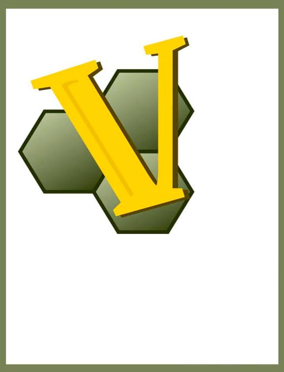

*VASSAL 3.1*

*Designer’s Guide*

*VASSAL 3.1 Designerʼs Guide*

Version 1.4, June 2012

*Credits*

_VASSAL_ designed by Rodney Kinney

*Designerʼs Guide:* Ed Messina (ed@crucible.cc, mycenae on the VASSAL forums)

*Development Team:* Rodney Kinney, Joel Uckelman, Brent Easton, Michael Kiefte, Tim McCarron

*Testing:* Thomas Russ

*Website and Forum Management:* Ben Smith

Comments on this document and suggestions for improvement are welcomed. Please contact Ed Messina ([.underline]#ed@crucible.cc#) with your comments and suggestions.

Programming skills are not necessary for creating fully functional VASSAL modules.

include::overview.adoc[]

include::preparation.adoc[]

include::the-module-editor.adoc[]

include::using-properties.adoc[]

include::maps-and-boards.adoc[]

include::sides.adoc[]

include::game-pieces.adoc[]

include::prototype-definitions.adoc[]

include::game-piece-image-definitions.adoc[]

include::decks-and-cards.adoc[]

include::generating-random-results.adoc[]

include::additional-module-components.adoc[]

include::pre-defined-setups.adoc[]

include::help-menu.adoc[]

include::additional-topics.adoc[]

include::creating-module-extensions.adoc[]

include::publishing-your-module.adoc[]

include::updating-a-module.adoc[]

include::best-practices.adoc[]

include::tutorials.adoc[]
