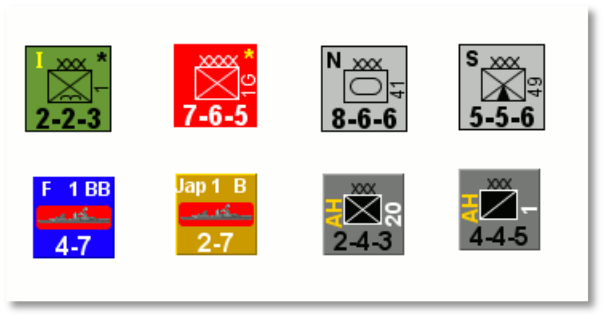
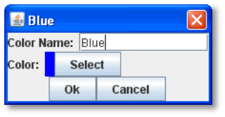
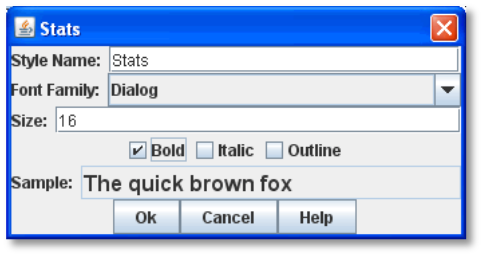
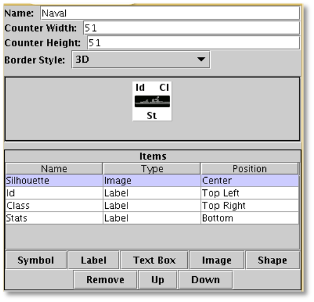
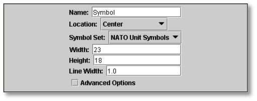
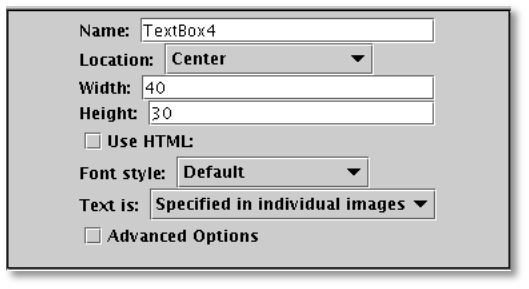
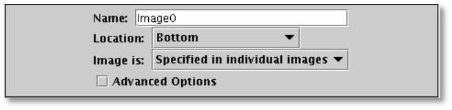

== Game Piece Image Definitions

Using Game Piece Image Definitions, you can build your own Game Piece images, by combining text, images, and standard NATO military symbols. Images defined in this component will be available for use with Game Pieces, just like any externally created images you have imported into the module.

You can use your own images instead of the computer-drawn NATO symbols, so for many games, you will be able to define the whole counter set with just a handful of images. Furthermore, you can change the size and layout of all the counters in your game easily by adjusting the layouts.

Set up a Game Piece Image Definition in two steps:

[upperalpha, start=9]
. *Layout:* First, create a Game Piece Layout. In the Game Piece Layout, you specify the position, size and style of all items to be drawn on the counter. Colors, actual text, and symbol selections are made in step 2.

[upperalpha, start=35]
. *Define Pieces:* Define an individual image using a layout. In each Image Definition, you specify the actual colors, text and symbols to be used for that image, based on the layout.

[cols=",,",]
|============================================================
a|
After defining the Game Piece Image, you can assign it to the

a|
*Some examples of Game Piece Image Definitions*

|
|Game Piece, along with any Traits. | |
|============================================================

_Use of Game Piece Image Definitions to create counters is optional. Itʼs best for use in wargames or other games with a large number of standardized counters._

=== Game Piece Image Elements

Game Piece Image Definitions have the following elements: Named Color, Font Style, and Layout.

==== Named Colors

Each color you wish to use in Image Definitions is predefined and given a name. These colors will appear in a palette for selecting foreground or background colors in the image. 14 Standard colors are built-in: Clear, White, Black, Light Gray, Dark Gray, Red, Green, Blue, Orange, Pink, Cyan, Magenta, Yellow.

* *Color Name:* The name of the color that will appear in drop-down menus in the Image Definitions.
* *Color:* Standard Color selector to select the color to be associated with the name.

*To create a named color,*

. Right-click the *[Named Colors]* node and pick *Add Named Color.*
. On the *Color Name* dialog, in *Color Name*, name the new color.
. In *Color*, click the color selector, and select the desired color.
. Click *Ok*.

==== Font Styles

Font Styles used in Image Layouts are defined here and selected by name from drop-down menus. A Font Style consists of a Font Family, size and style (plain, bold, italic, bold-italic). A default style is always defined: 12 point Dialog font.

* *Style Name:* The name of the Font Style that will appear in drop-down menus in the Image Layout.
* *Font Family:* The Font Family to use. To ensure maximum compatibility and portability, only the pre-defined Java logical fonts are available as options.
* *Size:* The size of the font style in points.
* *Bold:* Click on to select a Bold font style.
* *Italic:* Click on to select an Italic font style.
* *Sample:* Display a sample of your selected font style.

*To create a font style,*

. Right-click the [*Font Styles]* node and pick *Add Font Style.*
. On the Font Style dialog, enter the settings for the font style.
. Click *Ok*.

=== Game Piece Layouts

A Game Piece Layout defines the general appearance and positioning of the items used in drawing an image. Each Layout is composed of a rectangle of the background color, a border, and items such a symbols, labels, text boxes, images, or shapes. These items are generic and defined in terms of their appearance and position of the counter. Later, when the image is defined based on the layout, we can specify actual settings for each of these items, such as the specific symbol to use, or the specific text to show.

A Game Piece Layout has these attributes:

* *Name:* The name of the Image Layout.
* *Counter Width:* The width, in pixels, of all counters created using this layout.
* *Counter Height:* The height, in pixels, of all counters created using this layout.
* *Border Style:* The border style for all counters created using this layout. Border styles available are:

[loweralpha, start=15]
. _Plain:_ Single-pixel line of defined color.

[loweralpha, start=15]
. _Fancy:_ Two-pixel shaded line of defined color. Mild 3D effect.

[loweralpha, start=15]
. _3D_: A three-dimensional shaded border. Two pixels

wide, color automatically determined from background color.

[loweralpha, start=15]
. _None:_ No Border

* *Symbol:* A Symbol is a generic symbol to be drawn by VASSAL. These must be NATO Unit Symbols. The particular symbol is chosen in the Game Piece Image.
[loweralpha, start=16]
. *Name:* The name of the Item. Items must be uniquely named within an Image Layout.

[loweralpha, start=15]
. *Location:* Select the location of the item on the counter.

[loweralpha, start=15]
. *Symbol Set:* Select the Symbol Set to use. (The only symbol set available currently is standard NATO Unit Symbols.)

[loweralpha, start=15]
. *Width:* The width of the body of the symbol in pixels.

[loweralpha, start=15]
. *Height:* The height of the body of the symbol (not including the Size specifier) in pixels.

[loweralpha, start=15]
. *Line Width:* The width of the line (in pixels) used to draw the symbol. Fractional line widths can be used. The lines are drawn with anti-aliasing turned on, to produce smooth looking lines of any width. When using a small symbol size, a line width of 1.0 will usually give the best results.
[loweralpha, start=15]
.. _________________________________________________________________________________________________________________________________
*Advanced Options:* If selected, you can specify values for X and Y offset, Rotation, and whether or not to anti-alias the image.

* *Label:* A Label is a text label drawn in a particular font at a particular location. The value of the text can be specified in the individual images or in the layout, in which case all images using this layout share the same value.
[loweralpha, start=16]
. *Name:* The name of the Item. Items must be uniquely named within an Image Layout.

[loweralpha, start=15]
. *Location:* Select the location of the item on the counter. The location also determines the text justification, i.e. selecting Top Left ensures that the upper left corner of the text is in the upper left corner of the image. Once the justification is set by the Location, you can still use the X/Y offset in the advanced options to place the text in a different location.

[loweralpha, start=15]
. *Font Style:* Select the name of the Font Style to be used for this Text Item.

[loweralpha, start=15]
. *Text is:* Select whether the text is specified in the layout or in the images.
[loweralpha, start=15]
.. _________________________________________________________________________________________________________________________________
*Advanced Options:* If selected, you can specify values for X and Y offset, Rotation, and whether or not to anti-alias the image.

* *Text Box:* A Text Box Item is multi-line area of text drawn in a particular font at a particular location. The value of the text can be specified in the individual images or in the layout, in which case all images using this layout share the same value.
[loweralpha, start=16]
. *Name:* The name of the Item. Items must be uniquely named within an Image Layout.

[loweralpha, start=15]
. *Location:* Select the location of the item on the counter. The location also determines the text justification, i.e. selecting Top Left ensures that the upper left corner of the text is in the upper left corner of the image. Once the justification is set by the Location, you can still use the X/Y offset in the advanced options to place the text in a different location.

[loweralpha, start=15]
. *Use HTML:* If selected, then the contents will be interpreted as HTML.

[loweralpha, start=15]
. *Font Style:* Select the name of the Font Style to be used for this Text Item.

[loweralpha, start=15]
. *Text is:* Select whether the text is specified in the layout or in the images.
[loweralpha, start=15]
.. _________________________________________________________________________________________________________________________________
*Advanced Options:* If selected, you can specify values for X and Y offset, Rotation, and whether or not to anti-alias the image.

* *Image:* An Image item is an imported image.
[loweralpha, start=16]
. *Name:* The name of the Item. Items must be uniquely named within an Image Layout.

[loweralpha, start=15]
. *Location:* Select the location of the item on the counter.

[loweralpha, start=15]
. *Image is:* Specify whether the image is specified in this layout or in the images that use this layout. Use the File Open Dialog box to locate a copy of the image you wish to use on your PC. When you save the module, VASSAL will attempt to copy this image into the images folder within the module zip file. You can also manually copy images into your images folder.

[loweralpha, start=15]
. *Advanced Options:* If selected, you can specify values for X and Y offset.

* *Shape:* A Shape Item is a simple geometric shape.
[loweralpha, start=16]
. *Name:* The name of the Item. Items must be uniquely named within an Image Layout.

[loweralpha, start=15]
. *Location:* Select the location of the item on the counter.

[loweralpha, start=15]
. *Width:* Select the width of the shape.

[loweralpha, start=15]
. *Height:* Select the height of the shape.

[loweralpha, start=15]
. *Shape:* Select the type of shape.

[loweralpha, start=15]
. *Bevel:* For Rounded Rectangle shapes, larger bevel values mean rounder corners.
[loweralpha, start=15]
.. _______________________________________________________________________________________________________________________
*Advanced Options:* If selected, you can specify values for X and Y offset, and whether or not to anti-alias the image.

* *Items List:* Items are drawn in the layout based on their order in this list. An item at the top of the list will be drawn on top of the items below it. An item below another item in the list will also be drawn below it in the Layout. Use these buttons to control items in the Items List:
[loweralpha, start=16]
. *Remove:* Removes the selected Item.

_*Game Piece Image Definitions: Game Piece Images*_

[loweralpha, start=15]
. *Up/Down:* These move the selected Item up or down in the list and cause the item to be drawn on top of, or below, the other elements.

_*Creating a Game Piece Layout*_

As you design the Layout, a preview is shown in the *Game Piece Layout* dialog box.

*To create a Game Piece Layout,*

. Right-click the *[Game Piece Layouts]* node and pick *Add Game Piece Layout.*
. On the *Game Piece Layout* dialog, specify the elements of the layout.

[loweralpha, start=15]
. *Name*

[loweralpha, start=15]
. *Counter Width and Counter Height*
[loweralpha, start=15]
.. ______________
*Border Style*

[arabic, start=3]
. Select one or more items to include in the Layout by clicking the corresponding button, and then entering the details of the item. Repeat for any additional items.
. Click *Ok*.

=== Game Piece Images

Now that youʼve created a Named Color, Font Style, and a Game Piece Layout, you can create one or more images that use these elements, and choose specific values for the layout items.

For example, we can create a Game Piece Layout called British Unit. The Layout uses a brown background and a Symbol Item placed in the center of the Layout. When we define an image based on the Layout, we can choose a specific NATO symbol to appear in the Layout (for example, Cavalry or Infantry). We can then save each image we create and use them when we assign images to Game Pieces.

A Game Piece Image has these attributes:

* *Name:* Specify a name for the image definition. This is the name under which this image will appear in the image-selector drop-down menu in a Game Piece Trait's Properties.
* *Background Color:* Select a background color for the image from the drop down list of available colors.
* *Items:* The Items panel shows the configurable items that make up your image layout. Click on an item to display the configurable options for that item in the bottom display panel. There is a different display panel for each type of item.

*Symbol Item Configuration*

* *Unit Size:* Select the NATO Unit Size specifier from the drop-down menu.
* *1st Symbol:* Select the Primary NATO Symbol from the drop-down menu.
* *2nd Symbol:* Select the Secondary NATO Symbol from the drop-down menu.
* *Symbol Color:* Select the color used to draw the symbol lines.
* *Background Color:* Select the color to use for the background of the symbol body.
* *Size Color:* Select the color used to draw the Size Specifier drawn above the symbol body.

*Label Item Configuration*

* *Value:* Enter the text to display on the image.
* *Foreground Color:* Select the color to use to draw the text.
* *Background Color:* Select the color to use to draw a box behind the text.

*Text Box Item Configuration*

* *Value:* Enter the text to display on the image.
* *Text Color*: Select the color to use to draw the text.
* *Background Color:* Select the color to use to draw a box behind the text.

_*Game Piece Image Definitions: Game Piece Images*_

*Image Item Configuration*

Import an image to draw at the position specified in the layout.

*Shape Item Configuration*

* *Foreground Color:* Select the fill color for the shape.
* *Background Color:* Select the color for the shape's outline.

_*Creating a Game Piece Image*_

*To create a Game Piece Image,*

. In the *[Game Piece Layouts]* node, select a Game Piece Layout with which to create an image.
. Right-click the node and choose *Add Game Piece Image.*
. In the *Game Piece Image* dialog, specify the *Name* and *Background Color.*
. In the *Items* list, select an item and specify the details of the item for this particular image. Repeat for all additional Items in the list.
. Click *Ok*.

Once youʼve created an image, it will appear in the image-chooser drop-down list alongside imported images. You can then assign the Game Piece Image to Game Pieces. See page 40 for information on creating Game Pieces.
