== Game Pieces

Game Pieces are what you move around on the map in order to play the game. In some games, pieces are known as _units_, _counters,_ or _tokens_. Pieces can include ordinary Game Pieces, cards, game money, movement tokens, markers, and even map tiles.

=== Game Piece Palette

A Game Piece Palette is a tool for generating and organizing Game Pieces. During the game, players draw pieces from one or more palettes and place them on the map. There is no limit to the number of pieces that can be generated by a Game Piece Palette. Pieces will appear in the palette in the order they are listed in the Configuration Window.

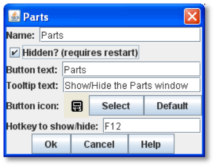

Each Game Piece Palette has these attributes:

* *Name:* If the palette appears in its own window, this will be used for the title.
* *Hidden:* If selected, then this Game Piece Palette will not appear at all during play. This is useful if you need to define pieces for a default Setup but don't want to allow players to create new pieces during play. You must restart VASSAL for this change to take effect in the Module Editor.
* *Button Text:* The text on the Toolbar button that shows and hides the Game Piece Palette.
* *Button Icon:* The icon image on the Toolbar button.
* *Hotkey to Show/Hide:* A keyboard shortcut for the Toolbar button. Toggles visibility of the Palette.

  An infinite number of Pieces can be drawn from a Game Piece Palette. However, some games have a limited number of pieces available on purpose. Too many pieces may actually affect the game ʼs balance and playability. In such games, your module should have the same limitations as the actual game. If the quantity of a Game Piece is limited in a game, itʼs probably better to use At-Start Stacks than a Game Piece Palette. See page 24 for more information.

==== Palette Sub-Components

A Game Piece Palette is highly configurable, and can contain any combination of tabs, lists, and pull-down menus containing individual Game Pieces. For example, a Scrollable List could include a Panel, which includes individual Game Pieces.

* *Tabbed Panel:* A panel with tabs, each of which corresponds to a Panel or other Tabbed Panel subcomponent. The label of the tab will be the name of the subcomponent.
* *Panel:* A panel that can contain Single Pieces, Tabbed Panes, or other panels. Select *Fixed Cell Size* to specify a fixed number of columns for the panel. Otherwise, the sub-components will appear in a single row, or a single column if the *Vertical layout box* is checked.
* *Pull-down Menu:* A pull-down menu in which each menu item corresponds to a subcomponent. The name of the menu item will be the name of the subcomponent.
* *Scrollable List:* A scroll list in which each entry corresponds to a subcomponent. The name of the entry will be the name of the subcomponent.
* *Single Piece:* A Game Piece that can be dragged onto a playing area. (Most Single Piece sub-components will be part of another sub-component, grouped with similar pieces.)

By default, a new module includes an empty Game Piece Palette, but you can modify the default, or create as many new ones as you need.

==== Docked Palette

By default, the first palette in the Editor (that is, at the top of the list in the Editor window) will be displayed docked (attached) to the module main controls and Chat Window. All other palettes will be undocked (detached).

If a player has the *Use Combined Application Window* preference checked, then the first (topmost) Game Piece Palette in the Configuration Window will dock into the main controls window to the left of the chat area. All other Palettes will appear in their own window.

_To detach all palettes from the toolbar for all players, use an empty hidden palette as the first one in the list._

_*Game Pieces: Creating Game Pieces*_

==== Creating a Game Piece Palette

*To create a Game Piece Palette,*

. Right-click the *[Module]* node and select *Add Game Piece Palette.*
. In the *Game Piece Palette* dialog, specify the settings for the palette.
. Click *Ok*.
. Right-click the new *[Game Piece Palette]* node and pick a sub-component to add.
. Continue adding subcomponents as needed.

After a palette is created, you can then create individual pieces.

==== Pre-Setting Pieces in a Game Piece Palette

Pieces in a Game Piece Palette can be pre-set in particular states based on the Traits they possess. Whenever the pieces are drawn from the palette, they will be in the pre-set state.

For example, you would like a rotatable piece to start each game rotated 90 degrees to the right. In the VASSAL Player, right-click the piece in the palette, select *Rotate* from the pieceʼs Command Menu, and rotate the piece to desired position. Now save the module. The pieces will be displayed in the rotated state you saved, and new pieces dragged from the palette will be created rotated 90 degrees to the right.

In order to pre-set a Trait, the piece must possess the Trait directly and may not inherit it from a Prototype. (For pre-setting Traits in a Prototype, see page 67.)

==== Displaying Large Pieces in the Palette

Each level of the palette allows a scale factor to be set, controlling the size that pieces are drawn. Thus you can specify a smaller scale for palettes containing large pieces.

=== Creating Game Pieces

A Game Piece is defined by its _Traits_. Each Trait gives a Game Piece one or more kinds of specialized behavior or attributes.

You can assign any number of Traits to your piece, to reflect its usage in the game.

By default, each piece includes the Basic Piece Trait (see page 44), which defines the name of the piece and the basic image used. The Basic Piece Trait may not be deleted.

==== Trait Order

The order of Traits as they appear in the pieceʼs *Properties* dialog is crucial when defining a Game Pieceʼs behavior. Traits are evaluated from the bottom of the list to the top. _A Trait will only affect those Traits above it in the_ _*Properties*_ _dialog._

For example, if you define a Rotate Trait on a Game Piece, and then a Text Label Trait below that, when the piece is rotated, the Text Label will not rotate.

If you were to move the Text Label Trait _above_ the Rotate Trait, then when the piece is rotated, the Text Label would rotate along with the piece.

Trait order is often the first place to look when diagnosing a Game Piece that is not behaving the way you intended. Always check the Trait order to determine if your Traits are being applied in the intended sequence (that is, bottom of the list to the top).

Trait order is _crucial_ when defining a Game Piece’s behavior. A Trait will only affect those Traits _above_ it in the *Properties* dialog.

You may get unexpected results if some Traits are not placed at the end of the list of Traits, where they can affect all other Traits. Examples of Traits that should usually be placed at the bottom of the Properties list include Mask, Invisible, and Restricted Access.

==== Using the Piece Properties Dialog

*To create a Game Piece,*

. In the Module Editor, select (or create) a *[Game Piece Palette]* node.
. Select where in the palette you want the piece to appear (in a scrollable list, a tab, etc.)
. Right-click and choose *Add Single Piece.*
. Under *Current Traits*, Basic Piece is selected. Click *Properties*.
. In the *Basic Piece Properties* dialog, do one of the following:
* Double-click the left side of the dialog, and then browse to the location of the image file you want to use for the piece, or,
* Using the drop-down list, select an existing image file from the list of files that are already in the module.
. In *Name*, enter the basic name of the piece.
. Click *Ok.* The piece is added to the palette.

_You can copy and paste Traits between pieces (and Prototype Definitions). In the *Properties* dialog of the first piece (or Prototype), select the Trait you want to copy, and click *Copy*. Open the *Properties* dialog of the second piece (or Prototype), and click *Paste*. The Trait is copied to the where you pasted it._

*To add Traits to a Game Piece,*

. Select the Game Piece in its palette and click *Properties*.
. On the *Properties* dialog, select a Trait from the *Available Traits* list, and click *Add*. The Trait is moved to the *Current Traits* list.
. Select the Trait, and then click *Properties.*
. In the dialog, specify the settings for the Trait.
. Repeat steps 2-4 until the behavior of the piece has been specified.
. Click *Ok*.

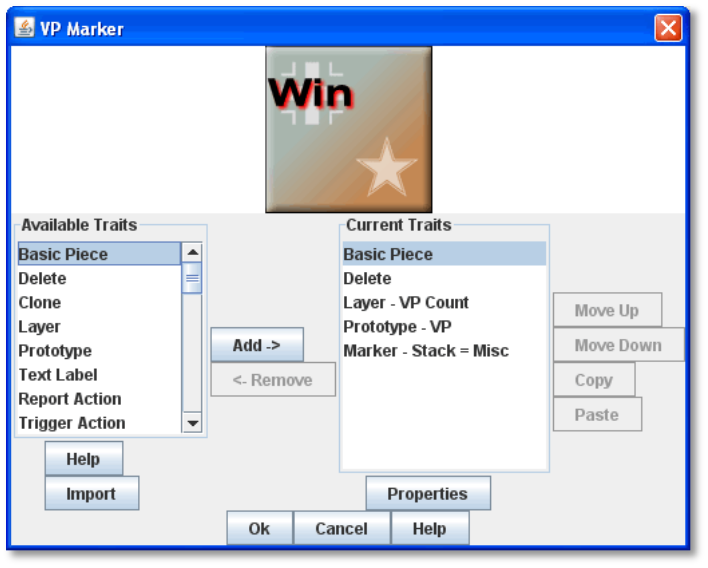

*To change the placement order of an assigned Trait,*

. In the *Current Traits* list, select the Trait to move.
. Click *Up* or *Down* to move the Trait up or down in the list.
. When complete, click *Ok*.

==== Traits and the Command Menu

[upperalpha]
. Game Pieceʼs right-click Command Menu will display Trait-related commands in reverse order from the way they appear in the Trait list. For example, if the Clone Trait were the _last_ Trait defined on a Game Piece (that is, bottom-most on the Trait list), then the corresponding *Clone* command would be the _first_ one displayed in the pieceʼs Command Menu.
* If no text label is specified for a command, then the command will not be displayed in the menu. However, the commandʼs keyboard shortcut could still be used as if the menu item were visible. (Commands that are solely part of a Trigger Action often omit the text label, so the commands will not appear on the menu outside of the Trigger command.)
* You may not omit the Keyboard Shortcut for a Trait (if the Trait Properties dialog prompts for one).

For example, you define a Delete Trait on a Game Piece with a keyboard shortcut of Ctrl-X. You leave the value of Command Name for the Trait blank. As a result, no Delete command shows up in the Command Menu. However, the keyboard shortcut Ctrl-X could still be used in Global Key Commands or Trigger Actions.

==== Keyboard Shortcuts (Hotkeys)

Pressing a commandʼs keyboard shortcut (hotkey) when the piece is selected will invoke the corresponding command, just as if the menu item was selected. For example, a Move Fixed Distance Trait could be defined to use the Ctrl-M shortcut. A player would hold down Ctrl and M simultaneously, with the piece selected, to launch the command.

Hotkeys can also be invoked by automated commands. For example, Trigger Action Traits make use of hotkeys when referring to a sequence of commands. In every respect, a Hotkey invoked by automated commands will work the same as if a player had pressed the key combination on a keyboard.

You can define any unique keyboard shortcut you want as a Hotkey for a particular command. To make it harder to press them accidentally, keyboard shortcuts are usually comprised of more than one key, such as Ctrl-X or Alt-Shift-K.

A keyboard shortcut could be composed of any number of keys, but generally use 2 or 3 keys; usually a letter or number combined with one of the following keys: Ctrl, Alt/Option, Shift, or Meta/Command.

To make them more memorable for players, when assigning keyboard shortcuts, use key combinations that are reminiscent of the command itself. (For example, Ctrl-D would be an easily remembered shortcut for a Delete command.)

Use these guidelines when assigning keyboard shortcuts.

* Keyboard shortcuts should be unique for a given type of piece. If not, when the shortcut is invoked, more than a single command could be fired at once, with possibly unexpected results.
* Avoid using keyboard shortcuts that players could type inadvertently. For example, a single capital letter M would not be a suitable shortcut, nor would Shift-M, because players could easily type either in the Chat window during ordinary conversation. However, Ctrl-M or Ctrl-Shift-M would both be suitable.
* Be careful about assigning hotkeys to keys that invoke special functions on your computer. Caps Lock, Backspace, Delete, Home, End, Enter/Return, and so on, are not appropriate for use as hotkeys. Similarly, the Function (F1-F9) keys at the top of a standard keyboard may serve as hotkeys for various Windows or MacOS  functions, and pressing them could cause unexpected operating system functions to be invoked instead of the desired piece command.

= Trait Descriptions

The following Traits are available for use with Game Pieces.

[cols=",,,",]
|===========================================================
|Action Button
|Movement Trail
|Area of Effect
|Non-Rectangular
|Basic Piece
|Place Marker
|Can Pivot
|Play Sound
|Can Rotate
|Property Sheet
|Clone
|Prototype
|Delete
|Replace With Other
|Does Not Stack
|Report Action
|Dynamic Property
|Restrict Commands
|Global Hotkey
|Restrict Access
|Global Key Command
|Return to Deck
|Invisible
|Send to Location
|Layer
|Set Global Property
|Mark When Moved
|Spreadsheet
|Marker
|Sub-menu
|Mask
|Text Label
|Moved Fixed Distance
|Trigger Action
|===========================================================

== Action Button

Action Button places a virtual button on your piece. Clicking within the specified rectangular region on the piece will invoke an action just as if the corresponding key command had been typed.

An Action Button Trait has these attributes:

* *Invoke Key Command:* The keyboard command to be invoked.
* *Button X-offset:* The horizontal position of the upper-left corner of the rectangle, in pixels from the center of the piece. Negative numbers are toward the left.
* *Button Y-offset:* The vertical position of the upper-left corner of the rectangle, in pixels from the center of the piece. Negative numbers are toward the top.
* *Button Width:* The width in pixels of the button.
* *Button Height:* The height in pixels of the button.

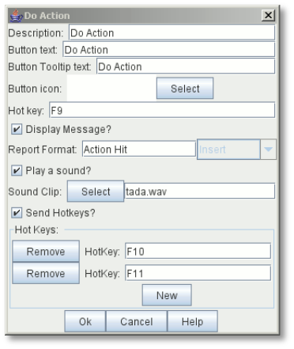

This Trait does not alter the way a Game Piece is drawn, so the Basic Piece or a Layer should be used to supply a visual cue to the player that the button exists.

The Action Button Trait is never affected by the Can Rotate Trait (no matter where the Action Button is placed in the Trait order).

To make a button that can be activated and deactivated, combine an Action Button with a Layer and a Trigger Action.

_Example: A Game Piece representing a spaceship has a self- destruct action that can only be activated when the energy reaches the minimum level. A Layer named Energy is used to represent the energy level. The image for the lowest level of the layer adds an icon for a self-destruct button. An Action Button Trait uses the boundaries of the button icon and invokes Ctrl-ALT+T. A Trigger Action watches for Ctrl- ALT+T and invokes the keyboard command for self-destruct when the Properties match Energy_Level = 1._

**_NOTE: The Action Button Trait is not related to the Action Button module component (see page 84)._**

=== Aligning an Action Button

Use this formula for aligning an Action Button:

* X offset = [width of piece / 2] – (X Position). Then change sign, from positive to negative, or vice versa.
* Y offset = [height of piece / 2] – (Y Position). Then change sign, from positive to negative, or vice versa.

For example, a 100x100 pixel game piece, with button position on the piece at 25x60 pixels, would have these X and Y offset values:

* X-offset = 100 / 2 = 50 - 25 = 25. Change sign, so final X-offset value is -25.
* Y offset = 100 / 2 = 50 - 60 = -10. Change sign , so final Y-offset value is 10.

== Area of Effect

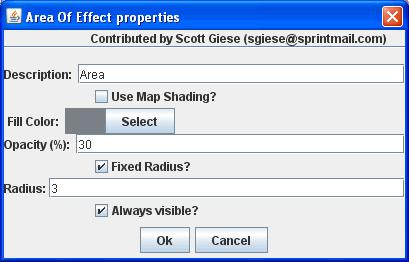

The Area of Effect Trait enables you to graphically highlight an area surrounding a Game Piece. The area is shaded with a specified color and transparency. Alternatively, you can point to a Map Shading component, contributing to the area that it draws.

Area of Effect has these attributes:

* *Use Map Shading:* If selected, then the area of this Trait will be added to the area drawn by the named Map Shading component (or subtracted from that area if it is of type Background). If not selected, then each piece with this Trait will draw its own area, with overlapping areas shaded darker.
* *Fill Color:* The color of the Area of Effect.
* *Opacity:* The opacity of the Area. 100% is completely opaque. 0% is completely invisible.

* *Radius:* Distance, in local Grid units, from the Game Piece that will be highlighted. If the piece is on a board with a Rectangular Grid or Hex Grid, this distance is in Grid units and the shaded area will conform to the Grid. Otherwise, it will be a circle with the given radius in pixels.
* *Always Visible:* If selected, the area is always highlighted when the piece is drawn on a Map.
* *Toggle Visible Command:* If not always visible, this is the Command Menu item to show/hide the highlighted area.
* *Toggle Visible Keyboard Shortcut:* If not always visible, the keyboard shortcut to show/hide the highlighted area.

== *Basic Piece*

All Game Pieces have the Basic Piece Trait. The Basic Piece Trait consists of a Game Piece name and assigned image.

=== Game Piece Name

A game piece name can be any alphanumeric string of text. The name can include space characters ( ).

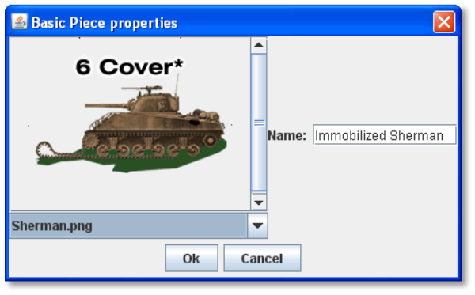

=== Game Piece Image

Your image can come from one of these sources:

* You can import an externally created image from outside

VASSAL (such as a scanned piece image, or image you have otherwise created).

* You can create an image using the Game Piece Image Definition component. See page 69 for more information on Game Piece Image Definitions.
* You can use an image that already exists in the module. The image selector drop-down, found in the *Basic Piece* dialog, includes an alphabetical list of every image in the module.

_Alternatively, you can create a composite piece image using the Layer Trait. See page 50 for more information._

=== Basic Piece System Properties

The following system Properties are defined for the Basic Piece Trait (and therefore defined for all Game Pieces). Remember that Property names are case-sensitive.

[cols=",",]
|============================================================================================================
a|
*Property*

a|
*Description*

a|
BasicName

a|
Name of the Basic Piece Trait.

a|
PieceName

a|
Full name of the piece, including all Traits.

a|
PlayerSide

a|
Side of the current player.

a|
LocationName

a|
Name of the current location, as determined by the local Grid. If no Grid is assigned to the Board, the value
will be ʻoffboard.ʼ

a|
CurrentMap

a|
Name of the current Map Window.

a|
CurrentBoard

a|
Name of the current Board.

a|
CurrentZone

a|
Name of the current Zone.

a|
CurrentX

a|
The current map X coordinate.

a|
CurrentY

a|
The current map Y coordinate.

a|
DeckName

a|
Name of the Deck, if the piece is currently stacked in one.

a|
Selected

a|
Boolean. Has a value of true when the piece has been selected with the mouse.

a|
OldLocationName

a|
Name of the previous location, as determined by the local Grid (after the piece has been moved by drag-and-
drop movement).

a|
OldMap

a|
Name of the previous Map Window (after the piece has been moved by drag-and-drop movement).

a|
OldBoard

a|
Name of the previous Board (after the piece has been moved by drag-and-drop movement).

a|
OldZone

a|
Name of the previous Zone (after the piece has been moved by drag-and-drop movement).

a|
OldX

a|
Previous map X coordinate (after the piece has been moved by drag-and-drop movement).

a|
OldY

a|
Previous map Y coordinate (after the piece has been moved by drag-and-drop movement).
|============================================================================================================

== Can Pivot

Can Pivot enables a Game Piece to pivot around a fixed point relative to its current position. A piece with Can Pivot must also include Can Rotate, which must appear before (below) the Can Pivot Trait. The Trait has these attributes:

* *Command:* The Command Menu item to pivot the piece.
* *Keyboard Command:* The keyboard shortcut of the command.
* *Pivot Point:* The location, relative to the center of the piece and its current facing, around which the piece will rotate. Positive numbers are down and to the right. _Example: For a Game Piece of size 40x40,_ _a pivot point of 20,-20 will rotate the piece around its upper right corner._
* *Pivot Through Fixed Angle:* If selected, then invoking the command will pivot the piece through the angle specified in the Angle field, in degrees clockwise. If left unselected, then invoking the command will allow the player to pivot the piece interactively by any angle by dragging the mouse.

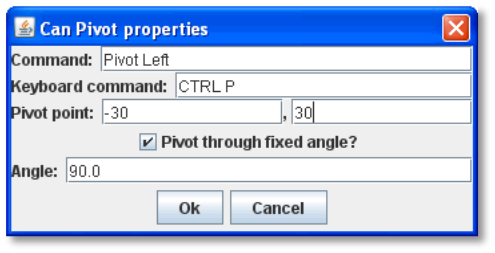

== Can Rotate

Can Rotate enables a Game Piece to be rotated through an arbitrary number of facings. The Trait has these attributes:

* *Description:* Description of the Can Rotate Trait.
* *Number of Allowed Facings:* You can choose the number of valid facings. For example, a hex-based game may have six possible facings, while a game with a square Grid game might have four (or eight, if corners are used). Each use of the command to rotate clockwise or counter-clockwise will rotate the piece one facing.
* *Command to Rotate Clockwise:* If specified, the keyboard shortcut to rotate clockwise, and the accompanying menu text.
* *Command to Rotate Counter-clockwise:* If specified, the keyboard shortcut to rotate counter-clockwise, and the accompanying menu text.
* *Allow Arbitrary Rotations:* If selected, then the user can drag the Game Piece to rotate it to any facing.
* *Command to Rotate Randomly:* If specified, this command will rotate the piece to a random facing (in one of the valid facings, if applicable).

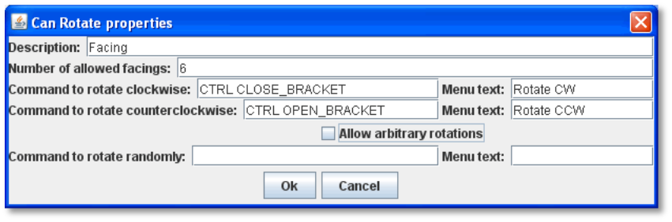

Like other Traits, Can Rotate will affect only

those Traits that appear above it in the list of Traits

for a Game Piece. Traits below the Can Rotate Trait will be drawn on top of the rotated image.

_Since the rotations are created on the fly from a bitmapped image, the image quality of a rotated counter may be lower than the unrotated version. You may get better image quality for your rotations by creating separate images for each rotation in an external image editor and putting them into different levels of a Layer._

=== Can Rotate Trait System Properties

The Can Rotate Trait includes these system Properties. In the name of the Properties, <name> is the name specified in the attributes above.

*Property* *Description*

[cols=",",]
|==============================================================
a|
*Property*

a|
*Description*

a|
<name>_Facing

a|
The current facing, if the number of facings is fixed.

a|
<name>_Degrees

a|
The current rotation angle, if arbitrary rotations are allowed.
|==============================================================

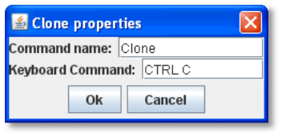

== Clone

Clone will duplicate the Game Piece during a game. The Trait has these attributes:

* *Command Name:* The Command Menu item to clone the piece.
* *Keyboard Command:* The keyboard shortcut of the command.

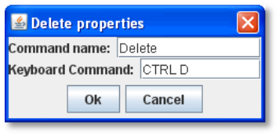

== Delete

Delete will delete the Game Piece from the game. The Trait has these attributes:

* *Command Name:* The Command Menu item to delete the piece.
* *Keyboard Command:* The keyboard shortcut of the command.

== Does Not Stack

A Game Piece with the Does Not Stack Trait will not form stacks with other pieces. In addition, a piece with this Trait can be assigned special treatment when it comes to selection and movement.

The Trait has these attributes:

* *Select Piece:* Controls how the piece is selected: either normally, never (can never be selected), only when the shift key is down (shift-click to select the piece), or only when the Alt and shift keys are down (alt-click to select the piece).
* *Move Piece:* Controls how the piece is moved: either normally, never (cannot be moved once placed) or only if selected (select piece, then click and drag to move).
* *Ignore Map Grid When Moving:* If selected, then this piece will not snap to the nearest Grid location.

Some uses for the Does Not Stack Trait include:

* In games that mix cards and counters, the Do Not Stack Trait can be assigned to cards, so that the cards can be placed on a map without interfering with stacks of counters. In addition, the cards will not form stacks and be generally easier to manipulate on screen.
* Pieces that represent map features, such as buildings, can use the _Move Piece - Never_ option so that players do not inadvertently move them around.

== Dynamic Property

A Dynamic Property Trait enables you to assign a custom Property to the Game Piece, and to define commands to change the value of the Property during play.

Setting a Property does not in itself give a Game Piece any particular behavior. The Property must be recognized by some other component in the module. Dynamic Properties are used by Global Key Commands and other components and often by custom Java classes.

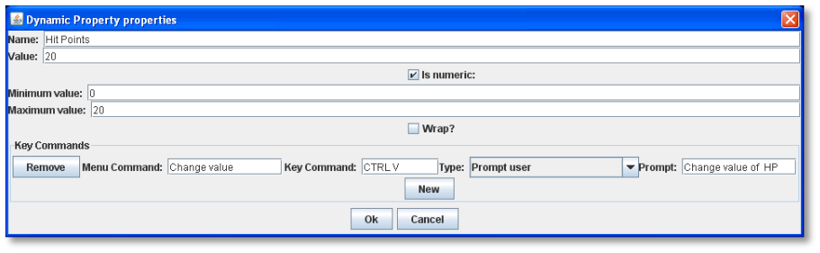

The Trait has these attributes:

* *Name:* The name of the Property.
* *Value:* The value of the Property at the start of a new game.
* *Is Numeric?* If selected, then changes to the value of the Property will be restricted to integer values.
* *Minimum Value:* Numeric values will be restricted to no less than this number.
* *Maximum Value:* Numeric values will be restricted to no more than this number.
* *Wrap?* If selected, then when incrementing this numeric Property, values will wrap around from the maximum to the minimum.
* *Key Commands:* Adds any number of commands to the right-click drop-down menu for this Game Piece. Click the *New* button to add a new command and the *Remove* button to remove one. For each command, specify the text of the drop-down menu entry and the keyboard shortcut. The type defines how the Property value should change:

[loweralpha, start=15]
. _Set value directly_ sets the Property to a fixed value. You can set a numerical value or the value of another Property. (To specify a Property, enter the name of the Property in $-signs; for example, $ExampleProperty$.)

[loweralpha, start=15]
. _Increment numeric value_ adds a fixed value to the Property. You can set a number, or the value of another Property. (To specify a Property, enter the name of the Property in $-signs; for example, $ExampleProperty$.)

[loweralpha, start=15]
. _Prompt user_ displays a dialog for the user to type in a new value.

[loweralpha, start=15]
. _Prompt user to select from list_ displays a dialog with a drop-down menu for the user to select from.

_Example: we define a Dynamic Property called Hit Points that represents the amount of damage taken by a warrior. Hit Points has a maximum level of 20, and a minimum of 0. We add a command to the Property with a Command Menu item of *Change Value* and a shortcut of Ctrl-V. When the user selects *Change Value*, the module prompts for the new value of Hit Points. Dynamic Properties do not display their values on a Game Piece, but we could display the current value of each warriorʼs Hit Points using a Text Label or a Layer._

_If a Propertyʼs value always remains the same during the game, it may be better to define it using the Marker Trait instead._

_See page 52 for more information._

== Global Hotkey

The Global Hotkey Trait adds an action that invokes a Hotkey (that is, a keyboard shortcut for a Toolbar button) in the Main Controls windows or a Map Window. For example, you could use a Global Hotkey to trigger the firing of a Global Key Command Button or Dice Button.

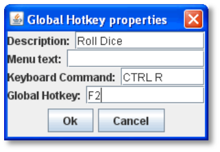

Define the hotkey for the button you wish to invoke before creating the Global Hotkey Trait.

The Trait has these attributes:

* *Menu Text:* Command menu text.
* *Keyboard Command:* Keyboard shortcut of the menu item that initiates the command.
* *Global Hotkey:* The Hotkey that will be applied to the Main Controls window.

_EXAMPLE: A Dice Button component has been added to the Toolbar, and given the Hotkey F2. A Game Piece is given a Global Hotkey Trait with Menu Text_ **Roll Dice**__, Keyboard Command__ Ctrl-R, _and Global Hotkey_ F2__. Now, selecting the piece and typing Ctrl-R or selecting__ *Roll Dice* _from the Command Menu will roll the dice button just as if the player had clicked the button in the Toolbar or typed F2 from the keyboard._

== Global Key Command

The Global Key Command (GKC) Trait adds an action that applies a keyboard command to other pieces, similar to the Global Key Command component of a module or Map Window. A GKC Trait can potentially affect any pieces anywhere in the game, on any map.

The Trait has these attributes:

* *Description:* Description of the GKC Trait.
* *Command Name:* Menu text of the command to activate the GKC.
* *Keyboard Command:* Keyboard shortcut of the menu item that initiates the GKC.
* *Global Key Command:* The key command that will be applied to other pieces.
* *Matching Properties:* The key command will only be applied to pieces with the specified Properties.
* *Restrict Range:* If selected, the command will only apply to pieces located within a specified distance of this piece.
* *Within a Deck, Apply To:* Select how this command applies to pieces that are contained within a Deck.

[loweralpha, start=15]
. _No pieces_ means that all pieces in a Deck ignore the command.

[loweralpha, start=15]
. _All pieces_ means that the command applies to the entire Deck.
[loweralpha, start=15]
.. _________________________________________________________________________________________________________________________
_Fixed number of pieces_ enables you to specify the number of pieces (drawn from the top) that the command will apply to.

* *Restrict Range:* Only others pieces within this distance, inclusive, of this piece will have the command applied to them. If the pieces are on a board with a Hex Grid or Rectangular Grid, then the distance is in units of the Grid. Otherwise, the distance is measured in screen pixels.
[loweralpha, start=16]
. *Fixed Range:* If selected, then the range is specified as a fixed number. If unselected, then the range will be given by the value of the named Property.
* *Suppress Individual Reports:* If selected, then any auto-reporting of the affected pieces will be disabled. Use the Report Action Trait to provide a summary message in their place.

_Commands applied by Global Key Commands will be affected by piece ownership. If the GKC triggers a command that is restricted by side, the action may not take place as intended when the restricted side triggers the GKC (by button or other command)._

_EXAMPLE: A leader counter and infantry counters both have Marker Traits to specify their nationality and type. A Layer Trait represents the rallied state of an infantry counter, uses Ctrl A to activate the layer, and uses Rally as the name. A Global Key Command on the leader counter can select and rally all infantry counters within two hexes of the same nationality that are not rallied by specifying Range=2 and matching Properties type=Infantry && nation=$nation$ && Rally_Active=false._

== Invisible

The Invisible Trait gives a Game Piece the capability to be made invisible (or, visible if the piece is already invisible). An invisible Game Piece will be seen as translucent by the hiding player but completely hidden from the view of the other players.

_Use of the Invisible Trait will require you to define Sides in the game. See page 37 for more information._

The Trait has these attributes:

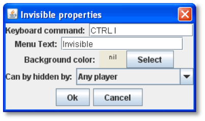

* *Keyboard Command:* Keyboard command to toggle visibility.
* *Menu Text:* Menu text of the command to toggle visibility.
* *Background Color:* To the player who turned it invisible, the piece will appear transparent against a background of the specified color. To other players, it will not appear at all.
* *Can Be Hidden By:* Defines who may hide this piece (and see it once hidden).

[loweralpha, start=15]
. _Any Player_ means that any player may hide this piece, including observers.

[loweralpha, start=15]
. _Any Side_ means that any player who has been assigned a Side in a game (that is, not an observer) can hide this piece. If the player resigns and another player takes the Side, then the new player for that Side will be the owner.

[loweralpha, start=15]
. _Any of the Specified Sides_ enables you to enter a list of Sides. Only players assigned to one of the named Sides can hide the piece, but the players of all the listed Sides will be able to see and modify the piece. This is useful for referee players or games with multi-player teams.

The Invisible Trait only hides those Traits that are above it in the list of Traits. In addition, movement Report Traits will not return any report on the movement of Invisible pieces.

=== Invisible Trait Properties

The Invisible Trait includes one System Property:

[cols=",",]
|==============================================================
a|
*Property*

a|
*Description*

a|
InvisibleToOthers

a|
Has a value of true if the piece is hidden.
|==============================================================

== *Layer*

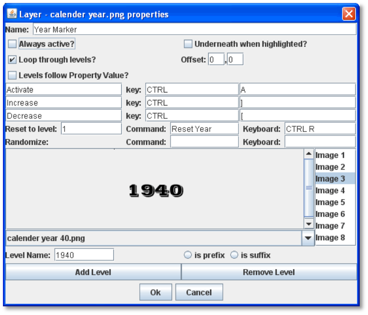

A Layer Trait is used for interactively changing the appearance of Game Pieces. Layers have a number of uses that include, but are not limited to:

* _Changing a pieceʼs appearance:_ A Layer Trait can be used to change a Game Pieceʼs appearance, equivalent to flipping a two-sided counter to its reverse face. For example, a tank counter has two faces: one shows the tank at full strength and the other at depleted strength. The Basic Piece Trait could show the Tank at full strength and a Layer could show it at its depleted level. Where a physical counter may only have two sides, the Layer Trait can actually reflect any number of counter ʻfacesʼ.
* _Placing a status marker:_ A Layer can substitute for placing a separate status marker on top of another piece. For example, in the actual board game, when a unit is targeted by other units, a separate counter is placed atop it that says ʻTargeted. In the module, a ʻTargetedʼ Layer can be created for units and a menu item added to toggle this marker on and off.
* _Creating a piece layout:_ A Layer can be used to change the foreground or background images assigned to a Game Piece. For example, a Game Piece is defined with a blank image for the Basic Piece Trait. The background is defined as a Red or Blue Layer, and the foreground is defined as an Infantry symbol or Tank symbol. During the game, the same piece could be switched from red to blue background, and the symbol could be switched from Infantry to Tank, so one piece could actually be turned into 4 separate units.

_To simulate two -sided pieces where one face of the piece is hidden from one or more players, itʼs better to use the Mask Trait. See page 52 for more information._

=== Configuring a Layer

A Layer Trait consists of a number of 'levelsʼ, each of which has an image and a name. The Layer can be activated with a keyboard command, and players can change the current level during play. The image from the current level will be drawn whenever the Layer is activated. The Layer is drawn on top the Traits that appear above it in the list of Traits.

The Trait has these attributes:

* *Name:* The name of this Layer, used for reference during editing and as the prefix for the name of any Properties defined by this Layer.
* *Always Active:* If selected, then this layer is always active; that is, the current layer will always be displayed. If unchecked, then the layer must be activated (by the specified keyboard command) in order to display the current layer.
* *Underneath When Highlighted:* If selected, then this layer will be drawn underneath the rest of the piece when the counter has been highlighted (by clicking on it).
* *Loop Through Levels:* If selected, then increasing the level past the last one will loop through to the first level and vice versa. Otherwise, increasing the level has no effect if the current level is the last level.
* *Offset:* The images of a level are drawn with their center offset from the center of the underlying piece by a number of pixels specified by the offset boxes, with positive numbers giving an offset down and to the right. For example, if a layer image is 40x40 pixels and you want it to be drawn so that the lower-left corner is at the center of the Game Piece, set the offset to 20,-20.
* *Levels Follow Property Value:* If selected, then you can specify the name of a numeric Property that will determine the active level, rather than responding directly to keyboard events. A typical use will specify the name of a numeric
Dynamic Property on the piece, or a Global Property. As the Property changes value, the level displayed will change as well. You can also specify the numeric value of the Property that should correspond to the first level of this Layer.

* *Activate/Increase/Decrease:* Specify the keyboard commands and Command Menu text that will activate the Layer and increase or decrease the current level. The Activate keyboard shortcut can specify a string of characters, such that the layer is activated only when all the corresponding keys have been pressed. The Increase/Decrease keyboard shortcuts can also specify a string of characters, so that the level is increased/decreased when any one of the keys is pressed.

* *Reset To Level:* Specifies a keyboard command that resets the Layer to a specified level. This does not automatically activate the Layer.

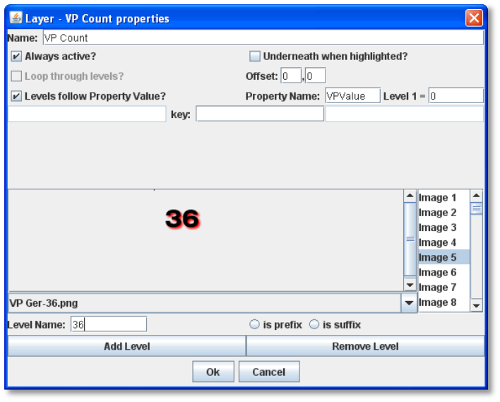

* *Randomize:* Specifies a keyboard command that sets the Layer to a randomly selected level.
* *Level Images:* Specify the image to be shown for each layer by double-clicking or selecting from the drop-down menu. An image can be left blank to display nothing for that level. Using transparency in the images can be very useful.
* *Level Name:* Each level can be given an individual name, which is used to change the name of the piece for reporting purposes during play. The level's name either replaces the piece's normal name, or else modifies the piece's normal name as a prefix or suffix.

=== Examples of Layers

* _For a basic two-sided counter, add a Layer, and select an image that represents the reverse side. Change *Activate* to *Flip* and set the key to Ctrl-F._
* _To represent fatigue in an Army counter, give it a Layer named_ Fatigue__. Select *Always Active*, choose four images that represent the levels, and change__ Increase _to_ Increase Fatigue _and_ Decrease _to_ Decrease Fatigue__. A__ Reset _command named_ Rest _using Ctrl-R could be used to bring the Army counter back to full strength. Name the levels " (fatigue 1)", and so on, and check *is suffix* to append the current fatigue level to the piece's name._

=== Composite Piece Images

In most cases, a Game Piece image is a static representation, based on a single created or scanned image.

However, you can construct the appearance of a Game Piece using a composite set of images. For the basic piece image, you could use a solid-color (or even transparent) GIF or PNG, and then create the actual piece appearance by compositing semi-transparent Layers. This gives you more flexibility when creating actual units, as well as cutting down on the number of graphic images you require, as you can re-combine image layers to create the pieces.

Even if you use this method, the Basic Piece Trait for the piece must still be assigned an image. The image can be a transparent or semi-transparent PNG or GIF.

For example, we create the Russian armies for our World War II game. Each Russian Tank unit will consist of a red background, one Layer consisting of a Tank icon, and another Layer showing the unit strength. Because there are two kinds of Tank units, one light and one heavy, each will have a different strength, which is determined when the unit is deployed. We define the units as follows:

* Basic Piece Trait image includes the solid red background.
* One Layer, called Icon, shows the Tank icon. (Everything else in the image is transparent except the tank icon, so the red background will show through.)
* Another Layer, called Strength, has two levels, and each shows the unit strengths for light and heavy tanks. (As above, the rest of the image is transparent except the Strength text.)

_*Game Pieces: Trait Descriptions*_

When a tank is deployed, the player can select the layer showing the correct strength of the unit. The counter will appear to be a single image. Such a scheme could easily be implemented by using Prototypes (see page 67).

=== Layer Trait Properties

The Layer Trait includes these system Properties. <layer_name> is the *Name* of the Layer defined in the *Layer* dialog box.

[cols=",",]
|===========================================================
a|
*Property*

a|
*Description*

a|
<layer_name>_Image

a|
Name of the currently active level's image file.

a|
<layer_name>_Name

a|
Name of the currently active level.

a|
<layer_name>_Level

a|
Number of the current level.

a|
<layer_name>_Active

a|
Has a value of true if the Layer is active, false otherwise.
|===========================================================

_EXAMPLE: A Layer named Manpower that is active and showing level 4 defined with image Man04.gif and name (strength 4) would have the following Properties:_

* _Manpower_Image = Man04.gif_
* _Manpower_Name = (strength 4)_
* _Manpower_Level = 4_
* _Manpower_Active = true_

_These Properties could be used in a Global Key Command to automatically remove all counters whose manpower was zero._

**_NOTE: The Game Piece Layer Trait is not related to the Game Piece Layers option for Map Windows._**

== Mark When Moved

A piece with the _Mark When Moved_ Trait will display a specifiable image every time they are moved. Specify the image and the position at which to draw the image. You can also toggle the image on and off manually.

In order to enable this feature, you must also go to the Global Options of the module and enable the setting *Mark pieces that* *move*. Enabling this feature will automatically add a button to each Map Window, which when clicked will clears the Moved status of all pieces on the map.

The Mark When Moved Trait is a requirement for the Movement Trail Trait.

image:_images/image120.png[image,width=228,height=173]

The Trait has these attributes:

* *Command:* Menu text of the command used to manually mark piece movement. (Even if left blank, the keyboard command will still appear on the Command Menu.)
* *Keyboard Command:* Keyboard shortcut of the command to manually mark piece movement.
* *Marker Image:* Image displayed to mark piece movement. Click *Select* to choose a custom image.
* *Horizontal Offset:* Horizontal offset, in pixels, of the displayed image.
* *Vertical Offset:* Vertical offset, in pixels, of the displayed image.

_Mark When Moved can be very useful in PBEM games, which may take days or longer between turns, to keep track of opponent moves._

=== Mark When Moved Properties

The Mark When Moved Trait includes one system Property:

[cols=",",]
|===========================================================
a|*Name*
a|*Description*

a|Moved
a|Has a value of true if the piece has been moved.

|===========================================================

== Marker

A Marker sets (marks) one or more custom Properties on a Game Piece. The defined Property is static and its value cannot be changed during the game.

Setting a Property does not in itself give a Game Piece any particular behavior. The Property must be recognized by some other component in the module. Markers are used by Global Key Command and Game Piece Layers components and often by custom Java classes used in a module.

To use a comma in a name or value, precede it with a backslash ('\').

*Defining Multiple Properties:* You can define multiple name-value pairs for multiple Properties by separating the names and values with a comma (',').

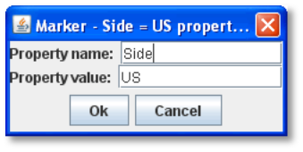

The Trait has these attributes:

* *Property Name:* Name of the Property.
* *Property Value:* Value of the Property. Can be text or numeric.

For Properties that can be changed during a game, see _Dynamic Property_ on page 46.

**_NOTE: The Marker Trait is not related to the Place Marker Trait._**

*Assigning a Piece to a Game Piece Layer*

Marker Traits are commonly used to assign Game Pieces to Game Piece Layers (GPLs), which cause Game Pieces to be drawn on different levels. (You should set up the Game Piece Layers for the map first. See page 24 for more information.)

*To assign a Game Piece to a Game Piece Layer,*

. Set up the Game Piece Layers for the map.
. Assign the Marker Trait to the piece.
. In *Property Name*, type the name of the Game Piece Layer Property (for example, Layer).
. In *Property Value,* type the name of the layer you will assign the piece to. The name must match one of the GPLs already assigned to the map.

*Totaling the Number of Pieces on a Map*

You can use the Marker Trait in conjunction with the Set Global Properties Trait to sum the number of pieces on a map.

. Create a Global Property called PieceTotal.
. For the new Global Property, create a Change-Property button called Zero Total that will set PieceTotal to 0 (In *Type*, choose _Set Value Directly_).
. Create a Marker on each piece you want to add to the count. Name the Marker _Count_, with a value of 1.
. Create a Set Global Property Trait on each piece, which will increment PieceTotal by 1.
. Create a Global Key Command called Total Pieces. For Global Key Command, use the keyboard shortcut of the Set Global Property Trait you specified in Step 3, and in Matching Properties, enter _Count = 1_.
. Create a Toolbar Action Button called _Count Report_. In *Display Message*, and enter _Total Number of Pieces on Map:_ $PieceTotal$.
. Create a Multi-Action Button called Total, and add the Zero Total, Piece Total, and Count Report buttons to it.

Now, when the Multi-Action Button is clicked, PieceTotal will first be zeroed out (to remove any previous totals), then each piece will add 1 to the PieceTotal, and the Action Button will report the total in the chat window.

== Mask

A Mask is used for hiding the true appearance of a piece, such as when you play a facedown playing card. A Masked Game Piece will show its mask to players other than the one who hid it. The hiding player can still view its true face. This Trait is useful for card games, block games, or games with concealable pieces. (Note that unlike an Invisible piece, a Masked piece will still remain visible.)

Any piece with a Mask Trait, such as a playing card, must have a back side image defined, or when the masked Game Piece is revealed the Piece will seem to vanish to all players.

Like the Invisible Trait, this Trait only hides Traits that appear before it. Generally, it should be before any Invisible Trait and after all other Traits of the piece.

Use of the Mask Trait will require you to define Sides in the game. (See page 37 for more information.)

A piece with the Mask Trait is "owned" by the player who masks it. If unmasked and masked again by a different player, the second player becomes the owner. Menu commands of Traits hidden by a masked piece are not available to non-owning players. A setting in the Global Options determines whether or not non-owning players can unmask pieces.

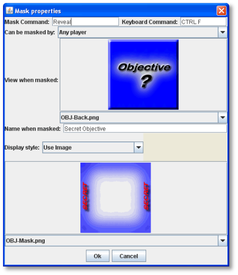

_A Mask Trait is best used only once for a given piece. For pieces with that may have several different appearances, use the Layer Trait instead. See page 49._

The Trait has these attributes:

* *Mask Command:* The name of the Command Menu entry that mask or unmasks this piece.
* *Keyboard Command:* The keyboard command to mask or unmask this piece.
* *Can be Masked By:* Defines who may mask the piece from other players)

[loweralpha, start=15]
. _Any Player_ means that any player may mask this piece, including observers.

[loweralpha, start=15]
. _Any Side_ means that any player who has been assigned a Side in a game (not an observer) can mask this piece. If the player resigns and another player takes the Side, then the new player for that Side will be the owner.
[loweralpha, start=15]
.. _____________________________________________________________________________________________________________________________________________________________________________________________________________________________________________________________________________________________
_Any of the Specified Sides_ enables you to enter a list of Sides. Only players assigned to one of the named Sides can mask the piece, but the players of all the listed Sides will be able to see and modify the piece. This is useful for referee players or games with multi-player teams.

* *View when Masked:* To non-owning players, the piece will be drawn using this image.
* *Name when Masked:* To non-owning players, the piece will be given this name.
* *Display Style*: Determines how the owning player sees a masked piece. The following options are available:
[loweralpha, start=16]
. _Inset_ draws the regular piece with the mask image at reduced size in the upper left corner. (The size of the reduced image is not customizable.)

[loweralpha, start=15]
. _Background_ draws the mask image at full size and the regular piece at reduced size centered within it. (To make a mask image appear in a different location, use a mostly-transparent graphic the same size as the counter or Card, with the mask in the location that you want it to appear.)

[loweralpha, start=15]
. _Plain_ draws only the mask image, so the piece looks the same to all players. A *Peek* command key may be specified. When the owning player selects the *Peek* command, he will see the unmasked piece so long as it remains selected (that is, until he clicks elsewhere on the map). If the *Peek* command key is left blank, then the owning player will see all selected pieces in their unmasked state.

_A *Peek* command is temporary. If youʼd like to allow the owning player to see the hidden piece on a permanent basis, use one of the other display styles instead._

[loweralpha, start=15]
. _Use Image_ draws the unmasked piece and then a specifiable image on top of the piece. The image should make use of transparency to let some of the piece information through.

_EXAMPLE: An ordinary playing Card can be implemented by setting the Basic Piece Trait to represent the front of the Card. Then add a Mask Trait. In the Mask Trait settings, specify an image for the back of the playing Card. When a player types Ctrl-P, that Card will be known only to him (as though held in his hand). Typing Ctrl-M will reveal the Card to the other players (as when playing it on the table)._

=== Mask Properties

The Mask Trait includes one System Property:

[cols=",",]
|===========================================================
a|
*Property*

a|
*Description*

a|
ObscuredToOthers
a|
Has a value of true if the piece is masked.
|===========================================================

== Move Fixed Distance

The Move Fixed Distance Trait defines a command to move the piece a fixed distance upwards and to the right.

If this piece has a Can Rotate Trait listed _before_ this Trait, then the resulting direction will be relative to the current facing of the piece.

* If a Game Piece had the Can Rotate Trait followed by Move Fixed Distance (upwards 60 pixels), then the Move Fixed Distance command would move the piece in whatever direction the top of the piece is facing.
* If a Game Piece has Traits Move Fixed Distance (upwards 60 pixels), followed by the Can Rotate Trait, then the move command would move the piece towards the top of the screen regardless of the facing of the piece.

The Trait has these attributes:

* *Description:* Description of the command (will not appear on the piece).
* *Command Name:* Menu text of the command used to move the fixed distance.
* *Keyboard Shortcut:* Keyboard shortcut of the command used to move the fixed distance.
* *Distance to the Right:* Distance, in pixels, the unit is moved to the right. To move the unit to the left, use a negative number.
* *Distance Upwards:* Distance, in pixels, the unit is moved up. To move the unit down, use a negative number.
* *Move Entire Stack:* If selected, when the piece is part of a stack that is not expanded, the command will move the entire stack.
* *Advanced Options:* If selected, additional movement increments can be specified. The two numbers specified in the advanced options are multiplied together, and added to the basic distance, to get the final distance moved. _Example:_ _An army unit can conduct a forced march for extra movement. The amount of additional movement depends on its supply, which is tracked by a Dynamic Property. The Move Fixed Distance Trait is given an additional offset of one hex times the value of the supply level Property._

== *Movement Trail*

Game Pieces with the Movement Trail Trait will leave behind a graphical trail showing the positions through all positions to which the piece has been moved. The trail consists of a circle for each past location, connected by straight lines. The piece must also contain a Mark When Moved Trait.

The Movement Trail is reset when the moved status of the Mark When Moved Trait is cleared.

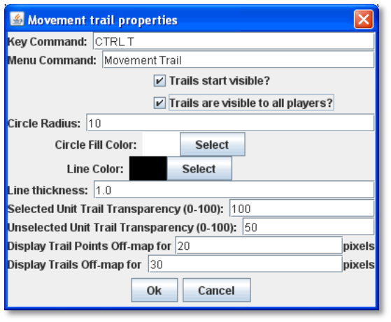

The Trait has these attributes:

* *Key Command:* The keyboard shortcut to toggle the movement trail. If left blank, then the trail is always visible.
* *Menu Command:* The Command Menu item to toggle the movement trail. If left blank, no menu entry appears, although the keyboard command may still be enabled.
* *Trails Start Visible:* If selected, at the beginning of each move, the trail will be visible.
* *Trails Visible To All Players:* If selected, then toggling the visibility of the trail will affect all players' views and will be saved along with the game. Otherwise, each player controls the visibility of trails on that player's view.
* *Circle Radius:* The radius, in pixels, of the circle representing each location in the trail.
* *Circle Fill Color:* The color of the location circles.
* *Line Color:* The color of the connecting lines.
* *Line Thickness:* The thickness, in pixels, of the connecting lines.
* *Selected Transparency:* The transparency of the trail when the piece is selected. 0 is invisible; 100 is opaque.
* *Unselected Transparency:* The transparency of the trail when the piece is not selected. 0 is invisible; 100 is opaque.
* *Display Points Off-Map:* If the map has buffer space surrounding the boards, the trail circles will be drawn within this distance from the board edges.
* *Display Trails Off-Map:* If the map has buffer space surrounding the boards, the trail lines will be drawn within this distance from the board edges.

_Movement Trails can be very useful in PBEM games, which may take days or longer between turns, to keep track of piece movement in detail._

=== Automatically Resetting Movement Trails

Using several commands together, you can cause movement trails to be automatically reset on a Game Piece at the start of each turn.

. Add the Movement Trail and Mark When Moved Traits to the piece (or Prototype) for which you wish to automatically reset trails.
. Add a Global Key Command to the module. Assign it a Hotkey. For *Matching Properties*, enter Moved = true. For *Global Key Command*, enter the Key Command from the Mark When Moved Trait (which will toggle the movement trail).
. Create a Turn Counter and a Counter (or List). Add a Turn-Based Global Hotkey. Use the Hotkey of the Global Key Command you created in Step 2.

Now, each time you advance the Turn Counter, the Global Hotkey will trigger the GKC, which will reset movement trails on any pieces that have been moved. The trails will show again normally when the piece is moved.

== Non-Rectangular

The Non-Rectangular Trait enables you to specify an arbitrary shape for a Game Piece, based on a partially transparent image such as a GIF or PNG file.

The shape of a Game Piece is used to determine where the player must click to select a Game Piece or bring up its Command Menu. It also is used to highlight the outline of the piece when it has been selected.

By using transparent colors in your GIF or PNG, you can make your Game piece be drawn with any shape. However, without the Non-Rectangular Trait, the piece can be selected even by clicking on the transparent portions of the image, which can lead to confusion if the image uses a great deal of transparency.

The Trait has one attribute:

* *Image Shape:* select an image shape from the drop-down list of existing image files in your module, or double-click to add a new one.

== Place Marker

A Game Piece with the Place Marker Trait will have a menu command that places a different piece (the _marker_) on or near it.

You can select any existing piece for the marker, or define a new one from scratch.

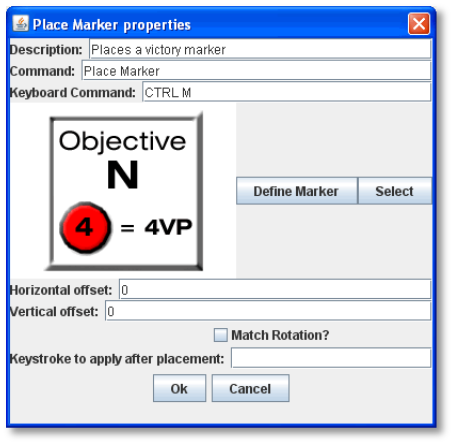

The Trait has these attributes:

* *Horizontal Offset:* The marker will be placed this many pixels to the right of the original piece. Any value other than zero will prevent the marker from stacking with the original piece.
* *Vertical Offset:* The marker will be placed this many pixels above the original piece. Any value other than zero will prevent the marker from stacking with the original piece.
* *Match Rotation:* If selected, and both the original piece and the marker have the Can Rotate Trait, then the rotation angle of the marker will be adjusted to match that of the original piece.
* *Place Marker:* Choose whether the marker should be place on the top of this piece's stack, on the bottom, or directly above/below the triggering piece.
* *Keystroke to apply after placement:* Optional keystroke to be applied automatically to the marker immediately after being placed

_EXAMPLE: If a game uses a fortification counter to indicate fortified status of an army counter, this Trait could be given to the army counter to place a fortification marker on the army with a keyboard command, as an alternative to dragging the fortification counter from the Game Piece Palette._

_The Place Marker Trait is not related to the Marker Trait._

== Play Sound

The Play Sound Trait enables you to specify a command that plays an audible sound. The Trait has these attributes:

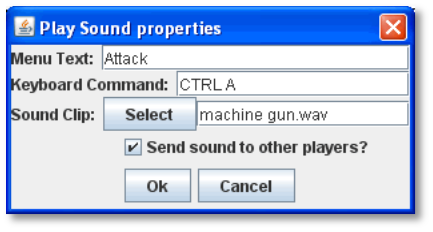

* *Menu Text:* The name of the menu item in the Command Menu.
* *Keyboard Command:* The keyboard shortcut for the command.
* *Sound Clip:* Select a file in .au, .aiff, or .wav format to add it to the module. The sound file specified in this field will be played when the action is invoked. (MP3s are currently not supported.)
* *Send Sound to Other Player:* If selected, then the sound will be echoed to other players when playing live or reading from a logfile. Otherwise, the sound is only audible to the player who invoked the command.

=== Playing a Sound with a Piece Action

To combine a Play Sound trait with another piece action, create a Trigger Action that includes the Play Sound Trait with the piece action.

For example, a Zorkon war cruiser has a Cloaking Device represented by an Invisible Trait. Each time the war cruiser cloaks (or de-cloaks), we want it to play a “whoosh” sound. We first define the Invisible Trait no command name, but with a shortcut of Ctrl -I. Next, we define a Play Sound trait with no command name, a “whoosh” sound clip, and a shortcut of Ctrl-P. Finally, we define a Trigger with the command name _Cloak_ and a shortcut of Ctrl-Shift-C. Under *Perform These Actions*, we enter Ctrl-I and Ctrl-P. Now, selecting Cloak from the war cruiserʼs Command Menu will invoke both Traits.

Alternately, for simple actions, instead of defining a Trigger Action, you can specify the keyboard command for the Play Sound trait to use the same keyboard command for the other action. When this keyboard command is invoked, both Traits will be triggered.

=== Movement Sounds

Using the Play Sound Trait, you can cause a Game Piece to make a sound each time it is moved in a particular Map Window, simulating the sound of a game piece being moved on a board.

. Locate or create the sound file you wish to play when the piece is moved. (Typically, this is a “click” sound.)
. Create a Game Piece with the Play Sound Trait. Specify a keyboard command. For *Sound Clip*, select the sound file you created in Step 1.
. Double-click the *[Map Window]* node the sound will be played on.
. In the Map Window Properties dialog, in *Key Command to Apply to All Units Ending Movement on This Map*, enter the keyboard command for the Play Sound Trait you defined in Step 2. Now, each time the piece is moved, the sound clip is played.

== Property Sheet

The Property Sheet Trait attaches an arbitrary set of editable Properties to a Game Piece. This can be used for character sheets, piece attributes, and many other functions. The Trait has these attributes:

* *Menu Text:* Name of the menu item to show the Property Sheet window.
* *Keystroke:* Keyboard command to show the Property Sheet window.
* *Commit Changes On:* When a player edits the Properties window during play, there are three methods for committing changes:
** _Commit on Every Keystroke:_ Every keystroke and tick-mark click you make are immediately committed as you make them. Other players see your changes immediately.
** _Commit on Apply Button or Enter Key:_ Changes are not communicated to other players until you click the *Apply* button at the bottom of the Property Sheet, press the Enter key on your keyboard, or close the Property Sheet window.
** _Commit on Window Close or Enter Key:_ Changes are not communicated to other players until you press the Enter key or close the Property Sheet window.
* *Background Color:* You may customize the background color of each Property Sheet window, for example to use different colors for the pieces belonging to different Sides.
* *Properties:* You may select from these formats in which to display Properties:
** _Text:_ A simple, single-line field that accepts text.
** _Multi-line text:_ A field that accepts multi-line text. This type of field stretches to fill extra space on the Property Sheet window. It is suitable for free form notes.
** _Label Only:_ This is not really a Property; it simply adds text to your Property Sheet. It is useful for documenting your Property Sheet.
** _Tick Marks:_ Displays one or more rows of checkboxes. Suitable for tracking ammo or damage. Players specify a current and maximum value range.
** _Tick Marks with Max Field:_ As above, but the maximum value is displayed in an editable field to the left of the checkboxes. Suitable for role-playing games where damage tracking is based on a character attribute.
** _Tick Marks with Value Field:_ As Tick marks, but the current value is displayed in an editable field. Suitable for large-value Properties where clicking ticks might be impractical and when the exact tick value is important. For example weapons that track 100+ rounds of ammo.
** _Tick Marks with Value and Max:_ As Tick marks, but both current value and maximum values are editable.
** _Spinner:_ A numeric Property that includes increment and decrement buttons.

=== Using Tick Marks
Tick Mark Property types have a value and a maximum. Either, both, or neither may be displayed as a text box in addition to the tick marks. Initially, the maximum and value are both 0, so no tick marks appear. To set the value or maximum when the box is not shown, right-click in the area where the tick marks would appear.

=== Pre-defining Values in a Property Sheet

Generally, Property Sheets values are defined at game time. For example, in a game where pieces represent fantasy gladiators, the Property Sheets will be used to record each individual fighterʼs personal attributes like Strength or Hit Points, and are filled in by the players when the game begins.

However, you can pre-define the values in a Game Pieceʼs Property Sheet, so that the selected piece will have the values filled in already. This is useful when all pieces of a given type have the same Property Sheet values. For example, in the fantasy gladiator game, we decide that every Orc has a Strength of 12 and 14 Hit Points. If these values were pre-filled, each Orc counterʼs Property Sheet would have these values already assigned when placed on the map.

Note that this method will not work if the piece inherits a Property Sheet from a Prototype. The Game Piece must have the Property Sheet Trait directly in order to be pre-defined.

*To pre-define a Game Piece’s Property Sheet,*

. In the Game Pieces Palette, select the piece whose Property Sheet you want to pre-define. (Do not drag it to the map.)
. In the Palette, right-click the piece and select the Property Sheet from the Command Menu.
. Enter the values for the sheet as desired.
[arabic, start=4]
. Save the module. Whenever a Game Piece of this type is drawn from the palette, the values you entered will be already defined in the Property Sheet.

== Prototype

The Prototype Trait assigns a Prototype to the piece from the moduleʼs list of Prototype Definitions. A Game Piece can have any number of Prototypes assigned.

Before assigning a Prototype to a Game Piece, define it under the *[Prototype Definitions]* node. See page 67 for more information on creating Prototypes.

_In terms of Trait order, a Prototype Trait is treated as a single block of Traits. Traits below the Prototype will affect all Traits that are part of the Prototype. Traits that are part of the Prototype will affect all Traits above the Prototype._

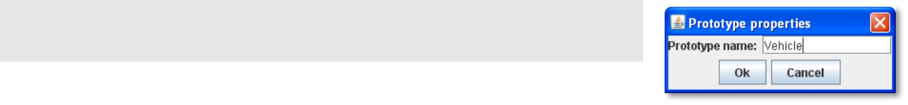

The Prototype Trait has one attribute:

* *Prototype Name:* The name of a Prototype Definition.

A Game Piece assigned a Prototype exposes a Property called Type.

== Replace with Other

A Game Piece with the _Replace with Other_ Trait will have a menu command that replaces the piece with a different one. You can select any existing piece for the replacement, or define a new one from scratch.

For example, a unit that can be destroyed but still leaves a wreck behind, could be given this Trait to replace the original counter with a wrecked version. This would be more convenient than dragging a new piece from the Game Piece Palette, and can't be accidentally undone, as a Layer Trait could.

* *Description:* Description of the Trait. (Will not appear on the piece.)
* *Command:* Text of the menu item used to replace the piece.
* *Keyboard Command:* Keyboard command of the menu item used to replace the piece.
* *Define Replacement/Select:* Click *Define Replacement* to define a new replacement for the piece, or click *Select* to select an existing piece.
* *Horizontal Offset:* The replacement will be placed this many pixels to the right of the original piece.
* *Vertical Offset:* The replacement will be placed this many pixels above the original piece.
* *Match Current State:* If selected, VASSAL will attempt to put the replacement piece in the same state as the original piece. Layers will be set to the same level, labels will be given the same value, rotation angles will match, and so on. The state of a particular Trait will carry over only if it has an exact match in the replacement, that is, the Properties settings of that Trait are the same in both the original and replacement piece.
* *Only Match States Above this Trait:* If selected, VASSAL will only replace states in Traits that occur above this one in the list Traits in the Game Piece Editor. For example, the state of a Marker that's above this one will change if the state in the new Game Piece. If it's below, then it will not change if the new Game Piece has the same marker Property.
* *Place Marker:* Choose whether the marker should be place on the top of this piece's stack, on the bottom, or directly above/below the triggering piece.
* *Keystroke to Apply After Placement:* If desired, enter a keystroke to be applied to the replacement piece after it is placed. For example, the replacement Wreck counter described above includes a Play Sound Trait (Ctrl-P) of an explosion, which is applied after the Wreck counter is placed.

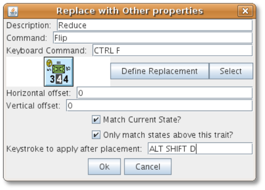

=== Replacing a Piece with Multiple Pieces

The _Replace With Other_ Trait will replace a Game Piece with only a single piece. To replace a Game Piece with multiple pieces, combine the Replace with Other Trait with a Trigger Action.
For example, we want to replace a Game Piece A with 3 copies of piece B. On Piece A, we define a Replace with Other Trait with a Keyboard Shortcut of Ctrl-R. (We leave the *Command* empty.) The Replace with Other Trait will replace A with B.

We define a Trigger Action on Piece A, with a shortcut of Ctrl-T. In the *Perform These Keystrokes* section of the Trigger Action, we enter Ctrl-R three times, once for each copy of B.

Now, invoking the Trigger Action on Piece A with Ctrl-T will perform Replace with Other three times, replacing A with three copies of B.

The same process could be used to replace multiple pieces with non-identical pieces. However, we would need to define three different Replace with Other Traits on Piece A, one for each piece type. The keyboard shortcuts for each of these Traits would then be included in the Trigger.

=== Creating Lockable Pieces

Using Replace With Other, you can create pieces that can be moved normally on the board, but will include a command that locks them, preventing them from being moved. (What will actually be occurring is that a command will switch the mobile piece with the immobile one, and back again. However, to players, this switch will be invisible.) To do this, you need to create two nearly identical pieces, one mobile and one immobile.

. _Create the mobile piece:_ In a Game Piece Palette, create the mobile Game Piece. Add whatever Traits you choose to add to define the piece, except Replace with Other. During the game this piece will be moved normally, by drag and drop, to its position.
. _Create the immobile piece:_ In the Editor, right-click the Piece you just created, pick *Copy*, and then *Paste* the copied piece into the Palette. During the game, this piece will be locked, so add the Does Not Stack Trait to this piece. In the *Does Not Stack* dialog, define how this piece will be selected, and whether or not the piece can be moved when selected or not moved at all.
. Go back to the mobile piece you created in Step 1, and add the Replace with Other Trait. Define the Properties of the Trait in the *Replace with Other* dialog as follows:
* *Description:* Enter _Lock Command._
* *Command:* Enter _Lock_.
* *Keyboard Command:* Enter Ctrl+L (or other appropriate shortcut).
* Click *Select*. Browse to, and select, the piece you created in Step 2 (the immobile piece).
* Check *Match Current State*.
* Leave the other values on the dialog empty and click *Ok*.
. So the piece can be unlocked, for the immobile piece you created in Step 2, add the Replace with Other Trait, and then define the Properties of the Trait in the *Replace with Other* dialog. Then enter the following:
* *Description:* Enter _Unlock Command._
* *Command:* Enter _Unlock_.
* *Keyboard Command:* Enter Ctrl+U (or other appropriate shortcut).
* Click *Select*. Browse to, and select, the piece you created in Step 1 (the mobile piece).
* Check *Match Current State*.
* Leave the other values on the dialog empty and click *Ok*.

During a game, players can select the mobile piece, move and place it normally, and then select the *Lock* command. This will replace the mobile piece with the immobile one. To unlock the piece later, players choose *Unlock* on the immobile piece, which invokes the replacement (mobile) piece.

Alternately, instead of defining the immobile piece on a game piece palette in Step 2, you can define it in the Replace with Other Trait of the mobile piece by clicking *Define Replacement* instead of *Select* in Step 3. Then, add the exact same basic image and Traits as the mobile piece possesses, as well as the Does Not Stack Trait. Add and define the Replace with Other Trait as well, using the parameters from Step 4. This method will make the immobile piece inaccessible through game palettes, and only accessible by selecting the *Lock* command on the mobile piece.

== Report Action

A Game Piece with the Report Action Trait will report a configurable message to the Chat Window when any of a given set of key commands is entered. (The report will appear whether the key commands are entered by a player or invoked automatically, such as with a Global Key Command.)

In order for Report Actions to display text in the Chat Window, the Map Window that the piece currently is on must have the setting *Auto-Report Format For Units Modified on This Map* enabled. (By default, this is set to $message$.) If this setting is empty, then no Reports will be returned.

* *Report on these Keystrokes:* Specifies the keys that this Trait will respond to. Click the *Add* button to specify more than one key.
* *Cycle through Different Messages:* If left unchecked, the same message will be reported whenever any of the above keys are pressed. If selected, the message to be reported
will cycle through the list specified below. Each time one of the keys if pressed, the next message in the list will be reported, returning to the beginning after the end is reached.

* *Report Format:* The Message Format for reporting non-cycling messages:

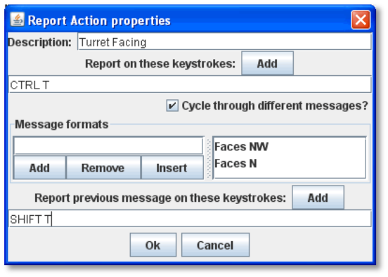

[loweralpha, start=15]
. menuCommand is the name of the piece's Command Menu item that corresponds to the control key pressed.

[loweralpha, start=15]
. oldPieceName is the name of the piece before the action is applied.

[loweralpha, start=15]
. newPieceName is the name of the piece after the action is applied.

[loweralpha, start=15]
. mapName is the name of the map where the piece is located.

[loweralpha, start=15]
. oldMapName is the name of the map before the action.

[loweralpha, start=15]
. location is the map location where the piece is located.

[loweralpha, start=15]
. oldLocation is the location before the action is applied.

_If a Game Piece is deleted or replaced as the result of an action, then the value of oldLocation and oldMapName will depend on the order of the Traits, while mapName and location will be blank._

* *Message Formats:* A list of Message Formats for cycling messages. Available variables are the same as above. Any Properties defined on the piece will be substituted. To access the value of a Property before the change, add the prefix _old_ to the name. For example, if a Game Piece has a Property hitPoints, then $hitPoints$ gives the value after the key command and $oldhitPoints$ gives the value before.
* *Report Previous on these Keystrokes:* When any of these keys are pressed, the message reported will be the one the precedes the last reported message, instead of the following one.

=== Report Action Examples

* An Infantry unit has a single layer that is activated with a Ctrl-F "Flip" command. You add a Report Action with Report Key Ctrl-F, and a message _$newPieceName$_ _flips in hex_ _$location$._ When the player flips the unit, the Chat Window reports _Infantry flips in hex 3321_.
* A piece includes the Invisible Trait, toggled by Ctrl-I. A Report Action Trait is added with report key Ctrl-I and two cycling messages: _$oldPieceName$_ _goes invisible in_ _$location$_ and _$newPieceName$_ _revealed in_ _$location$._ The messages will be shown in order whenever will report when the unit becomes invisible or is revealed.

== Restrict Commands

The Restrict Commands Trait enables you to disable or completely remove certain keyboard commands from a Game Piece when certain conditions or contexts apply. For example, you could restrict some commands on a piece to only be useable by certain players, or on certain boards.
Like other Traits, it will only affect those above it in the Properties list, so it should be placed after the commands it restricts.

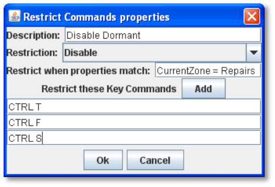

Some uses of the Restrict Commands Trait include:

* A piece may remove certain commands based on where it is on the map by matching the CurrentZone Property.
* A piece with a Layer specifying a damage level may disable commands based on the Level Property of that Layer.
* Commands used only during the setup portion of the game (Turn 0) can be disabled during gameplay turns (Turn > 1).

The Trait has these attributes:

* *Name:* A name, for identification purposes.
* *Restriction:* Select _Hide_ to remove a command from the Command Menu entirely. Select _Disable_ to disable (gray out) the command. In either case, the restricted action will not be invoked with its corresponding keyboard combination is pressed.
* *Restrict when Properties Match:* The commands will be restricted when the Properties of this piece match the given expression
* *Restrict These Key Commands:* Specify the keyboard commands that will be hidden or disabled. The corresponding Command Menu item (if any) will also be restricted.

__A Restricted Command will not be fired as part of a Trigger Action or GKC if the Properties of the piece match the restricting conditions. For example, if a pieceʼs Clone command (Ctrl-C) is Restricted on a board named Battlefield, (__CurrentBoard _= Battlefield), then any Trigger using that Ctrl-C command will not work correctly for pieces on the Battlefield board._

== Restricted Access

A Game Piece with Restricted Access can only be controlled by a specified Side. Other players will not see menu items corresponding to Traits appearing above the Restricted Access Trait in the list of Traits for the Game Piece, and the corresponding keyboard commands will do nothing.

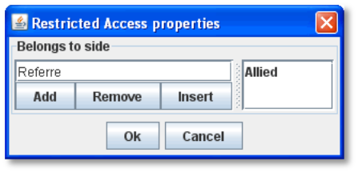

The Restricted Access Trait has these attributes:

* *Belongs to Side:* Enter a Side, and then click *Add* to add it to the list of Sides. The Sides must be one of those listed in the definition of

Player Sides. Only players playing one of the specified Sides will be able to modify this Game Piece.

* *Also Belongs to Initially-Placing Player:* If selected, then the player who initially clicks on the piece (or first places it on any map) will become the owner, in addition to listed Sides. It is a good idea to specify at least one Side when using this option. Otherwise, any pieces created by an observer will not be able to be removed. If, during a game, a player clicks the *Retire* button to become an observer, then all pieces owned by that player become owned by nobody, even if the player was already an observer. Pieces in a Game Piece Palette can be manipulated by anybody, as long as no game is in progress.

If you assign the Restricted Access Trait to a Game Piece, you will need to add Sides to the game. See page 37 for more information.

== Return to Deck

The Return to Deck Trait will send a Card to a Deck. This Trait will have no effect on ordinary Game Pieces, only Cards. The Trait has these attributes:

* *Menu Text:* Menu text of the command used to send the piece to a Deck.
* *Keyboard Command:* Keyboard command used to send the piece to a Deck.
* *Select Deck*: Click *Select Deck* to choose a Deck to be sent to. Alternatively, select *Choose Destination Deck at Game Time*, and players will be prompted to select a Deck to send the Card to after invoking the command.

    For example, in a game in which Cards are drawn from a Deck, used, and placed into a discard pile, both the Deck and the discard pile will be represented by a Deck component. By adding a Return to Deck Trait to each Card, with the text *Discard* and the command 'Ctrl-D', and the Discard Pile selected as the destination, then clicking Ctrl-D on any Card would automatically send it to the Discard Pile.

_This Traitʼs name is slightly misleading. A Card with this Trait can actually be sent to_ any _Deck: the one the Card came from, or an entirely different Deck._

For more about creating Decks and Cards, see page 74.

== Send to Location

The Send to Location Trait adds a command that moves a Game Piece directly to another location. The Trait has these attributes:

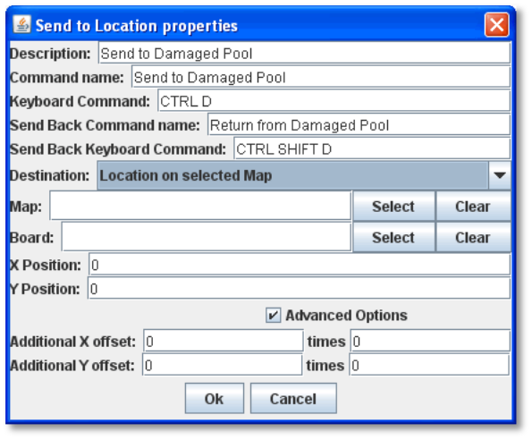

* *Command Name:* Text of the menu item used to send the piece.
* *Keyboard command:* Keyboard shortcut of the menu item used to send the piece.
* *Send Back Command Name:* Menu text for an undo command, which will return the piece to its original location.
* *Send Back Keyboard Command:* Keyboard shortcut for the undo command
* *Destination:* Choose a destination type for the piece.

[loweralpha, start=15]
. __Location on Selected Map__**:** Sends the piece to a defined X-Y coordinate. In *Map*, click *Select*, and then select a Map Window. In *Board*, click Select, then select a Board from the selected Map Window.

Further, specify the X-Y coordinates of the location on the board, in pixels. If no board is specified, positions are relative to the Map Window.

[loweralpha, start=15]
. __Zone on Selected Map__**:** (Used for maps with Zones defined.) In *Map*, click *Select*, and then select a Map Window. In *Zone Name*, enter the name of a Zone from the Map Window.

[loweralpha, start=15]
. __Region on Selected Map__**:** (Used for maps with Regions defined.) In *Map*, click *Select*, and then select a Map Window. In *Region Name*, enter the name of a Region from the Map Window.

[loweralpha, start=15]
. __Another Counter, Selected by Properties__**:** To send the piece to another counter, in *Property Match*, specify one or more Properties to match as a final destination for the piece. The Property Match should match a unique piece or unexpected results may occur. For example, to send the piece to a unique piece on the Main board named _Commander_, the value of *Property Match* would be CurrentBoard = Main && PieceName = Commander.

_Game Pieces that are moved to another Map by the Send to Location Trait will not trigger the *Auto-Report Format For* *Movement To This Map* message on the new Map._

* *Advanced Options:* The value of these two Message Formats will be multiplied together and added to the position specified above to give the final destination position for the piece.

_EXAMPLE: A game may require that damaged units be returned to a Damaged pool for repairs. Different boxes in the pool represent the amount of time before the unit is fully repaired. A Game Piece may be given a Send to Location Trait with name Send to Damaged Pool and command Ctrl-P and position corresponding to the first box of the pool, with an additional offset, determined by the level of a Layer representing the damage, to place it in the appropriate box in the pool._

== Set Global Property

The Set Global Property Trait enables a Game Piece to change the value of a Global Property. The Trait has these attributes:

* *Description:* A descriptive name of the command (Will not appear in the Command Menu).
* *Global Property Name:* The name of the Property to be set. (The name can include the name of another Property. Set it off by using $-signs; for example $Example$_Property would be a valid Global Property name.)
* *Locate Property Starting in the*: You may name a Zone or Map containing the Global Property to be set, or you may set the Property based on the piece's current location, looking for the occupied Zone or Map before defaulting to the Module. (The name can include the name of another Property. Set it off by using $-signs; for example $Example$_Map would be a valid Map or Zone name.).
* *Is Numeric:* If selected, then the value of the Property will be restricted to integer values.
* *Minimum Value:* Numeric values will be restricted to no less than this number.
* *Maximum Value:* Numeric values will be restricted to no more than this number.
* *Wrap Around:* If selected, then when incrementing this numeric Property, values will wrap around from the maximum to the minimum (or vice versa).
* *Key Commands:* Adds any number of commands to the right-click drop-down menu for this Game Piece. Click the *New* button to add a new command. For each command, specify the text of the drop-down menu entry and the keyboard shortcut. The type defines how the Property value should change:

[loweralpha, start=15]
. _Set value directly:_ Sets the Property to a fixed value, after substituting values of other Properties defined for this Game Piece.

[loweralpha, start=15]
. _Increment numeric value:_ Adds a fixed value to the Property. You can use a numeric value or the value of another Property. (If you specify a Property, enter the name of the Property in $-signs; for example, $ExampleProperty$.)

[loweralpha, start=15]
. _Prompt user_: Displays a dialog for the user to type in a new value.

[loweralpha, start=15]
. _Prompt user to select from list:_ Displays a dialog with a drop-down menu for the user to select from.

== Spreadsheet

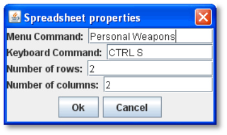

The Spreadsheet Trait attaches an editable table of data to a Game Piece. A Spreadsheet is simply for the tabular display of data (or text). It is not capable of performing any mathematical operations on cells, rows, or columns in the table.

* *Menu Command:* Text of the menu item used to display the Spreadsheet.
* *Keyboard Command:* Keyboard shortcut of the menu item used to display the Spreadsheet.
* *Number of Rows:* Number of rows in the spreadsheet.
* *Number of Columns:* Number of columns in the spreadsheet.

_Currently, VASSAL has no method for handling mathematical formulas._

*Pre-populating Spreadsheet Data*

Generally, Spreadsheet values are defined at game time. However, you can pre- define the values in a Game Pieceʼs Spreadsheet, so that the selected piece will have the values filled in already. This is useful when all pieces of a given type have the same Spreadsheet values.

Note that this method will not work if the piece inherits a Spreadsheet from a Prototype. The Game Piece must have the Trait directly in order to be pre-defined.

*To pre-define the values of a Game Piece’s Spreadsheet,*

. In the Game Pieces Palette, select the piece whose Spreadsheet you want to pre-define. (Do not drag it to the map.)
. In the Palette, right-click the piece and select the Spreadsheet command.
. Enter the values for the sheet as desired.
. Save the module. Whenever a Game Piece of this type is drawn from the palette, the values you entered will be already defined in the Spreadsheet.

== Sub-Menu

The Sub-menu Trait enables you to group menu items associated with other Traits into a sub-menu in the Game Piece's Command Menu. Use it to organize command menus for ease of use.

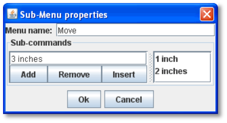

Sub-menus may contain other sub-menus, to any nesting level. Items added to a Sub-menu will not appear independently.

Items added to a Sub-Menu are case-sensitive.

The Trait has these attributes:

* *Menu Name:* Name of the sub-menu.
* *Sub-commands:* Click *Add* to add the name of another command from the pieceʼs Command Menu. Commands added will be displayed in the Sub-menu in the order they are listed.

_Example: If a Game Piece has three separate layer Traits with corresponding activate commands Entrench, Fortify, and Blockade, then those menu items can be gathered under a single sub-menu named Defense by creating a Sub-Menu Trait with Menu Name_ Defense _and Sub-commands_ Entrench, Fortify, _and_ Blockade__.__

== Text Label

The Text Label Trait displays a text label on or near the Game Piece. The text of the label can be fixed or specifiable by a player at game time. The Trait has these attributes:

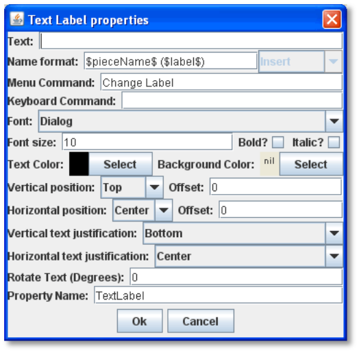

* *Text:* The starting value for the label text. (You can set this to the value of a Property on the piece by enclosing it in $-signs.) By enclosing the text within tags, you can use simple HTML format to specify various colors, fonts and sizes. Example: <html><b>Bold text</b>
with a line break
and different colors</html> would display as:

*Bold text*

with a line break

and different colors

* *Name Format:* A Message Format that specifies how the name of this piece will be reported: pieceName is the name of the piece excluding the label, label is the value of the label text (including, unfortunately, HTML tags). If the label is empty, then the default name of the piece is always used.
* *Menu Command:* If not blank, gives the text of the corresponding menu item in the piece's Command Menu
* *Menu Key Command:* If blank, the text of the label is permanent. If set, then gives the keyboard command to set the text of the label.
* *Font:* Text is drawn using this font.
* *Font Size/Bold/Italic:* The text is drawn at this size, optionally in bold or italics.
* *Text Color:* The text is drawn using this color.
* *Background Color:* The text is drawn within a solid rectangle of this color. Click *Select* and then *Cancel* to use a transparent background.
* *Vertical Position:* Draw the label with the given offset from the top, bottom, or center of the piece.
* *Horizontal Position:* Draw the label with the given offset from the left, right, or center of the piece.
* *Vertical Justification:* Whether the top edge, bottom edge, or center of the label will be drawn at the Horizontal Position specified above.
* *Horizontal Justification:* Whether the right edge, left edge, or center of the label will be drawn at the Vertical Position specified above.
* *Rotate Text:* The text will be rotated clockwise by this angle. Rotation is performed after the horizontal/vertical justification and positioning specified above.
* *Property Name:* The value of this label will be exposed as a Property with the given name. Ordinarily, a Text Label trait comprises its own Property, which you can name when you create the Trait.

    For example, in a naval wargame, we want a Text Label trait to show each shipʼs individual name, such as _HMS Victory_. We use the following settings:

* *Text:* We leave this blank. Players will be able to specify the string at the start of a game.
* *Name Format:* $pieceName$ ($label$). For a battleship piece, this would show, _Battleship (HMS Victory)._
* *Menu Command:* _Set Ship Name_, with a keyboard shortcut of Ctrl+N.
* (We set font size, color, position, and other cosmetic settings as appropriate for the piece.)
* *Property Name:* ShipName. We can now use ShipName as a Property for things like Report Traits on the piece, and other functions.

*Using a Text Label to Display a Property*

You can use a Text Label Trait on a Game Piece to display the value of any Property defined on the Game Piece (as well as Global Properties). This is handy to display Property values you have separately specified for the Game Piece, such as Dynamic Properties, or to create a ʻdisplay pieceʼ that shows the value of some Global Property.

To display the value of a separately defined Property as a Text Label,

. In both *Text* and *Name Format*, enter the name of the pieceʼs Property or Global Property you wish to display, surrounded by $-signs. (You can add additional label text here; any text not surrounded by $-signs will be displayed literally.)
. Leave the values of *Menu Command*, *Keyboard Command*, and *Property Name* blank.
. Enter display values (font size, color, position, and justification) for the label as appropriate.

For example, if a Starship piece had a Dynamic Property Trait called EnergyLevel, we could display the value of the starshipʼs

Energy Level with a Text Label by entering this in both *Text* and *Name Format*:

Shipʼs Power: $EnergyLevel$.

When the ship has a power level of 5, what will be shown in the label is _Shipʼs Power: 5_

You can enter any number of Property names. For example, you could also show the ShieldLevel Property in the label by entering this in *Text* and *Name Format*:

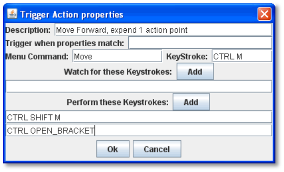

Shipʼs Power: $EnergyLevel$ Shield Level: $ShieldLevel$.

== Trigger Action

A Trigger Action Trait combines multiple keyboard commands into one, or automatically invokes keyboard commands in response to other keyboard commands, when certain conditions apply. A Trigger Action can be keyed to fire on command, to fire when one or more keystrokes are made, or when either of these apply and certain conditions (Properties) are matched.

The Trait has these attributes:

* *Trigger Name:* Descriptive name of the Trigger Action. (Will not appear on the Command Menu.)
* *Trigger When Properties Match:* The corresponding key commands will be performed only if the piece matches this Property expression. Property match is optional.

    A keyboard command must be actively invoked to launch a Trigger Action. Trigger Actions cannot passively ʻlistenʼ for matching Properties and then fire automatically.

* *Menu Command:* Adds an item to the piece's Command Menu that will launch the trigger commands manually commands, as long as the Property expression is matched.
* *Keystroke:* Keyboard shortcut for the manual menu command.
* *Watch for These Keystrokes:* After the user types any of these key commands, the commands listed under *Perform These Keystrokes* will be launched, if the Property expression is matched.
* *Perform These Keystrokes:* The key commands to be invoked after one of the above key commands is observed and the Property expression is matched. The commands are invoked in sequence from top to bottom.

_Example 1: A piece has a Layer to track action points and a Move Fixed Distance Trait to move it forward. The Move Fixed Distance Trait can be assigned the key command Ctrl- SHIFT-M with no command name (so that it does not appear in the Command Menu). Then a Trigger Action Trait with the command Move and the keystroke Ctrl-M can trigger both the Move command and decrease the action points layer by one._

_Example 2: A piece has separate Layer Traits for hit points and for a "critically wounded" status for when the hit points are less than 2. A Trigger Action Trait can watch for the keystrokes that affect the hit-point layer and respond by activating the wounded layer by matching the Property expression for when the hit points are < 2 and the wound level is not active._

To suppress the command menu labels for the keyboard commands that compose the Trigger Action, omit the text labels for the individual commands. Then the only way to invoke these commands will be to fire the Trigger Action. If the text labels are not omitted, then each individual command will also appear in the pieceʼs command menu separately.
