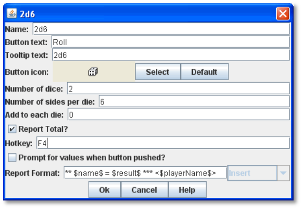
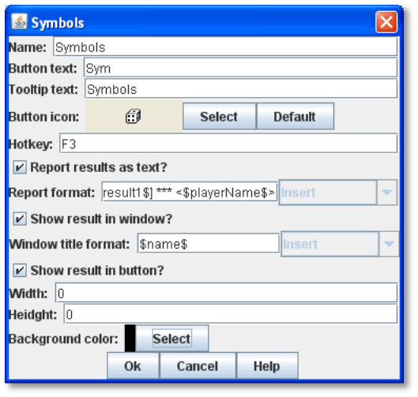
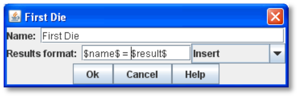
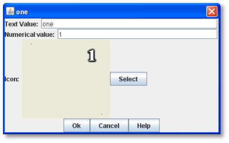
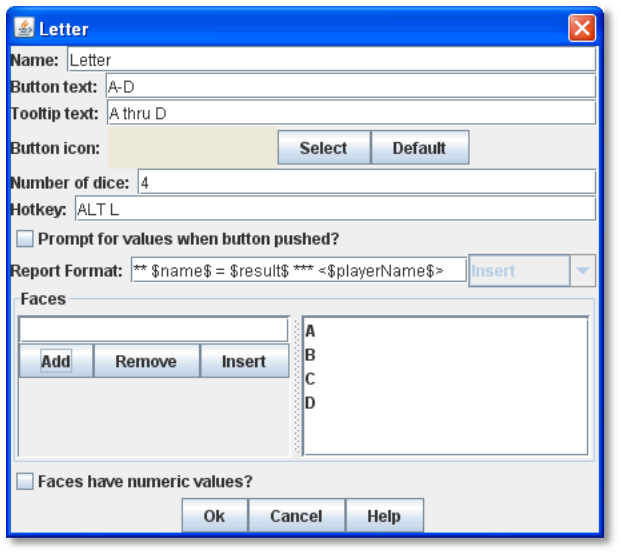

= Generating Random Results

VASSAL has a variety of methods for generating random results: Dice Buttons, Symbolic Dice, and Random Text Buttons.

== Dice Button

A Dice Button generates random numbers, simulating the roll of any number of dice of any number of sides. You may add any number of Dice Buttons to a module.

A Dice Buttons has these attributes:

* *Name:* The name of the dice button.
* *Button Text:* Text for the button in the Toolbar.
* *Tooltip Text:* Tooltip text for the Toolbar button.
* *Button Icon:* Icon image appearing on the button.
* *Number of Dice:* Number of dice rolled.
* *Number of Sides per Die:* Number of sides on each die.
* *Add to Each Die:* Number added to the roll of each individual die.
* *Add to Overall Total:* Number added to the total of all the dice.
* *Report Total?* If selected, results will total the dice. If not, the results of each die are reported individually (“2, 6, 3”).
* *Hotkey:* Keyboard shortcut for rolling the dice.
* *Prompt for Values when Button Clicked:* If selected, the player is prompted to enter the number, Sides and adds for the dice rolled after clicking the button. (If selected, you will not need to specify Number, Sides, and Adds as above.)
* *Report Format:* The Report Format specifies the Message Format for reporting the results: name is the name of the button as specified above, result is the result of the roll, nDice is the number of dice, nSides is the number of sides, plus is the modifier to each die, and addToTotal is the value added to the total.
* *Sort Dice Results:* Sorts the dice results.

*To create a dice button,*

. Right-click the *[Module]* node and pick *Add Dice Button.*
. In the dialog, specify the settings for the button.
. Click *Ok*.

=== Dice Properties

Dice buttons include these system Properties. <name> is the name of the Dice button.

[cols=",,",]
|========================================================================================================================
|*Property Name* |*Property Level* |*Description*
|<name>_result |Global |Value is the result of the Die Roll. Example: a Dice Button named 2d6 would include a Global Property named 2d6_result.
|========================================================================================================================

== Symbolic Dice Button

A Symbolic Dice Button is used to define dice that use arbitrary images. When the button is clicked, a random face is selected for each Symbolic Die that this component contains. The results of the roll can be reported as text into the chat area, graphically in a separate window, or in the button itself.

Each button can roll any number of dice (represented by Symbolic Die components), each of which may have any number of faces (represented by Symbolic Die Face components).

* *Name:* The name of the Symbolic Dice Button.
* *Button Text:* Text for the button in the Toolbar.
* *Hotkey:* Keyboard shortcut for rolling the dice.
* *Report Results As Text:* If selected, report results to the chat area.
* *Report format:* A Message Format specifying the format for reporting text results: name is the name of the button as specified above, result1, result2, etc is the result of the 1st, 2nd, etc. Symbolic Die as configured below (replace the '#' symbol with the desired number), _numericalTotal_ is the sum of the numerical values of the Symbolic Die rolls.
* *Show Result In Window:* If selected, show the results graphically in a standalone window.
* *Window Title Format:* A Message Format specifying the format for reporting results to the title bar of the standalone window.
* *Show Result In Button:* If selected, show the results graphically in the Toolbar button.
* *Width:* The width of the area for displaying results graphically.
* *Height:* The height of the area for displaying results graphically.
* *Background Color:* The background color to be used when displaying results graphically.

*To create a Symbolic Dice Button,*

. Right-click the *[Module]* node and pick *Add Symbolic Dice Button.*
. In the *Symbols* dialog, specify the settings for the button.
. Click *Ok.*

After you define the symbolic dice button, you must define the actual dice rolled, including the dice faces.

=== Symbolic Dice

Each Symbolic Die has these attributes.

* *Name:* The name of the die.
* *Results Format:* A Message Format specifying how to report the result of this die roll. The resulting text will be substituted for result1, result2, and so on in the Symbolic Dice Button's results format: name is the name of this die as specified above, result is the text value of the Symbolic Die Face that is rolled, numericalValue is the numerical value of the Symbolic Die rolled.

*To define a Symbolic die,*

. Right-click the *[Symbolic Dice Button]* node and pick *Add Symbolic Die.*

[arabic, start=2]
. In the *Symbolic Die* dialog, specify the attributes of the die. Finally, you must define the face of each Symbolic Die.

=== Symbolic Dice Faces

You must define the faces for each Symbolic Die. Each die face contains these attributes:

* *Text Value:* Text value is reported in the chat window.
* *Numerical Value:* You can assign a numerical value to the die face, if desired, which can be totaled when rolled.
* *Icon:* The die image shown in the separate window, or in the actual Symbolic Dice button.

*To define a symbolic die face,*

. Right-click the *[Symbolic Die]* node and pick *Add Symbolic Die* *Face*.
. In the *Symbolic Die Face* dialog, specify the attributes of the die.

_To quickly create multiple identical symbolic dice, first create one die, and define all its faces. Then, copy and paste the *[Symbolic Die]* node as many times as needed into your *[Symbolic Dice Button]* node._

=== Symbolic Dice Properties

Symbolic Dice buttons include these system Properties. <name> is the name of the Symbolic Dice button.

[cols=",,",]
|==================================================================================
a|
*Name*

a|
*Property Level*

a|
*Description*

a|
<name>_result

a|
Global

a|
Value is the result of the Symbolic Die roll. Example: a Symbolic Dice button named Ghost would include a Property named Ghost_result.

|==================================================================================

== Random Text Button

A Random Text Button can be used to randomly select a text message from a list defined beforehand. For example, a button can be defined to select a random letter from the list A, B, C, or D.

It can also be used to define dice with irregular numerical values, such as a six-sided die with values 2,3,3,4,4,5, or dice with verbal values, such as a die with the results “Hit” or “Miss”.

_One use for a Random Text Button could be to roll for results on a chart and then report the results to the Chat Window._
_However, such a chart roll may not have any modifiers applied._

A Random Text button has these attributes:

* *Name:* The name of the text button.
* *Button Text:* Text for the button in the Toolbar.
* *Tooltip Text:* Tooltip text for the Toolbar button.
* *Button Icon:* Icon image appearing on the button.
* *Number of Dice:* Number of dice rolled.
* *Hotkey:* Keyboard shortcut for rolling the dice.
* *Prompt for Values when Button Clicked:* If selected, the player is prompted to enter the number, sides, and adds for the dice rolled after clicking the button. (If selected, you will not need to specify Number, Sides, and Adds as above.)
* *Report Format:* The Report Format specifies the

Message Format for reporting the results: name is the name of the button as specified above, result is the

result of the roll, nDice is the number of dice, nSides is the number of dice, plus is the modifier to each die, and addToTotal is the value added to the total.

* *Sort Dice Results:* Sorts the dice results.
* *Faces:* Specify the possible faces (results) for each die.
* *Faces Have Numeric Values:* If selected, enables the *Adds* and *Report Total* options.

[loweralpha, start=15]
. *Add to Each Die:* Number added to the roll of each individual die.

[loweralpha, start=15]
. *Add to Overall Total:* Number added to the total of all the dice.

[loweralpha, start=15]
. *Report Total?* If selected, results will total the dice. If not, the results of each die are reported individually (“2, 6, 3”).

*To create a random text button,*

. Right-click the *[Module]* node and pick *Add Random Text Button.*

[arabic, start=2]
. In the dialog, specify the settings for the button.
. Under Faces, enter the value for the first face, and click *Add*. The value is added to the list of results.
. Repeat Step 3 until all faces have been added.
. Click *Ok*.

=== Random Text Button Properties

Random Text buttons include these system Properties. <name> is the name of the Random Text button.

[cols=",,",]
|==================================================================================
a|
*Name*

a|
*Property Level*

a|
*Description*

a|
<name>_result

a|
Global

a|
Value is the latest result of the Random Text button. Example: a Random Text button
named Events would include a Property named Events_result.
|==================================================================================
