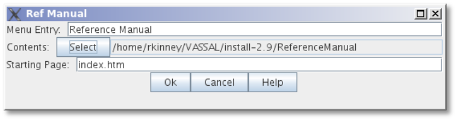
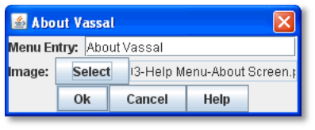
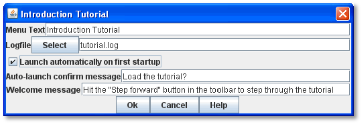

== Help Menu

You can supplement your module with a variety of informational files and settings. Help files and Tutorials can be useful in explaining the functions of a complex module to your players.

The *Help* menu in the main control window contains general informational files for your module. You may add more help files specific to the module you are creating. Help files in a module may include information such as game rules, descriptions of how to use particular module features, setup instructions, copyright notices, or other useful text.

*Help* menu items can be any of these types:

=== PDF Help File

From VASSAL 3.5 onward you can add a PDF file directly to VASSAL. Selecting the menu opens the default browser on the user's machine with the PDF file you specified. A PDF Help file has these attributres:

* *Menu Command:* The menu item to be added to the Help menu.
* *PDF file:* Click the select button to select a PDF file from your computer. It will be copied into the module and then displayed when the user selects the menu item.

=== HTML Help File

The HTML Help file component adds an entry to the *Help* menu. Selecting the menu opens the default browser on the user's machine with HTML content that you specify. An HTML Help file has these attributes:

* *Menu Entry:* The menu item to be added to the Help menu.
* *Contents:* A folder on your local file system. The contents of the folder will be copied into the module and expanded onto the user's machine when the user selects the menu item.

The folder can contains any number of sub-folders and can include image data, style sheets, and other associated content. Be sure that any HTML content makes use of relative URLs.

* *Starting Page:* The file within the Contents folder that the user's browser will be pointed to. Normally, this is an HTML page.

[loweralpha, start=15]
. You can launch a PDF file by setting the *Starting Page* to a local PDF file.

[loweralpha, start=15]
. You can launch an external URL in the user's browser by specifying the external URL as the Starting Page, and leaving the Contents set to null.

*To add an HTML Help file to the module,*

. Create and save the HTML and other files in your choice of file editor (such as an HTML authoring tool).
. Open your module in the Module Editor.
. In the Configuration window, right-click the *[Help Menu]* node and pick *Add HTML Help File.*
. Enter values for *Menu Entry*, *Contents* folder, and *Starting Page*, and then click *Ok*.

=== Plain Text Help File

The Plain Text Help file component adds an entry to the *Help* menu. Selecting the menu displays a new window with the contents of a plain text file.

The text file can include any text you like. Some examples include:

* A list of design credits and acknowledgements.
* Instructions on how to set up or use the module.
* Rules or rules summaries.
* Reference information.

A Plain Text file has these attributes:

* *Menu Entry:* The menu item to be added to the Help menu.
* *Text File:* A file containing the contents of the window to be displayed. Create and save the text file in your choice of text editor before adding it to the module.

*To add a Plain Text help file to the module,*

. Open your module in the Module Editor.
. In the Configuration window, right-click the *[Help Menu]* node and pick *Add Plain Text Help File.*
. Enter values for Menu Entry and Text File, and then click *Ok*.

=== About Screen

The *About* screen will display the currently installed versions of the VASSAL engine and module. This helps players make sure they are running compatible versions.

A new module uses a default image for the *About* screen. However, you may use any image you wish as an *About* screen for your module.

The image for the About Screen is also displayed in the Welcome Wizard when the module is first launched.

The About Screen has two attributes:

* *Menu Entry:* The Help menu item to invoke the screen.
* *Image:* The image displayed when the screen is invoked.

*To change the default About screen,*

. Create the new About image in your choice of image editor.
. In the Configuration window, right-click the *[Help Menu]* node and pick Add About Screen.
. Enter the values for each setting, and then click *Ok*.

=== Tutorials

A Tutorial is a short walk-through of your module, played back live by new players. It can include a demonstration game setup, a sample turn sequence, or show the use of module functions.

_A Tutorial is really just a logfile that players can step through, reviewing each move in turn, exactly the same as using a VASSAL PBEM log._

Plan your Tutorial to show the most important aspects of gameplay, before adding it to your module.

The *Tutorial* menu item includes these attributes:

* *Menu Text:* The menu item under the Help Menu.
* *Logfile:* The logfile that players will step through when they select the corresponding menu item.
* *Launch Automatically On First Startup:* If selected, then players will automatically be prompted to run the tutorial the first time they load the module.
* *Auto-Launch Confirm Message:* Provides the text in the yes/no dialog that is displayed to the player when they load the module for the first time. Answering Yes will load the tutorial logfile.
* *Welcome Message:* The message that displays in the main controls window chat area when the tutorial is loaded.

*To add a tutorial to the module,*

. Launch the module for which you wish to create a tutorial.
. In the VASSAL player, click *File | Begin Logfile.*
. Play one or more turns of the game, changing Sides as needed. (You can also add explanatory text in the Chat window.)
. Click *File | End Logfile.* This ends recording of your logfile.

[arabic, start=5]
. In the Module Editor, in the Configuration Window, right-click on *Help Menu* and choose *Add Tutorial.*
. In the *Tutorial* dialog, enter the other settings for your tutorial replay, as desired. (In *Logfile*, select the logfile you recorded previously.)
. Click *Ok*. The tutorial is added to the moduleʼs *Help* menu.
