== Maps and Boards

A _board_ is a playing surface on which pieces are moved. Boards are displayed in _map windows._ By default, a module has one main map window, but is possible to have multiple map windows, and pieces can be moved between them.

Some games have multiple boards, and a single one is selected at game start to play on. Other games include multiple board segments, which are used to build the complete game board at game start. Multiple maps can come in handy to make better use of screen ʻ real estate.ʼ For example, in a physical game, pieces, cards and other items might all be stored on the main game board. But in a VASSAL module, you can have a separate Map Window for the main board, another specifically for a deck of cards, and others to store playersʼ personal items like tokens. You can also add buttons to toggle visibility of these windows, so they can be hidden from view when not in use.

=== Types of Map Windows

The following types of map windows are available.

*Standard Map Window*

The standard Map Window holds one or more boards to play on. By default, a new module includes a *[Map Window]* node called _Main Map_, but you can change the name of this default, as well as add any number of new Map Windows.

*Private Window*

A Private Window works just like a regular Map Window, and has all the same options, but includes an additional control to specify which Sides can access the window. Only the owning Side (or Sides) will be able to access the window. You can further specify whether pieces in the Private Window are visible to other Sides. A Private Window can be used for players to store personal items needed in the game, like units, cards, or money.

*Player Hand*

A Player Hand is like a Private Window, but specifically intended for use to store a playerʼs personal hand of Cards. Items placed in a Player Hand Window will be displayed side by side, horizontally, and will not stack. The owning Side can manipulate Cards (such as turning them face up or face down), and drag new pieces to the Hand. Like a Private Window, you can specify which Sides can access the Player Hand, and whether items in the Player Hand are visible to other players.

_To make best use of Private Windows or Player Hands, you will need to add Sides to the game. See page 37 for more information on adding Sides._

*Chart*

A _Chart_ can be defined as a Map Window. This is useful if the players need to interact with the chart in some way, such as to move a tracking piece to record the current turn, player income, or victory points. See _Charts_ on page 84 for more information on creating a Map Window as part of a Chart.

_Maps can be hidden from view, which can be handy if the pieces on the map are performing some automated function, such as drawing from a Deck of Cards that sends Cards to players automatically. For more on creating hidden maps, see Hiding Toolbar Buttons on page 90._

=== Map Window Attributes

Each map window may include these settings.

These settings apply to Private Windows and Player Hands only:

* *Belongs to Side:* Click *Add* to add the name of a Side. Only Sides on this list will have access to this Private Window or Player Hand. You may add multiple Sides to the list of owners to enable multiple players to access the window. Once these Sides are set, players may not change the list during a game.
* *Visible to All Players:* If selected, non-owning players will be able to view the contents of Private Window or Player Hand.
* *Use the Same Boards as This Map:* A Private Window or Player Hand may be set to automatically use the same boards as another map window. If left blank, then the Private Window will use its own set of boards.

The rest of these settings apply to all Map Windows, Private Windows, and Player Hands.

* *Map Name:* The name of this Map Window. Each Map Window in the module should have a unique name.
* *Mark Pieces That Move:* If selected, then any Game Pieces with the Mark When Moved Trait will be marked when they are being moved in this Map Window. You can also allow players to set this option in their Preferences.
* *Horizontal/Vertical Padding:* The dimensions of the blank space, in pixels, surrounding the boards in the window.
* *Background Color:* The color to use in the blank space padding.
* *Can Contain Multiple Boards:* If selected, when setting up a new game, the player is prompted for how to arrange the available boards (those assigned to the Map Window) into rows and columns. Useful if the gameʼs main board is comprised of sections that may be arranged differently for different games.
* *Border Color For Selected Counters:* The color of the border to draw around pieces that have been selected.
* *Border Thickness For Selected Counters:* The thickness of the border, in pixels, drawn around pieces that have been selected.
* *Include Toolbar Button To Show/Hide:* By default, a Map Window is automatically visible when a game begins. However, if this is checked, then this Map Window will not be automatically shown. Instead, a button to show or hide this window will be added to the Main Controls Toolbar. You can specify these settings for the toolbar button:

[loweralpha, start=15]
. *Toolbar Button Text:* Text of the optional Toolbar button.

[loweralpha, start=15]
. *Toolbar Tooltip Text:* Tooltip of the optional Toolbar button.

[loweralpha, start=15]
. *Toolbar Button Icon:* Icon for the optional Toolbar button.

[loweralpha, start=15]
. *Hotkey:* Keyboard shortcut for the optional Toolbar button.

_In VASSAL 3.1.18 and later, entry boxes to specify Toolbar button text, tooltip, icon, and hotkey will not be available until the module is saved, exited, and then reloaded. After exiting and reloading the module, and reopening the map window dialog, you will be able to specify values for these settings._

* *Auto-Report Format For Movement Within This Map:* A Message Format that will be used to report movement of

pieces completely within this Map Window: pieceName is the name of the piece being moved, location is the location to which the piece is being moved (in the format specified above), previousLocation is the location from which the piece is being moved. (Note that this message will only be triggered by drag-and-drop piece movement, but not by the Send to Location Trait.)

* *Auto-Report Format For Movement To This Map:* A Message Format that will be used to report drag-and-drop

movement of pieces to this Map Window from another Map Window: pieceName is the name of the piece being moved, location is the location to which the piece is being moved (in the format specified above), previousLocation is the location from which the piece is being moved, previousMap is the name of the map from which the piece is being moved. (Note that this message will only be triggered by drag-and-drop piece movement, but not by the Send to Location Trait.)

* *Auto-Report Format For Units Created In This Map:* A Message Format that will be used to report pieces that are

dragged to this Map Window directly from a Game Piece Palette: pieceName is the name of the piece being moved, location is the location to which the piece is being moved (in the format specified above).

* *Auto-Report Format For Units Modified On This Map:* A Message Format that will be used to report changes to

pieces on this map: message is the text message reported by the Report Action Trait of the Game Piece being modified.

* *Key Command to Apply to All Units Ending Movement on This Map:* You can specify an optional keyboard shortcut that will be applied to any pieces that are moved on this map. Use this box to force a Game Piece to execute the same command every time it is moved.

=== Docked Map Window

By default, the first Map Window in the Editor (that is, listed topmost in the Editor window) will be shown docked (attached) to the module main controls and Chat Window. This is usually the Main Map. All other Map Windows will be detached from the toolbar as separate windows.

_Players can control this on an individual basis by de-selecting the *Use Combined Application Window* checkbox, under Preferences, and then restarting VASSAL. Deselecting this will cause all windows to be shown undocked (detached) from the module main controls for that player._

=== Boards

Once youʼve created a Map Window, you must add one or more Boards to it. If you attempt to save a new module without assigning at least one Board, the Module Editor will prompt you to assign one.

*The [Map Boards] Node*

Some games include multiple boards (or board segments). The beginning of such games consists of either selecting a board to play on, or laying out the board segments for play, sometimes in rows and columns.

If the *Can Contain Multiple Boards* option is checked for the Map Window, and multiple boards are defined for it, a player launching a module is presented with a dialog prompting for a board selection, or for board layout.

_If the game includes a random map layout, you may wish to create Map Tiles using the Deck function. See page 77 for more information._

The *[Map Boards]* node settings control the dialog presented for multiple boards. The player is prompted to select the Boards used in the game and their arrangement. (To enable the selection of multiple Boards, when defining the Map Window, select *Can* *Contain Multiple Boards*.)

If the Map Window only includes a single board, the settings in this node may be ignored.

* *Dialog Title:* The title of the dialog window for choosing boards on this map.
* *"Select Boards" Prompt:* The prompt message in the drop-down menu for selecting boards. (For example: _Choose_ _map sheets for the game._)
* *Cell Scale Factor:* The relative size of the boards displayed in the dialog compared to their final size during play.
* *Cell Width:* The width of a cell when no board has been selected.
* *Cell Height:* The height of a cell when no board has been selected.
* *Select Default Board Setup:* Click to choose a default set of boards. When a default has been set, the dialog will not be shown to players when a new game is begun. Instead, the game will always be started with the boards you select. If you click this button and then clear the boards, then dialog will again be shown at the start of each game.

*Boards*

When creating a board, you can choose to define a solid color field of any dimension, or you can use an imported image, such as a scan of a game board.

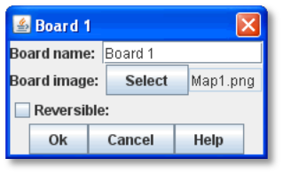

* *Board Name:* Identifying name of the board.
* *Board Image:* Click *Select* to select a board image.
* *Board Width/Height:* Dimension, in pixels, of the board if no image is used.
* *Background Color:* Color of the board, if no image is used.

_Large board image size can have an impact on system performance. See page 8 for more information._

=== Creating a Map Window

*To create a Map Window and one or more boards,*

. Right-click the *[Module]* node and pick *Add Map Window*. The Map Window is added to the Configuration window.
. In the *Map Window* dialog, specify the window settings.
. In the Configuration Window, expand the *[Map Window]* node.
. Right-click the *[Boards]* node and pick *Properties.*
. In the *Map Boards* dialog, enter the settings for the dialog used to select boards at game start.
. Right-click the [*Map Boards]* node, and pick *Add Board*.
. On the *Board* dialog, enter the details of the new map board.
. Repeat Steps 6-7 for any additional boards as needed.

By default, a module includes a Map Window called _Main Map_. You must perform the above procedure for the Main Map (starting from Step 3) before saving the module.

=== Map Options

By selecting options for the Map Window, you can customize the behavior of pieces on it. By selecting different options for different maps, the same piece may behave differently when on those maps.

Customize a Map Window with any of the options listed here. Each new option added to a Map Window will create a corresponding node with its own settings.

* [.underline]#Additional Selection Highlighter#
* [.underline]#At-Start Stack#
* [.underline]#Game Piece Layers#
* [.underline]#Global Key Command#
* [.underline]#Hide Pieces Button#
* [.underline]#Image Capture Tool#
* [.underline]#Last Move Highlighter#
* [.underline]#Line of Sight Thread#
* [.underline]#Map Shading#
* [.underline]#Mouseover Stack Viewer#
* [.underline]#Overview Window#
* [.underline]#Re-center Pieces Button#
* [.underline]#Stacking Options#
* [.underline]#Text Capture Tool#
* [.underline]#Toolbar Menu#
* [.underline]#Zoom Capability#

*Default Nodes:* A newly created Map Window includes these nodes by default: *[Stacking Options]*, *[Image Capture Tool]*, *[Mouseover Stack Viewer]*, *[Global Properties]*, *[Additional Selection Highlighters]*, and *[Last Move Highlighter].* You can configure these nodes, delete unneeded ones, or freely add new ones to the Map Window.

=== Recommended Map Options

Although all Map Options have their uses, always consider adding these visibility options to each Map:

* *Mouseover Stack Viewer:* (see page 28) Enables viewing of the contents of a stack of pieces.
* *Show/Hide Pieces:* (see page 26) Enables players to toggle piece visibility, to view the map directly without moving or interfering with pieces.
* *Zoom Capability:* (see page 31) Enables re-scaling of the Map, for easier viewing.

=== Adding Options to a Map

*To add an options node to a Map Window,*

. Right-click the selected *[Map Window]* node, and select an option to add from the context menu.
. As the option is added, a dialog box is shown. Specify the option settings in the dialog box.
. Repeat Steps 1-2 until all desired options are added.

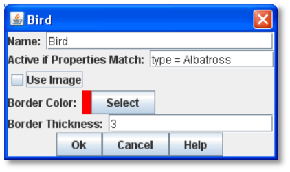

*Additional Selection Highlighter*

An Additional Selection Highlighter enables you to define additional Tpways to highlight the selected piece on a map. The additional highlighters are drawn only if the selected piece matches the specified Properties. If a Game Piece matches the

Properties of more than one highlighter, all will be drawn, in addition to the highlighting color/border specified in the Map's Properties.

An Additional Selection Highlighter has these attributes:

* *Name:* Short name of the component.
* *Active if Properties Match:* The highlighter will be drawn for all Game Pieces on the map that match the given Property expression.
* *Use Image:* Specify an optional image to be overlaid on top of the selected piece. The center of the image will be offset from the center of the piece by the given number of pixels.
* *Border Color:* The color of the border to be drawn around selected pieces.
* *Border Thickness:* The thickness of the border.

=== At-Start Stacks

An At-Start Stack is a stack of playing pieces that is automatically placed at the beginning of every game. Once the game begins, the pieces will be in place just as if they had been dragged from the Game Piece Palette.

First define the name, map, and position of the At-Start Stack, and then create the individual pieces in the Stack. (You can cut and paste pieces to an At-Start Stack from a Game Piece Palette, or other At-Start Stack.)

An At-Start Stack could be used for the following:

* Any group of Game Pieces whose quantity is fixed (for example, the number of houses in a _Monopoly_ set).
* Game Pieces which are found in the same place on the board at the beginning of _every_ game (and every game scenario). If the starting pieces or their positions will vary based on the scenario, use a Pre-Defined Setup instead. (See page 97 for more information on Pre-Defined Setups.)

An At-Start Stack should only include the pieces at a given starting location. For example, chess pieces start in 32 locations on the board, and so would require 32 different At-Start Stacks, each consisting of 1 piece each.

_If Game Pieces are to be drawn randomly from a selection of pieces, use a Deck instead of an At-Start Stack. See page 74 for more information on Decks._

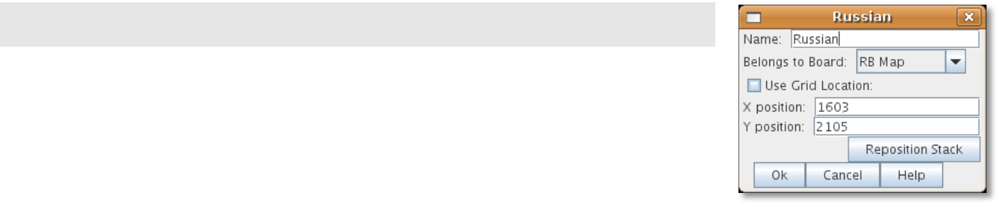

An At-Start Stack has these attributes:

* *Name:* Identifying name of the stack. (Not used during play.)
* *Belongs to Board:* If a name is selected, the stack will appear on that particular Board. If a game does not use that Board, then the stack will not appear. If _Any_ is selected, then the stack will always appear at the given position, regardless of the boards in use.
* *Use Grid Location:* If selected, you can enter the position of the stack using a descriptive location name. This can be the name of a grid point or cell number (for example, on a hex grid, 1515 would place the stack in hex 1515.) Otherwise, you must specify X and Y coordinates.
* *X, Y position:* The position in the Map Window of the center of the Deck. If this stack belongs to a Board, the position is relative to the Board's position in the Map Window.
* *Location:* The location of the stack as a descriptive location label as returned by Grid Numbering or the name of a Region. The Grid numbering system must provide enough information to define a specific location on the map (for example, $GridLocation$). However, if a zone in a Multi-zone Grid does not specify a Grid, the center of the zone will be selected.

_EXAMPLE: A strategic game in which a nationality has a fixed force pool of Infantry and Armor counters can be modeled by making a Map Window representing the force pool, with an At-Start Stack of Infantry counters and an At-Start Stack of Armor counters._

==== Editing the Contents of an At-Start Stack

You can make wholesale changes quickly to the entire contents of an At-Start Stack in the Editor. In the Configuration Window, right-click the *[At-Start Stack]* node and pick *Edit All Contained Pieces*. The *Properties* dialog for the first piece is displayed, but any changes you make in the *Properties* dialog will affect all Game Pieces in the At-Start Stack. Add, remove or edit Traits as usual, then click *Ok*. Your changes are applied to all Pieces in the At-Start Stack.

=== Game Piece Layers

Using Game Piece Layers (GPLs) enables you to specify that certain Game Pieces will always be drawn on top of others. GPLs function like a set of transparent sheets, laid in ascending or descending levels. Pieces on one of the levels will not stack with pieces drawn on other levels above or below it.

After defining the GPLs for a Map, you need to use a Marker Trait to assign each Game Piece (or Prototype) to a GPL. Pieces with no value for the Marker Trait will be drawn on the topmost layer. See page 52 for more information on assigning a Game Piece to a Game Piece Layer.

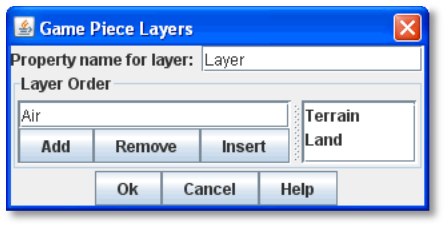

The GPL option has these settings:

* *Property Name for Layer:* Property name for the Marker Trait used to identify the pieceʼs GPL. The default value is _Layer_.
* *Layer Order:* Click *Add* to specify the Layer order. Each corresponds to the pieceʼs value for the Marker Trait used to identify the GPL. Layers are shown in inverted order from their layout on the map; that is, layers shown at the top of the list are drawn below the ones after them.

_Example: A Map has a Game Piece Layer specified with Property name_ Layer _and Layer Order_ Terrain, Land, Air__. Any piece with a Marker Trait with Property name__ Layer _and value_ Terrain _will be in the bottom-most layer. The middle layer will contain pieces with the value_ Land, _and the top layer will contain pieces with the value_ Air__. Pieces with no value for the Layer Property will be in their own layer, above all three.__

_The Game Piece Layer Map option is not related to the Layer Trait for Game Pieces. See page 49 for more information on the Layer Trait._

==== Game Piece Layer Control

The Game Piece Layer Control adds a button to the Map Window Toolbar that enables you to activate or deactivate the Game Piece Layers for that map, and to change their relative order. Game Pieces belonging

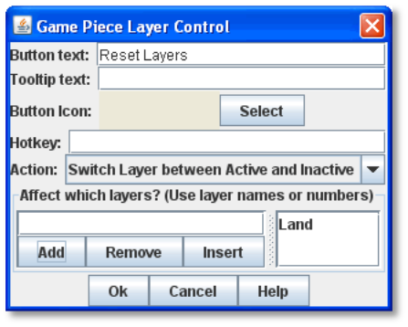

to GPLs that have been deactivated are hidden from view until the Layer is activated again.

Each player can activate or deactivate Layers independently, and layer activation is not saved when the game is saved.

The Game Piece Layer Control has these settings:

* *Button Text:* Text label for the GPL Control button.
* *Tooltip Text:* Tooltip text displayed on mouseover.
* *Button Icon:* Icon used for the GPL Control button.
* *Hotkey:* Keyboard shortcut for the button.
* *Action:* Action taken when the button is clicked. Choose one of the following:

[loweralpha, start=15]
. _Rotate Layer Order Up/Down_ will change the relative order of the Layers on the map, moving each layer up or down by one in the order.

[loweralpha, start=15]
. _Make Layer Active/Inactive_ will activate or deactivate the specified Layers.

[loweralpha, start=15]
. _Switch Layer between Active and Inactive_ will toggle the specified layers between active and inactive.

[loweralpha, start=15]
. _Reset All Layers_ makes all Layers active and restores them to their default order.

_*Global Key Command (Map Window Level)*_

The Global Key Command (GKC) adds a button to the Map Window Toolbar. Clicking the button will select certain pieces in the Map Window and apply the same keyboard command to all of them simultaneously.

By default, a Global Key Command assigned to a Map Window will only affect pieces in the Map Window to which it is assigned. You can specify a new map window by including a CurrentMap expression in *Matching Properties*, which will override the default window. (For a GKC that will affect pieces on any map, use the GKC (Module Level) control, described on page 87.)

The Global Key Command has these settings:

* *Description:* A description of the action, used for the button's mouseover tooltip.

* *Key Command:* The keyboard command that will be applied to the selected pieces.
* *Matching Properties:* The command will apply to all pieces on the map that match the given Property expression.
* *Within a Deck, Apply To:* Select how this command applies to pieces that are contained within a Deck.

image:_images/image49.png[image,width=231,height=203]

[loweralpha, start=15]
. _No pieces_ means that pieces in a Deck ignore the command.

[loweralpha, start=15]
. _All pieces_ means that the command applies to the entire Deck.
[loweralpha, start=15]
.. _________________________________________________________________________________________________________________________
_Fixed number of pieces_ enables you to specify the number of pieces (drawn from the top) that the command will apply to.

* *Tooltip text:* Mouseover hint text for the Toolbar button.
* *Button Text:* Text for the Toolbar button.
* *Button Icon:* Icon for the Toolbar button.
* *Hotkey:* Keyboard shortcut for the Toolbar button.
* *Suppress Individual Reports:* If selected, then any auto-reporting of the action by individual pieces by the Report Action Trait will be suppressed.
* *Report Format:* A Message Format that will be echoed to the Chat window when the button is pressed.

_Commands applied by Global Key Commands will be affected by piece ownership. If the GKC triggers a command that is restricted by side, the action may not take place as intended when the restricted side triggers the GKC (by button or other command)._

==== Hide Pieces Button

Clicking a Hide Pieces button will temporarily hide all pieces on the map from the clicking player, until the button is clicked again. This is useful to get a better look at the game board, such as to read a map label, terrain hex, or legend. (To make pieces invisible to other players, use the Invisible Trait.)

The Hide Pieces Button has these settings:

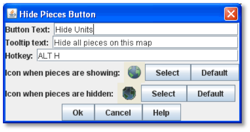

* *Button Text:* The text of the *Hide Pieces* button to be added to the Toolbar.
* *Tooltip Text:* Text shown on mouseover.
* *Hotkey:* Keyboard shortcut for toggling hidden pieces.
* *Icon When Pieces are Showing:* Button shown when pieces are visible.
* *Icon When Pieces are Hidden:* Button shown when pieces are hidden.

_If possible, use a different button image for the showing and hidden icons. Players will be able to more clearly determine when the button has been clicked and when pieces are hidden from view._

=== Image Capture Tool

The Image Capture tool component adds a button to the Toolbar of the Map Window. Clicking the button will copy the contents of the Map Window to a PNG image file. Using the Image Capture Tool, you can take an image of the entire map, shot even if the Map Window is too large to fit entirely on the screen.

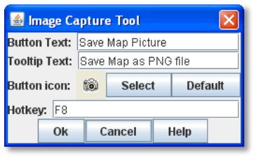

The Image Capture Tool has these settings:

* *Button Text:* Text label for the Image Capture button.
* *Tooltip Text:* Tooltip text displayed on mouseover.
* *Button Icon:* Icon used for the Image Capture button.

_*Maps and Boards: Map Options*_

* *Hotkey:* Keyboard shortcut for the button.

=== Last Move Highlighter

A Last Move Highlighter draws a colored border around the last piece to have been moved, added, or deleted in a logfile or by an opponent during live play. Clicking on the map clears the highlight.

The Last Move Highlighter has these settings:

* *Enabled:* Enabled by default. If selected, the highlighter is in effect for the last piece to be moved, added, or deleted from a logfile and live play.
* *Color:* Color of the border shown.
* *Thickness:* Border thickness, in pixels.

image:_images/image55.png[image,width=152,height=98]

=== Line of Sight Thread

A Line of Sight Thread adds a button to the Toolbar of the Map Window. Clicking the button will enable a player to drag the mouse cursor between any two points in the Map Window, drawing a line between those two points to indicate line of sight or range.

The Line of Sight Thread has these settings:

* *Button Text:* The label on the button in the Map Window Toolbar.
* *Tooltip Text:* Tooltip text for the button in the Map Window Toolbar.
* *Button Icon:* Icon for the button in the Map Window Toolbar.
* *Hotkey:* Specifies a keyboard shortcut for the button.
* *Report Format:* A Message Format that specifies the report to the chat window when the LOS button is used. If blank, no report is sent to the chat window when drawing a thread.
* *Persistence:* Select one of the following for the persistence of the LOS thread.

[loweralpha, start=15]
. _Ctrl-Click & Drag:_ The thread will only persist when the drawing player holds down Ctrl-Click and draws the thread.

[loweralpha, start=15]
. _Never:_ The thread will only persist as long as the drawing playerʼs finger is on the mouse button.
[loweralpha, start=15]
.. ___________________________________________________________________________
_Always:_ The thread will persist on the board until a new thread is drawn.

* *Button Icon When LOS Persisting:* The button icon shown when the LOS thread is persisting, in the circumstances defined under *Persistence*.
* *Visible to Opponent:* Select whether a drawn thread will

be visible to the opponent: _When Persisting, Never,_ _Always_.

* *Force Start of Thread to Snap to Grid:* If selected, and a Grid is defined for the map, the thread will always begin in the center of a Grid cell.
* *Force End of Thread to Snap to Grid:* If selected, and a Grid is defined for the map, the thread will always end in the center of a Grid cell.
* *Draw Range:* If selected, draws the range between the two points, in hexes or squares, as appropriate for the board in use.
* *Pixels Per Range Unit:* If drawing the range on a board without a Grid, this determines how many pixels on the screen equal a single unit of range.
* *Round Fractions:* For distances that are a fraction of a range unit, specify whether to round fractions up, down, or to the nearest whole number.
* *Hide Pieces While Drawing:* If selected, then all Game Pieces in the map will be hidden (or transparent) while the thread is being drawn.

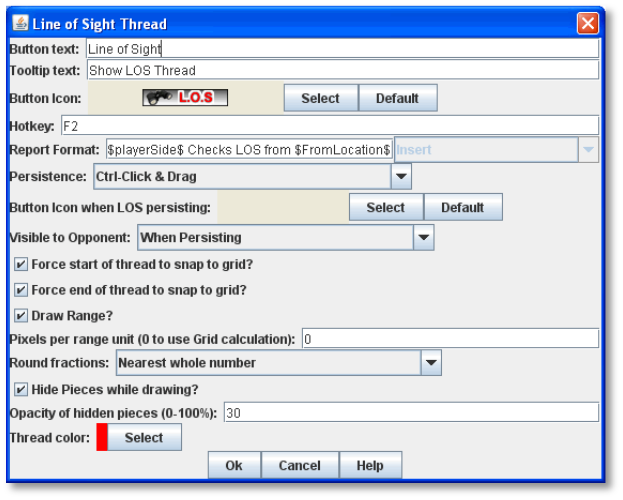

* *Opacity Of Hidden Pieces:* Set the transparency of Game Pieces, as a percentage of original opacity, while the thread is being drawn. 0 is completely invisible, 100 is completely opaque.
* *Thread Color:* Specifies the color the thread on the screen. If set to null (by clicking the *Select* button and then the *Cancel* button in the color-choosing dialog), then a Preferences option will determine the color of the thread at game time.

=== Map Shading

The Map Shading option applies a semi-transparent solid color or image tiling to the Map. In background mode, Map Shading can be used to overlay a repeating image over solid-color boards. In foreground mode, the area is determined by the pieces on the map that name this Map Shading in an Area of Effect Trait.

The Map Shading option has these settings:

* *Name:* A short name of this shading for reference by pieces with the Area of Effect Trait.
* *Shading Always On:* If selected, then the shading is always drawn. If not selected, then visibility is controlled by a button in the Map Window Toolbar.
* *Shading Starts Turned On:* If selected, then the shading will begin visible when a game is loaded.
* *Button Text:* Text for the Toolbar button.
* *Button Icon:* Icon for the Toolbar button.
* *Hotkey:* Keyboard shortcut for the Toolbar button.
* *All Boards In Map Get Shaded:* Allows you to select which Boards in the map to apply the shading to.
* *Type:* If set to _Background_ then the shaded area includes the entire board, minus the areas attached to any Area of Effect Traits. If set to _Foreground_, then the shaded area includes only the areas attached to Area of Effect Traits.
* *Draw Shade On Top Of Counters:* If selected, then the shading will be drawn over any counters on the map. Otherwise, it will be drawn underneath all counters.
* *Shade Pattern:* Choose between 100/75/50/25% hatch patterns, or choose a custom image.
* *Color:* The color of the shading (if not using a custom image).
* *Opacity:* The opacity of the shading. 0 is invisible, 100 is completely opaque.
* *Border:* If selected, will draw a border around the shading area. You can specify the thickness, color, and opacity of the border.

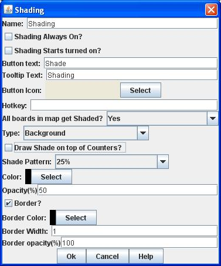

=== Mouseover Stack Viewer

A Mouseover Stack Viewer displays the contents of a stack when a mouse cursor is moved over it, after a specified delay. The Viewer can also display descriptive text about the pieces in the stack. (Note that a ʻstackʼ can consist of a single piece or multiple pieces.)

The option has these settings:

* *Recommended Delay Before Display:* When the mouse has been stationary for this many milliseconds, the viewer will appear. (Individual users can override this by choosing a setting in *Preferences*. See the _VASSAL_ _Userʼs Guide_ for more information on setting Preferences.)
* *Keyboard Shortcut to Display:* Players may display the viewer without waiting by typing this keyboard shortcut. This can be disabled in the preferences.
* *Background Color:* Pieces and text are drawn against a background of this color.
* *Border/Text Color:* Color of any text drawn, and the border around the overall viewer.

* *Display When At Least This Many Pieces Will Be Included:* Minimum number of units in a stack that will trigger the viewer. You can set this to 1 to view individual pieces. If set to 0, then the viewer will display even if the location is empty.
* *Always Display When Zoom Level Is Less Than:* Regardless of the above *Display When At Least This Many…* setting, the viewer will also display when the map's Zoom level is less than this number.
* *Draw Pieces:* If selected, then the stacked pieces will be depicted in the viewer.
* *Draw Pieces Using Zoom Factor:* The magnification factor to use to draw the pieces in the viewer.
* *Width Of Gap Between Pieces:* Empty space in pixels to place between each drawn piece.
* *Display Text:* If selected, then the viewer will show summary text and some individualized text for each piece. If selected, specify each of these values:

[loweralpha, start=15]
. *Font Size:* Size of the text shown in the viewer.
[loweralpha, start=15]
.. ___________________________________________________________________________________________________________________________________________________________________________________________________________________________________________________________________________________________________________________________________________________________________________________________________________
*Summary Text Above Pieces:* A Message Format specifying the text to display above the drawn pieces in the viewer. By default, this is set to $LocationName$. In addition to standard Properties, you can include a Property with the name $sum(PropertyName)$ where (PropertyName) is a Property defined on a Game Piece. The numeric values of this Property for all included pieces will be substituted.

* *Text Below Each Piece:* A Message Format specifying the text to display below each included piece.
* *Include Individual Pieces:* Specifies how pieces are to be selected for inclusion in the viewer. You may restrict the pieces according to the Game Piece Layer that they belong. Alternatively, you may specify the value of a Property.
* *Include Non-Stacking Pieces:* If selected, then non-stacking pieces are eligible for inclusion in the viewer.
* *Show Pieces In Unrotated State:* If selected, then pieces that can rotate are drawn in the mouseover as they look when not rotated.
* *Include Top Piece In Deck:* If selected, then the top piece of a Deck will be shown in the Viewer.

==== ʻOffboardʼ Pieces

By default, a Mouseover Stack Viewer will display each stack showing the value of each pieceʼs current location above each piece. If no Grid is defined for the map, the pieces will be shown as ʻoffboardʼ.

To change the display of the word ʻoffboardʼ, do one of the following:

* Add a Grid to the map. The Viewer will display the stackʼs current location.
* In the *Mouseover Stack Viewer* dialog, select *Display Text*. In *Summary Text Above Pieces*, delete the Property name $LocationName$.
* As above, but instead of $LocationName$, substitute the name of a different Game Piece Property to be displayed.

==== Showing the Number of Items in a Stack

You can set a Stack Viewer to show the number of items contained in a stack.

. Set a Marker Trait on all units you want to count. Name the Marker Trait _UnitCount_, and set the Value to 1.
. Create a Stack Viewer for the Map Window. In *Summary Text Above Pieces*, select _$sum(PropertyName)$_. In the box, replace _PropertyName_ with _UnitCount_ (so it shows _$sum(UnitCount)$_). On mouseover, the Viewer will now display the total Unit Count of all pieces in the stack.

==== Multiple Stack Viewers

A Map Window can have any number of Stack Viewers, each with its own settings. You can use different Stack Viewers to view pieces of different types, on different Game Piece Layers, or with different attributes, and display them in different ways.

For example, a playerʼs Map Window contains a stack of game pieces, as well as a stack of game money. To prevent them being stacked together, each of these piece types is assigned to a different Game Piece Layer. In addition, the money pieces each include a Marker Trait, _Value_, containing the value of the given piece.

* One viewer is set to display the game pieces, and has *Draw Pieces* enabled, with each pieceʼs Basic Name displayed in a small label below. For *Include Individual Pieces*, _from layers other than those listed_ is selected, and _Money_ is entered. This viewer will now show any stack not on the Money layer, and display all the pieces in the stack.

* The second viewer has *Draw Pieces* disabled. In *Summary Text Above Pieces*, the setting _$sum(Value)$_ is entered. For *Include Individual Pieces*, _from listed layers_ is selected, and _Money_ is entered. Now, when mousing over a stack of money, the total value of the money stack, but not the money pieces themselves, will be displayed.

=== Overview Window

The Overview Window adds a separate window that will be displayed whenever the main Map Window is displayed. The additional window will contain a view of the entire playing area at a smaller scale than displayed in the main Map Window. The area of the map currently visible in the Map Window is highlighted in the overview map with a colored rectangle. A player may click on the Overview window to center the Map Window at the point clicked on.

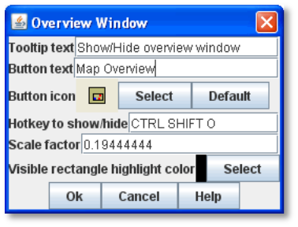

The scale of the overview window relative to the Map Window can be specified in the Scale Factor Property. You may also specify the color of the rectangle indicating the area visible in the main Map Window.

The option has these settings:

* *Tooltip Text:* Tooltip shown when the cursor hovers over the button.
* *Button Text:* Overview window button text.
* *Button Icon:* Overview window button icon.
* *Hotkey to Show/Hide:* Keyboard shortcut to toggle Overview window.
* *Scale Factor:* Size of the Overview window compared to the current map view. For example, if the Scale Factor is 0.2, then the Overview window will show the full-scale map image at 20% size.
* *Visible Rectangle Highlight Color:* Color of the rectangle shown around the overview.

=== Re-center Pieces Button

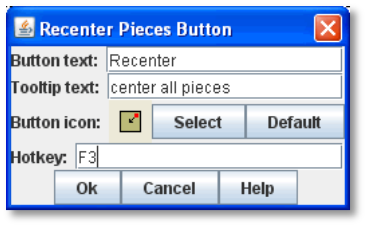

A Re-Center Pieces button adds a button to the Map Window Toolbar button, appearing on the Main Controls toolbar, which will shift the position of all pieces on the map such that they are centered on the middle of the map as much as possible. This is useful for games where there are no absolute terrain features, such as many air, naval, and space combat games.

The option has these settings:

* *Button Text:* Text label for the button.
* *Tooltip Text:* Tooltip text displayed on mouseover.
* *Button Icon:* Icon used for the button.
* *Hotkey:* Keyboard shortcut for the button.

_Because the size and layout of grids may vary widely, the Re-Center Pieces button may not place pieces exactly in the center of some grids, and some manual adjustment by players may be needed after ʻre-centeringʼ._

=== Stacking Options

Stacking Options determine how stacking is handled in this Map Window. The option may not be deleted.

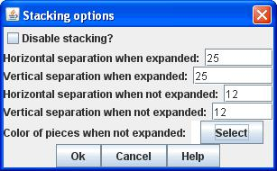

* *Disable Stacking:* If selected, then pieces will never form stacks in this window.
* *Horizontal Separation When Expanded:* The distance in pixels from the left edge (right edge if negative) of a Game Piece in a stack to the edge of the piece above it when the stack is expanded.
* *Vertical Separation When Expanded:* The distance in pixels from the bottom edge (top edge if negative) of a Game Piece in a stack to the edge of the piece above it when the stack is expanded.
* *Horizontal Separation When Not Expanded:* The distance in pixels from the left edge (right edge if negative) of a Game Piece in a stack to the edge of the piece above it when the stack is compact.
* *Vertical Separation When Not Expanded:* The distance in pixels from the bottom edge (top edge if negative) of a Game Piece in a stack to the edge of the piece above it when the stack is compact.
* *Color Of Pieces When Not Expanded:* If set, then pieces below the top piece in a compact stack will be drawn as plain squares of this color and a black border. If not set (click *Select* and cancel the color-selection dialog) then pieces will be drawn normally.

=== Text Capture Tool

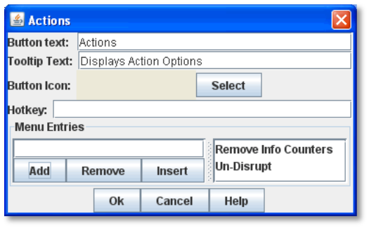

The Text Capture Tool adds a button to the Map Window Toolbar. Clicking the button will write a plain text summary of the contents of the map to a file, using the names assigned to the counters and the appropriate numbering of the board's Grid.

The option has these settings:

* *Button Text:* Text label for the Text Capture button.
* *Tooltip Text:* Tooltip text displayed on mouseover.
* *Button Icon:* Icon used for the Text Capture button.
* *Hotkey:* Keyboard shortcut for the button.

=== Toolbar Menu

The Toolbar Menu component enables you to group buttons from the Toolbar of the Main Controls window or a Map window into a drop-down menu on the Toolbar. Each button named in this component will be removed from the Toolbar and instead appear as a menu item in the drop-down menu.

* *Button Text:* The text of the button to be added to the Toolbar. Clicking the button will reveal the drop-down menu.
* *Button Icon:* Icon for the Toolbar button.
* *Hotkey:* Keyboard shortcut for revealing the drop-down menu.
* *Menu Entries:* Enter the text of the buttons that you wish to move to the drop-down menu. The menu item will have the same text. If the button uses an icon, the menu item will also use it.

=== Zoom Capability

Zoom capability enables re-scaling of a Board. You can add up to 3 buttons, for Zoom In, Zoom Out, and Zoom Select.

Zoom levels are defined as decimal numbers, each corresponding to a percentage of the full-scale map. For example, a 1000-pixel wide map, viewed at a Zoom level of .25 (25%), would appear to be 250 pixels across.

You can define an initial Zoom level. By default, this is 1.0 (which corresponds to a magnification factor of 100%), but you can select a different value. Zoom is defined in additional Zoom levels, which by default are defined at .39 (39%), .625 (62.5%), 1.0, and 1.6 (160%). However, you may add new levels to the list, or remove the defaults.

* Clicking the *Zoom In* button moves the current Zoom factor up the list of Zoom levels, from the initial value to higher values, making the map larger.
* Clicking the *Zoom Out* button moves the current Zoom factor down the list of Zoom levels, from the initial value to lower values, making the map smaller.
* Clicking *Zoom Select* enables the user to simply select a Zoom level from the defined levels.

The option has these settings:

* *Preset Zoom Levels:* A set of preset Zoom levels is listed. Each is identified by its scaling factor. For example, a Zoom level of .625 will show the board at 62.5% actual size. (A 1000 pixel-wide board would appear as 625 pixels across.) You can add a new level by entering a scaling factor in the text box and clicking *Add*. To remove a pre-set level, select it from the list and click *Remove*. To set the initial Zoom level (the one players see at game start), select the desired level and click *Set Initial.* The initial level will be marked with an asterisk (*).
* *Zoom In/Out/Select Tooltip Text:* Tooltip text for the button.
* *Zoom In/Out/Select Button Text:* Text label for the Zoom button.
* *Zoom In/Out/Select Icon:* Icon used for the Zoom button.
* *Zoom In/Out/Select Hotkey:* Keyboard shortcut used for the Zoom button.

Since the Zoom In and Zoom Out button functions are both duplicated b the Zoom Select button, you may wish to omit these buttons. To omit a particular Zoom button from the Map Toolbar, leave the text label and tooltip for the button blank. Then, next to the Icon for the button you do not wish to include, click *Select*, and then click *Cancel*. The button will not be displayed.

For example, to exclude the *Zoom In* button, next to *Zoom In Icon*, click Select, and then click Cancel. No Zoom In button will be included.

=== Map Grids

Map Grids help regulate movement and piece location. You can add one of the following types of Grid to a board: Hex, Rectangular, Irregular, and Multi-zoned.

Use of a Map Grid is optional. Although VASSAL Map Grids can help keep piece placement and movement tidy, hex and rectangular Grids in VASSAL are really most useful at the tactical scale, where range between hexes or squares may a factor in gameplay, and a Line of Sight Thread is used to track distances. For other games, such as those at the strategic scale, the printed grid included in the map image is often all that is necessary.

If you choose add a map grid to a board, each board in the same map window must have its own Grid, and each board may only have one grid (exception: see _Multi-Zoned Grids_, below.)

Like other components, map Grids can be copied and pasted from one Board to another.

By default, if a hex or rectangular Grid is imposed, pieces will _snap_ to them, in which case all pieces will align neatly with the Grid cells. You can also enable snap for Irregular grids.

To turn off snap, choose cell edges or vertices as legal locations. (You can also have some pieces ignore snap by assigning them the Does Not Stack Trait. See page 46 for more information.)

=== Hex Grid

A Hex Grid is a standard hexagonal Grid for regulating movement on a Board. This type of Grid has these options:

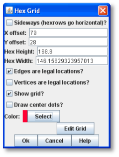

* *Sideways:* Check this box to make the hex rows of the Grid run right-to-left instead of top-to-bottom. (Setting the Grid to be Sideways switches the meanings of horizontal/vertical and x/y below.)
* *X,Y offset:* The horizontal and vertical position of the center of the first hex of the Grid.
* *Hex Height/Width:* In pixels from hex center to hex center. If you specify only the height, the width will adjust, or you can create oblong hexes by also specifying a width
* *Edges/Vertices are Legal Locations:* If selected, pieces can be placed on cell edges or corners, instead of only at hex centers.
* *Show Grid:* If selected, then the Grid will be drawn over the Board image using the specified color.
* *Draw Center Dots:* If selected, a dot will be drawn at the center of each hex in the specified color. You can add numbering to this type of Grid; see Grid Numbering on page 34.

=== Rectangular Grid

A standard rectangular Grid for regulating movement on a Board. This type of Grid has these options:

* *X,Y offset:* The horizontal and vertical position of the center of the first cell of the Grid.
* *Hex Height/Width:* in pixels of a single cell.
* *Edges/Corners are Legal Locations:* If selected, pieces can be placed on cell edges or corners, instead of only at cell centers.
* *Show Grid:* If selected, then the Grid will be drawn over the Board image using the specified color.
* *Draw Center Dots:* If selected, a dot will be drawn at the center of each cell in the specified color.

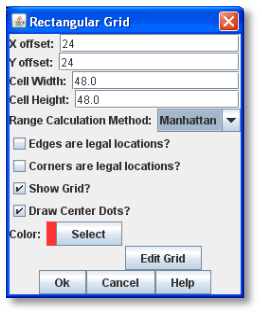

You can add numbering to this type of Grid; see Grid Numbering on page 34.

=== Irregular Grid

An irregular Grid is used for area-based games. It enables you to define a set of named Regions at arbitrary locations. These named Regions will act like the cell center points on hex or rectangular Grids. Pieces can be made to snap to the nearest named point, and their location will be reported as the nearest named point.

For maps with very irregularly shaped areas, you may need to specify more than one Region point in each area, each with the same name.

This type of Grid has these options:

* *Snap to Defined Point:* If selected, a Game Piece moved on the board will snap to the nearest defined Grid point.
* *Draw Region names:* If selected, the names of the Regions will be drawn on the map.
* *Font Size:* The font size used to draw the names.
* *Define Regions:* Click to display a window for defining the Regions. To add a new Region, right-click anywhere on the board and pick *Add Region*. To remove a Region, right-click on an existing Region's name and pick *Delete Region.* To change a Regionʼs name or relocate it, click *Properties*, and then enter the new values.

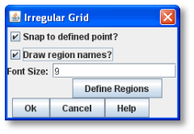

=== Multi-Zoned Grid

A multi-zoned Grid enables you to define any number of areas on a board. Each area, called a Zone, can have its own Grid type and naming format, which takes precedence over the default Grid. For example, a board with a hex Grid may have zones along the edge for a turn track or force pools. Pieces will snap to positions in the appropriate Zone and auto-reporting will use text supplied by the zone.

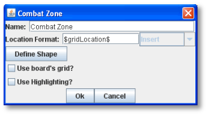

Use of a multi-Zoned Grid is not recommended for a map with many Zones.

This type of Grid has these options:

* *Zone:* Each zone can have an arbitrary shape, which you specify in the Define Shape dialog. Each zone may define its own Grid. When defining a zone's Grid, the offsets and numbering are relative to the edge of the overall board, not the zone's edge.
* *Name:* The name of the Zone.
* *Location Format:* A Message Format that will be used to define the location of a point for auto-reporting of moves: name is the name of this Zone, GridLocation is the location name according to this zone's Grid.
* *Define Shape:* Hit this button to bring up a dialog for defining the shape of this zone. To create the initial shape, drag the mouse to define a rectangle. Then right-click to add new points and use the mouse to drag points to their final locations. Delete a point by clicking on it and pressing the Delete key.
* *Use Board's Grid:* If selected, then this Zone will use the Grid from the containing board instead of defining its own Grid.
* *Use Highlighting:* If selected, you must also specify the name of a Property. The value of the Property will determine which Zone Highlighter is used to draw the zone.
* *Zone Highlighter:* Any number of Zone Highlighters can be added to a Multi-Zone Grid. Any Zone whose highlighting Property matches the name of a Zone Highlighter will be drawn with that highlighter, which overlays a colored pattern over the shape of the Zone.
* *Name:* The name of the highlighter.
* *Color:* The color of the highlight.
* *Coverage:* Select Entire Zone to overlay the entire shape of the zone. Select Zone Border to overlay only the border of the Zone.
* *Style:* Select from solid color, striped diagonal lines, crosshatched diagonal lines, or an image that you specify.
* *Opacity:* Select the transparency of the overlaid color or image.

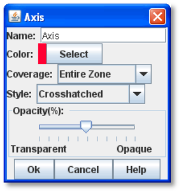

If a given point does not fall within any of the defines Zones for a Multi- zone Grid, the default Grid is used. The default Grid may be any of the usual types of Grid: hex, rectangular or irregular.

=== Zone Highlighters

Any number of Zone Highlighters can be added to a Multi-Zone Grid. Any Zone whose highlighting property matches the name of a Zone Highlighter will be drawn with that highlighter, which overlays a colored pattern over the shape of the Zone.

* *Name:* The name of the highlighter.
* *Color:* The color of the highlight.
* *Coverage:* Select Entire Zone to overlay the entire shape of the zone. Select Zone Border to overlay only the border of the Zone.
* *Style:* Select from solid color, striped diagonal lines, crosshatched diagonal lines, or an image that you specify.
* *Opacity:* Select the transparency of the overlaid color or image.

=== Zone Properties

A Zone may contain Global Properties. Zone Properties may not have a Change-Property Toolbar button, but can be modified by a Set Global Property Game Piece Trait.

*To assign a Global Property to a Zone,*

. Right-click the Zone and pick *Add Global Property*.
. In the *Global Property* dialog, enter name and other settings for the Property.
. Click *Ok*.

For more about Global Properties, see page 88.

*Adding Different Grid Settings to a Board*

Multiple Grids can be added to a Board using Zones. Grids are added at the Board level, not the Map level, and so need to be set on each Board that makes up your map. Follow this procedure for each Board:

. First create a board with a Multi-zoned Grid.
. Create a standard Hex, Rectangular or Irregular Grid that covers most of the board. This is the 'default' or 'background' Grid that will be used for all areas of the Map not covered by a Zone.
. For each area of the Board that is to have a different Grid, create a Zone. Don't click the *Use Board's Grid* button, as this will force the Zone to use the Grid you specified in step 2.
. Right-click on the newly created Zone and you can now add a Hex, Rectangular or Irregular Grid that will apply only within that Zone.
. If Zones overlap at a given point, the Zone defined first in the module (that is, topmost in the Module Editor) will take precedence at that point.

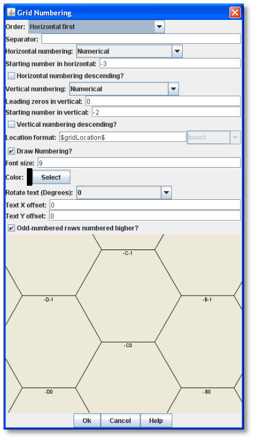

==== Grid Numbering

You can add Grid numbering to any hex or rectangular Grid. (Numbering is not applicable to the other Grid types.)

* *Order:* Label cells by row/column vs. column/row
* *Separator:* Text to place between the row and column, such as a comma
* *Numbering:* Alphabetical (A, B, C, ... AA, BB, CC, etc.) vs. numerical (1,2,3...)
* *Descending:* If selected, numbering of rows and columns begins on the bottom right edge of the board.
* *Leading Zeros: Number of leading zeroes in each row or column*

*number.* One leading zero means to always use two digits for the row/column. Two leading zeros mean always use three digits, and so on.

* *Starting Number:* The number of the first cell ('A' == 0 if using alphabetic numbering).
* *Location Format:* The Message Format for reporting locations within a Map Window (for example, for move reporting): GridLocation is the name as drawn on the sample Grid. This is useful for pre-pending a board name, for example.
* *Draw Numbering:* If selected, the numbering of the Grid will be drawn on top of the board image.
* *Font size:* Size of the font to use when drawing the numbering.
* *Color:* Color to use when drawing the numbering.
* *Rotate Text:* Orientation of the numbering text.
* *Text X Offset:* Distance in pixels to the right (relative to the text's orientation) of its default position that the text will be drawn. By default, text is center-justified at the top of the cell.
* *Text Y Offset:* Distance in pixels downward (relative to the text's orientation) of its default position that the text will be drawn. By default, text is center-justified at the top of the cell.
* *Odd-Numbered Rows Numbered Higher:* For hex Grids only. If selected, then the first number of staggered columns on the Grid will be one greater than non-staggered columns.

==== Adding a Grid to a Board

*To add a Grid to a board,*

. Select the *[Map Window]* node that contains the board.
. Select the *[Board]* node.
. Right-click the node and pick the type of Grid you would like to add from the list of commands.
. In the dialog, configure the Grid as desired.
. Click *Ok*.

*To add Grid numbering to a hex or rectangular Grid,*

. Select the *[Board]* node that contains the hex or rectangular Grid.
. Right-click the node and pick *Add Grid Numbering*.
. In the *Grid Numbering* dialog, configure the Grid numbering as desired.
. Click *Ok*.

==== Aligning a Map Grid with a Printed Grid

Some game board images already include a printed hexagonal or rectangular Grid. Of course, your module Grid should align with the printed Grid as closely as possible. The Module Editor has a number of tools to help you align a Grid.

_For better appearance, make a Map Grid invisible (*Draw Grid* is de-selected) if the Grid is already drawn on the printed map image._

*To align a hex or rectangular Grid with a printed Grid,*

. In the Module Editor, right-click the *[Hex Grid]* or *[Rectangular Grid]* node you wish to edit, and select *Properties*.
. On the dialog, select *Draw Grid* and *Draw Center Dots.*
. In *Color*, select a highly visible color.
. Click *Edit Grid.*
. On the *Edit Grid* dialog,
* Use your arrow keys to shift the offset of the Grid. (Hold Shift down to increase the speed of the Grid movement.)
* To resize the cells, use these keys: Ctrl-Down Arrow to increase the vertical cell dimensions. Ctrl-Up Arrow to decrease the vertical cell dimension. Ctrl-Right Arrow to increase the horizontal cell dimension. Ctrl-Left Arrow to decrease the horizontal cell dimension.
. When the Grid aligns with the printed Grid, click *Save*.
. Deselect the *Draw Grid* and *Draw Center Dots* checkboxes, so the VASSAL-imposed Grid is invisible.
. Click *Ok*.

*Guidelines for Grid Alignment*

Aligning a Grid component with a printed map Grid can be tricky, particularly for hexagonal Grids. Follow these guidelines to help ensure an accurate Grid placement.

* Make the Grid and center dots a highly visible color when working on a Grid. (You can turn off the *Draw Grid* setting later, when you finalize the board.)
* Try to align the grid in the upper left-hand corner of the map. Then, move to the lower right-hand portion of the map. Align this, and then re-check the upper left-hand corner again. This will show you how much you might have to deviate from a perfect alignment to have pieces generally centered throughout the map, if both corners do not align exactly.
* Work on one axis a time:

[loweralpha, start=15]
. Adjust the cell height first__.__ Change the cell height slowly with the Ctrl-Up/Down Arrow keys until the Grid hexes are approximately the same height as the map hexes. Then, using the Up/Down Arrow keys, adjust the vertical offset to align them better. Fine-tune the cell height and cell placement.

[loweralpha, start=15]
. Now, leaving cell height unchanged, work on cell width in the same way, using the Ctrl-Left/Right Arrow and Left/Right Arrow keys. Fine-tune the cell width and cell placement. Adjust the Hex width until you get a repeating pattern showing the hexes are about the same size.

The key for successful alignment to always adjust the cell height and vertical offset first, and get that right before working with the width and horizontal offset.
