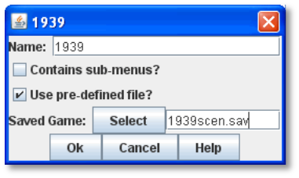
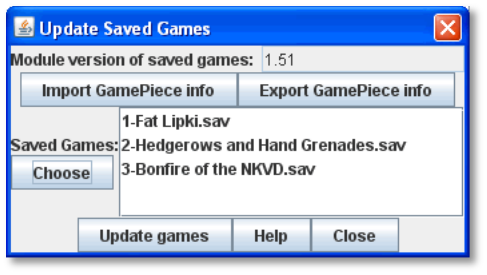

== Pre-Defined Setups

Many games include scenarios, where different maps and pieces may be used to simulate diverse game situations. For example, a World War II game could have a scenario for the Battle of the Bulge and another for the Battle of Midway. Each is played using the same module and rules, but would use different maps and counters.

In VASSAL, scenarios are represented by _setups_, which are preset configurations of maps and pieces. Setup files are actually just
saved games (.vsav files). You create a setup by setting up the game as appropriate for the scenario, and then saving the file.

VASSAL saves the current game arrangement, including all boards, placement of pieces, and current turn. You can then include the
saved game in a module.

If a module includes pre-defined setups, players will be prompted to select a setup when the module is launched. They can also select scenarios from the *File* menu.

=== About Saved Games

A saved game is a snapshot of the module at the time it was created. This is particularly true of the Game Pieces used in the setup:

* Pieces in a saved game will only include Traits that were part of the piece at the time the saved game was saved.

Changes to a module are _not_ reflected in existing Saved Games.

* Decks and At-Start Stacks will only include their contents at the time the game was saved.

If you later modify the Game Pieces to add or remove Traits (in any way, including Prototypes), then the Game Pieces in a setup file created _before_ the revision will not be updated to reflect the new Traits. Instead, they will continue to reflect the Traits present on each piece at the time it was created. The same applies of Decks or At-Start Stacks: if you modify them (add, edit, or remove pieces) after the game is saved, the saved game will not show the additions or revisions.

Because setup files reflect the game pieces at the time they were created, creating them should be the _very last task you_ _perform_ when creating a module. Only create the setup file when you are _certain_ you will not be making any more edits or revisions to pieces or other game components, or you may be forced to create the setup file all over again. (The Saved Game Updater tool can address this issue. See page 97 for more information.)

If you make updates to your module, make sure you also update any Saved Games associated with it. (See Iʼm Not Seeing My Changes on page 110.)

*Creating a Setup File*

Create a setup file as a saved game (.vsav) file. Always save the game when logged in as an Observer, to ensure that players can freely select any Side to play. If you do not save the game as an Observer, then when the game is launched, the Side you saved the game as will not be visible for players to select.

*To create a setup file,*

. Launch the module.
. Set up the scenario for the game as if you were playing it and take the first playerʼs side.
. If the game includes different Sides, click *Retire.* Select another Side to play, then set up pieces for that Side.
. Repeat Step 3 until all Sides have been set up for game start.
. Click *Retire* (again).
. On the *Retire* dialog, click *Become observer*.
. Optionally, if the module includes a *Notes* window, enter any scenario notes on the *Scenario* tab, and then click *Save*.
. Click *File | Save Game*. Save the game as a .vsav file.
. The .vsav file you have created can now be added as a Pre-defined Setup, per the below instructions.

=== The Pre-Defined Setup Menu

The pre-defined setup menu can include two types of item: links to scenario files, and parent menus.

* A scenario is represented by a .vsav file you have included in the module.
* A parent menu is an organizing tool. If you have a number of scenarios, you can group them in one or more parent menus to help organize them for players.

*To add a predefined setup or parent menu to a module,*

. Create a setup file as outlined above.
. Right-click the *[Module]* node and click *Add Pre-defined Setup*.
. In *Name*, enter the name of the scenario or parent menu.
. Do one of the following:
[loweralpha]
.. If this is a parent menu, select *Parent menu?*
.. If this is a scenario, select *Use pre-defined file?* Then, click *Select* and browse to the location of the scenario file you created in Step 1.
. Click *Ok*.

*Permitting New Scenarios*

If you want to allow players to create their own scenarios at game start, remember to include a blank menu item (named Create New Scenario or something similar). Select *Use pre -defined file*, but do not select any scenario file. Save the menu item. When the players log in, the blank menu item will be displayed with other scenarios. Selecting it will permit the players to create a brand new scenario when the module is launched.

*The Saved Game Updater Tool*

When a game is saved using one version of a VASSAL module, and then re-opened using a later version, the Game Pieces retain their original behavior, even if the piece has changed in the Game Piece Palette. This is necessary for modules to be backward compatible with old saved games. The *Saved Game Updater* tool enables you to update a game saved with an older version of a module to use the corresponding piece definitions in the current version. The intended use is to save work when creating Pre-Defined Setups for a new module version.

The Updater works by attempting to match each piece in a saved game to the component in the Game Piece Palette or Deck that it came from. The name of the piece in the saved game is matched with a component in the Game Piece Palette.

For example, a Game Piece named "4-6-7" may be defined in a list called "Squads" within a drop-down menu named "German" inside a tab named "Ground Units". The Saved Game Updater notes the component in the Game Piece Palette where the "4-6-7" piece was defined in the old module version, then looks for the same component in the new module version (that is, the "Ground Units" | "German" | "Squads" | "4-6-7" component). If it finds the component, it will replace any "4 -6-7" piece in the saved game with the piece from that component, matching the value of Text Labels, Layer activation, rotation, and other attributes, to the best of its ability.

It is likely you will have to load the updated saved game and make some adjustments to individual pieces, as the process is not perfect.

Because the Updater tool relies on matching piece names with component names in the Module Editor, it will not work well if many different kinds of pieces share the same name, or if the structure of the Game Piece Palette has changed significantly between module versions.

*To update a saved game using the Saved Game Updater tool,*

. Back up your saved game files to a separate location.
. Open the earlier module version in the Module Editor.

[arabic, start=3]
. Select *Tools | Update Saved Games | Export Game Piece* info.
. Save the info to a file on disk.
. Close the Module Editor.
. Open the later module version in the Module Editor.
. Select *Tools | Update Saved Games |Import Game Piece info*.
. Select the info file saved in step 3. The module version of saved games field will list the earlier module version number.
. Click *Choose* and select any number of saved game files in the same folder to update.
. Click *Update Games* to overwrite the files.
