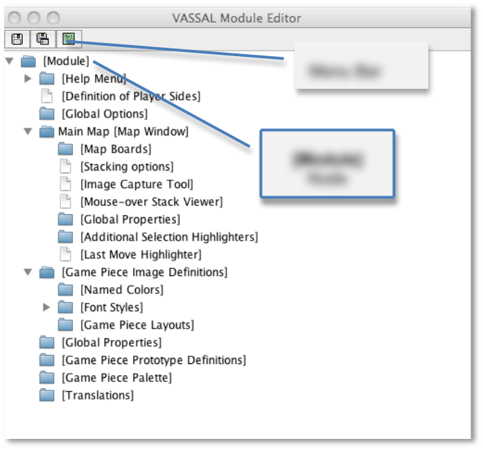

= The Module Editor

You're ready to begin building a module.

*What is a VASSAL Module?*

A VASSAL module is simply a set of compressed set of graphic, text, and other files, as well a descriptive file (called a Build File, and stored in XML format) that describes how the other files are expressed in play. A module file has the extension .vmod. There is no limit to the file size for a module, but modules intended to be published to the Vassalengine.org site may be up to 75 MB in size.

All of the files in a module are compressed using ZIP compression. As a result, anyone can examine or retrieve the files that comprise any module by simply unzipping the module, using any ZIP utility. (Unzipping a .vmod file is NOT necessary to play it.)

As VASSAL itself is open-source, so are VASSAL modules. Modules are freely editable in the Module Editor, even ones that have been created already. (VASSAL includes no native way to lock or encrypt a module, or otherwise prevent a module being opened in the Module Editor.)

_See_ Module File Structure__, on page 102, for more information on the BuildFile and other module files.__

*Module Creation Overview*

VASSAL is designed to be a toolkit for the creation of board games, and like any toolkit, is extremely flexible. As such, itʼs important to remember that there is no one right way to proceed when creating a module. The process given here is a guideline drawn from experienced designers. Two different designers who design modules for the same game in VASSAL are likely to produce very different results.

In general, a VASSAL module is not “coded” in the traditional sense. Because of the graphic user interface of the Module Editor, module creation does not require any programming skills. Someone with no programming experience can design a simple, functional module in a very short time.

However, VASSAL module creation can entail familiarity with particular programming _concepts_ , such as event sequencing, property comparison, manipulation of text strings, unit testing, and other related notions from the world of software development.

In general, the process of creating a new module follows these stages:

[upperalpha, start=9]
. *Basics:* Create the module and specify the basic settings. Choose the settings (and a board) for at least one map. Save the new module.

[upperalpha, start=35]
. *Development:* Create and define the moduleʼs other game boards, Game Pieces, and other controls required for game play. Additional controls can include turn counters, map buttons like Zoom and Overview, dice rollers, game charts, scenarios, or other components. (This stage will require the huge majority of development time, and may require multiple saves and restarts of the module to see your changes take effect.)

[upperalpha, start=61]
. *Testing:* Test your module. Check gameplay to make sure it works the way you want it to. Itʼs a good idea to play a few complete games to make sure you havenʼt left anything out. If not, return to Stage III and adjust whatʼs needed.

{empty}IV. *Publication:* Publish your module to the Vassalengine.org web site, or distribute it in some other method.

*Using the Module Editor*

The main utility for building modules is the Module Editor, an easy -to-use tool with a graphic interface. In the Module Editor, you specify each component, and can assign values, settings, and files to the component.

You install the Module Editor when you install VASSAL, along with the VASSAL Player, the Module Manager, the Extension Editor, and other tools. Youʼll be using the Module Editor in conjunction with the Module Manager. For complete VASSAL installation instructions and directions on how to use the Module Manager, consult the _VASSAL_ _Userʼs Guide._

The Module Editor looks and operates the same on all platforms: Windows, MacOS, Linux, and all other platforms.

== Launching the Module Editor

To launch the Module Editor, in the Module Manager, select *File | New Module.*

== The Module Editor Window

The Module Editor window includes a menu bar, a Toolbar, and Configuration window.

*The Menu Bar*

The Module Editor menu bar has the following menus:

* *File:* The File menu includes:

[loweralpha, start=15]
. *New Game:* Starts a new game with the open module.

[loweralpha, start=15]
. *Load Game:* Loads a saved game or log file.

[loweralpha, start=15]
. *Save Game:* Saves a game in .vsav format.

[loweralpha, start=15]
. *Close Game:* Closes the current game.

[loweralpha, start=15]
. *Begin Logfile:* Begins a log file in .vlog format.

[loweralpha, start=15]
. *End Logfile:* Closes an open log file in .vlog format.

[loweralpha, start=15]
. *Save:* Saves the current module.
[loweralpha, start=15]
.. ______________________________________________________
*Save As…:* Saves the current module under a new name.

* *Edit:* The Edit menu includes *Cut, Copy, Paste, Move, Properties,* and *Translate*. These duplicate the functions from the Configuration window. See _Configuration Window_, below, for more information.
* *Tools:* The *Tools* menu includes *Create Module Updater* and *Update Saved Games.*
* *Help:* The *Help* menu includes:
[loweralpha, start=16]
. *Help:* Displays VASSAL HTML help.

[loweralpha, start=15]
. *Userʼs Guide:* Shows the VASSAL User Guide (in PDF format)

[loweralpha, start=15]
. *Component Help:* Displays HTML help for the selected module component.

[loweralpha, start=15]
. *Quick Start:* Displays a short text file for VASSAL newbies.

[loweralpha, start=15]
. *About Module:* Displays the module splash screen, with information about the module name and version.

*The Module Editor Toolbar*

The Module Editor Toolbar includes the following buttons:

* *Save, Save As:* Duplicates the items of the same names on the menubar *File* menu. As with any other application, save your work often.
* *Help:* Click *Help* to display the VASSAL HTML help.

Menu Bar

*The Configuration Window*

Most of the effort of module creation is performed in the Configuration window. Any instructions given here refer to using the Configuration Window to create or configure module components.

The Configuration window browser displays the moduleʼs components as _nodes_, in a hierarchical tree view.

Each node displays a folder icon. Node types appear in brackets *[ ]*. The component name precedes the node type. For example, a node labeled *Japanese Units [Game Piece* *Palette]* would indicate a Game Piece Palette component named _Japanese Units._

Click the arrow next to each folder icon to toggle the expanded folder view and view the various sub -components of the folder. Click the arrow again to contract the node.

You can perform any the following operations on components by right clicking on the component node and selecting the operation from the menu.

*The Module Editor, showing the Configuration Window, Menu Bar, and default nodes for a new module.*

* *Properties:* Enables you to choose the settings for the selected component. For components that have already been created, you can access the *Properties* dialog by double-clicking on the selected component.
* *Translate:* Enables you to set translations for the component into a language of your choice. VASSAL is not localized; you must supply the translations for a given module component. See _Translations_ on page 104 for more information.
* *Help:* Displays the VASSAL online help for the component.
* *Delete:* Deletes the component. (There is no deletion confirmation prompt, so be careful.) You can also press the *Delete* key on your keyboard.
* *Cut:* Cuts the selected component pasting. A cut and paste will relocate the component. (Alternately, press Ctrl-X on your keyboard.)
* *Copy*: Copies the selected component for pasting. A copy and paste will make a new copy of the component. (Alternatively, press Ctrl-C/Cmd-C on your keyboard to Cut.)
* *Paste:* Pastes a copied or cut component. You can only paste a component to the appropriate place in the tree (like to like). For example, you could copy and paste a Game Piece from one palette to another palette, or to an At-Start Stack, but could not copy and paste the Game Piece to a Turn Counter. (Alternatively, press Ctrl-V/Cmd-V on your keyboard to Paste.)
* *Move:* Moves the component up and down in the tree view. Used to organize and order the components in a logical sequence. (Order of components in the Configuration Window will also determine the left-to-right Toolbar order of any buttons associated with the components. See page 89 for more information.) After selecting *Move*, you are presented with a dialog to specify a new location for the component in the tree view.
* *Add <Sub-Component>:* Many components include context menu, giving component-specific options, accessible through a right-click. For example, the context menu for a *[Map Window]* component includes a set of options allowing you to add map-specific components, such as a Line of Sight Thread. When created, new sub-components will be shown at the bottom of the list of the nodeʼs sub-components. (Some of these options may themselves have further options.)

== The [Module] Node

You create new module components by right clicking on the *[Module]* node, the topmost node in the Configuration Window. The node is labeled with the module name and contains all the other nodes.

Using the menu from this node, you can create any of the following new components:

* [.underline]#Action Button#
* [.underline]#Charts Window#
* [.underline]#Dice Button#
* [.underline]#Game Piece Inventory Window#
* [.underline]#Game Piece Palette#
* [.underline]#Game Piece Prototype Definition#
* [.underline]#Global Key Command#
* [.underline]#Imported Class#
* [.underline]#Map Window#
* [.underline]#Multi-Action Button#
* [.underline]#Notes Window#
* [.underline]#Player Hand#
* [.underline]#Pre-defined Setup#
* [.underline]#Private Window#
* [.underline]#Random Text Button#
* [.underline]#Symbolic Dice Button#
* [.underline]#Toolbar Menu#
* [.underline]#Turn Counter#

Each of these components is discussed in detail in later sections.

*Creating New Components*

When creating new components, create just a few of each type of component that you need, and test them first. If you find that you have made a mistake, or that you need to rework pieces or components, you will not have to go back and correct possibly many examples of the problematic components. For example, if you are creating Game Pieces, create a few Game Pieces first to make sure they function as you intend, and then create the others as needed. (Prototypes can make this process more efficient. See page 67 for more information.)

*Copy and Paste*

Copy and Paste can be an extremely useful tool when creating or editing a module, as it enables you to create similar components very quickly. Most components in a module can be duplicated by copy and paste. You can then edit the duplicate to create a similar component without having to adjust all the settings.

For example, you may need to create two Map Windows. Each will have similar attributes, differing only in the Board used for each. If you were to create each one individually, you would need to specify the attributes one at a time for each Map Window. However, you could create the first one, adjust the settings and options for the window to what you need, right-click to copy it, and then paste it into the Configuration Window. You could then adjust the settings for the pasted one to individualize it (such as including a new board graphic.) This would save a great deal of time.

The Module Editor will only permit pasting to the appropriate area of the Configuration Window: a Map Window must be pasted into the top-level node of the module, Game Pieces may only be pasted into Game Piece Palettes or At-Start Stacks, and so on.

_You cannot cut/copy and paste components between modules._

*Creating a New Module*

*To create a new module,*

. In the Module Manager, select *File | New Module*. The Module Editor opens with a new, empty module with a set of default nodes. In addition, the VASSAL Player loads the game so you can see your changes implemented.

*Saving a Module*

There are two types of saves.

* *Save:* As with any application, save your work as often as possible. Click the *Save* button in the menu bar to perform a save.
* *Save As:* Itʼs generally good practice to save renamed copies of your module periodically, as some modifications can be difficult to remove. Use the *Save As* button to save interim copies of your module, under a new filename, before making major edits to your module.

*Editing a Module*

After a module is created, you can save it at any time, and come back to work on it later

*To edit a module,*

. In the Module Manager, select the module you wish to edit and pick *Edit Module*. The Module Editor opens the selected module for editing.

When the Module Editor is open, the VASSAL Player will also load your game in Edit mode. This will enable you to test your module as you create it. Unlike an ordinary game, when in Edit mode, you will not need to log in to the module to test it in the Editor. In the Module Manager, pick *File | New Game* to start a game.

*Refreshing the Editor*

As you make changes to your module, many components you edit will reflect any changes you have made to them in real time.

You will be able to see immediately how the edited component looks or works in the VASSAL Player.

Some modifications, such as new board graphics, sound files, or changes to Prototype Definitions, may not be immediately reflected in the VASSAL Player. As well, the names of some components, such as Game Piece Palette tabs, Charts, and Irregular Grid Regions, may be truncated after you create them. This truncation is merely cosmetic. Any of these additions will require you to re-start the Editor in order for them to be displayed correctly in the VASSAL Player.

As a result, a good habit is to save your work, close, and then re-launch your module after you have made any major changes, particularly after adding or editing graphics files. Click *Save* , and then close the Configuration Window. In the Module Manager, right-click your module and pick *Edit Module* to re-load the module in the Module Editor. Any changes you have made to graphics or components should be fully functional after a restart.

_In some instances, you may edit a module but, frustratingly, the changes wonʼt show up even after you refresh the view._
_This can occur in games that load a Pre-Defined Setup at game start--changes to a module will not be reflected in a Predefined Setup. See page 110 for more information._

== Default Module Nodes

By default, a new module includes the following nodes. Not all of these nodes need be used in a given module.

* *[Module]:* Includes all other nodes, and used to create module-level components.
* *[Help Menu]:* Customize the module help menu.
* *[Definition of Player Sides]:* Define optional player Sides.
* *[Global Options]:* Define global module settings for all players.
* *Main Map [Map Window]:* The default Map Window, which usually contains the gameʼs main board. May be renamed, modified, or deleted. However, a module will usually include at least one Map Window.
* *[Game Piece Image Definitions]:* Create optional game image layouts.
* *[Global Properties]:* Define optional module-level Properties.
* *[Game Piece Prototype Definitions]:* Define optional module Prototypes.
* *[Game Piece Palette]:* The default Game Piece Palette for generating pieces.
* *[Translations]:* Configure text strings to translate your module.

You can now enter the moduleʼs basic settings.

*Module Basic Settings*

Module basic settings are displayed for the moduleʼs entry in the Module Manager.

*Game Name*

Name the module whatever you like. It should correspond to the name of the game. (The module name, which is displayed in the Module Manager, is distinct from the module filename.)

*Version Number*

Module version number is the number you assign to the current edition of the module. This must be a numeric value. Module Version Number serves these purposes:

* Helps the players to identify the module version they currently are using.
* Acts as a check to make sure that games are created with the same version of the module.
* Ensures the Saved Game Updater Tool can apply attributes from a game created with later version of the module to an earlier version.

*Description*

The module description is displayed for players in the Module Manager. The description should be brief—no more than a line or so.

*To set the module’s basic settings,*

. In the Configuration Window, double-click the *[Module]* node. (By default, this is labeled _Unnamed Module_, but the name will change after the module is saved.)
. In the dialog, enter values for *Game Name, Version Number* and *Description*.
. Click *Ok*.

== Suggested Module Filename Convention

When saving, choose a filename for the module. A suggested filename convention is <game name>_<version number>.vmod.

For example, clue_1.3.vmod, would indicate version 1.3 of a module for _Clue_.

Whatever filename you choose, it ʼs recommended to always include version number in the filename, so players can quickly tell which version of the game they have without having to open the file.

_Some older modules use .zip or .mod as a file extension. However, modules made for VASSAL 3.1 and later must always be given the extension .vmod._

== Next Steps

Now you can add other module components, like Map Windows, Game Pieces, and other items. Depending on the scope of your game, some of these components may be optional for your game. See the succeeding chapters for more information on these components.

