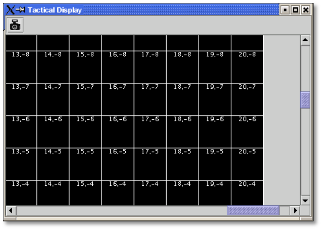
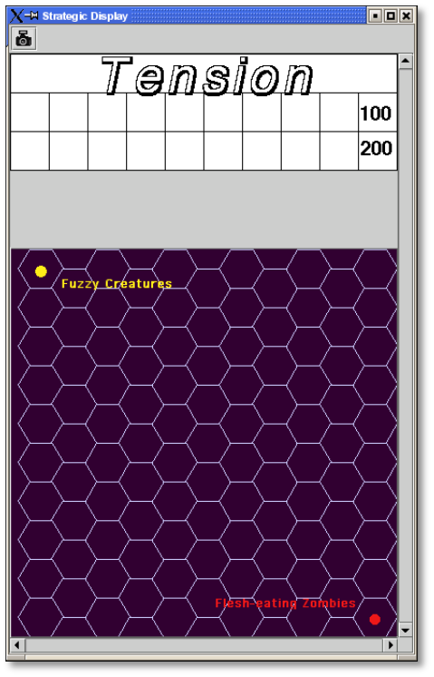
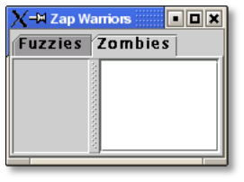

== Tutorials

Two tutorials are presented here, putting the module design process into practice.

*Board Game*

This tutorial explains the design of a module for a fictitious game called _Zap Wars_ , which depicts the epic struggle between a planet of heroic Fuzzy Creatures and their archenemies, the Flesh-Eating Zombies.

The imaginary _Zap Wars_ boxed set includes the following components:

* A strategic map for strategic movement between the Fuzzy and Zombie planets.
* A tactical map, where counters are moved to resolve battles. After the battle, counters are moved back to the strategic map. The tactical map is marked in a rectangular Grid to regulate movement. Units on the tactical map can maneuver and change their facing on the tactical map to any of the 4 sides of a Grid cell.
* A Tension Track, a space on the board where dramatic tension levels for each Side are recorded.
* Each Side can deploy an unlimited number of units (spacecraft and related forces).
* The Zombie units can enter an Undead state, which gives them some additional powers. In particular, all units in the Undead state can fire the dreaded Undeath Ray.
* The Zombie arsenal includes a unit called the Minefield, which can be placed in a hidden location on the map.
* Battles are resolved using 2 ten-sided dice (d10s).

All data for this tutorial can be found on the vassalengine.org wiki in the File:Zapwars.zip file.

=== Getting Started

Launch VASSAL. In the Module Manager, pick *File | New Module.* A new, empty module is created, shown here.

We right-click the *[Module]* node, and in the resulting dialog, enter the following:

* *Game Name:* _Zap Wars_
* *Version Number:* _1.0_
* *Description:* _Invasion of the Flesh-Eating Zombies!_

We can now begin creating the module.

=== Sides

Sides are usually optional when creating a module. However, in _Zap Wars_, it will be required: since some Zombie units will be hidden from the Fuzzy player (using the Invisible Trait), we want to ensure that the module can clearly distinguish between Sides.

* Double-click *Definition of Player Sides.*
* Enter _Fuzzy_ and click *Add*, then enter _Zombies_ and click *Add*.
* Click *Ok*.

Now when the game begins, each player will be prompted to select one of these Sides to play as.

=== Maps, Boards, and Grids

The two maps in _Zap Wars_ will each be represented by a different Map Window.

*The Tactical Display*

The new Zap Wars module comes with one Map Window by default, and we will make this the Tactical map.

*Map Window*

In the Configuration Window, double-click the *[Map Window]* node.

* Give the map a horizontal and vertical padding of 150 pixels each. This gives the window some blank space around the Grid where players can line up their reinforcing ships before they join the battle.
* The map will have a solid black board, so we should choose a different border color for highlighting selected pieces. Next to *Border for selected counters*, click the color selector and choose a bright green color.
* The Tactical map isn't the main playing area. It's only needed when the strategic situation dictates a battle. So we'll check the *Include Toolbar button to show/hide option*. Type _Tactical_ for the *Toolbar Button Name*. Place your cursor in the *Hotkey* field and press (together) Ctrl-SHIFT-T on your keyboard. Now notice that the main control window has a *Tactical* button. When you start a game, the button will become enabled and pressing Ctrl-SHIFT-T will bring up the Tactical window.

*Board:* A Map Window requires one of more Boards, so we need to create a Board for our new window. Open the new *Tactical Display [Map Window ]* component.

* Right-click on the *[Map Boards]* node and select *Add Board*. Name the board *Tactical Grid.*
* We'll want the Grid to be 41x41 square with each square being 50 pixels on a Side. We need one extra pixel to draw the complete Grid, so choose 2051x2051 as the size. (We will add the actual Grid shortly.)
* In *Background color*, click the color selector and set the background color to black.

*Grid:* _Zap Wars_ needs a Grid to regulate movement. Rather than constructing a map cell-by-cell, VASSAL defines a complete board and then imposes a Grid on top of it.

Expand the *[Map Boards]* node, right-click on the Tactical Grid component and select *Add Rectangular* *Grid*. Choose 50 for the width/height and 25 for the x/y offset. Check the *Show Grid* box; then click the color selector and pick white.

Finally, we can assign a numbering scheme to the Grid. Right- click on the *[Rectangular Grid]* component and select *Add Grid Numbering*. The numbering dialog gives you many options for assigning a numbering scheme to the Grid. The numbering scheme is used when reporting the movement of units, but it can also be drawn directly on the Grid. In _Zap Wars,_ the tactical Grid cells are numbered x,y with 0,0 in the center. We choose ',' for the separator, -20 for the horizontal/vertical starting number, 0 leading zeros, and Numerical (as opposed to Alphabetic) numbering.

Check the *Draw Numbering* box and select white for the color.

Congratulations! You've defined your first VASSAL Map Window.

Now select *File | New Game* in the controls window. The *Tactical* button becomes highlighted, and clicking it will show the Tactical Display window. The window has a Toolbar with the Image Capture tool. Clicking this would let you capture the entire map to a graphics file in PNG format. (A simple screen capture wouldn't do, since the map is probably too big to fit entirely on your screen.)

It would be a good idea to save your module at this point before continuing. On the Configuration Window Toolbar, click *Save*, and save your module as _zapwars_1.0.vmod._

=== The Strategic Display

The main playing area for _Zap Wars_ is the strategic map, plus a Tension track. For both of these, we'll use pre-defined artwork. The ZapWarsData folder contains a Strategic.gif and a TensionTrack file.

In the Configuration Window, right-click on the *Zap Wars [Module]* node and select *Add Map Window.*

*Map Window*

Name the window _Strategic Display_. As you did earlier, set the border highlight color to green. This time, we'll leave the *Include Toolbar* button unchecked. This will cause the Strategic Display window to always be visible during a game. We'll also check the *Can contain multiple boards* box.

*Boards*

The Strategic map and Tension Track will each be a separate board that is combined in the window.

* Expand the Strategic Display Map Window node, right-click on the Map Boards component, and select *Add Board*.

* For Board Name, enter _Strategic Map._
* For board image, click *Select* and select the Strategic.gif file.
* Repeat the process for the second board and the TensionTrack.gif file.

*Grids:* The Strategic and Tension Track boards have map Grids included in their artwork. We will still add Grids to them to regulate placement of units, but the VASSAL-imposed Grid will be invisible.

* The Strategic board Grid takes a hex Grid with x offset 33, y offset 22, hex height 40.
* The Tension Track takes a rectangular Grid with x/y offset 20 and width/height 40.

In practice, you'll want to follow the guidelines for aligning a Grid given on page 35.

*Board Placement:* In the Strategic Display Map Window, the Tension Track should go above the Strategic Map.

* Double-click on the *[Map Boards]* component of the Strategic Display component and click *Select Default Board Setup.* A dialog is presented for arranging the boards in the window.
* Click *Add Row* to place two boards on top of one another. In the top slot, select the Tension Track board from the drop-down menu, and select the Strategic board in the second slot.

That completes the definition of the maps in our Zap Wars module. During play, players will drag pieces from the Strategic display to the Tactical display to complete their battles, then drag them back to the Strategic display when finished.

=== Counters

We need a way to generate Game Pieces for the game, so we will a Game Piece Palette. (You'll find artwork for the counters in the ZapWarsData folder.)

*Game Piece Palette Structure*: By default, each module is configured with a single Game Piece Palette. First, we'll define its basic structure of the Game Piece Palette. We'll create two tabs: one for each Side, the Fuzzy Creatures and the Flesh-Eating Zombies. The Fuzzies tab will have two different pieces while the Zombies tab will have a scrollable list of different pieces.

* Double-click on the *[Game Piece Palette]* component and enter _Zed Warriors_ for *Name* and for *Button Text.* This will be the name of the window containing the pieces. Enter
* Right-click on the Zap Warriors Palette and select **Add Tabbed Pane**l. For Name, enter _Counters_.
* Right-click on the new Counters Tabbed Panel component and select *Add Panel.*
* Set the *Name* to _Fuzzies_ and the *Number of Columns* to _2._
* Right-click again on the Tabbed Panel and select *Add Scrollable List*. Name the list _Zombies._

Click the *Zed Warriors* button in the Main Controls Toolbar to see the new palette window. We can now add Game Pieces to the Palette.

*Basic Piece*

The simplest possible Game Piece in VASSAL consists of a single image. We need to create a unit called Fuzzy Base.

* Right-click on the *Fuzzies [Panel]* component and select *Add Single Piece*. You'll be presented with the Properties dialog for adding Traits to a Game Piece.

* Double-click on _Basic Piece_ in the *Current Traits* list on the right.
* Set the *Name* to _Base_.
* Double-click on the indicated area on the left Side of the dialog, and select FuzzyBase.gif from the tutorial directory. Now click *Ok*. You'll see the new piece appear in the Fuzzies tab. (The FuzzyBase.gif image uses transparency to give it a shape other than a square.)

*Traits*

You can customize the behavior of your pieces by selecting Traits for them.

*Delete:* We should to add the Delete Trait to the new Fuzzy Base unit, or counters wonʼt be able to be deleted from the game after creation.

In the *Fuzzies [Panel]* node, double-click the new Fuzzy Base piece. In the *Available Traits* list, pick _Delete_ and click *Add*. The Trait is defined with a default name and default keyboard shortcut. Click *Ok*.

*Rotation:* One of the most common Traits is the ability to rotate. In the Fuzzy counter mix, bases canʼt rotate, but warships can. We will create a Warship piece to use this Trait now.

* Right-click on the *Fuzzies [Panel]* node and select *Add Single Piece* again. Set the name to _Warship_. Select FuzzyShip.gif as the base image and click *Ok*.
* Now, from the *Available Traits* list, select Can Rotate and click *Add* to add the Trait to the *Current Traits* list.
* The Can Rotate dialog is now shown. For *Number of Allowable Facings,* enter 4 (which will enable each Warship to rotate up, down, left or right.)

We also add Delete to the Fuzzy Warship as we did for the base.

* You can test your counters without having to drag them onto a map. In the main piece definition dialog, you can right-click on the counter at the top of the window to bring up the piece's popup menu, or select the piece and type. You can do the same with the piece in the Game Piece Palette. When you select the Fuzzy warship and type Ctrl-] and Ctrl-[, the piece will rotate clockwise and counterclockwise.

This completes the creation of the Fuzzy units. Now we want to create the Zombie base and Zombie Minefield.

*Layers:* Layers are the most common way of adding functionality to a Game Piece. A Layer is a set of images drawn on top of the basic piece. The user can toggle the images on and off, and cycle through them with key commands.

The Zombie base has two states: normal and Undead.

* Right-click on the *Zombies [Scrollable List]* component and select *Add Single Piece*.
* For *Name*, enter _Zombie Base_, but do not select an image.
* Select Layer from the Available Traits and click *Add*.
* Each image that can be cycled through in a Layer is called a Level. We need two levels: one for each state. One of the two levels will always be drawn, so select *Always active*.
* Pick ZombieBase.gif for Image 1, and then click the *Add Level* button.
* Select ZombieBaseUndead.gif for Image 2.
* The *Increase/Decrease* commands are what the players use to cycle through the levels. Since there are only two levels, we don't need both commands. Change the *Increase* command to _Undead_ and the key to Ctrl-U. Now when players select a Zombie base and click Ctrl-U, the base will toggle between its normal and Undead states. If we set the name of level 2 to _Undead_ and check the *is prefix* button, then when the Undead level is activated, the name of the piece (used in auto-reporting moves) will be _Undead Zombie Base_ rather than simply _Zombie Base._

*Advanced Layers:* When a Zombie unit is in its Undead state, it can activate its Undeath Ray, directed either up, down, or to either Side. We'll add a second Layer to the Zombie Base to represent the Undeath Ray.

* Select Layer again from the list of Available Traits and click *Add*.
* Give the Layer four levels using the images RayN.gif, RayE.gif, RayS.gif, and RayW.gif. Note that these images also use transparency to offset the depiction from the center of the counter.

* The *Increase/Decrease* commands will change the facing of the ray. Set the *Increase* command name to _Rotate Ray CW_ and the *Decrease* command name to _Rotate Ray CCW_. (Set the hotkeys for these commands to Ctrl-X/Ctrl-Z so as not to conflict with the commands to rotate the ship.)

*Copy/Paste:* The Zombie Warship is similar to the Base, except that the ship can change facing. You can save a lot of time defining counter by using the Copy/Paste commands in the Configuration Window.

* Right-click on the Zombie Base component and select *Copy*, and then right-click on the *Zombies [Scrollable* *List]* component and select *Paste*. Now we need only edit the copy and change a few things.
* Edit the Basic Piece Properties and change the name to _Zombie Warship_.
* Edit the Properties of the first Layer: select *Image 1*, double-click on the image, and select the ZombieWarship.gif file.

*Partial Rotation:* The order of Traits in a Game Piece is important. Generally, a Trait can modify only those other Traits that appear before (above) it in the list of Current Traits.

* Edit the Zombie Warship and add a Can Rotate Trait.
* Then select it, and click the *Move Up* button until the Trait is between the two Layer Traits. This will make the Zombie Warship depiction rotate without making the Undeath Ray depiction rotate.

*Invisibility and Masking:* The Invisible Trait enables a player to completely hide a counter from another player. The Mask Trait allows one player to hide details of a counter from another player. The Zombie Minefield will make use of both of these Traits.

* Add another Single Piece to the Zombies Scrollable List.
* Leave the Basic Piece image blank and set the name to _Minefield_.
* Add a Layer with 3 levels, using the mine6.gif, mine8.gif, and mine12.gif images.
* Add a Mask Trait. Set the Mask command to _Reveal_ and the keyboard shortcut to Ctrl-R.
* Set the *View When Masked* to the mine.gif image. The Fuzzy player will see only this image until the minefield is revealed. The display option determines how the Zombie player will see the counter. We'll select the _Inset_ style, which displays the masked image in the upper left corner as a reminder to the Zombie player that the piece is not revealed.
* Finally, add the Invisible Trait. Under *Can Be Hidden By*, select _Any of the Specified Sides_. Enter _Zombies_ and click *Add*. When activated, the counter will be completely invisible to the Fuzzy player. The zombie player will see a transparent version of the piece against a colored background. Select black for the background color. The Zombie player can make the piece invisible and masked in the Game Piece Palette before dragging it onto the map.

=== Prototypes

Prototypes are a way of allowing many pieces to share a common set of Traits. In _Zap Wars_, every Zombie unit has the Undeath Ray capability. While Copy/Paste can be used to create the units initially, it can be difficult to manage if the module author later decides to make some alteration that affects many different pieces.

* Right-click on the *[Game Piece Prototype Definition]* node and select *Add Definition.* The dialog for defining a Prototype is the same as the one for defining a Game Piece, but with a name, and without the Basic Piece.
* Define an Undeath Ray layer just as it exists in the Zombie Base and Warship. (You can create this as you did earlier, or you actually open the Zombie Base unit, copy the existing Undeath Ray layer, and then paste it into the dialog for the Prototype.)
* Name the Prototype Definition _Zombie_.
* Edit the Zombie Base and Warship and replace the Undeath Ray layer with a Prototype Trait, using the name _Zombie_.

Now other ship types may be added that use the same prototype. The Undeath Ray layer can be adjusted later, affecting all of the units at once. Furthermore, a new Trait may be added to all pieces at once by simply adding the new Trait to the Prototype definition.

=== Dice Button

We need to add a Dice Button so we can resolve battles. Right-click the *Zap Wars [Module]* node and pick *Add Dice* *Button.* We change the *Name* and *Button Text* to _2d10_. In *Number of Sides Per Die*, we enter 10. Because the results of each individual die donʼt matter, we select *Report Total.*

A button labeled 2d10 is now shown in the Main Controls Toolbar. Clicking it will return the total of a 2d10 roll.

_Not all component changes are refreshed in real time. Itʼs a good idea to restart the Module Editor after making major changes to your module, so you can see the changes implemented._

=== Next Steps

The _Zap Wars_ module is well underway now. We can continue to add components to refine the game. Perhaps a Zoom Tool for the strategic display will help view the map better and more clearly. A Line of Sight Thread would be helpful to quickly measure distances on the Tactical display. Experiment until youʼve created the _Zap Wars_ module to your liking.

== Card Game

Besides traditional board games, VASSAL can be used to play card-based games, or games that are mixes of both card and board game. In this tutorial, we will go through the steps for making a VASSAL module for a pure card game called _Raj_.

_Raj_ is a bidding game for up to 4 players. Each player maintains a hand of Cards with values from 1 to 15, and bids for a set of tiles that are revealed one at a time.

Data for this module is in the File:Raj.zip file.

=== Getting Started

Launch VASSAL. In the Module Manager, pick *File | New Module.* A new, empty module is created, shown here.

We right-click the *[Module]* node, and in the resulting dialog, enter the following:

* *Game Name:* _Raj_
* *Version Number:* _1.0_
* *Description:* _A Bidding Card Game_

We can now begin creating the module.

=== Sides

To keep Cards clear, we need to specify what Sides are available for players in the game.

* Right-click the *[Definition of Available Sides]* node.
* In the box, type _Red_, and click *Add*. Do the same for _Green, Blue_, and _Purple_.

When players load a saved game or join one on the live server, they'll be prompted which Side they want to take, or whether they just want to be an observer.

=== Boards

We will make one Map Window for the main playing area: this will be where the tiles are revealed and each playerʼs bid Cards are placed. In addition, we will make one window for each player to hold his current hand of Cards in.

*The Playing Area*

Since each module begins with a Map Window by default, we'll make that one into the playing area.

* Double-click on the *[Map Window]* node. For *Map Name*, enter _Playing Area_. You can leave the other settings at their default values for now.

Now weʼll make the playing area blank, but with a definite size.

* Right-click on the *[Map Boards]* node and select *Add Board.*

* In *Board Name*, enter _Playing Area_. Set board width and height to 800x800. In *Background color,* click the color selector and pick a gray or light blue color.

*Windows for Player Hands*

Now for each Side, we'll create a window for that player's hand of Cards.

* Right-click on the *[Module]* node and select *Add Player Hand.*
* Under *Belongs to Side*, enter _Red_, and then click *Add*. Only the Red player will be able to access the contents of this window.
* In *Map Name*, enter _Redʼs Hand._
* Leave the *Visible to Other Players* box unchecked. This will mean that other players won't even see the window.
* Leave the rest of the fields blank. It's possible to give these windows an image for a background by specifying a board, but we'll simply leave the background blank. Click *Ok*.

You can use the Redʼs Hand window to quickly create the windows for the other players.

* Right-click the *Redʼs Hand [Player Hand]* node and pick *Copy*.
* Select the *[Module]* node, right-click, and pick *Paste*. Repeat this two more times, for a total of four *[Private* *Hand]* nodes.
* Double-click one of the copies. Under *Belongs to Side*, Red is listed to the right. Select Red and click *Remove*. Now enter _Green_ in the text box and click *Add*. Green will now be able to access this window.
* In *Map Name*, enter _Greenʼs Hand_, and then click *Ok*.
* Repeat these steps for Blue and Purple.

=== Making the Cards

VASSAL board games draw counters from the Game Piece Palette, with an unlimited supply of each counter. This is not appropriate for Card games. Right-click on the *[Game Piece Palette]* node and pick delete to remove it from your Raj module.

Decks of Cards must be added to a Map Window. Cards added to a Deck in the Configuration Window will be in the Deck when a game is begun. Players click on a Deck to drag the top Card to their hands or a playing area. Right-clicking on a Deck lets players turn it face-up or face-down, shuffle it, or reverse the order of Cards in it.

For this module we will create one Deck that contains the tiles the players are bidding for and one Deck for each player's set of Cards.

* The Deck of tiles goes in the middle of the playing area. Right-click on the *Playing Area [Map Window]* map node and select *Add Deck.*
* For *Name*, enter _Tiles_.
* For *X Position* and *Y Position*, use _400_ and _400_, which will put the Deck in the center of the Playing Area.
* Put the *Tile Deck* in the middle of the map, at X Position 400,400.
* The *Width/Height* of the Deck is only used when the Deck is empty, so that players can place Cards back into the Deck. We'll use the size of one of our tiles, 70x94.
* Click *Ok*.

Now right-click on the *Tiles [Deck]* node and select *Add Card* to add the first Card to the Deck.

Cards in VASSAL are built the same way as counters. The simplest Card is a Basic Piece with the Mask Trait. The image of the Basic Piece will be the front of the Card and the image for the Mask will be the reverse of the Card.

* Two Traits are listed under Current Traits: Basic Piece and Mask.
* Double-click _Basic Piece_. For the *Name*, enter Card 1. Double-click on the left Side of the dialog, and browse to the tile1.gif image in the rajData directory. Click *Ok*. You have now defined the name and the front image for the Card.

* Double-click _Mask._ In *Display Style*, pick _Background_. For *View When Masked*, double-click the white area and browse to tileBack.gif in the rajData directory. Click *Ok*. This defines the Card back.
* If we needed more features for our Cards, such as the ability to rotate them Sideways or place markers on them, that could be done by adding more Traits. They would go above the Mask Trait if you wanted them to only show when the Card is face up. However, we only need simple Cards for this tutorial.
* Now right-click on the Tile you just made and pick *Copy*. Then, on the *[Deck]* node, click *Paste*. This will make a copy of the first Card.
* Double-click the copy. In Basic Piece, change the name to Card 2, and pick tile2.gif for the Card front.
* Repeat for each of the other 13 tiles (15 in all).

Now you are ready to create each playerʼs Deck. For the tiles we needed a different image for every Card. We can save some steps when creating the players' Decks. The players' Cards are simply numbered 1-15 on the front, so we'll use a Text Label Trait to write the number on a common background image.

Right-click on the *Playing Area [Map Window]* node to create another Deck.

* We'll name this Deck _Redʼs Cards_ and put it at 400,150 with size 150x240.
* Right-click to add a new Card. Use FrontRed.gif for the front and RedBack.gif for the back.
* Now select _Text Label_ from the list of *Available Traits* and click *Add*. This will be a permanent label, not changeable during the game, so set the *Text* to _1_ and make the *Menu Command* blank.
* Set the *Font Size* to 52. Set the *Text Color* to black and the *Background Color* to white.
* Set the vertical and horizontal position and the vertical and horizontal justifications all to _Center_. Click *Ok*.
* Now with the Text Label selected in the list of Current Traits on the right, click *Move Up* until the Text Label Trait is above the Mask Trait. This will ensure that the number is not showing when the Card is face down.
* Now right-click on the Card you just made and pick *Copy*. Then, on the *Redʼs Cards [Deck]* node, click *Paste*. This will make a copy of the first Card.
* Double-click the copy. Edit the Text Label Trait and change the text of the label from 1 to 2.
* Repeat the *Copy/Paste/Edit* process for each of the other 13 tiles (15 in all).

Having made the Red Deck, the others follow quickly.

* Right-click on the *Redʼs Cards [Deck]* node and pick *Copy*. Select the *[Module]* node and pick *Paste*. This copy will become the Green Deck.
* Double-click on the copied Deck. Set its Name to *Greenʼs Cards*, and set its position to 700,400.
* VASSAL provides a convenient feature to edit many pieces at once. Right-click on the Green Deck and select *Edit All Contained Pieces*. You'll see the Properties window for the first Card, but all changes you make to Traits in this window will apply to all Cards in the Deck. For the Mask Trait, set the front image to FrontGreen.gif and the back to GreenBack.gif.
* Repeat the *Copy/Paste/Edit* process for the Blue and Purple Decks.

=== During Play

To play, one of the players turns the first tile in the Deck face up. Then each player selects a Card from his hand, turns it face down, and drags it to the playing area. All players then reveal their Cards simultaneously. The highest Card wins the tile, but Cards of the same value cancel each other out.

For example, the players play 12, 6, 8, and 12. The 12s cancel, so the 8 wins. The playing buying the tile moves it to his area in the playing area and the used Cards are deleted. After all tiles have been bought, the player with the highest tile total wins.
