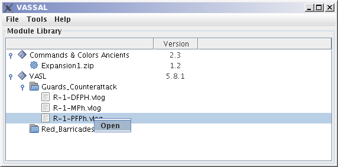
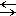

== The VASSAL Engine

https://vassalengine.org/[https://vassalengine.org]

== Overview

VASSAL is a general-purpose engine for building online versions of traditional turn-based games.
To play a game using VASSAL, you must first have a module for that game.
Many modules are available for download on the https://vassalengine.org/wiki/Category:Modules[VASSAL Modules page], although a module need not be hosted on the web site to be playable.

== Quick Start

For an overview of VASSAL's capabilities, select Help->Take the Tour, and step through the tour by hitting the  Step Forward button.

To play a game, download a VASSAL module file to your computer. Select File->Open Module and choose the downloaded module. This will open a controls window for the game. Start a new game or load a saved game by using the File menu of the controls window. Some modules come with optional extensions, which can be downloaded separately. To enable an extension, right-click (Mac users: Command-click) on the module in the Module Library window, choose Add Extension and select the downloaded extension. +

You can also specify any number of directories containing saved games and load those games directly from the Module Library window. +
 +
From the Module Library's File menu, you can edit any module or extension, or create new ones from scratch. You can also import modules created by Aide de Camp 2 (support for other formats is planned for the future). +
 +
Select Tools->Server Status to see what games are being played on the live server. To connect to the server, load a module and hit the      Connect button. To chat with other players, double-click on the room with those players. To begin playing, one player must start a game from the File menu. The other player right-clicks on the first player's name in the server controls and selects Synchronize. +
 +
VASSAL supports languages other than English. To change your preferred language, open any module, choose File->Preferences and select your language from the drop-down menu in the General tab. If your language is not listed, you can help provide a translation by selecting Tools->Translate VASSAL User Interface. Further details are given link:ReferenceManual/Translations.htm[here].

== Further Documentation

Online documentation is available on the https://vassalengine.org/wiki[wiki].

* The https://vassalengine.org/wiki/Getting_Started[Getting Started Guide] has instructions on how to load and play games online using VASSAL
* The <<ReferenceManual/index.adoc#toc,Reference Manual>> has detailed instructions on how to build modules for VASSAL, including how to use its Java programming interface
* See the <<versionHistory.adoc#vassal_version_history,version history>> for a list of recent changes.

'''''

== License

The VASSAL Engine is supported by an https://github.com/vassalengine/vassal[open-source project] founded and administered by Rodney Kinney and distributed under the GNU Library General Public License (LGPL). This distribution includes a number of third-party binary libraries, distributed under terms of their respective licenses. Artwork and other media contained in module files are the property of their respective owners. The VASSAL web site administrators will comply with any request to remove copyrighted material from the web site.

'''''

Enjoy!

rk

image:images/Splash.png[logo] +
