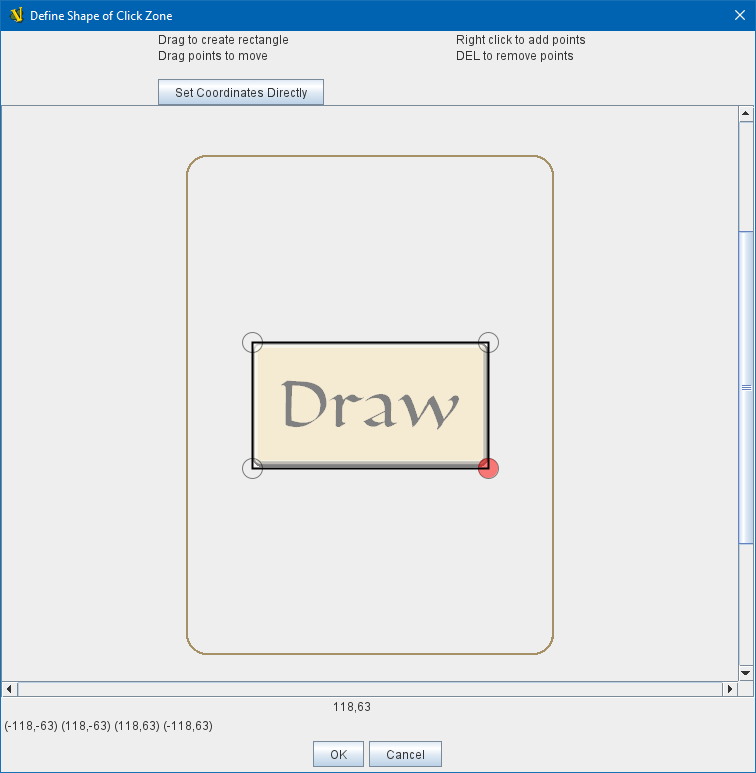

== VASSAL Reference Manual
[#top]

[.small]#<<index.adoc#toc,Home>> > <<GameModule.adoc#top,Module>> > <<PieceWindow.adoc#top,Game Piece Palette>> > <<GamePiece.adoc#top,Game Piece>> > *Action Button*#

'''''

=== Action Button

This trait allows you to place a virtual button within your piece.
Clicking within the specified rectangular region on the piece will cause the specified Key Command to be sent to your piece as if it had been selected from the right-click menu.

This trait does not alter the way a piece is drawn, so the <<BasicPiece.adoc#top,Basic Piece>> or a <<Layer.adoc#top,Layer>> should supply a visual cue to the player that the button exists.

To make a button that can be activated and deactivated, combine an Action Button with a <<Layer.adoc#top,Layer>> and a <<TriggerAction.adoc#top,Trigger Action>>.

*Example* +
A piece representing a spaceship has a self-destruct action that can only be activated when the energy reaches the minimum level.
A Layer named __Energy__ is used to represent the energy.
The image for the lowest level of the layer adds an icon for a self-destruct button.
An Action Button trait uses the boundaries of the button icon and invokes _Ctrl+Alt+T_.
A <<TriggerAction.adoc#top,Trigger Action>> trait watches for _Ctrl+Alt+T_ and invokes the keyboard command for self-destruct when the properties match _{ Energy_Level == 1 }_.

[width="100%",cols="50%a,^50%a",]
|===
|*Desription:*:: A short description of the button for your own reference.

*Invoke key command:*::  The key command to be invoked.
Can be a traditional Keystroke Command such as _Ctrl+C_ or a Named Command such as _PressedButton_.
See <<NamedKeyCommand.adoc#top,KeyStroke and Named Commands>>.

*Invoke context menu:*:: Checking this box causes the piece's context menu (aka right-click menu) to open when the action button is clicked.

*Clicking anywhere on piece activates action button:*:: Checking this box means that a click anywhere on the piece will cause the action button to fire off its keystroke. Effectively it turns the whole piece into a button. If you use this option you do not need to manually define the hotspot boundaries for the button.

*Define Shape of Click Zone:*:: Clicking this button brings up a window in which you can manually define the boundaries of the click zone (hot spot) for the action button. Any available art for your piece will be displayed, or a crosshairs over the origin 0,0 will be shown otherwise. Polygons of any appropriate shape can be defined. You can add vertices by right+clicking, and you can select vertices and moves them around. You can delete a vertex by selecting it and pressing the delete key.

|image:images/ActionButton.png[]
_Configuring an Action Button_

_Defining the position of the Action Button hotspot manually_

|===
