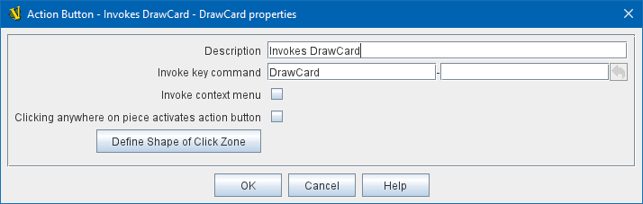

== VASSAL Reference Manual
[#top]

[.small]#<<index.adoc#toc,Home>> > <<GameModule.adoc#top,Module>> > <<PieceWindow.adoc#top,Game Piece Palette>> > <<GamePiece.adoc#top,Game Piece>> > *Action Button*#

'''''

=== Action Button

[width="100%",cols="50%,50%",]
|===
|This trait allows you to place a virtual button within your piece.
Clicking within the specified rectangular region on the piece will invoke an action just as if the corresponding key command had been sent.

*Invoke Key Command:*  The key command to be invoked.
Can be a traditional key stroke such as _Ctrl+C_ or a Named Key Command such as _PressedButton_.
See <<NamedKeyCommand.adoc#top,Key Commands and Named Key Commands>>

*Button X-offset:*  The horizontal position of the upper-left corner of the rectangle, in pixels from the center of the piece.
Negative numbers are toward the left.
(*Example:* for a piece 40 pixels wide, you'd want an offset of -20 to have the clickable area overlay the piece properly).

*Button Y-offset:*  The vertical position of the upper-left corner of the rectangle, in pixels from the center of the piece.
Negative numbers are toward the top.

*Button Width:*  The width in pixels of the button.

*Button Height:*  The height in pixels of the button.

This trait does not alter the way a piece is drawn, so the <<BasicPiece.adoc#top,Basic Piece>> or a <<Layer.adoc#top,Layer>> should supply a visual cue to the player that the button exists.

To make a button that can be activated and deactivated, combine an Action Button with a <<Layer.adoc#top,Layer>> and a <<TriggerAction.adoc#top,Trigger Action>>.

*EXAMPLE*:  A piece representing a spaceship has a self-destruct action that can only be activated when the energy reaches the minimum level.
A Layer named __Energy__is used to represent the energy.
The image for the lowest level of the layer adds an icon for a self-destruct button.
An Action Button trait uses the boundaries of the button icon and invokes _Ctrl+Alt+T_.
A <<TriggerAction.adoc#top,Trigger Action>> trait watches for _Ctrl+Alt+T_ and invokes the keyboard command for self-destruct when the properties match _{ Energy_Level == 1 }_.

|

40x40 pixel button that triggers a Ctrl+A

|===
