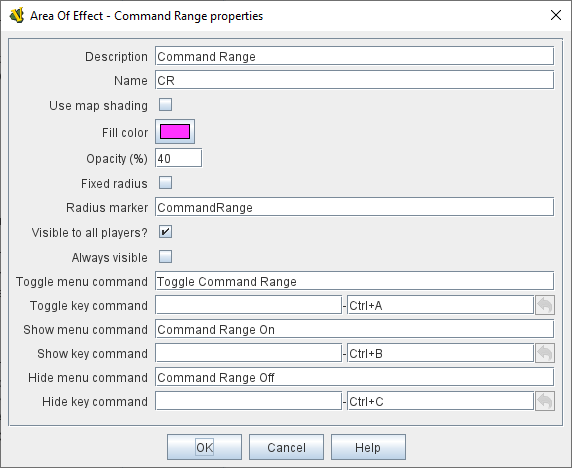

== VASSAL Reference Manual
[#top]

[.small]#<<index.adoc#toc,Home>> > <<GameModule.adoc#top,Module>> > <<PieceWindow.adoc#top,Game Piece Palette>> > <<GamePiece.adoc#top,Game Piece>> > *Area of Effect*#

'''''

=== Area of Effect Trait

The _Area of Effect_ trait allows you to graphically highlight an area surrounding a game piece.
The area is shaded with a specified color and transparency.
Alternatively, you can point to a <<Map.adoc#MapShading,Map Shading>> component, contributing to the area that it draws.

The size of the shaded area can be fixed, or dynamic based on the values of a <<Properties.adoc#top,Property>>. The shading can be set to be always visible, or can be turned on and off by Commands. The shading can also be defined to be visible to all players, or just the player who turns it on.

[width="100%",cols="50%a,^50%a",]
|===
|*Description:*:: A short description of this trait for your own reference.

*Use map shading:*:: If selected, then the area of this trait will be added to the area drawn by the named <<Map.adoc#MapShading,Map Shading>> component (or subtracted from that area if it is of type _Background_). If not selected, then each piece with this trait will draw its own area, with overlapping areas shaded darker.

*Use map shading:*:: A short name that will be used to define a <<Properties.adoc#top,Property>> that exposes the current visibility of the shaded area. The name should not contain spaces or punctuation marks. The name of the property defined will be the _<name>_Active_ where <name> is the text entered in this field.

*Fill color:*:: The color of the area.

*Opacity:*:: The opacity of the area.
100% is completely opaque.
0% is completely transparent.

*Fixed radius:*:: If checked, then the shaded area will always be the same size, defined in the _Radius_ field. If unchecked then the size of the shaded area will be determined by the value of the marker named in the _Radius marker_ field.
+
If the piece is on a board with a <<RectangularGrid.adoc#top,Rectangular Grid>> or <<HexGrid.adoc#top,Hex Grid>>, this distance is in grid units and the shaded area will conform to the grid.
Otherwise, it will be a circle with the given radius in pixels.

*Radius:*:: Distance, in local grid units, from the game piece that will be highlighted when the _Fixed range_ option is selected.

*Radius marker:*:: The name of a <<Properties.adoc#top,Property>> that defines the size of the shaded area when the _Fixed range_ option is not selected.

*Visible to all players:*:: When selected, the shading will be seen by all players.
+
When not selected, only the player using the Area of Effect will see the shading.

NOTE: A single Area of Effect can only be locally visible, or visible to all players, it cannot change between the two.

*Always visible:*:: If selected, the area is always highlighted when the piece is drawn on a Map and no Key Commands can be configured.

*Toggle menu command:*:: If not always visible, this is the context menu command ("right-click menu") to flip the visibility of the highlighted area.

*Toggle key command:*:: If not always visible, the <<NamedKeyCommand.adoc#top,KeyStroke or Named Command>> to flip the visibility of the highlighted area.

*Show menu command:*:: Right-click menu command to show the highlighted area.

*Show key command:*::  <<NamedKeyCommand.adoc#top,KeyStroke or Named Command>> to show the highlighted area.

*Hide menu command:*:: Right-click menu command to hide the highlighted area.

*Hide key command:*::  <<NamedKeyCommand.adoc#top,KeyStroke or Named Command>> to hide the highlighted area.

|
image:images/AreaOfEffect.png[] +
_A 1 hex radius, Purple, 40% Area of Effect._

image:images/AreaOfEffectSample2.png[] +
_Area of Effect applied to a VASL FFE counter.
(Purple, 40%, 1)._

image:images/AreaOfEffectSample1.png[] +
_Area of Effect applied to a Flat Top cloud counter.
(Gray, 20%, 2)._

 +
_Area of Effect that can be turned on and off._
|===

[#Properties]
An Area of Effect defines the following <<Properties.adoc#top,Property>>.  In the name of the property, _<trait_name>_ is the name entered into the _Name_ field of the trait.

* _<trait_name>_Active_ returns _true_ if the Area of Effect is currently visible, _false_ otherwise
