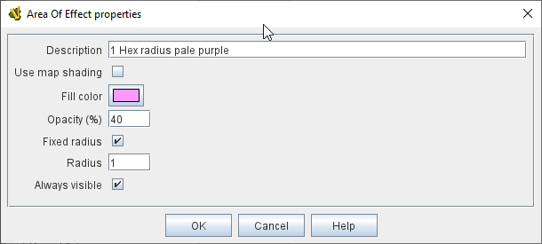

== VASSAL Reference Manual
[#top]

[.small]#<<index.adoc#toc,Home>> > <<GameModule.adoc#top,Module>> > <<PieceWindow.adoc#top,Game Piece Palette>> > <<GamePiece.adoc#top,Game Piece>> > *Area of Effect*#

'''''

=== Area of Effect Trait

The _Area of Effect_ trait allows you to graphically highlight an area surrounding a game piece.
The area is shaded with a specified color and transparency.
Alternatively, you can point to a <<Map.adoc#MapShading,Map Shading>> component, contributing to the area that it draws.

[width="100%",cols="50%a,50%a",]
|===
|
*Use map shading:* If selected, then the area of this trait will be added to the area drawn by the named <<Map.adoc#MapShading,Map Shading>> component (or subtracted from that area if it is of type _Background_). If not selected, then each piece with this trait will draw its own area, with overlapping areas shaded darker.

*Fill color:* The color of the area.

*Opacity:* The opacity of the area.
100% is completely opaque.
0% is completely transparent.

*Radius:* Distance, in local grid units, from the game piece that will be highlighted.
If the piece is on a board with a <<RectangularGrid.adoc#top,Rectangular Grid>> or <<HexGrid.adoc#top,Hex Grid>>, this distance is in grid units and the shaded area will conform to the grid.
Otherwise, it will be a circle with the given radius in pixels.

*Always visible:* If selected, the area is always highlighted when the piece is drawn on a Map.

*Toggle visible command:* If not always visible, this is the context menu command ("right click menu") to show/hide the highlighted area.

*Toggle visible key command:* If not always visible, the <<NamedKeyCommand.adoc#top,KeyStroke orNamed Command>> to show/hide the highlighted area.

image:images/AreaOfEffectSample1.png[] +
_Area of Effect applied to a Flat Top cloud counter.
(Gray, 20%, 2)_

|
 +
_Area of Effect property window._

image:images/AreaOfEffectSample2.png[] +
_Area of Effect applied to a VASL FFE counter.
(Purple, 40%, 1)_

|===
