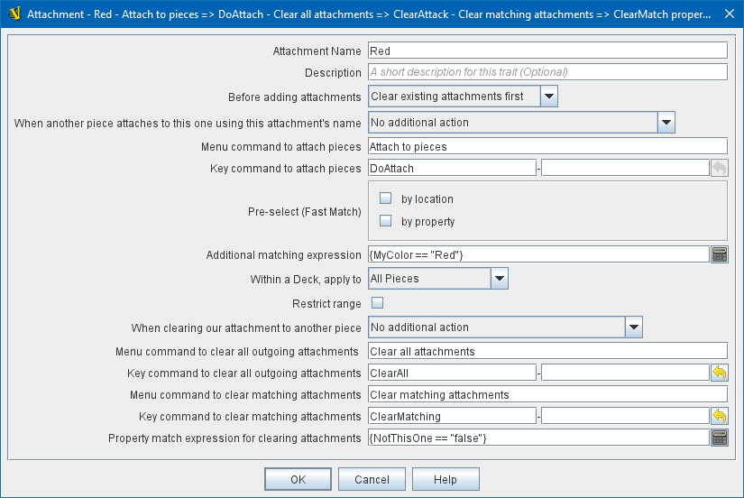

== VASSAL Reference Manual
[#top]

[.small]#<<index.adoc#toc,Home>> > <<GameModule.adoc#top,Module>> > <<PieceWindow.adoc#top,Game Piece Palette>># [.small]#>  <<GamePiece.adoc#top,Game Piece>># [.small]#> *Attachment*#

'''''

=== Attachment

This <<GamePiece.adoc#Traits,Trait>> adds an action that creates a lasting "attachment" to other pieces, allowing several special functions:

(1) The piece will be able to issue <<GlobalKeyCommand.adoc#top, Global Key Commands>> to attached pieces using the very fast and efficient "Current Attachments" location filter. A piece that needs to repeatedly communicate with the same piece(s) every time can thus use an Attachment to make the commands process very quickly, overcoming the normal performance lag of Global Key Commands.

(2) The piece will be able to directly read the properties of _one_ of the pieces that the Attachment trait is bound to. For cases where a single piece is bound to a particular Attachment trait, this can be quite useful in reading its properties quickly and easily. If a group of multiple pieces is attached with one Attachment trait, properties will be read from an undetermined _single piece_ from among the attached pieces. See _Attachment Name_, below, for an explanation of how to read a property from the attached piece.

(3) For <<DynamicProperty.adoc#top, Dynamic Properties>> of an attached piece, the value of the properties can also be _set_ by this piece, by using a <<SetGlobalProperty.adoc#top, Set Global Property>> trait using the same naming convention (see _Attachment Name_, below)

[width="100%",cols="50%a,^50%a",]
|===
|*Attachment Name:*:: The name for this Attachment trait. This name can be used by the piece to read properties from attached pieces. For example if the Attachment name were _Sibling_, then the property _Sibling_LocationName_ would contain the _LocationName_ property of the first currently attached piece. Similarly, if the attached piece contained a Dynamic Property called _Dynamite_, then a <<SetGlobalProperty.adoc#top, Set Global Property>> trait on this piece could change that property using the name _Sibling_Dynamite_.

*Description:*:: A short description of this trait for your own reference.

*Attach menu command:*:: Name of the right-click context menu item to attach pieces.
If left blank, no context menu item will appear.

*Attach key command:*::  A Key Command or <<NamedKeyCommand.adoc#top,Named Key Command>> that initiates attachment of pieces.

*Clear menu command:*:: Name of the right-click context menu item to clear all current attachments (by _this_ individual Attachment trait).
If left blank, no context menu item will appear.

*Clear key command:*::  A Key Command or <<NamedKeyCommand.adoc#top,Named Key Command>> that initiates the clearing of all current attachments (by _this_ individual Attachment trait).

*Pre-select (Fast Match):*::  *Fast Match* selections can be used to improve the performance of "slow" piece filters.
+
See the <<FastMatch.adoc#top>> page for full details on Fast Matches.

*Additional matching expression:*::  If further refinement of which target pieces should be attached is needed, or if you do not wish to use Fast Match pre-selections, an Additional Matching Expression can be used. Only Game Pieces which match the specified <<PropertyMatchExpression.adoc#top,Property Match Expression>> will become attached. Note that the properties named in _this_ expression are evaluated against the properties _of the target pieces_, not the properties of the piece creating the Attachment.
For example if you provided the expression _{ CurrentZone == "Europe" }_, that would use the CurrentZone property of each potential target piece (checking if _it_ is "Europe") to determine whether to attach it.
If you want to compare a property in the target pieces against the value of _a property in *this* piece_, then use $property$. All $...$ property references will be evaluated against this piece before testing against other pieces.
Note that this will often mean the expression needs to be put inside of quotation marks if the property in question is a string value.
For example if the expression provided is { CurrentZone == "$CurrentZone$" } then the CurrentZone of each potential target piece will be checked against $CurrentZone$ which will read the CurrentZone of the _issuing_ piece.

*Within a Deck, apply to:*::  Select how the Attachment command will be applied to pieces in a <<Deck.adoc#top,Deck>>. Options are _All pieces_, _No pieces_, or _Fixed number of pieces_.
If _Fixed number of pieces_ is selected, a field appears to allow entry of the number of Pieces in the Deck to affect, starting at the top of the Deck.
Thus, selecting 1 for the fixed number would cause only the top card or piece in a Deck to be attached. An <<Expression.adoc#top,Expression>> can be used. Note that such an expression will be evaluated _once_ at the beginning of the attachment (not each time a candidate piece is being checked).

*Restrict Range:*::  If selected, the command will only attach pieces located within a specified distance of this piece.<<Properties.adoc#top>>

*Range:*:: Only others pieces within this distance, inclusive, of this piece will be attached.
If the pieces are on a board with a <<HexGrid.adoc#top,Hex Grid>> or <<RectangularGrid.adoc#top,Rectangular Grid>>, then the distance is in units of the grid.
Otherwise, the distance is measured in screen pixels.

*Fixed Range:*::  If selected, then the range is specified as a fixed number.
If unselected, then the range will be given by the value of the named <<Properties.adoc#top,property>>.

*Range Property:*::  The name of a Property that contains the range to use when Fixed Range is not selected.

|
|===

'''''
