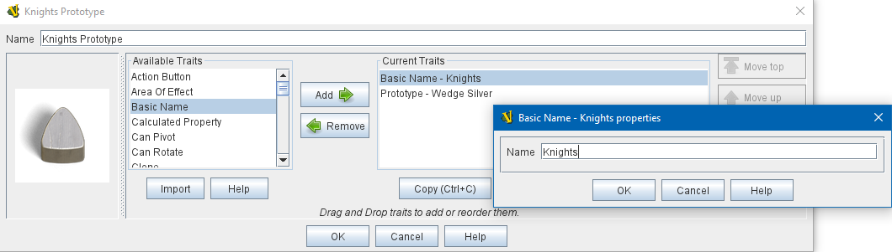

== VASSAL Reference Manual
[#top]

[.small]#<<index.adoc#toc,Home>> > <<GameModule.adoc#top,Module>> > <<PieceWindow.adoc#top,Game Piece Palette>> > <<GamePiece.adoc#top,Game Piece>> > *Basic Name*#

'''''

=== Basic Name

This trait allows you to override the BasicName property of the <<BasicPiece.adoc#top,Basic Piece>> with a specific basic name for the piece. Useful when you wish to define a piece entirely using Prototypes,
it allows the empty default Basic Piece to be ignored entirely, since the Basic Name trait already fills the basic name field.

*SEE ALSO:*  <<Prototypes.adoc#top,Prototypes>>, <<BasicPiece.adoc#top,Basic Piece>>
[width="100%",cols="50%a,50%a",]
|===
|
*Name:*:: The basic name of this piece. This name will be used to fill the _BasicName_ property of the piece.

|

_A Prototype defining a Basic Name for its pieces._

|===

