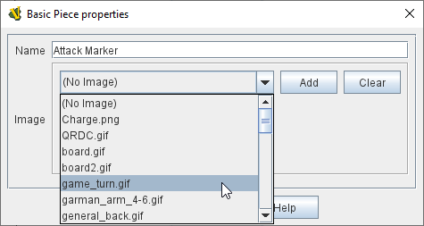

== VASSAL Reference Manual
[#top]

[.small]#<<index.adoc#toc,Home>> > <<GameModule.adoc#top,Module>> > <<PieceWindow.adoc#top,Game Piece Palette>> > <<GamePiece.adoc#top,Game Piece>> > *Basic Piece*#

'''''

=== Basic Piece

The simplest game piece consists of an image and a name.

The image is optional, or different pieces can share the same image, but you should always give each Basic Piece a unique name.

Simple piece images can be created from scratch within Vassal using <<GamePieceImageDefinitions.adoc#top,Game Piece Image Definitions>>, but you will usually get a better result by loading images sourced from existing artwork or created with specialist graphics software.

To give a piece more complex behaviors, you can add more Traits to it in the <<GamePiece.adoc#top,Piece Definer>> dialog.
For example you could omit or remove the image from the Basic Piece and instead add a <<Layer.adoc#top,Layer>> trait to allow the piece to use multiple images.

[width="100%",cols="50%a,^50%a",]
|===
|
*Name:*:: Choose a unique name for this Game Piece.

*Image:*:: Click on the _Add_ button to select an image for this Game Piece and to load it into the module.
+
Click on the _Clear_ button to remove the selected image from this Game Piece.
+
Click on the drop-down menu to select an image that has already been loaded into the module in a previous editing session. *Note* that newly selected images do not appear in the drop-down list until the module has been saved and re-loaded.

|
image:images/BasicPiece.png[]
_A Basic Piece containing an image and a name._

_Choosing an image that has already been loaded into the module._

|===

'''''

The following <<Properties.adoc#top,Properties>> are defined in a Basic Piece, meaning that any trait in the piece can refer to them:

* _BasicName_ contains the name of Basic Piece trait, as specified in the properties
* _PieceName_ contains the full name of the piece, including any additional strings added by e.g.
<<Layer.adoc#top,Layer>> or <<Label.adoc#top,Text Label>> traits
* _PlayerSide_ contains the side of the current player, as specified in the <<GameModule.adoc#Definition_of_Player_Sides,Definition of Player Sides>>
* _LocationName_ contains the name of the current location, as determined by the local grid.
If the piece is in a <<ZonedGrid.adoc#top,Zone>> in a Multi-Zone Grid, then whether _LocationName_ returns the name of the _Zone_ or a _Region_ within the Zone's grid depends on the configuration of the <<ZonedGrid.adoc#top,Zone>>. +
* _CurrentMap_ contains the name of the current <<Map.adoc#top,Map Window>> +
* _CurrentBoard_ contains the name of the current <<Board.adoc#top,Board>>
* _CurrentZone_ contains the name of the current <<ZonedGrid.adoc#top,Zone>>
* _CurrentX_ contains the current map X coordinate
* _CurrentY_ contains the current map Y coordinate
* _DeckName_ contains the name of the <<Deck.adoc#top,Deck>> if the piece is currently stacked in one.
* _DeckPosition_ contains the position of a piece within a <<Deck.adoc#top,Deck>> (top = 1) if the piece is currently stacked in one, or 0 otherwise.
* _Selected_ contains _true_ when the piece has been selected with the mouse
* _PieceId_ contains a string that uniquely defines the source of the piece.
All pieces sourced from the same <<PieceWindow.adoc#top,Game Piece Palette>> slot will have the same PieceId string.

The following <<Properties.adoc#top,Properties>> are defined after a piece is moved, either manually by drag-and-drop movement or by a <<SendToLocation.adoc#top,Send To Location>> trait:

* _OldLocationName_ contains the name of the previous location, as determined by the local grid +
* _OldMap_ contains the name of the previous <<Map.adoc#top,Map Window>> +
* _OldBoard_ contains the name of the previous <<Board.adoc#top,Board>>
* _OldZone_ contains the name of the previous <<ZonedGrid.adoc#top,Zone>>
* _OldX_ contains the previous map X coordinate
* _OldY_ contains the previous map Y coordinate
* _OldMat_ contains the previous <<Mat.adoc#top,Mat>>, if this is a <<MatCargo.adoc#top, Mat Cargo>> piece.
* _OldMatID_ contains the previous <<Mat.adoc#top,Mat>> ID, if this is a <<MatCargo.adoc#top, Mat Cargo>> piece.
* _OldMatPieceName_ contains the previous Mat's Piece Name
* _OldMatBasicName_ contains the previous Mat's Basic Name

The following <<Properties.adoc#top,Properties>> are defined after the player has selected something from the piece's right-click context menu:

* _ClickedX_ contains the X location on current map where right-click took place.

* _ClickedY_ contains the Y location on current map where right-click took place.

