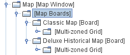
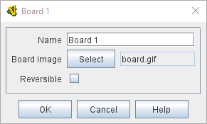
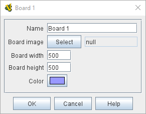

== VASSAL Reference Manual
[#top]

[.small]#<<index.adoc#toc,Home>> > <<GameModule.adoc#top,Module>> > <<Map.adoc#top,Map>> > *Board*#

'''''

=== Board

A Board represents the physical board on which pieces are moved by the players.
A Map Window can consist of multiple Boards laid out next to one another.

If a board image is specified (a PNG, JPEG, SVG or GIF image file that must be created beforehand with some external tool), then the size of the image determines the size of the board.

If the board image is set to null (by clicking the "Select" button and then canceling the file dialog), then no image is used for the board, and the size and color may be specified directly.

To add a board to your map, use the Editor's configuration window to navigate to the _[Map Window]_ entry for your map.
Click to the left of it to open its sub-components and you should find a _[Map Boards]_ component.
You can then right-click on the _[Map Boards]_ component and select _Add Board_.
You will then have a _[Board]_ component for your map!

You can optionally add a _Grid_ subcomponent to your board to regulate movement by right-clicking the _[Board]_ component and selecting one of the appropriate _Add_ options.
See _Sub-Components_, below, for more details on grids.

[width="100%",cols="50%a,^50%a",]
|===
|
*Name:*:: The name of the Board. It should NOT be left blank.

*Board image:*:: The image to use for the board display.

*Board width:*:: The width of the Board in pixels if no image is used.

*Board height:*:: The height of the board in pixels if no image is used.

*Color:*:: The color of the board if no image is used.

|

|===

'''''

=== Sub-Components: Grids

If a Board contains no grid, then pieces may be placed anywhere on the board.
Pieces dropped on top of one another will stack.
If the board contains a <<HexGrid.adoc#top,Hex>> or <<RectangularGrid.adoc#top,Rectangular>> grid, they can be configured either to allow pieces anywhere or to have pieces snap to the nearest legal location on the board as defined by the grid.
The grid may be drawn over the board's image or drawing may be suppressed (for example if the image already has a grid drawn on it). <<IrregularGrid.adoc#top,Irregular>> grids may be used to define locations on maps where the positions are arbitrary; on such grids the option to have pieces snap to the nearest legal location is selectable.
Maps can also be configured to use different grids in different zones through the use of a <<ZonedGrid.adoc#top,Multi-zoned Grid>>.

==== <<HexGrid.adoc#top,Hex Grid>> - a Hexagonal Grid

==== <<RectangularGrid.adoc#top,Rectangular Grid>> - A Square or Rectangular Grid

==== <<IrregularGrid.adoc#top,Irregular Grid>> - Manually Configured Spaces of Arbitrary Shape

==== <<ZonedGrid.adoc#top,Multi-zoned Grid>> - Multiple Zones, Each With Its Own Grid

