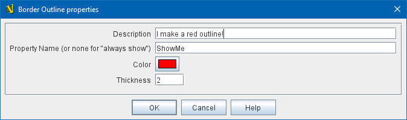
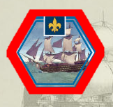

// Mark When Moved is internally known as MovementMarkable
== VASSAL Reference Manual
[#top]

[.small]#<<index.adoc#toc,Home>> > <<GameModule.adoc#top,Module>> > <<PieceWindow.adoc#top,Game Piece Palette>> > <<GamePiece.adoc#top,Game Piece>> > *Border Outline*#

'''''

=== Border Outline

Pieces which have the _Border Outline_ trait will automatically display a colored border around the piece's image. Specify the color and thickness of the border, and an optional property name to control whether the border is displayed. Note that if you use a NonRectangular trait to control your piece's shape, the outline will conform to the designated shape.

[width="100%",cols="50%a,50%a",]
|===
|
*Description:*:: A short description of this trait for your own reference.

*Property Name (or none for "always show"):*:: If blank, the border will always be shown. Otherwise the value of the named property will be checked, and the outline will be shown if the property value is anything other than 0, false, or an empty string.

*Color:*:: The color of the border outline.

*Thickness:*:: The pixel thickness of the border outline.

|

 +
|===
