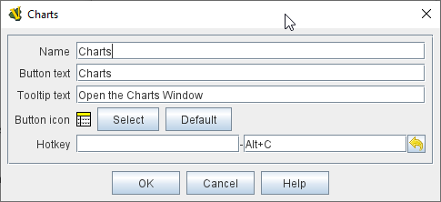
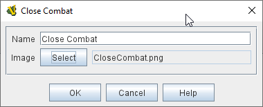
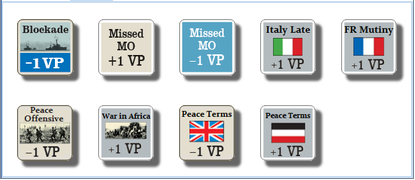

== VASSAL Reference Manual
[#top]

[.small]#<<index.adoc#toc,Home>> > <<GameModule.adoc#top,Module>> > *Chart Window*#

'''''

=== Chart Window

A window for holding game-play aids:  charts, tables, etc.
Adds a button to the Toolbar of the main Module window.
Clicking the button shows the window with the given name.
The text of the button, an icon, and a hotkey shortcut to open and close the window may be specified.

To add a Chart Window to your module, find the main _[Module]_ entry at the very top of the Editor's configuration window.
Right-click it and select _Add Chart Window Menu_.
After adding initial settings for your Chart Window, you will find a _[Chart Window Menu]_ component at the very bottom of your module's list of components in the Editor window.
You can then right-click the _[Chart Window Menu]_ component to _Add_ any of the types of Sub-Component listed below, thus building out your Chart Window with as many charts as you need.

image:images/ChartWindowConfig.png[]
[width="100%",cols="50%a,^50%a",]
|===
|

*Name:*:: The name of the Chart Window appears on the title bar of the windows when opened.

*Button text:*:: The text displayed on the Toolbar Button added for this Chart Window. Optional.

*Tooltip text:*:: The tooltip text displayed if you hover the cursor over the Toolbar Button added for this Chart Window.

*Button icon:*:: The icon displayed on the Toolbar Button added for this Chart Window. Optional. Click _Select_ to select a new icon and load it into the module. Click _Default_ to use the Vassal default icon.

*Hotkey:*:: <<NamedKeyCommand.adoc#top,Keystroke or Named Command>> that will open or close this Chart Window.

|

 +
|===

'''''

=== Sub-Components

[#Chart]

==== Chart

Each chart is a GIF/JPEG/PNG image that you must create beforehand with an external program.

[width="100%",cols="50%a,50%a",]
|===
|*Name:*:: The name of the Chart.

*Image:*:: The image to be displayed in the Chart. Click _Select_ to select an image and load it into the module.

| +
|===

[#HtmlChart]
==== HTML Chart

Charts can be specified using HTML as well, so long as the HTML is not too complex.
Avoid using the <head> tag, for instance.
HTML Charts can contain hyperlinks to one another, but not to external resources.
You can reference any image that exists in the module file.

For example, if inf.png is an image used in one of the Game Piece definitions, you can reference it using . Note that because images stick around in a module file even after the components using them have been deleted, you can add images as a regular Chart, delete the Chart, and still use its image in an HtmlChart.

[width="100%",cols="50%a,50%a",]
|===
|*Name:*:: The name of the Chart.

*HTML file:*:: The HTMl file to be displayed in the Chart. Click _Select_ to select a file and load it into the module.
| +
|===

==== Tabbed Pane

A panel with tabs, each of which corresponds to a Chart, Panel, or other Tab panel subcomponent.
The label of the tab will be the name of the subcomponent.

image:images/TabbedPane.png[]

==== Panel

A panel that can contain Charts, Tab panels, or other panels.
The _Fixed cell size_ box allows you to specify a fixed number of columns that the panel will have.
Otherwise, the subcomponents will appear in a single row, or a single column if the _Vertical layout_ box is checked.

[width="100%",cols="50%a,50%a",]
|===
|*Name:*:: The name of the Panel.

*Fixed cell size:*:: Check to select a fixed size layout, rather than using the size of the elements added to the Panel.

*Number of columns:*:: Number of columns to allow for when a Fixed cell size is used.

*Vertical layout:*:: Check to layout items in the Panel vertically, rather than horizontally.

*Image scale for all child members:*:: All items added to this panel will be scaled by this factor when displayed.
|

|===

[#Map]
==== Map

A fully functioning <<Map.adoc#top,Map Window>> can be embedded within a Chart.
You can put different maps under different tabs within the same chart window, and place and move counters onto the charts for bookkeeping purposes.

[width="100%",cols="50%a,50%a",]
|===
|*Name:*:: Name of the Chart Map Window.
|image:images/ChartMap2.png[]

|===
