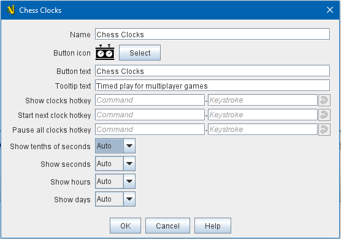
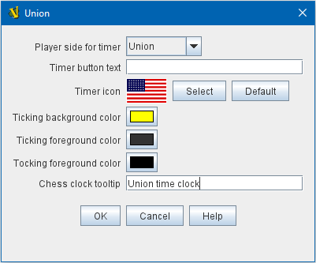

== VASSAL Reference Manual
[#top]

[.small]#<<index.adoc#toc,Home>> > <<GameModule.adoc#top,Module>> > *Chess Clock Control*#

'''''

=== Chess Clock Control

[cols=",",]
|===
|Adds a Chess Clock controller to your game, for use in timing multiplayer matches. Chess clocks in VASSAL count "up" rather than down, so you can agree to any desired time control with your opponent, without the need to re-configure clock values.

During play, clicking the main Chess Clock Control button will hide/reveal the individual clock buttons, if no clocks are running. Or, if any clocks are currently running, clicking
the main Chess Clock Control button will switch to the next clock in the player sequence. To stop all clocks, one can right click on the Chess Clock Control button and select from the
menu. Keyboard shortcuts can also be specified for starting and stopping clocks.

The time display format of the clocks can also be configured here. Display of fields such as "milliseconds" and "days" can be left on the _Auto_ setting, or
configured to _Always_ or _Never_ as appropriate for your game.

If _Allow manual reset of Chess Click timers_ is selected, players will be able to reset any clock to 0 at any time during the game by right-clicking on the clock
to reset and selecting the "reset" option from the context menu.

The individual clocks can then be configured with an icon and text, as desired, on their own components.

To add Chess Clocks to your module, find the main _[Module]_ entry at the very top of the Editor's configuration window.
Right-click it and select _Add Chess Clock Control_.
After adding initial settings for your Chess Clock controller, you will find a _[Chess Clock Control]_ component at the very bottom of your module's list of components in the Editor window.
You can then right-click the _[Chess Clock Control]_ component to _Add_ individual _[Chess Clock]_ components, although if you have already created your <<GameModule.adoc#Definition_of_Player_Sides,Definition of Player Sides>> before adding the
Chess Clock Control, individual clocks will be added by default, corresponding to each of your player sides.
|  +
|===

'''''

=== Sub-Components

[#ChessClock]##

==== Chess Clock

[cols=",",]
|===
|Each individual chess clock that you add can be configured in its own component here.

*Player side for timer:* Select which of your the player sides from your <<GameModule.adoc#Definition_of_Player_Sides,Definition of Player Sides>> will correspond to this clock.

*Timer button text:* Text to be displayed on this chess clock's toolbar button.

*Timer icon:* Icon for this chess clock's tookbar button.

*Ticking background color:* When this chess clock is _running_, this background color will be displayed behind the timer text.

*Ticking foreground color:* When this chess clock is _running_, the button text (including the timer numbers) will "pulse" between the "ticking" and "tocking" foreground colors.

*Tocking foreground color:* When this chess clock is _running_, the button text (including the timer numbers) will "pulse" between the "ticking" and "tocking" foreground colors.

*Chess clock tooltip:* Tooltip for this chess clock's button.

| +
|===

