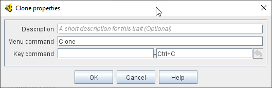

== VASSAL Reference Manual
[#top]

[.small]#<<index.adoc#toc,Home>> > <<GameModule.adoc#top,Module>> > <<PieceWindow.adoc#top,Game Piece Palette>> > <<GamePiece.adoc#top,Game Piece>> > *Clone*#

'''''

=== Clone

The Clone trait provides the capability for a piece to be duplicated by players during a game.

When this trait's Key Command or menu item is activated, an exact copy of the piece is placed in the game at the same location.

[width="100%",cols="50%a,50%a",]
|===
|
*Command:*::  Text for the right-click context menu item that will clone the piece.
If left blank, no context menu item will appear, but the piece can still be cloned with the Key Command.

*Key command:*::  The <<NamedKeyCommand.adoc#top,Keystroke or Named Command>> that will cause the piece to be duplicated.

|

|===

Back to <<GamePiece.adoc#Traits, Trait List>>
