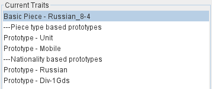
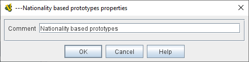

== VASSAL Reference Manual
[#top]

[.small]#<<index.adoc#toc,Home>> > <<GameModule.adoc#top,Module>> > <<PieceWindow.adoc#top,Game Piece Palette>> > <<GamePiece.adoc#top,Game Piece>> > *Comment*#

'''''

=== Comment

The Comment trait adds displays a line of text in the Piece Definer trait list, but has no action associated with it. The text entered in the Comment trait appears in the Piece Definer preceded by 3 hyphens.

Comments are stripped out of the definition when a piece is created, so Comments have no performance impact whatsoever on pieces used in VASSAL games.

[width="100%",cols="50%a,50%a",]
|===
|
*Comment:*::  The Text that will appear in the Piece Definer, preceded by ---.

|

|===

Back to <<GamePiece.adoc#Traits, Trait List>>