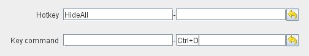

== VASSAL Reference Manual
[#top]

[.small]#<<index.adoc#toc,Home>> > *Concepts*#

= Concepts

* <<#Module,Module>> +
* <<#extension,Extension>> +
* <<#componentsandpieces,Components and Pieces>> +
** <<#components,Components>> +
** <<#pieces,Pieces>> +
* <<#hotkeys_and_key_commands,Hotkeys and Key Commands>>
** <<#hotkeys,Hotkeys>> +
** <<#keycommands,Key Commands>> +

Map +
Player Hand +
Board +
Zone +
Piece +
Prototype +
Stack +
Deck +
At-Start Stack +
Key Command +
Global Key Command +
Values +
Properties +
Piece Properties +
Global Properties +
Translation +
BeanShell

'''
[#module]
== Module
All the pieces that make up a Vassal implementation of a game are collected together into a single file called a <<GameModule.adoc#top,*Module*>>, which typically have a `.vmod` suffix. +

Physically, a <<GameModule.adoc#top,*Module*>> is a ZIP archive containing the different files that go together to make up the <<GameModule.adoc#top,*Module*>>.

You can inspect the files that make up a <<GameModule.adoc#top,*Module*>> by opening it with any utility that can open ZIP Archives.

NOTE: Some tools may require you to rename the module file from `.vmod` to `.zip` before you can open it. Just rename it back to `.vmod` when you have finished.

A <<GameModule.adoc#top,*Module*>> contains various files and folders:

 * The *buildfile.xml* is an XML file that links all the parts of your module together and includes all  the definitions of the different <<#components,*Components*>> and <<#pieces,*Pieces*>> that make up your module. +
The *buildfile* is normally maintained for you by the VASSAL Module Editor, but you can manually edit and update the *buildfile* if you know what you are doing. Make a backup first!!!
 * The *moduledata* file holds the summary information about your module that is displayed in the Module Manager.
 * The *images* folder holds all the image files used in your module.
 * HTML files shown in Chart Windows.
 * Pre-defined Setup files used to start games.

[#extension]
== Extension
An <<Extension.adoc#top,*Extension*>> is a fragment of a *Module* that can be used to add additional functionality to an existing *Module* without modifying that *Module* directly.

A typical use for an<<Extension.adoc#top,*Extension*>>  is to add additional scenarios to a module and some additional units that are needed to play those scenarios.

[#componentsandpieces]
== Components and Pieces
A VASSAL Module is made up of two fundamentally different types of elements that are defined and manipulated in two different ways.

[width="100%"]
[cols="20%,40%,50%"]
|===
| | *Components* | *Pieces* +

| Mobility | Fixed elements making up the structure of the module. | Mobile element that can move about on Map components. +

| Duplication | Only one of each Component exists in a game. | There can be multiple instances of each Piece in a game. +

| Activation | Activated by <<#hotkeys,Hotkeys>>, ignore <<#keycommands,Key Commands>>. | Activated by <<#keycommands,Key Commands>>, ignore  <<#hotkeys,Hotkeys>>. +

| Toolbar Buttons | Many Components can be activated by buttons that reside on the main Vassal toolbar. | Pieces are never associated with a Toolbar button.
| Flexibility | Limited to in-built configuration and flexibility provided by core VASSAL. | Highly configurable and extensible by module designer.

|===

[#components]
=== Components
VASSAL Components consist of the structural pieces that are used to implement a game. Some key Components used in nearly every module are

* <<Map.adoc#top, Maps>> that combine one or more boards into a playing surface that <<#pieces,Pieces>> can be placed on.
* <<Board.adoc#top,Boards>> that implement an individual map or part of map
* <<ZonedGrid.adoc#top,Zones>> identify individual subsections of a Board.
* <<ChartWindow.adoc#top,Charts>> allow the display of reference materials.
* <<PieceWindow.adoc#top,Game Piece Palettes>> where <<#pieces,Pieces>> can be defined.

[#pieces]
=== Pieces

Pieces are used to implement the individual units, counters and other display pieces that make up a game.

[#hotkeys_and_key_commands]
== Hotkeys and Key Commands

 +

<<#hotkeys,Hotkeys>> and  <<#keycommands,Key Commands>> represent a Keystroke that Vassal components and Piece traits 'listen' out for and perform actions when they see one that they are interested in. They allow one VASSAL Component or Piece to activate a completely different Component or Piece.

<<#hotkeys,Hotkeys>> and  <<#keycommands,Key Commands>> can be defined as an actual Keystroke that can be pressed on a keyboard, or can be defined as a 'virtual' Named Keystroke. Named Keystrokes can only be generated by VASSAL Components and Piece traits. See the <<NamedKeyCommand.adoc#top,Keystroke Commands, Named Commands, Key Commands and Hotkeys>> page for more information.

<<#hotkeys,Hotkeys>> and  <<#keycommands,Key Commands>> look very similar when you define them, but they have two different uses.

[#hotkeys]
=== Hotkeys

Hotkeys are recognized by VASSAL Components and are ignored by Pieces.

Whenever a Hotkey is generated,  it is sent to ALL VASSAL Components in no particular order.

.Hotkeys are generated in one of two ways:
. By the user pressing a key or key combination while a VASSAL Map or Chart component has the focus (Not if the Chat Windows is currenly in focus).
. By the <<DoActionButton.adoc#top,Action Button>> Component, which can initiate a sequence of Hotkeys.
. By the <<GlobalHotKey.adoc#top,Global Hotkey>> Piece trait.

[#keycommands]
=== Key Commands
Key Commands are completely ignored by VASSAL Components.

Whenever Key Commands are generated, they are always sent to a specific set of Pieces. The Key Commands are sent to every trait within the selected set of pieces, that can then react to them if they are configured to do so.

.Key Commands are generated in the following ways:
. By right-clicking on a Piece and selecting a Menu Command. The Key Command associated with tha Menu Command will be sent to the piece that is being right-clicked.
. By activating a <<TriggerAction.adoc#top,Trigger Action>> trait that can issue a sequence of Key Commands to the Piece that contains it.
. By activating any <<GlobalKeyCommand.adoc#top,Global Key Command>> Component or Piece trait to send a Key Command to a specific group of Pieces selected by the conditions specified in the <<GlobalKeyCommand.adoc#top,Global Key Command>>.

== Values in Vassal

== Properties
* Properties

Making a GP of the same name will have no effect. Each individual Property is complete unique and unrelated. When you reference a property named ‘X’ in a piece trait, the following happens to find a value for that property. The first find of a value of property ‘X’ is used as the value:

Search each trait in the current piece to see if any of the traits has a value for property ‘X’. The traits are searched in reverse order (bottom up) of what they appear in the Piece Definer.

If we reach the end of all the traits, then see if the piece is currently in a Zone on a Map. If so, see of the Zone has a Global property named X.

Still not found, Check the Map the piece is on to see if it has a Global property named ‘X’.

Still not found, then check if VASSAL knows what ‘X’ is. This might be a module level Global Property, or a system property.

So, a piece can directly ‘see’ and ‘read’ any property in itself, it’s current Zone, it’s current Map or in the top-level module.

It doesn’t work the other way. Nothing else can directly ‘see’ any property inside the piece, without using some of the new functions I am developing for v3.7.

** Piece Property

*** Marker
*** Calculated Property
*** Dynamic Property
*** Setting Piece Properties

* Global Property
*** Setting Global Properties

* Key Commands and Hotkeys

** Global Key Command

** Global Hot Key

* BeanShell
** Strings and Numbers
** true and false
** Property Match Expressions