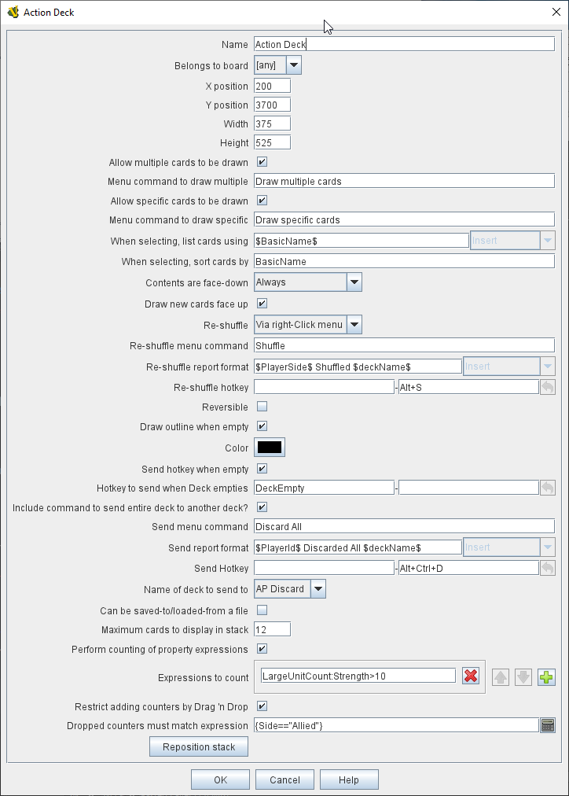

== VASSAL Reference Manual
[#top]

[.small]#<<index.adoc#toc,Home>> > <<GameModule.adoc#top,Module>> > <<Map.adoc#top,Map>> > *Deck*#

'''''

=== Deck

A Deck functions like a deck of playing cards, but can also be used to hold a supply of other types of <<GamePiece.adoc#top,Game Piece>>, such as a fixed supply of counters or a "bag of chits" to be randomly drawn from.
  Each game begins with the contents of the Deck as specified in the Configuration window.
During a game, players may remove cards from the deck by dragging them from the top of the deck with the mouse.
This removes a card from the Deck and assigns ownership to the dragging player.
Dragging a card onto the deck adds it back to the Deck.

The number of cards or pieces in the deck is exposed as a Map-level <<Properties.adoc#top,Property>> with the name _<name>_numPieces._ +
The number of card or piece types in the deck can be exposed as a Map-level <<Properties.adoc#top,Property>> with the name _<name>_<type>_ (see Perform Counting of Piece Types below).

Decks can be added to <<Map.adoc#top,Maps>>, and also to <<PlayerHand.adoc#top,Player Hands>> and <<PrivateWindow.adoc#top,Private Windows>>, each of which is simply a specialized type of Map.
To add a Deck, navigate to the _[Map]_, _[Player Hand]_, or _[Private Window]_ component entry in the Editor configuration window for the Map (or specialized map) you wish to add the Deck to.
Right-click on that component and select _Add Deck_ from the menu.
After you have configured your Deck and clicked the OK button, your new _[Deck]_ component will appear at the bottom of the map's list of Sub-Components.
You can then right-click on the _[Deck]_ entry and begin adding Cards and other Deck Sub-Components.

*NOTE:*  Because Decks are quite often used to hold "cards", the Game Pieces contained within a Deck will be frequently referred to in Vassal and in documentation as "cards". However keep in mind that a "card" is simply a type of Game Piece, and a Deck can be used to contain _any_ type of Game Piece.
The difference between a "card" and a "piece" is only notional, and perhaps represented in the artwork and function of the piece/card.

[width="100%",cols="50%,50%",]
|===
a|
*Name:*  The name of a Deck is not used during game play.
It is only used for identification in the Editor.
The name should be unique.
If multiple decks with the same name are created the return to deck trait will send cards to the first deck with that name.

*Belongs to board:*  If a name is selected, the Deck will appear on that particular <<Board.adoc#top,Board>>. If a game does not use that Board, then the Deck will not appear.
If "<any>" is selected, then the Deck will always appear at the given position, regardless of the boards in use.

*X,Y position:*  The position in the Map Window of the center of the deck.
If this Deck belongs to a Board, the position is relative to the Board's position in the Map Window.

*Width, Height:*  The size of the "tray" holding the cards.
If the Deck is empty, this determines the area into which players may drag cards to add them back to the Deck, as well as the box drawn if the _Draw Outline When Empty_ option is selected below.
It should be set to approximately the same size as the cards the Deck will hold.

*Allow Multiple Cards to be Drawn:*  Adds a right-click context menu entry to the Deck's context menu that prompts the user to specify the number of cards to be drawn from the Deck with the next drag.

*Allow Specific Cards to be Drawn:*  Adds a right-click context menu entry to the Deck's context menu that allows the player to examine the Deck and select exactly which cards will be drawn from the deck with the next drag.

*When selecting, list cards using:*  When the player is prompted to select specific cards from the Deck, individual cards will be listed using the specified <<MessageFormat.adoc#top,Message Format>>.

*When selecting, sort cards by:*   When the player is prompted to select specific cards from the deck, the cards can optionally be sorted (alphabetically) using the listed property.
Leave blank to list cards by their current position in the deck.
*NOTE:* Unlike the previous field this field simply names a single property, and should not use $..$ markers. To sort by multiple fields a <<CalculatedProperty.adoc#top,Calculated Property>> trait e.g. _SortName_ can be created and serve to concatenate the various fields in an appropriate order.
*Example:* cards in a deck can use a <<PropertyMarker.adoc#top,Marker>> trait to specify a card number (001,002, etc.) and always list cards in order of their assigned number: in this case simply fill _CardNum_ into the field, no $..$.

*Contents are Face-down:*  Determines whether cards in the Deck are always drawn face-down, always drawn face-up, or can be switched from face-up to face-down with a right-click context menu entry.

*Face Down Report Format:*  A <<MessageFormat.adoc#top,Message Format>> that is echoed to the chat log whenever a player selects the _Face Down_ menu item (if enabled above): _deckName_ is the name of this deck, _commandName_ is the name of the menu item.

*Draw new cards face up:*  If checked, then cards drawn from this Deck (e.g.
by dragging them) will be placed face-up on the playing area.
If unchecked, then cards from a face-down deck are drawn face down and owned by the drawing player.

*Re-shuffle:*  If set to _Never_ then cards remain in their original order; cards are drawn from and added to the top.
If set to _Always_ then cards are always drawn randomly from the deck.
If set to _Via right-click menu_ then a _Shuffle_ entry is added to the Deck's right-click context menu.

*Re-shuffle Menu Text:*  The right-click context menu entry for reshuffling the Deck.

*Re-shuffle Report Format:*  A <<MessageFormat.adoc#top,Message Format>> that is echoed to the chat log whenever a player selects the _Shuffle_ menu item (if enabled above): _deckName_ is the name of this Deck, _commandName_ is the name of the context menu item.

*Re-shuffle Hotkey:*  A <<NamedKeyStroke.adoc#top,Keystroke or Named Keystroke>> that will cause a reshuffle.
If left blank, a reshuffle can be caused only with the right-click context menu.

*Reversible:*  Adds an entry to the right-click context menu that reverses the order of cards in the Deck.

*Reverse Report Format:*  A <<MessageFormat.adoc#top,Message Format>> that is echoed to the chat log window whenever a player selects the "Reverse" menu item: _deckName_ is the name of this deck, _commandName_ is the name of the menu item.

*Draw Outline When Empty?*  Whether to draw the "tray" for the cards.
The "tray" is a rectangle of size _width,height_ centered at _x,y_.
Only drawn when there are no cards in the Deck, to indicate where to drag cards to place them back in the Deck.
May not be necessary or desirable if the Map Window contains a board on which the tray is already shown.

*Color:*  The color used to draw the rectangle representing the "tray" above.

*Send Hotkey when empty?*  Select this option to send a Global Hotkey whenever the Deck is emptied.

*Hot Key to send when Deck empties:*  Select the <<NamedKeyStroke.adoc#top,Keystroke or Named Keystroke>> to send whenever enough cards are removed from the Deck to empty it.

*Include command to send entire deck to another deck:*  If checked, the right-click context menu for this Deck will include a command that sends every Game Piece in this Deck to a different designated Deck.
For example, this can be used to reshuffle a discard pile into its original deck.
The following four attributes are used to configure this option.

*Send Menu Text:*  The text for the right-click context menu item.

*Report Format:*  A <<MessageFormat.adoc#top,Send Message Format>> that is echoed to the chat log window whenever a player selects the "send to another deck" menu item: _deckName_ is the name of this deck, _commandName_ is the name of the menu item.

*Send Hot Key:*  Select a <<NamedKeyStroke.adoc#top,Keystroke or Named Keystroke>> that will cause the Deck contents to be moved to the target Deck.

*Name of deck to send to:*  The name of the Deck that the contents of this Deck will be sent to.

*Can be saved-to/loaded-from a file:*  If selected, the right-click context menu will include _Save_ and _Load_ actions.
The _Save_ action saves the contents of a deck to a file.
The _Load_ action replaces the contents of the deck with the cards specified in the file.
Saved decks can be loaded into an entirely different game than the one used to save the deck.
This option is useful for collectible card games, in which a player may prepare a deck offline in preparation for a game.

*Maximum Cards to be Displayed in Stack:*  This defines the maximum number of cards to graphically display in the Deck.
The default is 10.
For example, if set to 10, a deck of 52 cards will appear to have 10 cards, until the actual number of contents drops below 10.
Then the deck will visually start to shrink as cards are removed.
If set to 1, the deck will always appear flat as if it held only a single card.

*Perform Counting of property expressions:*  Enable processing of property expression counting.
Expressions must be defined.

*Expressions to count:*  Specify expressions to be counted within the deck.
These can be whatever you like and must be in the format of:

....
<expression name> : <expression>
....

For each expression, a map-level property called __<deckName>_<expression name>__ is exposed.
The exposed value is number of pieces for which that expression evaluates to _true_.
An example of how to do this is provided below.
NOTE: Currently the only "dynamic" property which can be used in counting expressions is _playerSide_.
Other dynamic properties will most likely not update if they change after pieces move into a deck.

*EXAMPLE:*  An ordinary deck of playing cards for, say, Crazy Eights would be set to: _Allow Multiple = false_, _Allow Specific = false_, _Face Down = Always_, _Re-shuffle = Always_, _Reversible = false_.
The discard pile would be: _Allow Multiple = false_, _Allow Specific = false_, _Face Down = Never_, _Re-shuffle = Never_, _Reversible = false_.

A Deck may contain any kind of Game Piece, so it can also be used for draw piles of chits or counters that are drawn randomly and whose total number are limited by the game.
If the pieces/cards do not need to be selected randomly and you simply wish to provide a pile of them on the board at game start, consider an <<SetupStack.adoc#top,At-Start Stack>>.

*EXAMPLE:*  A strategic game in which a nationality has a fixed force pool of variable-strength Infantry, Armor, etc.
counters can be modeled by making a Map Window representing the force pool, with a Deck of Infantry counters, a Deck of Armor counters, etc.
The decks would be set to _Allow Multiple = false_, _Allow Specific = false_, _Face Down = Never_, _Re-shuffle = Never_, _Reversible = false_.
In order to guarantee that the number of each type of counter is fixed, any Clone and Delete traits of the Infantry and Armor counters should be removed.

*EXAMPLE:*  You want to create a deck of playing cards and display the number of red cards, the number of black cards, the number of face cards, and the total number of cards in the deck.
Create the Deck, check _Perform counting of expressions_.
Add the expressions of _red: color = red_ and _black: color = black_.
Also add the expression _facecards: value > 10_.
When creating your cards, give them a <<PropertyMarker.adoc#top,Marker>> trait named _color_ with the values of _red_ or _black_ depending on the card.
Also give your cards a Marker trait named _value_ with the numeric value of the card.
Then, you can refer to the counts with the map-level properties of _<deckname>_red_, _<deckname>_black_, and _<deckname>_facecards_.
The total number of cards currently in the deck can be referenced by the map-level property of _<deckname>_numPieces_.

|

|===

'''''

=== Sub-Components

Sub-Components can be added to a Deck by right-clicking on the _[Deck]_ entry in the Module Editor and selecting the appropriate _Add_ option.

[width="100%",cols="50%,50%",]
|===
a|
==== <<GamePiece.adoc#top,Card>>

A Card is identical to a Game Piece, but is initialized with a <<Mask.adoc#top,Mask>> trait appropriate for a playing card.

==== <<DeckGlobalKeyCommand.adoc#top,Deck Global Key Command>>

Global Key Commands can be added to a Deck and will appear in the right-click context menu of the Deck.
The resulting Global Key Command will be applied _only_ to pieces contained in the Deck.

|image:images/DeckAdd.png[] +
|===

