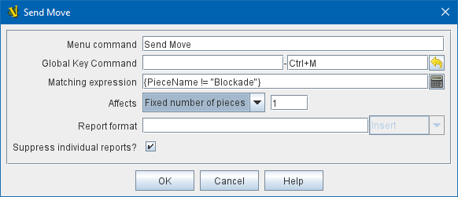

== VASSAL Reference Manual
[#top]

[.small]#<<index.adoc#toc,Home>> > <<GameModule.adoc#top,Module>> > <<Deck.adoc#top,Deck>> > *Deck Global Key Command*#

'''''

=== Deck Global Key Command

This <<Deck.adoc#top,Deck>> Sub-Component adds an action that applies a key command to pieces contained within the Deck, similar to the <<Map.adoc#GlobalKeyCommand,Global Key Command>> component of a Map Window or of a Game Piece.

To add a Deck Global Key Command to one of your Decks, use the Editor's configuration window to navigate to the _[Deck]_ entry for the Deck you want to add it to.
Right-click on the _[Deck]_ entry and select _Add Deck Global Key Command_.

[width="100%",cols="50%a,50%a",]
|===
|*Menu command:*:: Text for an entry in the Deck's right-click context menu that will activate the Deck Global Key Command.

*Global key command:*::  The <<NamedKeyCommand.adoc#top,Key Command or Named Command>> that will be applied to the pieces in the Deck.

*Matching expression:*::  The key command will only be applied to pieces (in the Deck) which match the specified <<PropertyMatchExpression.adoc#top,Property Match Expression>>. If you do not enter a property expression, then all pieces in the Deck can receive the key command, subject to the _Affects_ field, below.

*Affects:*::  The Deck Global Key Command can apply to all pieces which match the expression, or to a set number only (always counting from the top of the Deck). Use a setting of 1 to select the top piece.

*Report format:*::  A <<MessageFormat.adoc#top,Message Format>> that is echoed to the chat log whenever the Deck Global Key Command is activated.

*Suppress individual reports:*:: If selected, then any reports (whether auto-reporting or <<ReportChanges.adoc#top,Report Action>> traits) by the affected Pieces will be disabled throughout the processing of this Global Key Command.

a|

_Sends *Ctrl+M* to the first card in the deck that *isn't* Blockade._

|===

'''''
