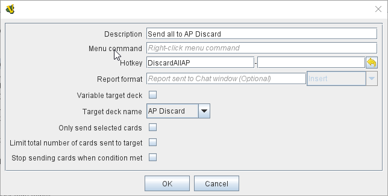
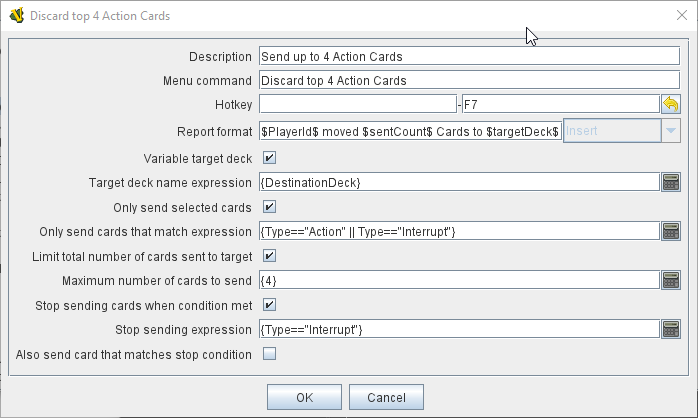

== VASSAL Reference Manual
[#top]

[.small]#<<index.adoc#toc,Home>> > <<GameModule.adoc#top,Module>> > <<Deck.adoc#top,Deck>> > *Deck Send Key Command*#

'''''

=== Deck Send Key Command

This <<Deck.adoc#top,Deck>> Sub-Component adds an action that sends cards from this Deck to another Deck

The Send action can be initiated by a right-click menu action, or by a Global Hotkey sent from another Vassal trait or component.

To add a Deck Send Key Command to one of your Decks, use the Editor's configuration window to navigate to the _[Deck]_ entry for the Deck you want to add it to.
Right-click on the _[Deck]_ entry and select _Add Deck Send Key Command_.

Deck Send Key Commands can also be placed in a component Folder created under the Deck.

When initiated, Cards will be sent one by one from the top of this Deck to the top of the target Deck. Options are available to limit which and how many cards are sent and to which Deck.

[width="100%",cols="50%a,50%a",]
|===
|*Description:*:: A short description for your own reference.

*Menu command:*:: Text for an entry in the Deck's right-click context menu that will activate the Deck Send Key Command. If no Menu Command is entered, the Send Command will not be available from the Deck's menu, but only by Hotkey.

*HotKey:*::  A <<NamedKeyCommand.adoc#top,Key Command or Named Key Command>> that will be used to activate the send from other Vassal traits or components. If no Hotkey is provided, then the send can only be initiated via the Deck's right-click menu.

*Report format:*::  A <<MessageFormat.adoc#top,Message Format>> that is echoed to the chat log whenever the Deck Send Key Command is activated.
The following additional report properties are provided:
+
* $DeckName$ - Deck Name.
* $commandName$ - Right-click Menu command name
* $targetDeck$ - The name of Deck the cards where sent to
* $SentCount$ - The number of cards that where sent to the target deck

*Variable target deck:*:: Checking this option changes from using a fixed Deck as the target, selected when the module is developed to a variable Deck, evaluated via an <<Expression.adoc#top,Expression>> when the Deck Send command is run.

*Target deck name:*:: A drop-down box listing all Decks defined in the module. Used to select a fixed target Deck when the _Variable target deck_ option is unchecked. +

NOTE: If you add new Decks to the module, you will need to save and reload the module to see the new Decks appear in the drop-down.

*Target deck name expression:*:: An <<Expression.adoc#top,Expression>> that must evaluate to the name of a Deck in the module when the Send Command is run. This option appears when the _Variable target deck_ option is checked. If the expression does not return the name of a valid Deck in the module, a _Bad Module Data_ error will be generated.

*Only send selected cards:*:: When unchecked, all cards in the Deck will be sent to the target Deck. When checked, a <<PropertyMatchExpression.adoc#top,Property Match Expression>> is used to select a specific selection of cards to send. When checked, cards that do not match the expression will be completely ignored by the Deck Send Command.

*Only send cards that match expression:*:: A <<PropertyMatchExpression.adoc#top,Property Match Expression>> that selects which cards are to be sent.

*Limit total number of cards sent to target:*:: When unchecked, all cards that meet the selection criteria will be sent to the target Deck. When checked, the total number of cards that will be sent will be limited to the value of the <<Expression.adoc#top,Expression>> in the next option.

*Maximum number of cards to send:*:: An <<Expression.adoc#top,Expression>> that limits the number of cards that will be Sent by this Send Command. If the expression does not evaluate to a number, it will have the same effect as if the limit option was not checked and all selected cards will be sent.

*Stop sending cards when condition met:*:: When checked, allows you to stop cards being sent to the target Deck when a particular card is reached.

*Stop sending expression:*:: A <<PropertyMatchExpression.adoc#top,Property Match Expression>> that when it matches a card, no more cards will be sent to the target Deck as part of this Deck Send Command.

Also send card that matches stop condition:*:: Controls whether the card that triggers the _Stop sending expression_ is sent to the target Deck or not.

a|

A basic command to send the entire contents of the Deck to the _AP Discard_ Deck on receipt of the _DiscardAllAP_ Hotkey.

image:images/DeckSendKeyCommand2.png[]
A more complex example that sends all cards with a value of "Action" in the _Type_ property to the Deck whose name is stored in the _DestinationDeck_ Global Property. The Command is initiated by a right-click menu command and reported to the Chat window.

A fully featured example that sends a maximum of 4 cards with a value of "Action" in the *Type* property to the Deck whose name is stored in the *DestinationDeck* Global Property, but stops sending if a card with a *Type* of *Interrupt* is seen. The *Interrupt* card is not sent to the target Deck. This command can be initiated by either the F7 Keystroke Hotkey, or a right-click menu command. The action is reported and includes the number of cards sent.

|===

'''''