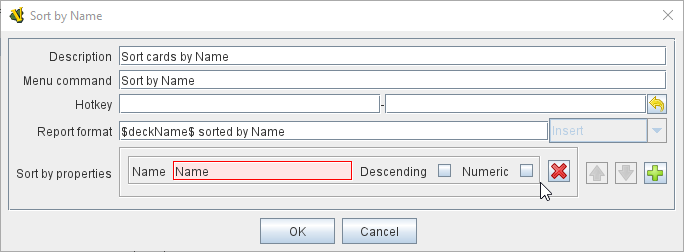
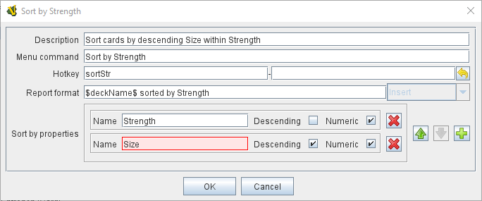

== VASSAL Reference Manual
[#top]

[.small]#<<index.adoc#toc,Home>> > <<GameModule.adoc#top,Module>> > <<Deck.adoc#top,Deck>> > *Deck Sort Key Command*#

'''''

=== Deck Sort Key Command

This <<Deck.adoc#top,Deck>> Sub-Component adds an action that sorts the cards in a Deck according to pre-defined sort parameters based on properties defined by the cards.

The Sort action can be initiated by a right-click menu action, or by a Global Hotkey sent from another Vassal trait or component.

To add a Deck Sort Key Command to one of your Decks, use the Editor's configuration window to navigate to the _[Deck]_ entry for the Deck you want to add it to.
Right-click on the _[Deck]_ entry and select _Add Deck Sort Key Command_.

Deck Sort Key Commands can also be placed in a component Folder created under the Deck.

[width="100%",cols="50%a,50%a",]
|===
|*Description:* An optional description for your own reference.

*Menu command:* Text for an entry in the Deck's right-click context menu that will activate the Deck Sort Key Command. If no Menu Command is entered, the Sort will not be available from the Deck's menu, but only by Hotkey.

*HotKey:*  A <<NamedKeyCommand.adoc#top,Key Command or Named Key Command>> that will be used to activate the sort from other Vassal traits or components. If no Hotkey is provided, then the sort can only be initiated via the Deck's right-click menu.

*Report format:*  A <<MessageFormat.adoc#top,Message Format>> that is echoed to the chat log whenever the Deck Sort Key Command is activated.
The following additional report properties are provided:

* $DeckName$ - Deck Name.
* $commandName$ - Right-click Menu command name

*Sort by properties:* A List of property names that will be used to sort the cards in the Deck. Each card in the Deck should provide a value for each property on the list. Cards will be sorted by the first property on the list, then all Cards with the same first property will be sorted by the second property on the list, and so on.

Each Sort level defines the following:

*Name:* The Name of a Property that each Card should provide a value for.

*Descending:* If checked, then that property will be used to sort the Cards in descending (decreasing) order, otherwise the sort will be in ascending (increasing) order.

*Numeric:* If checked, then Vassal will try and sort that property as whole numbers. If it is unchecked, or if property values are found that are not numeric, then an alphabetic sort will be used. In a Numeric sort, 20 will sort less than 100, but in an alphabetic sort, 100 will sort before 20 becuse the values are checked character by character

 a|

A simple sort of the Deck cards alphabetically by the Name property. The sort can be initiated only by the right-click *Sort by Name* menu command.

Sorts the cards in the Deck by the value of the *Strength* property, then by decreasing value of the *Size* property, both of which should have numeric values. The sort can be initiated by the *Sort by Strength* menu command, or by the *sortStr* Name Hotkey.

|===

'''''