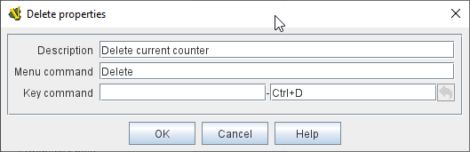

== VASSAL Reference Manual
[#top]

[.small]#<<index.adoc#toc,Home>> > <<GameModule.adoc#top,Module>> > <<PieceWindow.adoc#top,Game Piece Palette>> > <<GamePiece.adoc#top,Game Piece>> > *Delete*#

'''''

=== Delete

Adds the ability for a piece to be deleted by players during a game.

When this trait's Key Command or menu item is activated, the piece is deleted from the game.

NOTE:  When this trait is activated the piece is deleted and therefore does not do any further processing on the Key Command.
This can prevent Report Action traits from reporting the deletion, because of the <<#TraitOrder,order>> traits are processed.
Such a situation can be worked around by using a Trigger Action trait to first send a Key Command to cause a Report Action and then send a second Key Command to process the delete.
[width="100%",cols="50%a,50%a",]
|===
|

*Description:*:: An optional description for you own use.

*Menu Command:*::  Text for the right-click context menu item that will delete the piece. +
+
If left blank, no context menu item will appear, but the piece can still be deleted with the Key Command.

*Key command:*  The <<NamedKeyCommand.adoc#top,Keystroke or Named Command>> that will cause the piece to be deleted.

|

|===

Back to <<GamePiece.adoc#Traits, Trait List>>