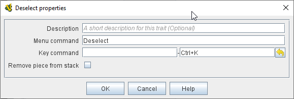

== VASSAL Reference Manual
[#top]

[.small]#<<index.adoc#toc,Home>> > <<GameModule.adoc#top,Module>> > <<PieceWindow.adoc#top,Game Piece Palette>># [.small]#> <<GamePiece.adoc#top,Game Piece>># [.small]#> *Deselect*#

'''''

=== Deselect

[cols=",",]
|===
|A <<GamePiece.adoc,Game Piece>> with this trait will have a command that causes the piece to be removed from any player selection (currently selected pieces, drag-selection, drag-and-drop grouping, etc.)

*Description:* Description of the trait - displayed only in the Editor, in the piece definer dialog.

*Menu Text:* Menu text for the _Deselect_ command for the right-click context menu. If left blank then no menu item will be displayed but the _Key Command_ can still be used.

*Key Command:* Keystroke or Named Keystroke to cause the piece to become deselected.

*Remove Piece From Stack:* If checked, then when this trait is activated the piece will _also_ be removed from any Stack it is a part of. This can be useful in games that involve "dropping off and picking up" units from armies, because a <<Marker.adoc,Place Marker>> trait will normally add the new marker to the current stack.

|

|===

=== 

'''''

