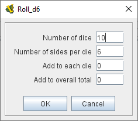
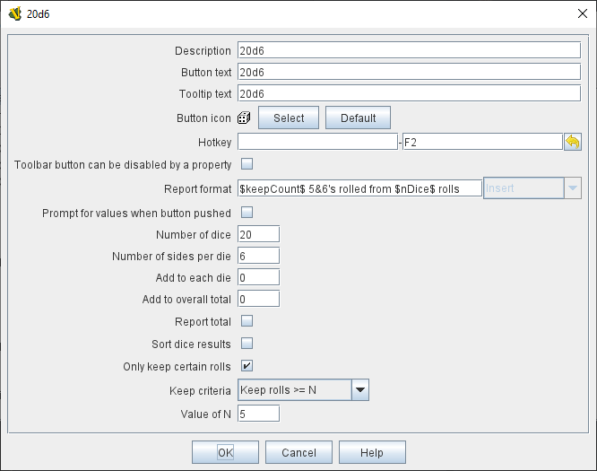
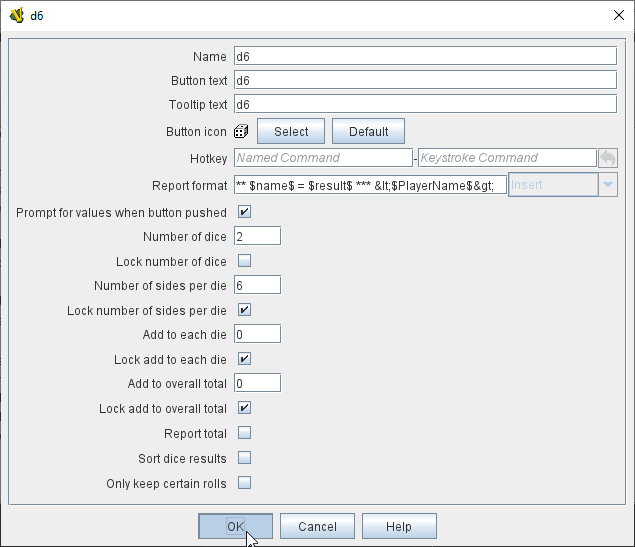
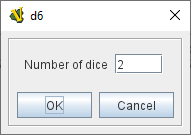

== VASSAL Reference Manual
[#top]

[.small]#<<index.adoc#toc,Home>> > <<GameModule.adoc#top,Module>> > *Dice Button*#

'''''

=== Dice Button
A Dice Button adds a toolbar button that implements the rolling and reporting of a set of Dice.

The number of dice to roll can either be fixed for every roll, or can be entered by the user for each roll.

==== Properties
A Dice Button exports its results to 3 Global Properties that are accessible from other Vassal components. These properties will keep their values until the next roll, including in save games and logs.

Each property name is of the form <DiceButtonName>_<property>. The three properties exported are:

* result - the value of the $result$ report format variable.
* total - the value of the $numericTotal$ report format variable.
* keep - the value of the $keepCount$ report format variable.

(_Example:_ A dice button is named "2d6". After a roll of 11, the Global Property named *2d6_result* will resolve to "11" until the next roll, assuming the _Report Total_ option has been checked, or "5,6" if not. The property *2d6_total* will contain "11" and the property *2d6_keep* will contain "2".

[width="100%",cols="50%a,^50%a",]
|===
|
*Name:*:: Sets the name of Dice Button. This is used for reporting and to set global <<Properties.adoc#top,Properties>> holding the results of the roll.

*Button text:*:: Text of the toolbar button.

*Tooltip text:*:: Tooltip text for the toolbar button.

*Button icon:*:: Image to use for the toolbar button.

*Hotkey:*:: A Global Hotkey that will activate the Dice Button.

**Toolbar button can be disabled by a property:**:: If this box is checked, you will be able to enable/disable the Toolbar Button by changing the value of a Global Property. See also: <<Toolbar.adoc#toolbarconfig, Toolbar Configuration>>

**Global Property to disable this button when "true"**:: The name of a <<GlobalProperties.adoc#top,Global Property>> that will control when this Toolbar Button is enabled or disabled. If the property contains the string _true_,  the button will be disabled; if it contains any other value the button will be enabled.

**Button Icon when disabled:**:: If you select an alternative icon here, then that icon will be used when the button is currently disabled. If you leave the icon empty, then the normal icon, if any, will stay in place. Any button text for the toolbar button will be greyed out when the button is disabled, regardless of your choice in this field.

*Report format:*:: specifies the <<MessageFormat.adoc#top,Message Format>> for reporting the results:
+
_$name$_::: Name of the button. +
_$result$_::: The result of the roll, either a list of the rolls, or the total of all rolls if the _Report Total_ option is checked. +
_$result#$_::: The result of each individial roll. e.g. $result1$, $result2$. +
_$numericTotal$_::: The total of all dice rolls, regardless of the setting of the _Report Total_ option. +
_$nDice$_::: The number of dice rolled. +
_$nSides$_::: The number of sides on each die. +
_$plus$_::: The modifier added to each die. +
_$addToTotal$_::: The modifer added to the total. +
_$keepDice$_::: The number of dice that were requested to be kept. This will be the _Value of N_ if one of the _keep_ options was selected, otherwise it will be the same as $nDice$. +
_$keepCount$_::: The actual number of dice that were kept.
_$rawRolls$_::: A list of the raw rolls in order before 'keeping' or sorting.
_$rawCount#$_::: The count of the number of rolls for each die side before 'keeping' or sorting. e.g. $rawCount1$ will be the raw number of '1's rolled.
_$count#$_::: The count of the number of rolls for each die side after 'keeping' or sorting. e.g. $rawCount1$ will be the raw number of '1's rolled.

*Prompt for values when button pushed:*:: When unselected, that values for the following 4 fields are fixed for all dice rolls. When selected, the user is prompted for these values in a popup window when the Dice Button is activated. Each of the four values can be locked to a specified value rather than appearing in the prompt dialog. If all 4 fields are locked, a normal dice roll with no prompting is performed

*Number of dice:*:: How many dice to roll.

*Lock number of dice:*:: Don't prompt for number of Dice, use the specified value.

*Number of sides per die:*:: What size should each die be?

*Lock umber of sides per die:*:: Don't prompt for number of sides, use the specified value.

*Add to each die:*:: A number to add to each roll.

*Lock add to each die:*:: Don't prompt for number to add to each die, use the specified value.

*Add to overall total:*:: A number to add once to the overall total result.

*Lock add to overall total:*:: Don't prompt for number to add to overall total, use the specified value.

*Report Total:*:: Controls what is stored in the _$result$_ reporting variable and the global result property. When unchecked, _$result$_ will contain a comma separated list of the individual roll results. If checked, _$result$_ will contain the roll total (same as _$numericResult$_).

*Sort dice results:*:: When checked, the rolls that are kept will be sorted in order from smallest to largest when being reported.

*Only keep certain rolls:*:: By default, every roll requested is reported and added to the total. Checking this option allows some rolls to be discarded and not included in reporting or totalling.

*Keep criteria:*:: The criteria for keeping rolls can be selected from the following options: +
_Keep rolls >= N_::: Only keep rolls greater than or equal to a specific value. +
_Keep rolls == N_::: Only keep rolls equal to a specific number. +
_Keep rolls \<= N_::: Only keep rolls less than or equal to a specific value. +
_Keep largest N rolls_::: Only keep the largest rolls.
_Keep smallest N rolls_::: Only keep the smallest rolls.

*Value of N:*:: Value to compare to when keeping specific rolls.

|
image:images/DiceButton.png[] +
_A basic Dice Button to roll 2 die 6_

 +
_Prompt for values window_

 +
_A more complex example, rolling 20 die 6 and reporting the number of 5's and 6's rolled._

 +
_A basic dice roll that prompts for the number of standard d6 die to roll each time the button is pressed_

 +
_Prompt for values window for the previous example_

|===

