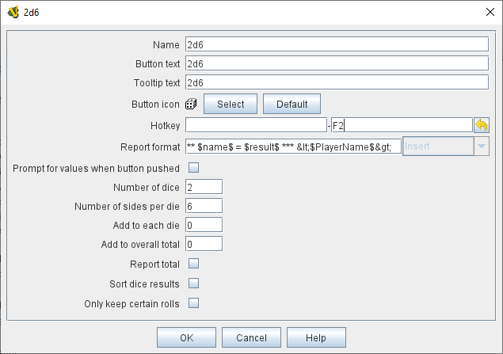

== VASSAL Reference Manual
[#top]

[.small]#<<index.adoc#toc,Home>> > <<GameModule.adoc#top,Module>> > *Dice Button*#

'''''

=== Dice Button

[width="100%",cols="50%a,^50%a",]
|===
|
*Name:* is the text accompanying the resulting roll in the Chat Log.
You may specify *Button Text* and *Tooltip Text* for the button and supply an image file to use as a *Button Icon*. You may also define a *Hotkey* that acts as a keyboard shortcut for pressing the button.
Check the _Report Total_ box to report the sum of all dice (e.g.
3-18 for 3x6-sided dice). If the box is unchecked, the dice will be reported individually (e.g.
as "2,6,3"). If the _Prompt for values_ box is checked, then players will be asked to select the number of sides/dice every time they press the dice button during a game.

*Report Format*:: specifies the <<MessageFormat.adoc#top,Message Format>> for reporting the results:
+
_$name$_: Name of the button as specified above. +
_$result$_: The result of the roll, either a list of the rolls, or the total of all rolls if the _Report Total_ option is checked. +
_$result#$_: The result of each individial roll. e.g. $result1$, $result2$. +
_$numericTotal$_: The total of all dice rolls, regardless of the setting of the _Report Total_ option. +
_$nDice$_: The number of dice. +
_$nSides$_: The number of sides. +
_$plus$_: The modifier to each die. +
_$addToTotal$_: The value added to the total.

The _$result$_ of the dice roll is stored as a global <<Properties.adoc#top,Property>> under the name <name>_result, where <name> is the name given to the component.
(_Example:_ A dice button is named "2d6" After a roll of 11, the property name $2d6_result$ will resolve to "11" until the next roll.

|

|===