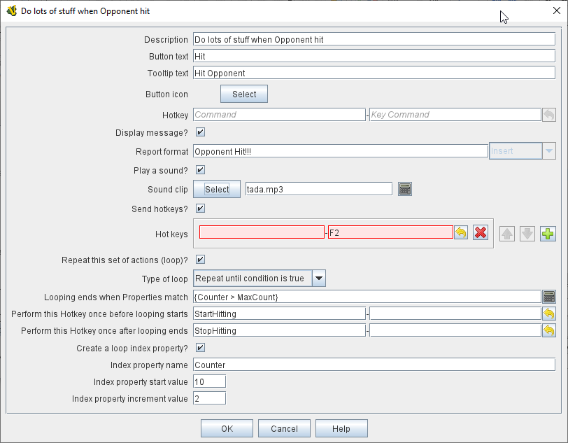

== VASSAL Reference Manual
[#top]

[.small]#<<index.adoc#toc,Home>> > <<GameModule.adoc#top,Module>> > *Action Button*# +

'''''

=== Action Button +

An Action Button component places a button on the Toolbar of the main Module window which combines a number of different actions into a single button. When the button is clicked, or receives its Hotkey, it can display a message to the Chat Log Window, Play a sound, and/or send a list of Hotkeys or <<NamedKeyCommand.adoc#top,Named Key Commands>> to other components. +
 +
To add an Action Button to your Module, find the _[Module]_ entry at the very top of the Editor's configuration window, right-click it, and select _Add Action Button_. Once you have performed the initial configuration of your new Action Button and clicked the OK button, your new _[Action Button]_ component will be found at the very bottom of the Module's list of components. +
 +
**Description: **An identifying name for this button. +
 +
**Button text: **The text of the button to be added to the Toolbar.  +
 +
**Button Tooltip text: **The tooltip text of the button to be added to the Toolbar.  +
 +
**Button Icon: **Icon for the Toolbar button. +
 +
**Hotkey: **Keyboard shortcut or <<NamedKeyCommand.adoc#top,Named Key Command>> for the Toolbar button. +
 +
**Display Message? **Select to display a message to the chat log when the Action Button is clicked or its Hotkey received. +
 +
**Report Format: **<<MessageFormat.adoc#top,Message Format>> to report to the chat log. +
 +
**Play a sound? **Select to play a sound clip when the button is activated. +
 +
**Sound Clip: **The Sound clip file to be played. +
 +
**Send Hotkeys? **Select to send Hotkeys to other components when the button is activated. +
 +
**Hot Keys: **The list of Hotkeys or <<NamedKeyCommand.adoc#top,Named Key Commands>> to be sent. Use the New button to add another key, or the Remove buttons to remove existing keys. *NOTE:* because these are _Global Hotkeys_ rather than _Global Key Commands_, they are sent to Module and Map Toolbar components, _not_ to individual Game Pieces. Of course a Hotkey could be used to activate a Global Key Command component which could then affect individual Game Pieces. +
 +
**Repeat this set of actions (Loop)? **Allows you to perform the specified actions multiple times. +
 +
**Repeat fixed number of times **This loop option allows you to repeat the set of actions a specified number of times. +
 +
**Repeat while condition is true **This loop option allows you to repeat the set of actions while a <<PropertyMatchExpression.adoc#top,Property Expression>> remains true. If the expression begins the loop already false, the actions will not be performed at all (compare "until", below). +
 +
**Repeat until condition is true **This loop option allows you to repeat the set of actions until a <<PropertyMatchExpression.adoc#top,Property Expression>> becomes true. The set of actions will be performed at least once. +
 +
**Loop how many times? **An <<Expression.adoc#top,Expression>> that defines how many times to generate the set of actions (for a fixed loop). +
 +
**Loop while/until condition is true: **Enter the <<PropertyMatchExpression.adoc#top,Property Expression>> that controls how long to keep looping (for a while or until loop). +
 +
**Perform this KeyStroke once before looping starts: **For all loop types, enter a HotKey or <<NamedKeyCommand.adoc#top,Named Key Command>> that will be performed once before the looping process commences. +
 +
**Perform this KeyStroke once after looping complete: **For all loop types, enter a HotKey or <<NamedKeyCommand.adoc#top,Named Key Command>> that will be performed once after the looping process finishes. +
 +
**Create a Loop Index Property? **For all loop types, allows you to create a Property whose value will changes as the looping process proceeds. +
 +
**Index Property Name: **The name of the property that will be created. +
 +
**Index Property start value: **An <<Expression.adoc#top,Expression>> that sets the value of the index property prior to looping commencing. The expression must evaluate to a whole number. +
 +
**Index Property increment value: **An <<Expression.adoc#top,Expression>> that defines how much will be added to the Index Property at the start of each loop. The expression must evaluate to a whole number. +
 +

 +
