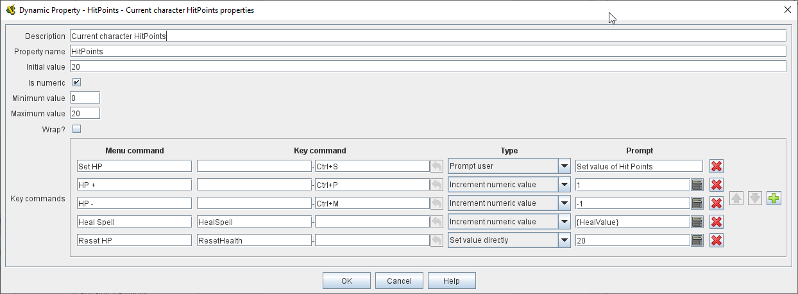

== VASSAL Reference Manual
[#top]

[.small]#<<index.adoc#toc,Home>> > <<GameModule.adoc#top,Module>> > <<PieceWindow.adoc#top,Game Piece Palette>> > <<GamePiece.adoc#top,Game Piece>> > *Dynamic Property*#

'''''

=== Dynamic Property

This trait attaches a <<Properties.adoc#top,Property>> to a Game Piece and allows you to define commands to change the value of the property during play.

*Name:*  The name of the property.
Any other trait of this piece can reference this name in an <<Expression.adoc#top,Expression>> or <<MessageFormat.adoc#top,Message Format>> to check or display its value.

*Value:*  The value of the property at the start of a new game or when a piece is first created.

*Is numeric:*  If true, then changes to the value of the property will be restricted to integer values.

*Minimum value:*  Numeric values will be restricted to no less than this number whenever an _Increment numeric value_ or _Prompt user_ operation is performed.
Note that _Set Value Directly_ operations will _not_ honor this constraint.

*Maximum value:*  Numeric values will be restricted to no more than this number whenever an _Increment numeric value_ or _Prompt user_ operation is performed.
Note that _Set Value Directly_ operations will _not_ honor this constraint.

*Wrap:*  If true, then when incrementing this numeric property, values will wrap around from the maximum to the minimum and vice versa.

*Key commands*  Adds any number of commands to the right-click context menu for this Game Piece.
Click the List Control buttons on the right-hand side of the list to add, remove or re-order commands.

For each command:

*Menu Command:* Right-click context menu item that will initiate this operation (can be left blank if only the Key Command portion is to be used).

*Key command:* <<NamedKeyCommand.adoc#top,Keystroke or Named Command>> that will initiate this operation.

*Type:* Select the way in which this command will change the property:

* _Set value directly:_  Set the property directly to the value of the <<Expression.adoc#top,Expression>> entered in the *New Value* field.
*Note:* When setting the value of a _numeric_ property directly with this option, the Minimum/Maximum constraints are _not_ honored.
* _Increment numeric value:_  Increment the value of the property by the value of the <<Expression.adoc#top,Expression>> entered in the *Increment by* field.
Maximum/Minimum constraints will be honored.
* _Prompt user:_  Pop up a dialog and ask the player for a new value for the property.
They will be prompted for a new value using the text prompt entered in the *Prompt* field.
* _Prompt user to select from list:_  Similar to _Prompt User_ but displays a list of items to select from in a drop-down menu.
The items in the list can be generated dynamically by <<Expression.adoc#top,Expressions>>.

*SEE ALSO:*  <<PropertyMarker.adoc#top,Marker>>, <<SetGlobalProperty.adoc#top,Set Global Property>>

'''''
