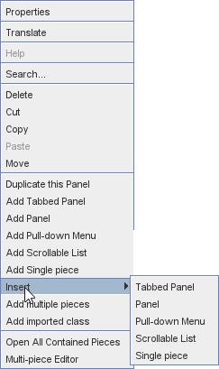

== VASSAL Reference Manual
[#top]

[.small]#<<index.adoc#toc,Home>> > *Editor*#

'''''

=== Module Editor

VASSAL's Module Editor can be used to create new modules, modify existing ones, and add extensions to them.
When you open a module for Edit (or select the "New Module" option), you will be presented with a Configuration Window showing the module's <<GameModule.adoc#top,Components>>, which will contain the <<Properties.adoc#top, Properties>>, <<Expression.adoc#top, Expressions>>, and <<GamePiece.adoc#top, Game Pieces>> that make up a module.

The Configuration Window is used to edit either a <<GameModule.adoc#top,Module>> or a <<Extension.adoc#top,Module Extension>>. The menu bar of the Configuration Window offers the following actions:

* *File*: Save the module or save it to a different file.
* *Help*: This reference manual.
* *Translate:* Help <<Translations.adoc#top,translate>> VASSAL into another language

<<Folder.adoc#top,Folders>> can be created under many components and nested to any depth to help organise the parts that make up your module.

'''''

==== Editing Modules

[width="100%",cols="50%a,^50%a",]
|===
a|
All modifications to a module are done through the Configuration Window, which is a familiar file/folder type browser in which each file/folder represents a module <<GameModule.adoc#top,Component>>. Right-click on any Component to get a context menu with options for that Component.
Use the _Cut_, _Copy_, _Paste_, and _Move_ commands to move Components around within the module, and use the _Search_ command from the _Edit_ menu if you need to find one.

Double-clicking a component opens it for editing. *Tip:* You can affect _where_ the configuration window opens by holding down the _shift_ key, _alt_ key, _ctrl_ key, or some combination thereof while double-clicking.

  // Ctrl+Alt                         Ctrl+Shift
  //
  // Alt                Ctrl            Shift
  //
  // Ctrl+Alt+Shift                   Alt+Shift

===== Properties

Brings up a dialog in which you specify the options for that components
Double-clicking on a component also brings up its Properties dialog.

===== Translate
Opens the Vassal module <<Translations.adoc#top,translation>> facility for translating the text in your module into another language. The Translation facility is opened for this component and all defined below it. Select Translate on the GameModule to translate the entire module at once.

===== Help
Opens the Vassal Reference Manual page for this component.

===== Search...

This Edit menu option lets you search for Components by name or by class name (the class name of a Component is the "type" of Component it is, enclosed in square braces in the Editor's Configuration Window, such as a "Map Window"). The search will commence from the currently selected Component.

The <<Search.adoc#top,search>> panel offers options to search for most component details too.

===== Delete

Deletes the component from the module.

===== Cut

Makes a copy of the component in the clipboard and deletes the component after the next Paste command successfully inserts the component into a new location.

===== Paste

Pastes the component in the clipboard into the currently selected component. The Paste command will be disabled if it is illegal to paste the contents of the clipboard in the current location.

===== Move

Pops up a dialog that allows the piece to be moved to a new location within the current component.

NOTE: You can also use Drag and Drop to move a component within the current component, but also to cut and paste it into a different component.

===== Help

Brings up the corresponding page in this manual.

===== Duplicate this ...

Creates a copy of the current component, inserts in the immediately following position and opens its configuration window.

===== Add ...

Adds a sub-component to this component. The different types of sub-components that are allowed within the current component each have a separate menu entry. This command is only valid on the containing component and adds a new sub-component at the bottom.

===== Insert ->

Provides a sub-menu of sub-components that can be inserted into the containg component at this point. This command is only valid on the sub-components within a component. It is a short-cut to Adding a component, then Moving it from the bottom up to where you need it.

===== Add multiple pieces

When configuring a component that can hold Game Pieces or Cards, this option opens the <<MassPieceLoader.adoc#top,Mass Piece Loader>> that allows your to create multiple similar pieces at once based on a template and using a folder of images.

===== Add imported class

Allows you to import an appropriate custom java class at this point in the module hierachy.

===== Import Deck File

Allows you to import a file saved from a <<Deck.adoc#top,Deck>> (one configured to allow saving its cards) into the module, as permanent cards. _Warning_: any prototypes used in the cards will have been fully expanded (replaced recursively by the individual traits in the prototypes), so further changes to the original prototypes will no longer change any of the imported cards even if the Game Refresher is run.

===== Open all contained pieces

When configuring a component that can hold Game pieces or Cards, will open all pieces within the component in separate <<PieceWindow.adoc#top,Piece Editor Windows>>

===== Multi-piece editor

When configuring a component that can hold Game pieces or Cards, this option opens a special Piece Editor window that attempts to edit all containing pieces at once and make the same changes to each one.

WARNING: Use with caution and backup your module first. This option works best when all pieces in the component have the same trait structure. Using the Multi-piece editor on widely differing pieces can have unpredictable results.

==== Module Components

See the <<GameModule.adoc#top,Module>> page for a list of Components that can be added to modules.

|image:images/configuration_window.png[]

_Main Vassal coniguration window._

_Typical right-click menu._
|===

