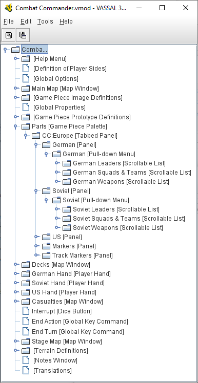

== VASSAL Reference Manual
[#top]

[.small]#<<index.adoc#toc,Home>> > *Editor*#

'''''

=== General

VASSAL's Module Editor can be used to create new modules, modify existing ones, and add extensions to them.
When you open a module for Edit (or select the "New Module" option), you will be presented with a Configuration Window showing the module's <<GameModule.adoc#top,Components>>.

The Configuration Window is used to edit either a <<GameModule.adoc#top,Module>> or a <<Extension.adoc#top,Module Extension>>. The menu bar of the Configuration Window offers the following actions:

* *File*: Save the module or save it to a different file.
* *Help*: This reference manual.
* *Translate:* Help <<Translations.adoc#top,translate>> VASSAL into another language

'''''

==== Editing Modules

[width="100%",cols="50%,50%",]
|===
a|
All modifications to a module are done through the Configuration Window, which is a familiar file/folder type browser in which each file/folder represents a module <<GameModule.adoc#top,Component>>. Right-click on any Component to get a context menu with options for that Component.
Use the _Cut_, _Copy_, _Paste_, and _Move_ commands to move Components around within the module, and use the _Search_ command from the _Edit_ menu if you need to find one.

Double-clicking a component opens it for editing. *Tip:* You can affect _where_ the configuration window opens by holding down the _shift_ key, _alt_ key, _ctrl_ key, or some combination thereof while double-clicking.

===== Properties

Brings up a dialog in which you specify the options for that components.
Double-clicking on a component also brings up its Properties dialog.

===== Search

This option from the Edit menu lets you search for Components by name or by class name (the class name pf a Component is the "type" of Component it is, enclosed in square braces in the Editor's Configuration Window, such as a "Map Window").

===== Delete

Deletes the component from the module.

===== Clone

Makes an exact copy of the component and inserts it after the existing component.

===== Help

Brings up the corresponding page in this manual.

===== Add ...

Adds a sub-component to this component

==== Module Components

See the <<GameModule.adoc#top,Module>> page for a list of Components that can be added to modules.

|+
|===

