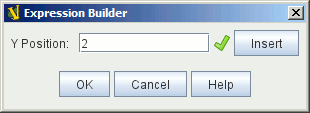
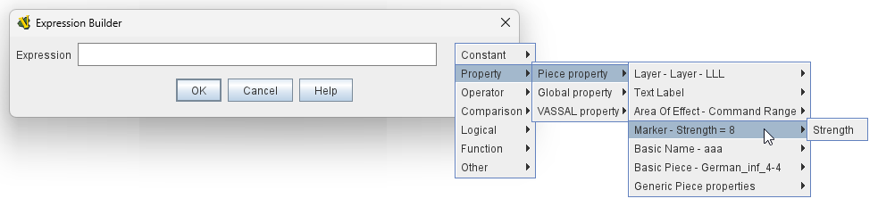
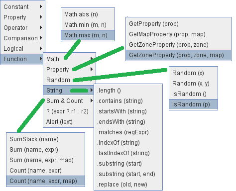

== VASSAL Reference Manual
[#top]

[.small]#<<index.adoc#toc,Home>> > *Expression Builder*#

'''''

=== Expression Builder

[width="100%",cols="50%,50%",]
|===
a|

|
|===

The Expression Builder is access by clicking on the Calculator image:images/calculator.png[] icon located to the immediate right of each Expression field.
It assists with building valid BeanShell Expressions,

As you type the green tick or red cross indicate whether the syntax of the current expression is valid or not.

The _Insert_ button displays a pop-up menu showing the components of the BeanShell Language and the valid Properties available in the current counter or component.

NOTE: While using the Expression Builder, use of the Insert button is optional: it is always acceptable to type in BeanShell expressions by hand.
