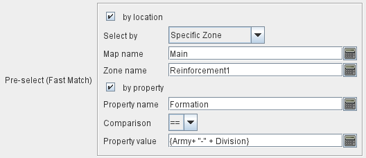

== VASSAL Reference Manual
[#top]

[.small]#<<index.adoc#toc,Home>> > <<GameModule.adoc#top,Module>> > <<PieceWindow.adoc#top,Game Piece Palette>># [.small]#>  <<GamePiece.adoc#top,Game Piece>># [.small]#> <<GlobalKeyCommand.adoc#top,Global Key Command>> > Fast Match#

[.small]#<<index.adoc#toc,Home>> > <<GameModule.adoc#top,Module>> > <<Map.adoc#top,Map>> > <<Map.adoc#GlobalKeyCommand,Global Key Command>> > *Fast Match*#

'''''

=== Fast Match (Global Key Command pre-select)

New from VASSAL 3.5, the *Fast Match* selections can be used to improve the performance of "slow" Global Key Commands by pre-matching the location and/or a single property value of the target piece. Essentially these run limited but much faster comparisons, to screen out some of the potentially hundreds of pieces needing to be checked for each Global Key Command.

Fast Match expressions are _optional_ in that the same comparisons can always be run in the standard "Additional matching expression" field. Judicious use of them, however, can improve the performance of a Global Key Command by 25-33%.

You should aim to choose Fast-match conditions that exclude as many pieces as possible from the not Fast-match condtion checking.

[width="100%",cols="50%a,^50%a",]
|===
|

*by location?*;; If this box is checked, potential target pieces will be pre-filtered based on their locations.

*Select By:*::: Selects the type of Location-based filtering that will be done on target pieces.
+
*_Current Stack or Deck_* - Only pieces in the same Stack or Deck as the issuing piece will be checked. This type of filtering, when applicable, is _very fast_.
+
*_Current Map_* - Only pieces on the same Map as the piece issuing the Global Key Command will be checked.
+
*_Current Zone_* - Only pieces in the same Zone (and therefore Map) as the piece issuing the Global Key Command will be checked.
+
*_Current Location_* - Only pieces in the same Location (i.e. LocationName property the same) as the piece issuing the Global Key Command will be checked.
+
*_Current Mat_* - If this piece is a Mat, or if it is a Mat Cargo piece that is currently _on_ a Mat, then the Mat itself and all of its current Cargo will be checked.
+
*_Specific Map_* - Only sends to pieces that are on the Map matching the supplied expression. The _expression_ is evaluated against the properties of the _source_ piece, i.e. the piece issuing the Global Key Command, but then the result of the expression is compared to the Map of potential _target_ pieces to determine if they are valid targets.
+
*_Specific Zone_* - Only sends to pieces that are in the Zone matching the supplied expression (an optional Map expression can be supplied as well). The _expressions_ are evaluated against the properties of the _source_ piece, i.e. the piece issuing the Global Key Command, but then the results of the expressions are compared to the CurrentZone (and optionally CurrentMap) of potential _target_ pieces to determine if they are valid targets.
+
*_Specific Location_* - Only sends to pieces that are in the Location matching the supplied expression (an optional Map expression can be supplied as well). The _expressions_ are evaluated against the properties of the _source_ piece, i.e. the piece issuing the Global Key Command, but then the results of the expressions are compared to the LocationName (and optionally CurrentMap) of potential _target_ pieces to determine if they are valid targets.
+
*_Specific X,Y Position_* - Only sends to pieces that are at the X,Y location matching the supplied expressions (optional Map and Board expressions can be supplied as well). The _expressions_ are evaluated against the properties of the _source_ piece, i.e. the piece issuing the Global Key Command, but then the results of the expressions are compared to the CurrentX and CurrentY (and optionally CurrentMap and CurrentBoard) of potential _target_ pieces to determine if they are valid targets.

*by property?*;; If this box is checked, a _single_ property of the target will be checked to determine if it is a valid target. This search will be performed more quickly than a similar search in the _Additional Matching Expression_ field.

*Property Name*::: Can be a simple string containing the name of a property in potential target pieces to be checked, _or_ an expression to be evaluated against the _source_ piece (the piece issuing the Global Key Command). The result of evaluating the expression is then used to find a property name in the potential _target_ piece.

*Comparison*::: The type of comparison to be done with the value of the property specified above. Can be equals, not-equals, greater, greater-or-equal, less than, less-than-or-equal, or can be matches or non-matches a regular expression.

*Property Value*::: Can be a simple string or number containing a specific value which will be compared to the value of the property specified above, _or_ an expression to be evaluated against the _source_ piece (the piece issuing the Global Key Command). The result of evaluating the expression is then used as the value to be compared against the property specified above using the comparison specified above.
|

|===

