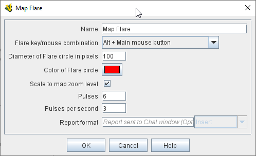

== VASSAL Reference Manual
[#top]

[.small]#<<index.adoc#toc,Home>> > <<GameModule.adoc#top,Module>> > <<Map.adoc#top,Map>> > *Flare*#

'''''

=== Flare

[cols="a,a",]
|===
|When added to a <<Map.adoc#top,Map>>, this component allows a player to "send up a flare" at any location on the map in order to attract other players' attention. The flare is sent by clicking on the desired location while holding down a designated modifier key (or set of them). Flares can be used both in online games (where they are sent to other players connected to the server), and in PBEM games (where they are shown to players who replay the log file).

A <<Flare.adoc#top,Flare>> component is automatically added to every map, starting in VASSAL 3.5. Additional flares can be added if desired.

To add a Flare component to a map, navigate to the appropriate _[Map]_ component in the Editor.
Right click on the <<Map.adoc#top,Map>> component and select _Add Flare_.
The new component will appear at the bottom of your map's list of sub-components. You can then
edit the properties for your new Flare.

*Name:* The name for the Flare, used to distinguish it among any others you add. The Flare's
name can also be referred to in the _Report Format_ field, below.

*Flare Key/Mouse Combination:* The combination of modifier keys and mouse click that will initiate this Flare. The default is _Alt+Left Click_, but
a variety of other combinations can be selected. _Note: the Ctrl+Click option is provided for modules which previously used a custom class to achieve the Flare effect with that key combination and would like to upgrade to the VASSAL Flare, but it is
not the recommended keystroke combination as it conflicts with the standard Ctrl+Click to select/deselect UI convention._

*Diameter of Flare Circle in Pixels:* This will be the pixel diameter of the Flare effect that is drawn on the map (or the maximum diameter if
animation is selected).

*Color of Flare Circle:* Allows the color of the Flare Circle to be specified.

*Scale to Map Zoom Level:* If checked, the size of the Flare effect will vary based on the current zoom level of the map. If unchecked,
the Flare will use a constant size at all zoom levels.

*Pulses (0 for no animation):* Defines the number of "pulse" cycles the Flare will animate through when it is activated. If this value is zero,
there will be no animation and the Flare will simply be a constant circle for its duration.

*Pulses per Second (0 for no animation):* Defines the speed of the pulsing effect.

*Report Format:* A message format to be displayed in the <<ChatLog.adoc#top,Chat Log>> when a Flare activates. Properties available to display in the message include the _$PlayerName$_, _$PlayerSide$_, and _$PlayerId$_
of the player initiating the Flare. The _$FlareName$_ can be referenced, as well as the _$FlareLocation$_, _$FlareZone$_, and _$FlareMap$_.

| +
[.text-center]
_Configuring a Flare_
 +
 +
 +

image:images/Flare2.png[align=center]
[.text-center]
_A Flare appears as a pulsing circle._
|===

=== 

'''''

