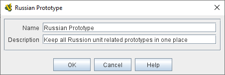

== VASSAL Reference Manual
[#top]

[.small]#<<index.adoc#toc,Home>> > <<Editor.adoc#top,Editor>> > *Folder*#

'''''

=== Folder

Folders can be created under many components to group together similar sub-components. For example, you can create Folders under the _Global Properties_ component to organise sets of Properties, or under the _Prototype Definitions_ to organise your prototypes.

Folders can be nested to any depth and are transparent to Vassal. Whatever is stored in a Folder, is seen as stored under the top-level component that contains the nest of Folders.

[width="100%",cols="50%a,^50%a",]
|===
|*Name:*:: The name for the Folder that will appear in the Editor window.

*Description:*:: An optional description to remind you what this folder is for.

| +
[.text-center]
_Configuring a Folder_

|===

