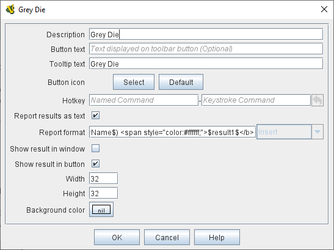

== VASSAL Reference Manual
[#top]

[.small]#<<index.adoc#toc,Home>> > *Module*#

'''''

[#module]
=== Module

The Module is the top component in the <<editor.adoc#top,Editor>> Configuration Window.
Its properties are simply the name of the game, a version number, and a description.
These properties are each displayed separately their own columns when the module is listed in the Module Manager that appears when Vassal starts up.
The version number is used to warn users who attempt to load save files created by a _later_ version of a module into an _earlier_ one.

All additions and modifications to a module are done through the <<editor.adoc#top,Configuration Window>>, also frequently referred to as the <<editor.adoc#top,Editor>> window, which is a familiar file/folder type browser in which each file/folder represents a module Component.
The second illustration on the right shows the Editor's configuration window for a "Brand New Module", with all of the Components that are added by default.
Right-click on the _[Module]_ to get a context menu with options for the many types of <<#SubComponents,Components>> you can add to a Vassal module, including <<Map.adoc#top,maps>>, <<ChartWindow.adoc#top,charts>>, and <<PieceWindow.adoc#top,palettes>> full of <<GamePiece.adoc#top,game pieces>>. See <<#SubComponents,below>> for more details.

Actually _playing_ the game takes place in the Module window (see example below). This window includes a <<Toolbar.adoc#top,Toolbar>> that can be configured by the module designer, as well as a <<ChatLog.adoc#top,Chat Log>> to record player messages and game moves.
The game's main <<Map.adoc#top,Map>> will be displayed just below the Chat Log.

=== Module Window
The illustration below shows the main Module controls window during play, including the <<Toolbar.adoc#top,Toolbar>>, a <<PieceWindow.adoc#top,Game Piece Palette>>, and the <<ChatLog.adoc#top,Chat Log>>. The mapboard would appear below it.

image:images/ModuleWindow.png[]

=== Module Properties
Double-clicking the [Module] component in the editor (or right-clicking and selecting "Properties" from the context menu), the module properties dialog will appear (see example below). Here you should enter the name of the game your module implements. You can also enter a version number, a description, and optional additional information that you wish.

Any of these properties is visible to the module itself as a <<GlobalProperties.adoc#top, Global Property>>, so for example you could refer to the module version number in a <<MessageFormat.adoc#top,Message Format>> as _$ModuleVersion$_.

image:images/GameModule.png[]

=== Editor Window
The Editor window (shown below with the [Module] component highlighted) lists the module and all of its components. Right-click on the _[Module]_ to get a context menu with options for the many types of <<#SubComponents,Components>> you can add to a Vassal module, including <<Map.adoc#top,maps>>, <<ChartWindow.adoc#top,charts>>, and <<PieceWindow.adoc#top,palettes>> full of <<GamePiece.adoc#top,game pieces>>. See <<#SubComponents,below>> for more details.

image:images/BrandNewModule.png[]

'''''

=== Toolbar

image:images/Toolbar.png[]

The <<Toolbar.adoc#top,Toolbar>> of the main Module window contains buttons for basic functions such as <<Toolbar.adoc#Undo,Undo>>, <<Toolbar.adoc#StepForward,Step Forward>>, and <<Toolbar.adoc#ServerControls,Server Controls>>, but you can also configure buttons to <<SpecialDiceButton.adoc#top,roll dice>>, <<PieceWindow.adoc#top,add pieces to the map>>, display <<Chartwindow.adoc#top,charts>> and <<Map.adoc#top,maps>>, keep <<PlayerHand.adoc#top,player hands>> and <<PrivateWindow.adoc#top,reinforcement pools>> private, and more.

Buttons for basic functions are created by configuring the existing basic components of the module, such as <<GlobalOptions.adoc#top,Global Options>> and the <<#Definition_of_Player_Sides,Definition of Player Sides>>.

Buttons for Maps, Charts, Dice, and other additional buttons are created by adding new <<SubComponents,Sub-Components>> to the Module.

<<Toolbar.adoc#top,See full article for more details.>>

'''''

[#ChatLog]
=== <<ChatLog.adoc#top,Chat Log>>
[width="100%",cols="^40%,60%",]
|===
|image:images/ChatLog.png[]
|Every game module contains exactly one Chat Log, and it always appears in the main Module window just underneath the toolbar.
It exists by default and cannot be removed in the Editor.
The chat log not only allows players to "chat" with each other by typing messages into the lower text line, it also displays a running "log" of game events -- messages produced by <<ReportChanges.adoc#top,Report Action>> traits and other <<MessageFormat.adoc#top,Message Formats>> in traits and various module components.
Messages from your components can be displayed in a variety of colored, bold, and italicized fonts, as the chat log provides substantial HTML support to create a visually attractive and easy-to-read report log.

<<ChatLog.adoc#top,See full article for details.>>
|===

'''''

[#SubComponents]
=== Sub-Components
[width="100%",cols="60%,^40%",]
|===
a|A proper module consists of many different types of subcomponents.
Any of them can be added by right-clicking on the _[Module]_ component in the Module Editor (the very top entry in the editor) and then selecting the appropriate _Add_ option.

|image:images/BrandNewModule.png[]
|===

[cols=",,,,",]
|===
|<<DoActionButton.adoc#top,Action Button>>|<<ChartWindow.adoc#top,Chart Window>>|<<ChatLog.adoc#top,Chat Log>>|<<ChessClock.adoc#top,Chess Clock Control>>|<<#Definition_of_Player_Sides,Definition of Player Sides>>
|<<#DiceButton,Dice Button>>|<<GamePieceImageDefinitions.adoc#top,Game Piece Image Definitions>>|<<Inventory.adoc#top,Game Piece Inventory Window>>|<<PieceWindow.adoc#top,Game Piece Palette>>|<<Prototypes.adoc#top,Game Piece Prototype Definitions>>
|<<Map.adoc#GlobalKeyCommand,Global Key Command>>|<<GlobalOptions.adoc#top,Global Options>>|<<GlobalProperties.adoc#top,Global Properties>>|<<GlobalTranslatableMessages.adoc#top, Global Translatable Messages>>|<<HelpMenu.adoc#top,Help Menu>>
|<<Map.adoc#top,Map Window>>|<<MultiActionButton.adoc#top,Multi-Action Button>>|<<#NotesWindow,Notes Window>>|<<PlayerHand.adoc#top,Player Hand>>|<<#PredefinedSetup,Predefined Setup>>
|<<PrivateWindow.adoc#top,Private Window>>|<<#RandomTextButton,Random Text Button>>|<<SpecialDiceButton.adoc#top,Symbolic Dice Button>>|<<Toolbar.adoc#top,Toolbar>>|<<ToolbarMenu.adoc#top,Toolbar Menu>>
|<<TurnTracker.adoc#top,Turn Counter>>||||
|===

'''''

==== <<HelpMenu.adoc#top,Help Menu>>
[width="100%",cols="66%,33%",]
|===
a|Every module has a Help entry on the main menu of its control window.
Only one Help menu is allowed, and it may not be removed.
See the <<HelpMenu.adoc#top,full article>> for details on how to add items to the Help Menu.
|image:images/HelpMenu.png[]
|===

[#Definition_of_Player_Sides]
==== Definition of Player Sides
[width="100%",cols="40%,60%",]
|===
|
|There is no requirement to define player sides for a module.
If you define no sides, then all windows and all game pieces are visible and accessible to all players.

If you wish to create components that are available only to one side in a game (e.g.
a <<PrivateWindow.adoc#top,Private Window>>), you must define the player sides here.
Simply type a name for each side and refer to that name in the restricted component(s).

Only one player may be assigned to a side.
When joining a game, players will be prompted to take one of the remaining available sides.
Any number of observers (players who belong to no side) are allowed.
The <<Toolbar.adoc#Retire,Retire>> or <<Toolbar.adoc#SwitchSides,Switch Sides>> button, in the main controls toolbar, allows a player to relinquish their side (making it available to the next player joining the game). You can specify the text, icon, and mouse-over tooltip for the toolbar button.
|===

==== <<GlobalOptions.adoc#top,Global Options>>
[width="100%",cols="60%,40%",]
|===

|A set of options that apply to the module overall.
Every module will have one Global Options entry; it can be edited but cannot be removed.

The Global Options component allows you to define your own custom preferences for a module.
It also contains other settings that apply to the module as a whole, as well as providing a location to configure button images and hotkeys for some of the basic Toolbar buttons.
If an option has a _Use Preferences Setting_ choice, selecting it will add an entry to the Preferences window to allow players to choose their own setting at game time.

<<GlobalOptions.adoc#top,See full article for details.>>

|image:images/GlobalOptions.png[]
|===

==== <<Map.adoc#top,Map Window>>
[width="100%",cols="40%,60%",]
|===
|image:images/Map.png[]
|A Map Window contains the main interface for playing games with VASSAL.
It displays the playing surface on which the players move <<GamePiece.adoc#top,Game Pieces>> by dragging and dropping with the mouse.
It is possible to have two or more Map Windows; the players may drag and drop pieces between the different windows.
A Map Window should be configured with at least one <<Board.adoc#top,Board>> (in the "Map Boards" component).

A Map Window is most commonly used to display a <<Board.adoc#top,Board>> on which <<PieceWindow.adoc#top,pieces>> can be moved, although Map Windows can also be used to display e.g.
reinforcement cards, charts and tables, and so forth.
By default, every module has one Map Window, although it may be removed and others added.

There are also specialized Map Windows, called <<PrivateWindow.adoc#top,Private Windows>> and <<PlayerHand.adoc#top,Player Hands>> to contain pieces that are private to one player or side.

<<Map.adoc#top,See full article for details.>>
|===

==== <<PieceWindow.adoc#top,Game Piece Palette>>
[width="100%",cols="60%,40%",]
|===
|A Game Piece Palette allows an unlimited supply of new <<GamePiece.adoc#top,pieces>> to be created and added to the game.
Some modules use them exclusively to create pieces whose supply is not limited by the game rules (e.g.
control markers); other modules provide palettes from which any type of piece can be created so that players and designers can use them to set up game scenarios.
By default, every module has one Game Piece Palette, although it may be removed and/or more may be added.

<<PieceWindow.adoc#top,See full article for details.>>

|image:images/PaletteExample.png[]
 +
 +
image:images/PieceWindow.png[]
|===

==== <<Prototypes.adoc#top,Game Piece Prototype Definitions>>
[width="100%",cols="40%,60%",]
|===
|image:images/PrototypeComponent.png[]
|Game Piece Prototypes allow you to define sets of commonly-used traits for various types of <<GamePiece.adoc#top,Game Pieces>>. For example you could give all of your cards a particular back and a key command to send it to the discard pile, without having to cut-and-paste those traits into every single one of your cards.
This also has the advantage of allowing you to change these traits in one place and have the changes affect every one of the pieces assigned to the Prototype.

<<Prototypes.adoc#top,See full article for details.>>
|===

==== <<GlobalProperties.adoc#top,Global Properties>>
[width="100%",cols="60%,^40%",]
|===
|Allows you to define default numeric or string values for <<Properties.adoc#top,Global Properties>> which can then be referenced and modified by <<SetGlobalProperty.adoc#top,traits>> in your Game Pieces.
Global Properties work much like "global variables" in programming, in that they are accessible to any piece or component in your module.

<<GlobalProperties.adoc#top,See full article for details.>>

|
|===

==== <<ToolbarMenu.adoc#top,Toolbar Menu>>
[width="100%",cols="40%,60%",]
|===
|image:images/ToolbarMenuExample.png[]
 +
 +
 +
image:images/ToolbarMenu.png[]
|Groups buttons in the Toolbar into a single drop-down menu.
Each button named in this component will be removed from the Toolbar and instead appear as a menu item in the drop-down menu.

<<ToolbarMenu.adoc#top,See full article for details.>>
|===

==== <<MultiActionButton.adoc#top,Multi-Action Button>>
[width="100%",cols="60%,40%",]
|===
|Combines multiple buttons in a Toolbar into a single button.
The named buttons are removed from the Toolbar and a new button is added.
Clicking this button automatically invokes the actions of all the other buttons in the order given.

<<MultiActionButton.adoc#top,See full article for details.>>
|image:images/MultiActionButton.png[]
|===

==== <<DoActionButton.adoc#top,Action Button>>
[width="100%",cols="40%,60%",]
|===
|image:images/DoActionButtonShort.png[]
|A Toolbar button that displays a message, plays a sound, and/or sends Hotkeys.

An Action Button component places a button on the Toolbar of the main Module window which combines a number of different actions into a single button.
When the button is clicked, or receives its Hotkey, it can display a message to the <<ChatLog.adoc#top,Chat Log>>, Play a sound, and/or send a list of Hotkeys or <<NamedKeyCommand.adoc#top,Named Key Commands>> to other components.

<<DoActionButton.adoc#top,See full article for details.>>
|===

==== <<TurnTracker.adoc#top,Turn Counter>>
[width="100%",cols="60%,40%",]
|===
|Creates a Toolbar item that can be used to track the current game turn and phase.

A Turn Counter places a button and/or widget on the Toolbar of the Module window which keeps track of the current turn/phase/sub-phase, etc.
of a game.
Players can advance the turn forward or backward, or optionally jump directly to a turn.

<<TurnTracker.adoc#top,See full article for details.>>

|image:images/TurnTrackerTurnWindow.png[]
|===

==== <<GamePieceImageDefinitions.adoc#top,Game Piece Image Definitions>>
[width="100%",cols="40%,60%",]
|===
|image:images/GamePieceImageDefinitions.png[]
|Allows you to build your own layouts and images for simple game counters without the need for an external art tool.

Within the Game Piece Image Definitions you can build your own images by combining text, images, and standard NATO symbols.
Images defined in this component will appear in the drop-down menu for selecting images for any Trait of any <<GamePiece.adoc#top,Game Piece>> just like an imported GIF, JPEG, or PNG.

<<GamePieceImageDefinitions.adoc#top,See full article for details.>>

|===

==== <<Map.adoc#GlobalKeyCommand,Global Key Command>>
[width="100%",cols="50%,50%",]
|===
|Creates a button on the Toolbar that applies a given key command or <<NamedKeyCommand.adoc#top,Named Key Command>> to many pieces at once.
Applies to <<GamePiece.adoc#top,Game Pieces>> on all <<Map.adoc#top,Map Windows>> simultaneously.

See full article for details.
|image:images/GlobalKeyCommand.png[]
|===

==== <<Inventory.adoc#top,Game Piece Inventory Window>>
[width="100%",cols="40%,60%",]
|===
|image:images/InventoryWindow.png[]
|Creates a Toolbar button that will open a window which summarizes the pieces in the current game.
You can define exactly which pieces are included in the window and howthey are organized.
Can be configured to select a particular subset of pieces and to organize them by their properties.

<<Inventory.adoc#top,See full article for details.>>
|===

[#SpecialDiceButton]
==== <<SpecialDiceButton.adoc#top,Symbolic Dice Button>>
[width="100%",cols="60%,40%",]
|===
|Rolls dice whose faces are represented by graphical images.

A Symbolic Dice Button places a button on the Toolbar which rolls dice that use graphical images to display their faces -- in simpler terms, "dice that look like dice". A Symbolic Dice Button can roll one or more individual dice, each represented by a _[Symbolic Die]_ component, each of which may in turn have any number of faces (represented by _[Symbolic Die Face]_ sub-components). When the button is clicked, a random face is selected for each Symbolic Die that this component contains.
The results of the roll can be reported as text into the chat area, and/or graphically in a separate window and/or in the button itself.

<<SpecialDiceButton.adoc#top,See full article for details.>>
|
|===

[#DiceButton]
==== Dice Button
[width="100%",cols="40%,60%",]
|===
|image:images/DiceButton.png[]
|A Toolbar button to generate random numbers in the <<ChatLog.adoc#top,Chat Log>>. You may add any number of buttons.
Each button will roll a specified number of dice with a specified number of sides and report the result in the Chat Log.
*Name* is the text accompanying the resulting roll in the Chat Log.
You may specify *Button Text* and *Tooltip Text* for the button and supply an image file to use as a *Button Icon*. You may also define a *Hotkey* that acts as a keyboard shortcut for pressing the button.
Check the _Report Total_ box to report the sum of all dice (e.g.
3-18 for 3x6-sided dice). If the box is unchecked, the dice will be reported individually (e.g.
as "2,6,3"). If the _Prompt for values_ box is checked, then players will be asked to select the number of sides/dice every time they press the dice button during a game.

*Report Format* specifies the <<MessageFormat.adoc#top,Message Format>> for reporting the results: _$name$_ is the name of the button as specified above, _$result$_ is the result of the roll, _$nDice$_ is the number of dice, _$nSides$_ is the number of sides, _$plus$_ is the modifier to each die, and _$addToTotal$_ is the value added to the total.

The _$result$_ of the dice roll is stored as a global <<Properties.adoc#top,Property>> under the name <name>_result, where <name> is the name given to the component.
(_Example:_ A dice button is named "2d6" After a roll of 11, the property name $2d6_result$ will resolve to "11" until the next roll.

|===

[#RandomTextButton]
==== Random Text Button

[width="100%",cols="60%,^40%",]
|===
|A Random Text Button can be used to randomly select a text message from a list defined beforehand.
For example, a button can be defined to select a random letter "A" "B" "C" or "D". Enter each test message into the box to the left of the _Add_ button and then click the _Add_ button.
It can also be used to define dice with irregular numerical values, such as a six-sided die with values 2,3,3,4,4,5.
If the values are numerical check the _Faces have numeric values_ box, which enables the _Report Total_ and _Add to each die_ options.
|
|===

[#PredefinedSetup]
==== Pre-defined setup

[width="100%",cols="^40%,60%",]
|===
|

|Replaces the _New Game_ menu item in the _File_ menu of the main Module window with a new menu item that loads a saved game which you specify in advance.

*Name:*  Text of the menu item.

*Contains sub-menus:*  Instead of specifying a saved game, you can check this box to add a sub-menu with the given name to the _File_ menu.
Then you can add more Pre-defined setups to this one to create entries in the sub-menu.

*Use pre-defined file:*  If left unchecked, this menu entry will start a new game from scratch, like the normal _New Game_ action.

*Saved Game:*  Select a saved game from your local hard drive.
This game will be loaded when the menu item is selected.
If the file does not exist, then the menu item behaves like the normal _New Game_ item.

_Example:_  Add a Pre-defined setup named "Play Scenario" to the module and check _contains sub-menus._ Then add another set of Pre-defined setups named _1939, 1940, 1941, 1942_ to the first and select a saved game file for each one.
Players may now select _File->Play Scenario->1939_ to load the 1939 scenario, etc.

*CAUTION*:  When creating a Pre-defined setup in a module with <<GameModule.adoc#Definition_of_Player_Sides,defined sides>>, always remember to click the _Retire_ button and switch to Observer status before saving.
Otherwise, the side you chose when creating the game you will be permanently assigned to you.
|===

==== <<ChartWindow.adoc#top,Chart Window>>

[width="100%",cols="60%,^40%",]
|===
|Adds a button to the Toolbar which opens a window for holding game play aids: charts, tables, etc for player reference.

<<ChartWindow.adoc#top,See full article for details.>>
|image:images/ChartWindow.png[]
|===

[#PrivateWindow]
==== <<PrivateWindow.adoc#top,Private Window>>

[width="100%",cols="^50%,50%",]
|===
|
|A Private Window behaves much like a normal <<Map.adoc#top,Map Window>>, but is designated as belonging to a particular side or sides.
This is particularly useful for holding a secret reinforcement pools.
The owning sides must correspond to one or more of the sides defined in the <<#Definition_of_Player_Sides,definition of player sides>>.

<<PrivateWindow.adoc#top,See full article for details.>>

|===

==== <<PlayerHand.adoc#top,Player Hand>>

[width="100%",cols="50%,^50%",]
|===
|A Player Hand is a specialized <<Map.adoc#top,Map Window>> for containing a hand of cards.
It is designated as belonging to a particular side or sides.
The owning sides must correspond to one or more of the sides defined in the <<#Definition_of_Player_Sides,definition of player sides>>.

The main difference between a Player Hand and a <<#PrivateWindow,Private Window>> is that in a Player Hand, the contents are automatically laid out in a row instead of stacking like counters.

Like a Private Window, a Player Hand can only be manipulated by the owning player, and can optionally be completely hidden from other players.
Cards can be manipulated in the hand (turned face up, etc.) and can be rearranged in order.
Cards can be dragged into and out of the window to add/remove them from the hand.

<<PlayerHand.adoc#top,See full article for details.>>
|
|===

[#NotesWindow]
=== Notes Window
[width="100%",cols="^40%,60%",]
|===
|
 +
 +

|A window for saving text notes along with a game.
A _Notes_ button will be added to the Toolbar of the Module window, enabled when a game is started.
Clicking the button displays the notes window.
The _Public_ tab contains notes that are visible to all players and to which all players may add.
The _Private_ tab contains notes that are visible only to the player who entered them.
The _Delayed_ tab is for writing messages to be revealed at a later time as a safeguard against cheating.
To create a delayed message, hit the _New_ button and enter a name and message text.
Once created, the text of a message cannot be changed.
At the appropriate time, the owning player may reveal the text of the message, at which point other players may read the contents of the message.

|===

[#ChessClock]
==== Chess Clock Control

[width="100%",cols="40%,60%",]
|===
|Chess Clocks allow online multiplayer games to be timed.

<<ChessClock.adoc#top,See full article for details.>>
|image:images/ChessClockControl.png[]
|===
