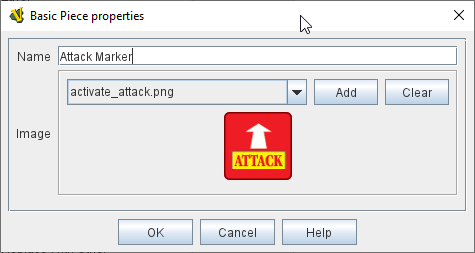
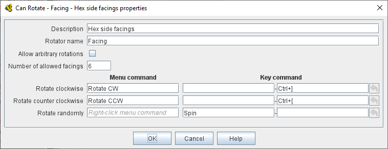
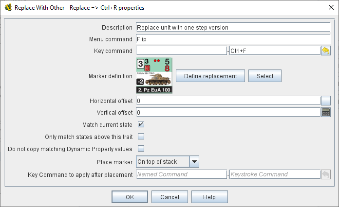
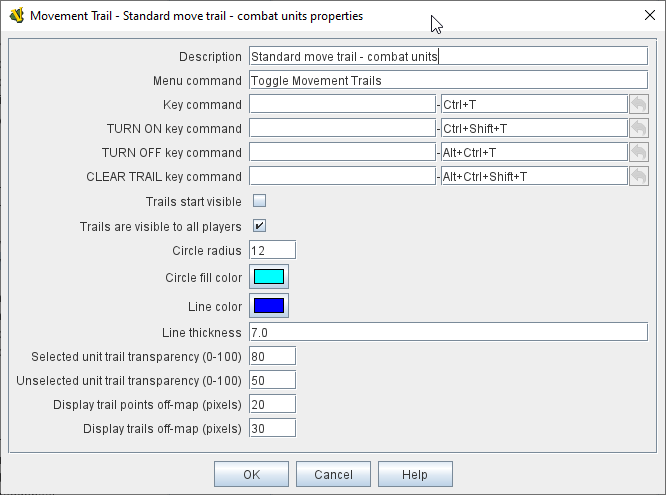
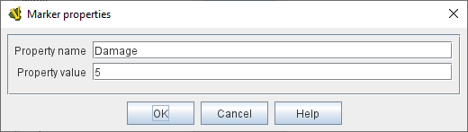

== VASSAL Reference Manual
[#top]

[.small]#<<index.adoc#toc,Home>> > <<GameModule.adoc#top,Module>> > <<PieceWindow.adoc#top,Game Piece Palette>> > *Game Piece*#

'''''

=== Game Piece

A Game Piece, sometimes simply referred to as a piece, is any counter, marker, or card used in a game.
Game Pieces in VASSAL are highly customizable and can have quite complex behavior.
They are defined by adding <<#Traits,Traits>> to a basic piece in the Piece Definer window shown at right.
A list of available Traits appears to the left, and a list of Traits currently in use by the piece you're defining appears at the right.
Add a Trait by selecting it in the list of available traits and clicking the 'Add' button.
Remove a Trait by selecting it and clicking the 'Remove' button.

As you define your Piece, it will appear at the top of the window.
You can select the Piece and type commands for it or right-click to bring up its context menu to test it as you go.

Once added to your Piece, a Trait's properties can be edited by selecting the Trait and clicking the Properties button, or by double-clicking on the Trait in the list.

When a Piece is drawn, the Traits are drawn _in order_, beginning with the <<BasicPiece.adoc#top,Basic Piece>> and continuing downward.
The order of Traits can be important.
For example the image in a Layer trait may obscure the Basic Piece or other Layers before it in the list of Traits.

For highly specialized pieces, you may supply your own custom Java classes.
The Java class must implement the GamePiece interface and most commonly extends the Decorator class.
First, add the Java .class file to the module file using a Zip utility (remember to preserve the package structure: e.g.
the class should go in a subdirectory within the Zip that is named for its package). Then hit the "Import" button and enter the fully-qualified name of the class (if the package name is "PathsOfGlory" and the class name is "CustomPieceMover" then enter "PathsOfGlory.CustomPieceMover"). The Trait corresponding to your class will appear in the list of available Traits and you may add it normally.
See the Coding Tutorial for more details.

'''''

[#TraitOrder]
=== Trait Ordering and YOU

Although you can probably make it a reasonable way into designing your first VASSAL module by just loading <<#Traits,Traits>> into a piece in whatever order they occur to you, _eventually_ as your mastery grows and you begin to think of more and more ambitious ways to improve your game and module there may well come a time when your traits will seem to be interacting oddly with each other.
Perhaps the trait you expected to be hidden by the Mask trait you just added isn't disappearing? Or parts of the piece you set up to be rotatable aren't rotating? Or parts that you set up _not_ to rotate _are_ rotating? Or maybe the Trigger Actions you are sending aren't being resolved in the order you expected they would?

Well it turns out that the interactions between different traits within the same piece are substantially affected by the _order_ those traits appear in the Game Piece's trait list! This section will walk you through the relationships between traits, provide you with some basic "rules of thumb" for ordering your traits, and then end with a comprehensive trait ordering guide that should be a regular touchstone even when you've become a VASSAL master!

==== Draw Order and Traits

[cols=",",]
|===
|_Most_ <<#Traits,Traits>> which draw something are drawn starting from the <<BasicPiece.adoc#top,Basic Piece>> and proceeding downwards, meaning that the last Layer (or Text Label, etc) in the list will be drawn overtop everything else.
However there are two exceptions: Area of Effect traits, and any Layer with the _Underneath when highlighted?_ option when the piece is currently selected.
In both of these cases, the "exception" traits (Area-of-Effect or Draw-Underneath) are drawn _before_ the Basic Piece.
If more than one of these exceptions exists in a single piece, then the first to draw will be the _lowest_ trait in the list, then the next lowest, etc -- the opposite of the normal order, and all before the Basic Piece.

The chart at right illustrates the draw order for a sample set of piece traits.
The two exception traits are drawn first (in bottom up order), followed by everything else (in top down order). Changing the order of the traits in this piece would change the order in which they were drawn.
For example if the _Text Label_ trait were moved up to the position directly underneath the Basic Piece, then it would be drawn right after the Basic Piece.
|image:images/GamePieceDrawOrder.png[] +
|===

==== Traits That Control Other Traits

[cols=",",]
|===
|Some <<#Traits,Traits>>, such as _Can Rotate_, _Mask_, and _Restrict Commands_ are designed to directly control and affect other traits (without the use of Key Commands). These traits will _only_ affect traits which appear _above_ them in the list of traits after taking prototypes into account.
Conversely each trait can only be affected/controlled/modified by traits which appear _below_ them in the list of traits.
You must think about each trait, how it affects the Game Piece, and whether it should affect, or be affected by other traits of the Game Piece.
The chart at right provides some general guidance for an ordering that will frequently be the best, but it is not exhaustive -- there will be special cases where you will want to deviate from it.

*Example 1:* if you want a _Text Label_ to Rotate, then the _Text Label_ trait must be above the _Can Rotate_ trait.
If you _don't_ want your Text Labels to rotate, then they must be _below_ the _Can Rotate_ trait.

*Example 2:* if you want the most of the visible information on your card or piece to be hidden from other players when the card is "flipped over" to its back side by a _Mask_ trait, then all of its Layers (and any Text Labels, plus any traits that create Menu options and/or Key Commands that you don't want to be available to other players while the card is hidden) need to be _above_ the _Mask_ trait.
But if there's some particular graphic Layer or Text Label that you want to be drawn even when the card is flipped over, then you'd put those traits _below_ the _Mask_ trait.

*Example 3:* _Restrict Commands_ traits should almost always go at the very bottom of the list of traits, so that they will be able to hide/disable the traits that they specify.
|image:images/GamePieceTraitOrder.png[] +
|===

[#TraitOrderKeyCommands]
==== Key Commands and Traits

[width="100%",cols="50%,50%",]
|===
a|
When a Key Command (or Named Key Command) is received by a Game Piece, the <<#Traits,Traits>> are visited in a particular order to see if they listen for that Key Command, and if they do have an entry for that Key Command the appropriate part of the Trait activates.
When a Key Command arrives at a Game Piece, its behaviour is identical regardless of the "origin" of that Key Command.
The Key Command could have come from the player pressing a real keyboard shortcut, from the player selecting the corresponding right-click context menu command, from a Global Key Command arriving from a completely different Game Piece or from the Toolbar, from an Action Button, or from a Trigger Action trait within the piece.

The order Traits _within_ the piece are visited is as follows:

. First any traits _except for_ Trigger Action and Report Action traits are visited.
This happens starting at the bottom of the list and proceeding up toward the <<BasicPiece.adoc#top,Basic Piece>> trait.
. Then, once every trait that isn't a Trigger Action or Report Action trait has been visited, we then visit those traits, this time starting at the _top_ of the list just beneath the Basic Piece trait and proceeding towards the bottom.

|image:images/GamePieceOrder.png[] +
|===

=== Advanced Trait Ordering

[cols=",",]
|===
|**Traits**

(in recommended order they should normally appear in a piece)|**Ordering Notes**

|Basic Piece|(Basic Piece will always be at the top)
|Layer _(Rotatable)_ +
Text Label _(Rotatable)_
|Drawing Layers that will rotate should be *_above_* the Can Rotate and/or Can Pivot.

|Can Rotate +
Can Pivot
|Can Rotate belongs below any drawing trait that it should rotate, but *_above_* any Can Pivot trait.

|Movement Trail +
Layer +
Mark When Moved +
Text Label +
Area of Effect
|These drawing traits all belong *_above_* Non-Rectangular, and *_above_* Masking/Restricting Traits (see red box below). Optionally they could also move *_above_* Can Rotate if you want them to rotate/pivot; in this position they will *_not_* rotate or pivot.
Traits will draw in order from the Basic Piece on down, meaning the very last drawing trait in the list will be "drawn on top of" everything else, and so forth.

|Non-Rectangular
|Non-Rectangular belongs *_below_* all drawable traits - otherwise their bounding box regions will be selectable even if transparent.

|Delete +
Replace With Other
|These delete the piece & stop any further processing.
Keep them *_above_* anything that needs doing first.

*NOTE:* Be aware that any Trigger Action on the same Key Command as a deleting trait will never get to execute -- you will need to use a forking/chaining Trigger Action sequence to be sure any Trigger Action traits you need to have run before a deleting trait are executed.

|Send to Location +
Move Fixed Distance +
Return to Deck +
Place Marker +
Clone
|Movement and Piece-Placement traits normally belong *_above_* any Masking/Restricting traits (i.e.
Mask, Invisible, Restrict Access, Restrict Commands).

|Play Sound +
Action Button +
Global Hotkey +
Global Key Command
|"Communication" and Key Command initiating traits normally belong *_above_* Masking/Restricting traits (i.e.
Mask, Invisible, Restrict Access, Restrict Commands).

|Trigger Action
|Trigger Action traits should normally be grouped *_above_* Report Action traits so that any changes to properties they trigger are resolved before the Report Action reports on them.
(They should also normally appear *_above_* any Mask & Restrict Commands).

|Report Action
|Report Action traits should be grouped *_below_* Trigger Action traits (so that they report results after the Triggers process).

|Set Global Property +
Spreadsheet +
Property Sheet +
Dynamic Property
|Property traits can have their values read faster (so that Vassal runs slightly faster) the *_lower_* they are in the trait list.
However you'll normally want the "setter" actions of e.g.
Dynamic Properties and Set Global Property to remain *_above_* any Mask, Invisible, Restrict Access, and Restrict Commands traits that could affect them.

|Mask +
Invisible +
Restrict Access +
Restrict Commands
|Masking/Restricting traits belong *_below_* any traits that they need to be able to hide, restrict, and protect.

Mask belongs *_above_* Invisible.

|Does not stack
|Does Not Stack functions correctly anywhere in the trait list but _runs slightly faster near the bottom._

|Calculated Property +
Marker +
Translatable Message
|Calculated Property, Marker, and Translatable Message function properly anywhere, but they _run slightly faster near the bottom_.

|**Free Floating Traits**
|**(Proper Order Varies)**

|Prototype
|The proper location for a Prototype... *_depends_* on what's in the Prototype! Note that you may sometimes decide that you need to split up large/complex Prototypes so that "the part that needs to go on top can go on top" and "the part that needs to go down below can go down below".

|Sub-Menu +
Menu Separator
|Menu-building traits should go wherever you need them for building the right kinds of right-click context menus.
Note, however, that Sub-Menu traits must always go *_below_* the traits that it should be grouping into a menu.
|===

'''''

[#Traits]
=== Comprehensive List of Piece Traits

[cols=",,,,",]
|===
|<<ActionButton.adoc#top,Action Button>> |<<AreaOfEffect.adoc#top,Area Of Effect>> |<<BasicPiece.adoc#top,Basic Piece>> |<<CalculatedProperty.adoc#top,Calculated Property>> |<<Pivot.adoc#top,Can Pivot>>
|<<Rotate.adoc#top,Can Rotate>> |<<#Clone,Clone>> |<<#Delete,Delete>> |<<NonStacking.adoc#top,Does not stack>> |<<DynamicProperty.adoc#top,Dynamic Property>>
|<<GlobalHotkey.adoc#top,Global Hotkey>> |<<GlobalKeyCommand.adoc#top,Global Key Command>> |<<SetGlobalProperty.adoc#top,Global Property, Set>> |<<Hideable.adoc#top,Invisible>> |<<Layer.adoc#top,Layer>>
|<<MarkMoved.adoc#top,Mark When Moved>> |<<PropertyMarker.adoc#top,Marker>> |<<Mask.adoc#top,Mask>> |<<MenuSeparator.adoc#top,Menu Separator>> |<<Translate.adoc#top,Move fixed distance>>
|<<MovementTrail.adoc#top,Movement Trail>> |<<NonRectangular.adoc#top,Non-Rectangular>> |<<Marker.adoc#top,Place Marker>> |<<PlaySound.adoc#top,Play Sound>> |<<PropertySheet.adoc#top,Property Sheet>>
|<<UsePrototype.adoc#top,Prototype>> |<<Replace.adoc#top,Replace with Other>> |<<ReportChanges.adoc#top,Report Action>> |<<RestrictCommands.adoc#top,Restrict Commands>> |<<RestrictedAccess.adoc#top,Restricted Access>>
|<<SendToLocation.adoc#top,Send to Location>> |<<Spreadsheet.adoc#top,Spreadsheet>> |<<SubMenu.adoc#top,Sub-Menu>> |<<Label.adoc#top,Text Label>> |<<TranslatableMessage.adoc#top,Translatable Message>>
|<<TriggerAction.adoc#top,Trigger Action>>||||
|===

'''''

[width="100%",cols="50%,50%",]
|===
a|
==== <<BasicPiece.adoc#top,Basic Piece>>

Every Game Piece contains a Basic Piece, which itself contains a name string and can also be assigned an image.
For a truly simple piece this is all that is necessary.
However for pieces that need more complex images or combinations of them, the image from the Basic Piece element can be omitted in favor of ones from e.g.
Layer traits.

The Basic Piece exposes a list of <<Properties.adoc#top,Properties>> concerning name, location, and other common piece details.
See the full <<BasicPiece.adoc#top,Basic Piece>> article for details.

|
|===

[#Delete]
==== Delete
[width="100%",cols="50%,50%",]
|===
|image:images/Delete.png[] a|

The ability to be deleted by players during a game.
When this trait's Key Command or menu item is activated, the piece is deleted from the game.

*Command:*  Text for the right-click context menu item that will delete the piece.
If left blank, no context menu item will appear, but the piece can still be deleted with the Key Command.

*Keyboard Command:*  The <<NamedKeyCommand.adoc#top,Key Command or Named Key Command>> that will cause the piece to be deleted.

*NOTE:*  When this trait is activated the piece is deleted and therefore does not do any further processing on the Key Command.
This can prevent Report Action traits from reporting the deletion, because of the <<#TraitOrder,order>> traits are processed.
Such a situation can be worked around by using a Trigger Action trait to first send a Key Command to cause a Report Action and then send a second Key Command to process the delete.

|===

[#Clone]
==== Clone
[width="100%",cols="50%,50%",]
|===
a|

The ability to be duplicated by players during a game.
When this trait's Key Command or menu item is activated, an exact copy of the piece is placed in the game at the same location.

*Command:*  Text for the right-click context menu item that will clone the piece.
If left blank, no context menu item will appear, but the piece can still be cloned with the Key Command.

*Keyboard Command:*  The <<NamedKeyCommand.adoc#top,Key Command or Named Key Command>> that will cause the piece to be duplicated.

|image:images/Clone.png[]
|===

==== <<Layer.adoc#top,Layer>>

A Layer is the most powerful way to add images to a piece.
Each Layer you add can contain multiple images along with with Key Commands and/or Expressions to switch between them and activate/deactivate them.
A piece can contain as many Layers as you wish.
<<Layer.adoc#top,See full article for details.>>

[cols=",",]
|===
| |
|===

[width="100%",cols="50%,50%",]
|===
a|
==== <<UsePrototype.adoc#top,Prototype>>

Inserts a pre-defined set of Traits defined in a <<Prototypes.adoc#Definition,Prototype Definition>> elsewhere.
This allows you to define a set of Traits for a whole class of Pieces all in one place; likewise, by changing the Prototype later your changes will automatically apply to every piece which inherits the Prototype.

See <<UsePrototype.adoc#top,Prototype (Trait)>> and <<Prototypes.adoc#top,Prototype (Definition)>> for further details.

|image:images/UsePrototype.png[]
|===

[width="100%",cols="50%,50%",]
|===
|image:images/Label.png[] a|
==== <<Label.adoc#top,Text Label>>

A text message drawn somewhere on or near the piece.
Font sizes, colors, and position can be customized, and the text of the message can be created indirectly using the contents of <<Properties.adoc#top,Properties>>.

<<Label.adoc#top,See full article for details.>>

|===

[width="100%",cols="50%,50%",]
|===
a|
==== <<ReportChanges.adoc#top,Report Action>>

Allows the piece to automatically report messages, state changes, and other game information to the chat log.

<<ReportChanges.adoc#top,See full article for details.>>

|image:images/ReportChanges.png[]
|===

[width="100%",cols="50%,50%",]
|===
|image:images/TriggerAction.png[] a|
==== <<TriggerAction.adoc#top,Trigger Action>>

Allows pieces to trigger Key Commands and Named Key Commands.
Triggers can be used to combine multiple commands into a single menu entry, place conditions on a command's execution, create repeating loops, and more.

<<TriggerAction.adoc#top,See full article for details.>>

|===

[width="100%",cols="50%,50%",]
|===
a|
==== <<GlobalHotKey.adoc#top,Global Hotkey>>

Allows pieces to activate a function from the Toolbar, via the Hotkey associated with the button on the Toolbar.

<<GlobalHotkey.adoc#top,See full article for details.>>

|image:images/GlobalHotkey.png[]
|===

[width="100%",cols="50%,50%",]
|===
|image:images/ActionButton.png[] a|
==== <<ActionButton.adoc#top,Action Button>>

Allows a region of a piece to be configured to act like a button, invoking a command when a player clicks within the designated region.

<<ActionButton.adoc#top,See full article for details.>>

|===

[width="100%",cols="50%,50%",]
|===
a|
==== <<Rotate.adoc#top,Can Rotate>>

Gives a piece, or parts of it, the ability to rotate through a specified number of facings.

<<Rotate.adoc#top,See full article for details.>>

|
|===

[width="100%",cols="50%,50%",]
|===
| a|
==== <<Pivot.adoc#top,Can Pivot>>

Gives a piece, or parts of it, the ability to pivot, i.e.
rotate around a point other than the center.

<<Pivot.adoc#top,See full article for details.>>

|===

[width="100%",cols="50%,50%",]
|===
a|
==== <<Hideable.adoc#top,Invisible>>

Allows the piece to be hidden from opponents and other non-owning players, with a toggle to reveal it.
Appears partially transparent to the owner while it is hidden, as a reminder.

The player sides who are allowed to hide the piece can be specified.

<<Hideable.adoc#top,See full article for details.>>

|image:images/Hideable.png[]
|===

[width="100%",cols="50%,50%",]
|===
| a|
==== <<Mask.adoc#top,Mask>>

Allows a piece to be flipped to a generic "reverse side" so that only limited information is shown to opponents and other non-owning players.
The most common application is to give playing cards a generic "back side" which obscures the face of the card from players who aren't currently entitled to see it.

The player sides who are allowed to flip the card or piece over can be specified.

<<Mask.adoc#top,See full article for details.>>

|===

[width="100%",cols="50%,50%",]
|===
a|
==== <<SendToLocation.adoc#top,Send to Location>>

Adds a command that moves a piece directly to another location.

<<SendToLocation.adoc#top,See full article for details.>>

|image:images/SendToLocation.png[]
|===

[width="100%",cols="50%,50%",]
|===
|image:images/CounterGlobalKeyCommand.png[] a|
==== <<GlobalKeyCommand.adoc#top,Global Key Command>>

Adds an action that applies a Key Command or <<NamedKeyCommand.adoc#top,Named Key Command>> to other pieces, similar to the <<Map.adoc#GlobalKeyCommand,Global Key Command>> component of a Map Window.
Global Key Commands are the main avenue by which pieces can prompt action by other pieces.

<<GlobalKeyCommand.adoc#top,See full article for details.>>

|===

[width="100%",cols="50%,50%",]
|===
a|
==== <<Translate.adoc#top,Move Fixed Distance>>

Adds a command to move a piece a fixed distance in a direction.

<<Translate.adoc#top,See full article for details.>>

|image:images/Translate.png[]
|===

[width="100%",cols="50%,50%",]
|===
a|

a|==== <<ReturnToDeck.adoc#top,Return to Deck>>

Adds a command to send a piece to a <<Deck.adoc#top,Deck>>.

Can be used to send cards to a discard pile, back to the draw pile, etc.
Also useful with groups of chits or for fixed pools of counters.

<<ReturnToDeck.adoc#top,See full article for details.>>

|===

[width="100%",cols="50%,50%",]
|===
a|

==== <<NonStacking.adoc#top,Does Not Stack>>

Prevents the piece from combining with other pieces to form a stack, and can also be used to control whether the piece can be moved, selected, and/or band-selected by a player.

<<NonStacking.adoc#top,See full article for details.>>

|
|===

[width="100%",cols="50%,50%",]
|===
|image:images/PropertySheet.png[]
a|

==== <<PropertySheet.adoc#top,Property Sheet>>

Provides a popup window from which players may set and view auxiliary information about a piece.
Includes sophisticated controls for specifying single- and multi-line text notes and tick-mark boxes for depletable resources (hit points, shield levels, damage, etc.)

<<PropertySheet.adoc#top,See full article for details.>>

image:images/property_sheet_map.png[]
|===

[width="100%",cols="50%,50%",]
|===
a|

==== <<Spreadsheet.adoc#top,Spreadsheet>>

Attaches an editable informational table to a piece.
Unlike a Property Sheet, it contains only plain-text fields, but can contain arbitrary numbers of rows and columns.

<<Spreadsheet.adoc#top,See full article for details.>>

|image:images/Spreadsheet.png[]
|===

[width="100%",cols="50%,50%",]
|===
|image:images/Marker.png[]
a|

==== <<Marker.adoc#top,Place Marker>>

Adds a command to place another piece (of any type) at the same location as this piece.
An optional additional command can then be applied to e.g.
move the piece somewhere else.

<<Marker.adoc#top,See full article for details.>>

|===

[width="100%",cols="50%,50%",]
|===
a|

==== <<Replace.adoc#top,Replace with Other>>

Adds a command that replaces this piece with a different piece.

*NOTE:*  When this trait is activated the piece is deleted and therefore does not do any further processing on the Key Command.
This can prevent Report Action traits from reporting the deletion, because of the <<#TraitOrder,order>> traits are processed.
Such a situation can be worked around by using a Trigger Action trait to first send a Key Command to cause a Report Action and then send a second Key Command to process the delete.

<<Replace.adoc#top,See full article for details.>>

|
|===

[width="100%",cols="50%,50%",]
|===
|image:images/NonRectangular.png[]
a|

==== <<NonRectangular.adoc#top,Non-Rectangular>>

Allows pieces with unconventional shapes to use their actual image boundaries for selection and dragging.
In technical terms, directs the piece to ignore transparent areas of its image for purposes of selecting the piece with the mouse.

<<NonRectangular.adoc#top,See full article for details.>>

|===

[width="100%",cols="50%,50%",]
|===
a|

==== <<PlaySound.adoc#top,Play Sound>>

Adds a command that plays a specified sound when invoked.

<<PlaySound.adoc#top,See full article for details.>>

|image:images/PlaySound.png[]
|===

[width="100%",cols="50%,50%",]
|===
|image:images/MarkMoved.png[]
a|

==== <<MarkMoved.adoc#top,Mark When Moved>>

Allows the piece to be automatically marked with a visible image when moved in a Map Window.

<<MarkMoved.adoc#top,See full article for details.>>

|===

[width="100%",cols="50%,50%",]
|===
a|

==== <<MovementTrail.adoc#top,Movement Trail>>

Pieces with this trait will leave behind a graphical trail showing the positions through which the piece has been moved.

<<MovementTrail.adoc#top,See full article for details.>>

|
|===

[width="100%",cols="50%,50%",]
|===
|image:images/AreaOfEffect.png[]
a|

==== <<AreaOfEffect.adoc#top,Area Of Effect>>

The Area of Effect trait allows you to graphically highlight an area surrounding a gamepiece.
The area is shaded with a specified color and transparency.
Alternatively, you canpoint to a <<Map.adoc#MapShading,Map Shading>> component, contributing to the area that it draws.

<<AreaOfEffect.adoc#top,See full article for details.>>

|===

[width="100%",cols="50%,50%",]
|===
a|

==== <<SubMenu.adoc#top,Sub-Menu>>

Creates a sub-menu in the right-click context menu and groups some of the piece's other commands into it.

<<SubMenu.adoc#top,See full article for details.>>

|
|===

[width="100%",cols="50%,50%",]
|===
|
a|

==== <<MenuSeparator.adoc#top,Menu Separator>>

Creates a menu separator (horizontal bar) in the piece's right-click context menu.

<<MenuSeparator.adoc#top,See full article for details.>>

|===

[width="100%",cols="50%,50%",]
|===
a|

==== <<RestrictCommands.adoc#top,Restrict Commands>>

Hides or removes key/menu commands from the piece when certain conditions apply.

<<RestrictCommands.adoc#top,See full article for details.>>

|image:images/RestrictCommands.png[]
|===

[width="100%",cols="50%,50%",]
|===
|
a|

==== <<RestrictedAccess.adoc#top,Restricted Access>>

Limits control of a Piece by opponents and other non-owning players.
Such players will not be able to access protected commands of the piece.

<<RestrictedAccess.adoc#top,See full article for details.>>

|===

[width="100%",cols="50%,50%",]
|===
a|
==== <<PropertyMarker.adoc#top,Marker>>

Assigns a fixed value to a named property on a piece.
Analogous to creating a "constant" in programming.

<<PropertyMarker.adoc#top,See full article for details.>>

|
|===

[width="100%",cols="50%,50%",]
|===
|image:images/DynamicProperty.png[]
a|
==== <<DynamicProperty.adoc#top,Dynamic Property>>

Adds a named property to the piece, with a user-changeable value.
Allows any number of commands to change and manipulate the value to be defined.

<<DynamicProperty.adoc#top,See full article for details.>>
|===
[width="100%",cols="50%,50%",]
|===
a|
==== <<CalculatedProperty.adoc#top,Calculated Property>>

Adds a named property to the piece, whose value is automatically calculated according to a specified formula.

<<CalculatedProperty.adoc#top,See full article for details.>>

|
|===
[width="100%",cols="50%,50%",]
|===
|
image:images/SetGlobalProperty.png[]
a|
==== <<SetGlobalProperty.adoc#top,Set Global Property>>

Defines commands to change the value of a <<GlobalProperties.adoc#top,Global Property>>.

<<SetGlobalProperty.adoc#top,See full article for details.>>
|===
