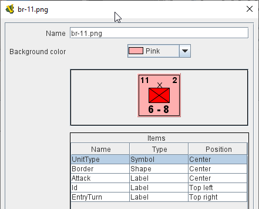
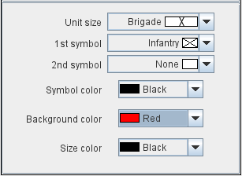
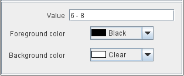
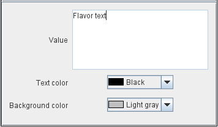
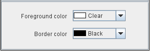

== VASSAL Reference Manual
[#top]

[.small]#<<index.adoc#toc,Home>> > <<GameModule.adoc#top,Module>> > <<GamePieceImageDefinitions.adoc#top,Game Piece Image Definitions>> > <<GamePieceLayouts.adoc#top,Game Piece Layout>> > *Game Piece Image*#

'''''

=== Game Piece Image

This component uses a layout created in a <<GamePieceLayouts.adoc#top,Game Piece Layout>> component to create an actual image.
Here, you specify the colors, text, and images to use in the layout, as well as the name under which this image will appear in the image-chooser drop-down.
You can then begin using this image in any other Vassal component or trait as if you had loaded it in from an external source.

[width="100%",cols="50%a,50%a",]
|===
a|
*Name:*:: Specify a name for the image definition.
This is the name under which this image will appear in the image-chooser drop-down menu in a Game Piece trait's properties. Vassal enforces that the name contains only letters, numbers or the _ character and ends in '.png'.

NOTE: Older versions of Vassal prior to version 3.6 allowed for any string of characters to be used for a filename. This is not advisable as it can cause the module to fail to work correctly.

*Background color:*:: Select a background color to use behind the whole image from the dropdown list of available colors, or click the _Cancel_ button on that dialog to use a transparent background. Additional colors can be added as a <<GamePieceImageDefinitions.adoc#NamedColors,Named Color>>.

The next section shows a visualization of what the finished image will look like with your choices.

The Items panel shows the configurable items that make up your image layout.
Click on an item to display the options available for that item in the bottom configuration panel.
There is a different configuration panel for each type of item.

|
|===

==== Symbol Item Configuration

[width="100%",cols="50%a,<50%a",]
|===
|*Unit Size:*:: Select the Unit Size specifier from the drop-down menu.

*1st symbol:*:: Select the primary symbol from the drop-down menu.

*2nd symbol:*:: Select the secondary symbol from the drop-down menu.

*Symbol color:*:: Select the color used to draw the symbol lines.

*Background color:*:: Select the color to use for the background of the symbol body.

*Size color:*:: Select the color used to draw the Size Specifier drawn above the symbol body.
|
|===

==== Label Item Configuration

[width="100%",cols="50%a,<50%a",]
|===
|*Value:*:: Enter the text to display on the image if the _Specified in individual images_ option was selected for this label in the Layout.

*Foreground color:*:: Select the color to use to draw the text.

*Background color:*:: Select the color to use to draw a box behind the text.
|
|===

==== Text Box Item Configuration

[width="100%",cols="50%a,<50%a",]
|===
|*Value:*:: Enter the text to display on the image if the _Specified in individual images_ option was selected for this label in the Layout.

*Text color:*:: Select the color to use to draw the text.

*Background color:*:: Select the color to use to fill the text box behind the text.
|
|===

==== Image Item Configuration

Import an image to draw at the position specified in the layout.

==== Shape Item Configuration

[width="100%",cols="50%a,<50%a",]
|===
|*Foreground color:*:: Select the fill color for the shape.

*Background color:*:: Select the color for the shape's outline.
|
|===
