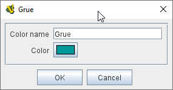
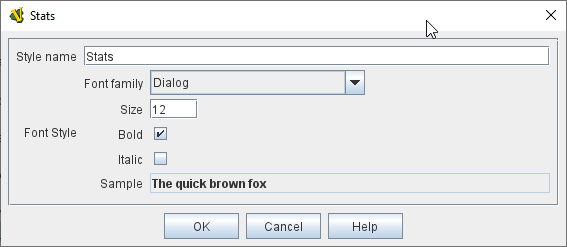

== VASSAL Reference Manual
[#top]

[.small]#<<index.adoc#toc,Home>> > <<GameModule.adoc#top,Module>> > *Game Piece Image Definitions*#

'''''

=== Game Piece Image Definitions

[width="100%",cols="50%a,^50%a",]
|===
|
The _[Game Piece Image Definitions]_ component can be found in the top layer of components under the Game Module, and provides a mechanism for building your own images for simple game counters without the need for an external art tool.

Within the Game Piece Image Definitions you can build your own images by combining text, images, and standard NATO symbols.
Images defined in this component will appear in the drop-down menu for selecting images for any Trait of any Game Piece just like an imported GIF, JPEG, or PNG.

You can also use your own images instead of the vector drawn NATO ones, so for many games you will be able to define the whole counter set with just a handful of images.
Furthermore you can change the size and layout of all the counters in your game easily by adjusting the layouts.

*Set up a Game Piece Image in three steps:*

. *Make a layout:* Right-click on the [Game Piece Image Definitions] component in the Editor and select "Add Game Piece Layout". In the <<GamePieceLayouts.adoc#top,Game Piece Layout>>'s properties, you specify the position, size and style of all items to be drawn on counter.
Colors and actual text and symbol selections are made in step 2.
. *Create a specific image*:  Now right-click on the [Game Piece Layout] component that you've just added and select "Add Game Piece Image". This defines an individual image using the layout you created in step 1.
In each <<GamePieceImage.adoc#top,Game Piece Image>>'s properties, specify the actual colors, text and symbols to be used for that image, using the layout you created in the previous step.

. *Use image in game pieces:*  Now you can use this image in any trait of any Game Piece (or Prototype) that you add anywhere in the game, whether to the <<PieceWindow.adoc#top,Game Piece Palette>> or an <<SetupStack.adoc#top,At-Start Stack>>. It will be listed in the dropdown menu for images, anywhere an image can be selected.

|image:images/GamePieceImageDefinitions.png[] +
image:images/GamePieceImageDefinitionsWhere.png[]
|===

'''''

=== Sub-Components

[#NamedColors]
==== Named Colors

Fourteen standard colors are built in to VASSAL, but in the Named Colors section you can add as many more as you'd like, and they will then appear in the dropdown menus for selecting foreground, background, and other colors in an image.

To predefine a color, right-click on the [Named Colors] component and select "Add Named Color". Give your color a name and then click the "Color" button to set it up in the Color Picker.

The fourteen standard built in colors are: Clear, White, Black, Light Gray, Dark Gray, Red, Green, Blue, Orange, Pink, Cyan, Magenta, and Yellow.

[width="100%",cols="50%a,^50%a",]
|===
|

*Color Name:*::  The name of the color that will appear in dropdown menus in the Game Piece Image properties.

*Color:*::  Standard Color picker to select the color to be associated with the name.

| +
|===

[#FontStyles]
==== Font Styles

A default font style is always available, but you can create additional font styles to use in creating your <<GamePieceLayouts.adoc#top,Game Piece Layouts>> by right-clicking the [Font Styles] component and selecting "Add Font Style". Your new Font Style can then be selected by name from the dropdown menus while creating new layouts.

A Font Style consists of a Font Family, size and style (plain, bold, italic, bold-italic). A default style is always defined.

[width="100%",cols="50%a,^50%a",]
|===
|

*Style Name:*::  Provide a name for your Font Style.
This is the name that will appear in dropdown menus in the Game Piece Layouts properties.

*Font Family:*::  The Font Family to use.
To ensure maximum compatibility and portability, it is recommended that you use only the five Java logical fonts (Dialog, DialogInput, Monospaced, Serif, SansSerif), but other font families installed on your computer may appear as well.

*Size:*::  The size of the font style in points.

*Bold:*::  Click on to select a Bold font style.

*Italic:*::  Click on to select an Italic font style.

*Sample:*::  Displays a sample of your selected font style.

| +
|===

==== <<GamePieceLayouts.adoc#top,Game Piece Layouts>>

A Game Piece Layout is like a template that defines positions, styles, and orientations of the components in an image, but not their actual text and values.
This component is a container for all the images defined in the module.
You then add one or more <<GamePieceImage.adoc#top,Game Piece Images>> to the Game Piece Layout subcomponent, to create the individual images which you can then use later in Game Piece traits.
