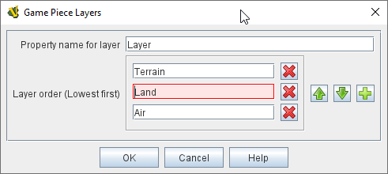

== VASSAL Reference Manual
[#top]

[.small]#<<index.adoc#toc,Home>> > <<GameModule.adoc#top,Module>> > <<Map.adoc#top,Map>> > *Game Piece Layers*#

'''''

=== Game Piece Layers

When added to a <<Map.adoc#top,Map>>, this component allows you to specify that certain Game Pieces will always be drawn on top of others.

To add a _[Game Piece Layers]_ component to a map, navigate to the appropriate _[Map]_ component in the Editor.
Right click on the _[Map]_ component and select _Add Game Piece Layers_.
The new component will appear at the bottom of your map's list of sub-components.
You can then optionally right-click the _[Game Piece Layers]_ component if you wish to add a _[Game Piece Layer Control]_ sub-component to allow layers to be hidden (see below).

[width="100%",cols="50%a,50%a",]
|===
|*Property name for layer:* The name of the Property of each Game Piece that determines the order.
Typically this will be specified with a <<PropertyMarker.adoc#top,Marker>> trait with the specified property name.

*Layer Order (Lowest first):* lists the expected values for that property, in the order that they will be drawn on the map (pieces draw last will naturally appear on top of those drawn before).  Pieces assigned to different layers will never combine into a Stack.
Pieces with no value specified for the given property are placed in the topmost layer.

*Example:*  A Map has a Game Piece Layer specified with property name _Layer_ and Layer Order _Terrain, Land, Air_.
Then any piece with a <<PlaceMarker.adoc#top,Marker>> trait with property name "Layer" and value "Terrain" will be in the bottom-most layer.
The middle layer will contain Pieces with the value "Land" and the top layer will contain Pieces with the value "Air".  Pieces with no value for the "Layer" property will be in their own layer above all three.
|
|===

'''''

=== Sub-Components

[#GamePieceLayerControl]
==== Game Piece Layer Control

[width="100%",cols="50%a,50%a",]
|===
|This adds a button or buttons to the Map Window's Toolbar that allows you to activate/deactivate the Game Piece Layers for that map, and to change their relative order.
Game Pieces belonging to Layers that have been deactivated are be hidden from view until the Layer is activated again.
Each player can activate/deactivate Layers independently, and layer activation is not saved when the game is saved.

Specify the button's text, icon, and hotkey.
Specify the names of the layers that this button will affect, and the action of the button.
_Rotate Layer Order Up/Down_ will change the relative order of the Layers on the map, moving each layer up/down by one in the order.
_Make Layer Active_ and _Make Layer Inactive_ will activate or deactivate the specified Layers.
_Switch Layer between Active and Inactive_ will toggle the specified layers between active and inactive.
_Reset All Layers_ makes all Layers active and restores them to their default order.

|image:images/GamePieceLayerControl.png[]
|===

