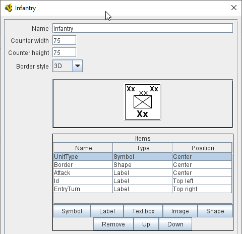
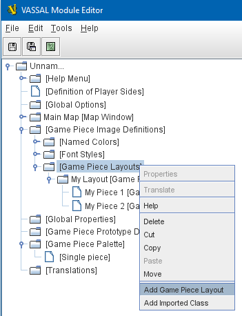
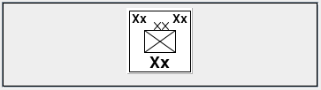
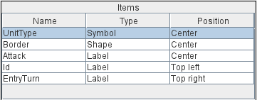
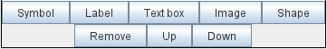
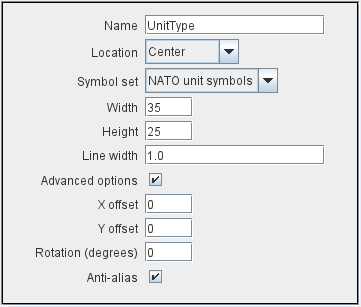
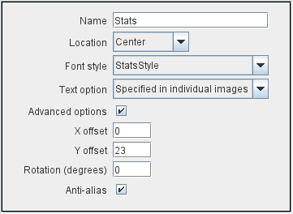
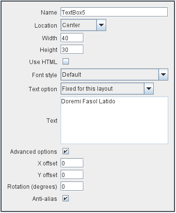
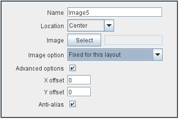
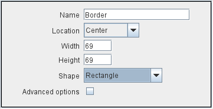

== VASSAL Reference Manual
[#top]

[.small]#<<index.adoc#toc,Home>> > <<GameModule.adoc#top,Module>> > <<GamePieceImageDefinitions.adoc#top,Game Piece Image Definitions>> > *Game Piece Layouts*#

'''''

=== Game Piece Layouts

[width="100%",cols="50%,<50%",]
|===
a|
This component contains all the layouts used to define a <<GamePieceImage.adoc#top,Game Piece Image>>.  Right-click on the _[Game Piece Layouts]_ component and select _Add Game Piece Layout_ to add a new layout.

A Game Piece Layout defines the general look and layout of the items used in drawing an image.
Specific color and text information is defined later for individual piece images in the Game Piece Image properties.

*NOTE:*  Once you have configured your new Game Piece Layout, you will need to right click on its _[Game Piece Layout]_ entry and select _Add Game Piece Image_ to create one or more individual images based on your layout.

An image is built up by drawing in order:

. [.li]#A rectangle of the background color.#
. [.li]#A border.#
. [.li]#Each defined item in the order displayed in the Item panel.#

*Name:* The name of the Image Layout.

*Counter Width:* The width of all images created using this layout.

*Counter Height:* The height of all images created using this layout.

*Border Style:* The border style for all images created using this layout.
Border styles currently available are:

* [.li]#None - No Border#
* [.li]#Plain - Single pixel line of defined color.#
* [.li]#Fancy - Two pixel shaded line of defined color.
Mild 3D effect.#
* [.li]#3D - A 3D-style shaded border.
Two pixels wide, colour automatically determined from background color.#

*Reduce Images to 256 Colors:* This option results in smaller module files and will not degrade image quality unless the counters use high-resolution photographic images

|

|===

==== Visualizer

[width="100%",cols="50%,<50%",]
|===
|The next section contains a visualizer, showing you in actual size how your finished image will look.
No colors or text have been defined yet, so sample text values and images placeholders are displayed.
|
|===

==== Item List

[width="100%",cols="50%,<50%",]
|===
|The Items panel shows the list of defined items for this Layout.
Layout items are drawn onto the image in the order specified.
Click on an item in the panel to display and edit its attributes in the lower display panel.
a|
==== 

|===

==== Buttons

[width="100%",cols="50%,<50%",]
|===
a|
Use the buttons to add, remove or move items in the list.

* [.li]#Symbol - Add a NATO Unit Symbol.#
* [.li]#Text - Add a Text label.#
* [.li]#Image - Add an image from the module images directory.#
* [.li]#Shape - Draw and color fill a rectangle, rounded rectangle or oval.#
* [.li]#Remove - Remove the selected item.#
* [.li]#Up - Move the selected item up the list (i.e.
draw earlier, and thus "towards the back").#
* [.li]#Down - Move the selected item down the list (i.e.
draw later and thus "towards the front").#

|
|===

==== Symbol Item

[width="100%",cols="50%,<50%",]
|===
a|
A Symbol Item is a generic symbol to be drawn by the program.
  An Infantry symbol will be shown as a placeholder but the particular symbol is chosen later when configuring an individual <<GamePieceImage.adoc#top,Game Piece Image>>.

* +
Name:*  The name of the item.
Items *MUST* be uniquely named within an Image Layout.

*Location:*  Select the location of the item on the counter.

*Symbol Set:*  Select the Symbol Set to use.
The only Symbol Set currently available is NATO Unit Symbols.

*Width:*  The width of the body of the symbol in pixels.

*Height:*  The height of the body of the symbol (not including the Size specifier) in pixels.

*Line Width:* The width of the line (in pixels)used to draw the symbol.
Fractional line widths can be used.
The lines are drawn with antialiasing turned on to produce smooth looking lines of any width.
When using a small symbol size, a line width of 1.0 will usually give the best results.

|
|===

==== Label Items

[width="100%",cols="50%,<50%",]
|===
a|
A Text Item is a text label drawn in a particular font at a particular location.
The value of the text can be specified in the individual images or in the layout, in which case all images using this layout share the same value.

*Name:*  The name of the item.
Items *MUST* be uniquely named within an Image Layout.

*Location:*  Select the location of the item on the counter.
The location also determines the text justification, i.e.
selecting Top Left ensures that the upper left corner of the text is in the upper left corner of the image.
Once the justification is set by the Location, you can still use the X/Y offset in the advanced options to place the text in a different location.

*Font Style:*  Select the name of the Font Style to be used for this Text Item.

*Text is:*  Select whether the text is specified in this layout (i.e.
right here) or in the individual Game Piece Images to be created from this layout.

[.li]##

| +
|===

==== Text Box Items

[width="100%",cols="50%,<50%",]
|===
a|
A Text Box Item is multi-line area of text drawn in a particular font at a particular location.
The value of the text can be specified in the individual images or in the layout, in which case all images using this layout share the same value.

*Name:*  The name of the item.
Items *MUST* be uniquely named within an Image Layout.

*Location:*  Select the location of the item on the counter.
The location also determines the text justification, i.e.
selecting Top Left ensures that the upper left corner of the text is in the upper left corner of the image.
Once the justification is set by the Location, you can still use the X/Y offset in the advanced options to place the text in a different location.

*Use HTML:*  If selected, then the contents will be interpreted as HTML.

*Font Style:*  Select the name of the Font Style to be used for this Text Item.

*Text is:*  Select whether the text is specified right here in the layout or later in the individual Game Piece Image properties.

|
|===

==== Image Item

[width="100%",cols="50%,<50%",]
|===
a|
An Image item is an imported image.

*Name:*  The name of the item.
Items *MUST* be uniquely named within an Image Layout.

*Location:*  Select the location of the item on the counter.

*Image is:*  Specify whether the image is specified right here in this layout or later on in the Game Piece Image properties that use this layout.
Use the File Open Dialog box to locate a copy of the image you wish to use on your PC.
When you save the module, VASSAL will attempt to copy this image into the _images_ folder within the module zip file.
You can also manually copy images into your images folder.

|
|===

==== Shape Item

[width="100%",cols="50%,<50%",]
|===
a|
A Shape Item is a simple geometric shape.

*Name:*  The name of the item.
Items *MUST* be uniquely named within an Image Layout.

*Location:*  Select the location of the item on the counter.

*Width:*  Select the width of the shape.

*Height:*  Select the height of the shape.

*Shape:*  Select the type of shape.

*Bevel:*  For Rounded Rectangle shapes, larger bevel values mean rounder corners.

|
|===

'''''

=== Sub-Components

==== <<GamePieceImage.adoc#top,Game Piece Image>>

An image created using this layout.
You can create as many individual Game Piece Images as you'd like using each Game Piece Layout.
To add a Game Piece Image, right click on the _[Game Piece Layout]_ component where you created the desired layout and select _Add Game Piece Image_.
