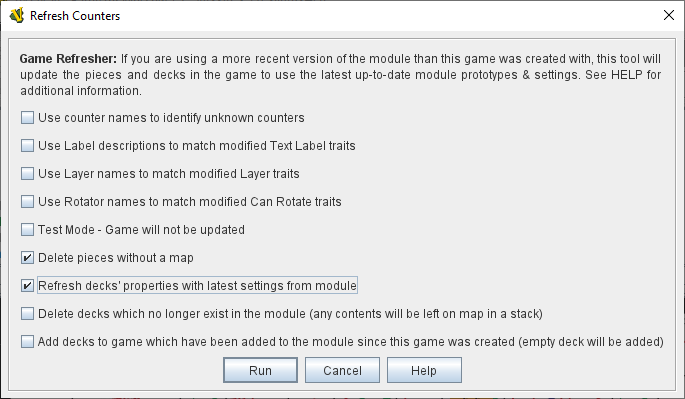

== VASSAL Reference Manual
[#top]

[.small]#<<index.adoc#toc,Home>> > <<Editor.adoc#top,Editor>> > *Refresh Counters*#

'''''

=== Refresh Counters
When you update the <<Prototypes.adoc#top,Prototypes>> in a module, those changes will affect any *future* games started using that module, but the changes will not--by default at least--affect pieces in any ongoing games that you load with the new version of the module. VASSAL saved games include the complete definition of each piece in order to maintain saved game compatibility with older versions of a module: so that replays and saves sent to you by someone with an earlier version of the module will continue to work in the same way they always did with the old version.

But particularly since the <<GameModule.adoc#PredefinedSetup, Predefined Setups>> for module scenarios are stored internally as saved games, it is often important to module designers to be able to update an existing game to use the latest prototypes. That way a module designer can often avoid re-doing complex setups simply because prototypes have been updated and improved.

[width="100%",cols="50%,^50%",]
|===
|To use the refresher on the currently loaded game, go to the _Tools_ menu and select _Refresh Counters_. You will be shown a dialog with several choices affecting the manner in which the operation is to be carried out.

Click the _Run_ button when you are ready to perform the refresh. The chat log will show output and statistics from the operation. Once the operation is finished, pieces in the game (as well as new pieces created from <<PieceWindow.adoc#top, Game Piece Palettes>>) will make use of the most recent prototypes.
|+
|===

You can then save the game, or simply continue playing it from that point.

